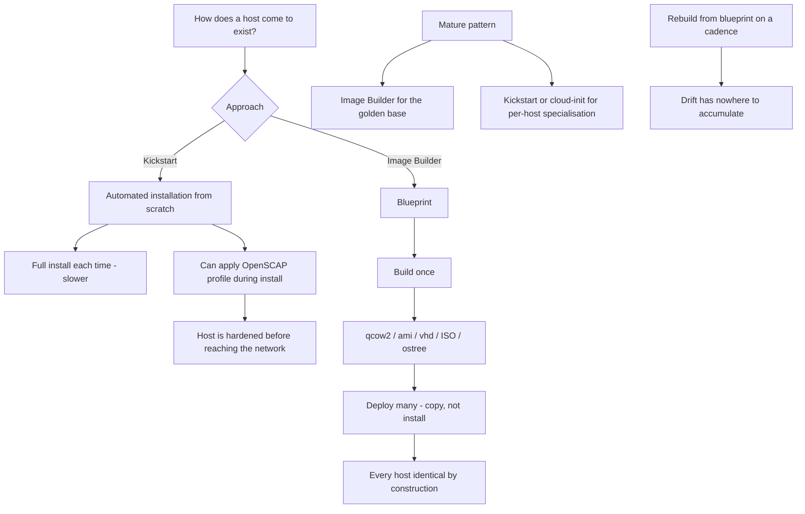

# Golden Images with Image Builder and Kickstart

**Level:** Intermediate
**Tree:** [Containers & Virtualization on Linux](../README.md)
**Branch:** [KVM Virtualization](README.md)
**Forest:** [Linux](../../../README.md)

## Explanation

# Golden Images with Image Builder and Kickstart

How a host comes into existence determines almost everything about how consistent the estate is. There are two complementary approaches and they solve different problems.

## Kickstart

**Kickstart** automates the installer. A single file describes partitioning, package selection, network, users and post-installation scripts, and the installer consumes it with no interaction.

Its strength is that it produces a host from scratch reproducibly. Crucially, Kickstart can **apply a security profile during installation** via the addon for OpenSCAP, so a host is hardened before it ever reaches the network rather than being retrofitted afterwards.

The weakness is time: every host runs a full installation.

## Image Builder

**Image Builder** (osbuild) takes the opposite approach: build the image once, deploy it many times. From a declarative **blueprint** it produces images in whatever format the target needs - qcow2 for KVM, ami for AWS, vhd for Azure, ISO for bare metal, or an ostree commit for immutable systems.

Because the image is built once and tested once, every deployment from it is identical. Deployment is a copy rather than an installation, so it is dramatically faster - which is what makes autoscaling and rapid rebuild practical.

## Use both

The mature pattern is Image Builder for the golden image containing the hardened base, agents and standards, and Kickstart or cloud-init for the small amount of per-host specialisation on top.

The discipline that matters is **rebuilding rather than patching in place**. If images are rebuilt from blueprints on a cadence and hosts are replaced from them, configuration drift has nowhere to accumulate. Long-lived hosts patched repeatedly in place diverge from each other no matter how good the configuration management is.

## Architecture and flow



## Commands

### Command 1

List available blueprints and inspect one

```text
composer-cli blueprints list; composer-cli blueprints show base-rhel9
```

### Command 2

Upload a blueprint definition from version control

```text
composer-cli blueprints push base-rhel9.toml
```

### Command 3

Build a KVM image from a blueprint

```text
composer-cli compose start base-rhel9 qcow2
```

### Command 4

Build the same blueprint as an AWS image - one definition, many targets

```text
composer-cli compose start base-rhel9 ami
```

### Command 5

Track a build and download the finished image

```text
composer-cli compose status; composer-cli compose image <uuid>
```

### Command 6

Validate a Kickstart file before using it - a syntax error wastes a full install cycle

```text
ksvalidator /root/anaconda-ks.cfg
```

### Command 7

Install a guest driven entirely by a Kickstart file

```text
virt-install --name web01 --location <tree> --initrd-inject ks.cfg --extra-args "inst.ks=file:/ks.cfg"
```

### Command 8

Strip machine-specific identity from an image before using it as a template

```text
virt-sysprep -a image.qcow2
```

## Automation scripts

### Golden image drift comparator

```bash
#!/usr/bin/env bash
# Compares a running host against the package set its golden image declared,
# which is how you find drift that configuration management did not catch.
set -uo pipefail
MANIFEST="${1:?usage: $0 <image-package-manifest>}"
rc=0

[ -r "$MANIFEST" ] || { echo "cannot read manifest: $MANIFEST"; exit 2; }

tmp=$(mktemp -d)
trap 'rm -rf "$tmp"' EXIT

rpm -qa --qf "%{NAME}\n" 2>/dev/null | sort -u > "$tmp/current"
sort -u "$MANIFEST" > "$tmp/expected"

added=$(comm -23 "$tmp/current" "$tmp/expected")
removed=$(comm -13 "$tmp/current" "$tmp/expected")

na=$(printf %s "$added" | grep -c . || true)
nr=$(printf %s "$removed" | grep -c . || true)

echo "== drift from golden image =="
echo "  packages added since build:   $na"
echo "  packages missing from build:  $nr"

if [ "$na" -gt 0 ]; then
  echo "  ADDED (installed outside the image definition):"
  printf %s "$added" | head -20 | sed 's/^/    /'
  rc=1
fi
if [ "$nr" -gt 0 ]; then
  echo "  MISSING (removed from a host that should have them):"
  printf %s "$removed" | head -20 | sed 's/^/    /'
  rc=1
fi

[ "$rc" -eq 0 ] && echo "  OK: host matches its golden image package set"
echo
echo "note: drift means someone changed a running host. the fix is to update the"
echo "      blueprint and rebuild, not to patch this host and move on."
exit $rc
```

## Lab

**Objective:** Build one blueprint into multiple image formats, apply a security profile at install time, and measure drift.

### Steps

1. Write a blueprint declaring packages, users and a firewall configuration, and push it with composer-cli.
2. Build the blueprint as qcow2 and deploy a guest from it.
3. Build the identical blueprint as a second format and confirm the package set matches exactly.
4. Write a Kickstart file that applies an OpenSCAP profile during installation, and install a host with it.
5. Scan the freshly installed host and confirm it is already compliant with no post-install remediation.
6. Install extra packages on a deployed host, then run the drift comparator against the image manifest to detect them.

### Validation

A single blueprint produces two output formats, and the package sets of both are compared and shown identical, so the claim rests on the manifests rather than on both builds having succeeded,A Kickstart-installed host is checked against the compliance baseline at first boot with no post-install configuration step, demonstrating the image was already compliant rather than made compliant afterwards,A package installed by hand on a running instance is detected as drift by comparing against the declared set, and the comparison is one that could run unattended rather than by inspection,The same blueprint is rebuilt later and any difference in resolved package versions is identified, because a blueprint that does not pin its sources is reproducible in structure but not in content

## Operational automation

## Automating image production

**Keep blueprints and Kickstart files in version control and build in a pipeline.** They are infrastructure definitions; treated as artefacts on a workstation they become undocumented and unreproducible.

**Apply the security profile at build or install time, never afterwards.** A host hardened during installation never exists in an unhardened state on the network, and there is no window for it to be compromised before remediation runs.

**Rebuild images on a cadence rather than patching long-lived hosts.** Replacement from a freshly built image is the only approach where drift genuinely cannot accumulate; in-place patching of long-lived hosts always diverges eventually.

**Always run virt-sysprep before templating.** An image retaining machine ID, SSH host keys or persistent network rules produces guests that collide with each other in ways that are confusing to diagnose.

## Troubleshooting

### Scenario 1: Every VM cloned from a template gets the same IP address from DHCP

**Likely cause:** The template retained its machine ID, so DHCP issues the same lease to every clone

**Resolution:** Run virt-sysprep on the image before templating; it clears machine-id, SSH host keys and persistent network naming rules

### Scenario 2: A Kickstart installation stops and waits for input

**Likely cause:** A required directive is missing, so the installer falls back to prompting for that item

**Resolution:** Validate with ksvalidator before use and check the installer log on tty; the prompt indicates exactly which directive is absent

### Scenario 3: Hosts built from the same blueprint months apart behave differently

**Likely cause:** The blueprint did not pin package versions, so later builds pulled newer packages from the repository

**Resolution:** Pin versions in the blueprint or build against a snapshot repository so builds are reproducible over time

### Scenario 4: An image builds successfully but the deployed guest does not boot

**Likely cause:** The image format or firmware expectation does not match the platform, for example a BIOS image on a UEFI-only host

**Resolution:** Build the format appropriate to the target platform and confirm the firmware type matches the guest definition

## Interview questions

### 1. When would you use Image Builder rather than Kickstart?

They solve different problems and mature estates use both. Kickstart automates the installer, producing a host from scratch every time - reproducible but slow, since each host runs a full installation. Image Builder builds an image once from a blueprint and deploys it many times, so deployment is a copy rather than an installation. That is dramatically faster and guarantees every host is byte-identical because they came from one tested artefact, which is what makes autoscaling and rapid rebuild practical. The typical pattern is Image Builder for the hardened golden base and Kickstart or cloud-init for the small amount of per-host specialisation on top.

### 2. Why apply a security profile during installation rather than afterwards?

Two reasons. First, timing - a host hardened after installation exists in an unhardened state on the network for however long remediation takes, which is a real exposure window during provisioning. Second, safety - retrofitting a profile like STIG onto a running system can disable services and break the application the host exists to run, whereas applying it at install time means nothing has been deployed yet to break. Kickstart supports an OpenSCAP addon precisely for this, so compliance becomes a property of the build rather than a remediation project that follows it.

### 3. Why does rebuilding from images beat patching hosts in place?

Because drift cannot accumulate on something that gets replaced. A long-lived host patched repeatedly in place gathers manual changes, emergency fixes and half-applied updates, and after a year no two supposedly identical servers are actually identical - which is why one host in a cluster mysteriously behaves differently. If the image is rebuilt from a version-controlled blueprint and hosts are replaced from it, the running estate is always a direct product of a reviewed definition. It also makes rollback trivial, since reverting means deploying the previous image rather than trying to undo changes.

## Certification alignment

- RHCSA EX200 - install and configure systems, use Kickstart
- RHCE EX294 - automate provisioning with Ansible
- Red Hat EX415 - apply security profiles during provisioning
- CompTIA Linux+ XK0-005 - system installation and automation

## References

- Red Hat documentation - Composing a customized RHEL system image
- Red Hat documentation - Automated installation using Kickstart
- osbuild project documentation - blueprints and image types
- man 1 virt-sysprep, man 1 ksvalidator

## Suggested video search

RHEL Image Builder osbuild blueprint Kickstart golden image automation tutorial

---

> Validate commands, versions, permissions, licensing, and rollback procedures in an isolated lab before production use.
