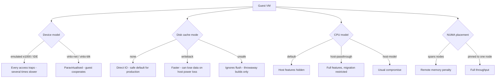

# KVM and libvirt Performance Tuning

**Level:** Advanced
**Tree:** [Containers & Virtualization on Linux](../README.md)
**Branch:** [KVM Virtualization](README.md)
**Forest:** [Linux](../../../README.md)

## Explanation

# KVM and libvirt Performance Tuning

KVM turns the Linux kernel into a type-1-like hypervisor, with QEMU providing device emulation and **libvirt** offering the management API that virsh, Cockpit and higher-level platforms all consume.

## Use virtio for everything

Emulated hardware exists for compatibility and is slow, because every device access traps to the hypervisor. **virtio** devices are paravirtualised - the guest knows it is virtualised and cooperates - which removes most of that overhead.

A guest configured with an emulated e1000 NIC and IDE disk can be several times slower than the same guest with virtio-net and virtio-blk. This is the single highest-return check on any underperforming VM, and it is common on VMs imported from other platforms.

## Disk format and cache mode

**raw** is fastest; **qcow2** supports snapshots and thin provisioning at some cost. Preallocating a qcow2 recovers much of the difference.

**Cache mode is a correctness decision, not only a performance one.** cache=none uses direct IO and is the safe default for production. cache=writeback is faster and can lose recently written data on host power failure. cache=unsafe ignores flush requests entirely and must never be used for data you intend to keep - it exists for throwaway builds.

## CPU model and NUMA

The default CPU model hides host features. **host-passthrough** exposes the real CPU so the guest can use AES-NI, AVX and similar - a large difference for encryption and compute workloads - at the cost of restricting live migration to identical hardware. **host-model** is the usual compromise.

On multi-socket hosts, a VM whose vCPUs and memory span NUMA nodes suffers the remote-access penalty. Size guests to fit within a node where possible and pin them.

## Memory

**Ballooning** allows overcommit but introduces unpredictable guest behaviour under pressure. **Hugepages** reduce TLB pressure and measurably help large-memory guests such as databases.

## Architecture and flow



## Commands

### Command 1

Inventory of guests and the resource configuration of one

```text
virsh list --all; virsh dominfo <vm>
```

### Command 2

Check for emulated devices and cache mode - the first things to verify on a slow VM

```text
virsh dumpxml <vm> | grep -E "model type|driver name|cache=|<cpu"
```

### Command 3

Disk mapping plus format, virtual and actual size

```text
virsh domblklist <vm>; qemu-img info /var/lib/libvirt/images/<vm>.qcow2
```

### Command 4

Host NUMA topology as libvirt sees it, for placement decisions

```text
virsh capabilities | grep -A5 "<topology"
```

### Command 5

Pin vCPUs and bind guest memory to a single NUMA node

```text
virsh vcpupin <vm> 0 4; virsh numatune <vm> --mode strict --nodeset 0
```

### Command 6

Live per-VM statistics for disk, network and CPU

```text
virsh domstats <vm> --block --interface --vcpu
```

### Command 7

Change a device attribute without hand-editing XML

```text
virt-xml <vm> --edit --disk cache=none
```

### Command 8

Live migrate a guest and watch the job progress

```text
virsh domjobinfo <vm>; virsh migrate --live <vm> qemu+ssh://target/system
```

## Automation scripts

### KVM guest configuration auditor

```bash
#!/usr/bin/env bash
# Finds the two configuration mistakes that account for most slow VMs:
# emulated devices instead of virtio, and unsafe cache modes.
set -uo pipefail
rc=0

command -v virsh >/dev/null 2>&1 || { echo "libvirt not installed"; exit 2; }

for vm in $(virsh list --all --name 2>/dev/null); do
  [ -n "$vm" ] || continue
  xml=$(virsh dumpxml "$vm" 2>/dev/null) || continue
  echo "== $vm =="

  # emulated NICs
  nics=$(printf %s "$xml" | grep -oP '(?<=<model type=.)[a-z0-9-]+' | sort -u | tr '\n' ' ')
  echo "  nic models: ${nics:-none}"
  case "$nics" in
    *e1000*|*rtl8139*|*ne2k*)
      echo "    ALERT: emulated NIC in use - switch to virtio for a large throughput gain"
      rc=1 ;;
  esac

  # emulated disk buses
  buses=$(printf %s "$xml" | grep -oP '(?<=bus=.)[a-z]+' | sort -u | tr '\n' ' ')
  echo "  disk buses: ${buses:-none}"
  case "$buses" in
    *ide*|*sata*)
      echo "    ALERT: IDE/SATA bus in use - switch to virtio-blk or virtio-scsi"
      rc=1 ;;
  esac

  # cache mode
  caches=$(printf %s "$xml" | grep -oP '(?<=cache=.)[a-z]+' | sort -u | tr '\n' ' ')
  echo "  cache modes: ${caches:-default}"
  case "$caches" in
    *unsafe*)
      echo "    ALERT: cache=unsafe ignores flush - data WILL be lost on host power failure"
      rc=2 ;;
    *writeback*)
      echo "    WARN: cache=writeback can lose recent writes on host power failure"
      rc=1 ;;
  esac

  # CPU model
  cpumode=$(printf %s "$xml" | grep -oP '(?<=<cpu mode=.)[a-z-]+' | head -1)
  echo "  cpu mode: ${cpumode:-default}"
done
exit $rc
```

## Lab

**Objective:** Quantify the performance difference that device model, cache mode and NUMA placement make on the same guest.

### Steps

1. Create a guest with an emulated e1000 NIC and IDE disk, and benchmark disk and network throughput.
2. Convert the same guest to virtio-blk and virtio-net, rerun the identical benchmarks and record the difference.
3. Compare raw and qcow2 disk formats, then compare preallocated qcow2 against sparse.
4. Benchmark with cache=none against cache=writeback and note both the speed and the durability implication.
5. Set the CPU model to host-passthrough and confirm the guest now sees AES-NI, then benchmark an encryption workload.
6. Pin vCPUs and memory to a single NUMA node and measure the change on a memory-bound workload.

### Validation

Each tuning change is measured separately on the actual hardware and recorded as a before and after number, with only one variable altered at a time so the attribution holds,cache=writeback is shown faster than cache=none on the same workload, and the window of guest writes acknowledged but not yet on stable storage is stated explicitly - the data loss accepted in exchange,An emulated device is compared against its virtio equivalent under identical load, so the paravirtualised gain is a measured figure for this estate rather than a general claim,At least one tuning change is shown to make no measurable difference on this hardware and is left unapplied, since carrying configuration that buys nothing is a cost with no return

## Operational automation

## Automating KVM configuration

**Define guests from templates, never by hand.** Hand-built VMs are exactly where emulated NICs and inconsistent cache modes come from, and they are invisible until someone benchmarks.

**Audit for emulated devices continuously.** VMs imported or converted from other platforms routinely arrive with e1000 and IDE, and nobody notices because they work - just slowly.

**Treat cache mode as a policy decision with a stated owner.** cache=writeback trades durability for speed and cache=unsafe abandons durability entirely; neither should be set by an individual without the data-loss implication being explicit.

**Match CPU model to the migration requirement.** host-passthrough gives the best performance and restricts live migration to identical hardware; host-model is the usual compromise. Choose deliberately rather than accepting whatever the default produced.

## Troubleshooting

### Scenario 1: A VM has poor network and disk performance while the host is idle

**Likely cause:** Emulated e1000 and IDE devices rather than virtio - every device access traps to the hypervisor

**Resolution:** Change the NIC model to virtio and the disk bus to virtio-blk or virtio-scsi; ensure guest drivers are present, particularly on Windows guests

### Scenario 2: Guest filesystem is corrupted after a host power failure

**Likely cause:** cache=writeback or cache=unsafe meant writes the guest believed were durable were still in host memory

**Resolution:** Use cache=none for production; reserve writeback for data you can rebuild and never use unsafe for anything you intend to keep

### Scenario 3: Live migration fails with a CPU compatibility error

**Likely cause:** The guest uses host-passthrough and the target host CPU differs

**Resolution:** Use host-model or an explicit named CPU model that both hosts support; define a common baseline across the migration cluster

### Scenario 4: A large guest performs inconsistently on a multi-socket host

**Likely cause:** vCPUs and memory span NUMA nodes, so guest scheduling decisions cause remote memory access unpredictably

**Resolution:** Size the guest to fit within one node and pin with vcpupin and numatune, or expose virtual NUMA topology so the guest scheduler is locality-aware

## Interview questions

### 1. A VM has poor disk and network performance while the host is idle. What do you check first?

The device models. I would dump the guest XML and look for an emulated NIC such as e1000 or rtl8139 and an IDE or SATA disk bus. Emulated devices trap to the hypervisor on every access, so they can be several times slower than virtio equivalents, and this is extremely common on guests imported or converted from other platforms because they work correctly and nobody investigates. Switching to virtio-net and virtio-blk or virtio-scsi is usually the single largest improvement available, provided the guest has the drivers - which needs checking explicitly on Windows guests.

### 2. Explain the KVM disk cache modes and when each is appropriate.

cache=none uses direct IO, bypassing the host page cache, so a write the guest believes is durable actually is. It is the correct default for production. cache=writeback lets the host cache writes and acknowledge before they reach disk, which is faster but means a host power failure can lose data the guest considered committed - acceptable only where you can rebuild the guest. cache=unsafe additionally ignores flush requests entirely; it exists for throwaway workloads such as image builds and must never hold data you intend to keep. The important framing is that this is a durability decision with a performance side effect, not the other way round.

### 3. What is the trade-off with host-passthrough CPU mode?

It exposes the physical CPU model and all its feature flags to the guest, so the guest can use hardware acceleration such as AES-NI and AVX. For encryption or compute-heavy workloads that is a substantial gain. The cost is that the guest now depends on those specific features, so live migration only works to a host with an identical or superset CPU - which breaks migration across a mixed-generation cluster and complicates hardware refresh. host-model is the usual compromise: it exposes most host features while letting libvirt negotiate a definition the destination can satisfy. The right choice depends on whether performance or migration flexibility matters more for that workload.

## Certification alignment

- RHCSA EX200 - manage virtual machines with virsh
- Red Hat EX210 and virtualization curriculum
- CompTIA Linux+ XK0-005 - virtualization concepts and management
- Virtualization performance engineering fundamentals

## References

- Red Hat documentation - Configuring and managing virtualization
- libvirt documentation - domain XML format reference
- QEMU documentation - disk cache modes and virtio devices
- man 1 virsh, man 1 virt-xml, man 1 qemu-img

## Suggested video search

KVM libvirt virtio performance tuning cache mode CPU pinning hugepages tutorial

---

> Validate commands, versions, permissions, licensing, and rollback procedures in an isolated lab before production use.
