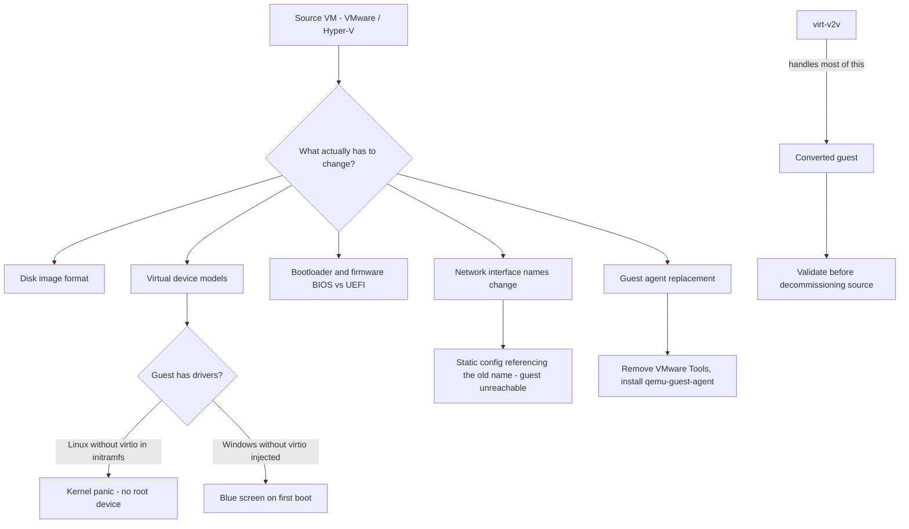

# VM Conversion and Migration with virt-v2v

**Level:** Advanced
**Tree:** [Containers & Virtualization on Linux](../README.md)
**Branch:** [KVM Virtualization](README.md)
**Forest:** [Linux](../../../README.md)

## Explanation

# VM Conversion and Migration with virt-v2v

Moving virtual machines between platforms - VMware to KVM, Hyper-V to OpenShift Virtualization, physical to virtual - is a recurring enterprise project, and the work is far more about the guest operating system than about the disk image.

## What conversion actually involves

Copying the disk is the easy part. The guest was built expecting a specific set of virtual hardware, and after conversion that hardware has changed. The guest needs:

**Drivers** for the new virtual devices. A Linux guest needs virtio drivers present in its initramfs, or it boots to a kernel panic because it cannot find its root device. A Windows guest needs the virtio driver package injected before conversion, or it blue-screens on first boot.

**Bootloader and firmware alignment.** A guest installed under BIOS will not boot on a UEFI-only definition, and vice versa.

**Network reconfiguration.** Interface names change when the device model changes, so persistent naming rules and static configurations referencing the old name leave the guest unreachable.

**Guest agent replacement.** VMware Tools or Hyper-V Integration Services must be removed and qemu-guest-agent installed, or the guest carries dead software and the new platform cannot query it.

**virt-v2v** handles most of this automatically, which is precisely why it should be used rather than a manual disk copy.

## Plan for the cutover, not the conversion

The technical conversion usually works. What causes failed migrations is everything around it: undocumented dependencies, applications licensed to a hardware UUID that changes, static IPs that must be preserved, and the fact that **conversion requires the guest to be powered off** for a consistent copy - so the outage window is real and must be agreed.

Always convert a pilot wave first, and never decommission the source until post-cutover validation has passed.

## Rollback

The rollback for a conversion is **the source VM, left intact and powered off**. That is why decommissioning is the last step rather than part of cutover, and why the window must include the time to power the original back on.

What cannot be rolled back is **data written after cutover**. Once the converted guest serves traffic, reverting to the source loses everything since, so the decision point is the moment users are admitted rather than the moment the conversion finishes.

## Security implications

Conversion frequently **carries credentials across**: hypervisor tooling, agents, and cloud-init or sysprep state from the source platform. Guest agents from the old hypervisor remain installed and running, holding privileges for a platform that no longer exists.

Remove the source platform tooling as part of the conversion rather than afterwards, and treat the **converted disk image as sensitive** in transit - it is a full copy of the system including its keys, and it usually traverses a network path chosen for throughput rather than confidentiality.

## Monitoring

Verify **boot and service start on the converted guest before cutover**, not reachability. A guest that boots to a login prompt with its application failing is a successful conversion and a failed migration.

The specific thing to check is **device naming and drivers**: a converted guest may come up with different network interface names or missing virtio drivers, so the network configuration silently does not apply. That is the most common post-conversion fault and it is invisible until traffic is expected.

## High availability and disaster recovery

A converted guest inherits **none of the source platform HA**. Clustering, restart policies and anti-affinity rules do not travel with the disk image, so a guest that was protected before conversion is unprotected after it unless the target policies are recreated deliberately.

Backups are the same story: the **backup agent and its schedule are platform-specific**, and a converted guest is typically unprotected until it is re-registered. Confirm the first successful backup after cutover rather than assuming continuity.

## Anti-patterns

**Converting the whole estate in one wave.** A pilot exists to surface the driver, naming and licensing surprises on a system whose failure is affordable.

**Decommissioning the source at cutover.** It removes the only rollback at the moment it is most likely to be needed.

**Assuming performance parity.** Different storage tier and different CPU generation mean the converted guest may be slower, and discovering that under production load is avoidable with a measured pilot.

## Change control

Conversion is a **high blast radius change with a clear reversal point**, which makes the gate obvious: no user traffic until post-cutover validation passes, and no decommissioning until the guest has run a full business cycle including its backup and any month-end job.

The item needing explicit sign-off is **licensing**, because some products are licensed per socket, per host or per platform, and a conversion can breach an agreement without any technical symptom at all.

## Architecture and flow



## Commands

### Command 1

Convert directly from a VMware VMX definition into libvirt

```text
virt-v2v -i vmx /vmfs/volumes/ds1/vm1/vm1.vmx -o libvirt -os default
```

### Command 2

Convert from vCenter using the VDDK transport for a faster copy

```text
virt-v2v -ic vpx://vcenter/Datacenter/Cluster/host -it vddk -io vddk-libdir=/opt/vddk vm1 -o local -os /var/tmp
```

### Command 3

Convert a bare disk image, choosing the root filesystem interactively

```text
virt-v2v -i disk disk.qcow2 -o local -os /var/tmp --root ask
```

### Command 4

Inspect a guest before converting to see the OS, drivers and bootloader it uses

```text
virt-v2v-inspector -i disk disk.qcow2
```

### Command 5

Point virt-v2v at the Windows virtio drivers it must inject during conversion

```text
export VIRTIO_WIN=/usr/share/virtio-win/virtio-win.iso
```

### Command 6

Identify guest OS and architecture without booting it

```text
virt-inspector -a disk.qcow2 | grep -E "<osinfo|<arch|<product_name"
```

### Command 7

Read files inside a guest disk image offline - useful for pre-conversion checks

```text
guestfish -a disk.qcow2 -i cat /etc/fstab
```

### Command 8

Regenerate the initramfs offline so virtio drivers are present at boot

```text
virt-customize -a disk.qcow2 --run-command "dracut -f --regenerate-all"
```

## Automation scripts

### Pre-conversion guest readiness check

```bash
#!/usr/bin/env bash
# Checks a guest image for the things that cause conversion to fail at first boot:
# missing virtio drivers, device-name references in fstab, and old guest agents.
set -uo pipefail
IMG="${1:?usage: $0 <disk-image>}"
rc=0

command -v virt-inspector >/dev/null 2>&1 || { echo "libguestfs-tools not installed"; exit 2; }
[ -r "$IMG" ] || { echo "cannot read $IMG"; exit 2; }

echo "== guest identity =="
virt-inspector -a "$IMG" 2>/dev/null | grep -E "<name>|<osinfo>|<arch>|<product_name>" | sed 's/^[ \t]*/  /'

echo "== virtio driver presence =="
if virt-ls -a "$IMG" -m /boot / 2>/dev/null | grep -q initramfs; then
  if guestfish --ro -a "$IMG" -i sh "lsinitrd /boot/initramfs-\$(uname -r).img 2>/dev/null | grep -c virtio" 2>/dev/null | grep -qv "^0$"; then
    echo "  OK: virtio modules appear present in initramfs"
  else
    echo "  WARN: could not confirm virtio in initramfs"
    echo "        if absent the guest will panic with no root device after conversion"
    rc=1
  fi
fi

echo "== fstab device references =="
fstab=$(guestfish --ro -a "$IMG" -i cat /etc/fstab 2>/dev/null || true)
if [ -n "$fstab" ]; then
  dev=$(printf %s "$fstab" | grep -c "^/dev/sd\|^/dev/hd" || true)
  if [ "${dev:-0}" -gt 0 ]; then
    echo "  ALERT: $dev fstab entries reference /dev/sdX or /dev/hdX by name"
    echo "         device names change on conversion - switch to UUID= before converting"
    rc=1
  else
    echo "  OK: fstab uses UUID or LABEL references"
  fi
fi

echo "== legacy guest agents =="
for pkg in open-vm-tools VMwareTools hyperv-daemons; do
  if guestfish --ro -a "$IMG" -i sh "rpm -q $pkg" 2>/dev/null | grep -qv "not installed"; then
    echo "  INFO: $pkg present - remove after conversion and install qemu-guest-agent"
  fi
done
exit $rc
```

## Lab

**Objective:** Convert a guest between platforms and reproduce the two classic first-boot failures.

### Steps

1. Inspect a source guest image with virt-inspector and record its OS, bootloader and device references.
2. Check whether fstab references devices by name rather than UUID, and correct any that do.
3. Convert the guest with virt-v2v and start it, confirming it boots and networks correctly.
4. Deliberately convert a guest whose initramfs lacks virtio and observe the kernel panic for a missing root device.
5. Repair it offline with virt-customize regenerating the initramfs, and confirm it now boots.
6. Remove the old guest agent, install qemu-guest-agent and confirm the host can query the guest.

### Validation

A guest is converted and boots to a usable state, with success judged by services reachable over the network rather than by the conversion tool reporting no error,The missing-virtio panic is produced deliberately and read from the console, so the failure is recognised by its signature rather than by having been warned about it,The panic is fixed by rebuilding the initramfs with the virtio drivers present, and the fix is verified by the guest booting unaided rather than by the command completing,Interface naming is checked after conversion, since new virtual hardware can rename the device and leave a host that boots correctly with no network - a success by every check except the one that matters

## Operational automation

## Automating conversion at scale

**Inspect before converting, in bulk.** virt-inspector across the estate identifies guests needing preparation - name-based fstab entries, missing drivers, unsupported OS versions - so the problems are known before the outage window rather than discovered during it.

**Fix device references before conversion, not after.** An fstab entry naming /dev/sda leaves a guest unbootable when the device model changes, and repairing it after the fact means offline surgery under time pressure.

**Convert in waves with a pilot first.** The pilot exists to produce accurate timings for the real cutover window and to shake out per-application issues while the stakes are low.

**Never decommission the source until validation passes.** Keep the original powered off but intact through the whole hypercare period; it is the only rollback that genuinely works.

## Troubleshooting

### Scenario 1: Converted Linux guest panics with unable to mount root filesystem

**Likely cause:** The initramfs lacks virtio drivers, so the kernel cannot see the disk on the new device model

**Resolution:** Repair offline with virt-customize running dracut --regenerate-all, or add virtio modules before conversion

### Scenario 2: Converted Windows guest blue-screens on first boot

**Likely cause:** virtio storage drivers were not injected, so Windows cannot access its boot disk

**Resolution:** Set VIRTIO_WIN to the virtio-win ISO before running virt-v2v so drivers are injected during conversion

### Scenario 3: Guest boots after conversion but has no network

**Likely cause:** The interface name changed with the device model, and persistent naming rules or static configuration still reference the old name

**Resolution:** Remove stale udev persistent-net rules and update the connection profile to match the new interface name

### Scenario 4: Guest boots to emergency mode after conversion

**Likely cause:** fstab references devices by name such as /dev/sda2, and the names changed

**Resolution:** Boot to rescue, replace name-based entries with UUID= references, and correct this before converting remaining guests

## Interview questions

### 1. Why is converting a VM more than copying its disk?

Because the guest was installed against a specific set of virtual hardware and that hardware changes underneath it. The guest needs drivers for the new devices - a Linux guest without virtio in its initramfs panics because it cannot find its root device, and a Windows guest without virtio injected blue-screens. Bootloader and firmware expectations must match, since a BIOS-installed guest will not boot a UEFI definition. Interface names change with the device model, so static network configuration referencing the old name leaves the guest unreachable. And the old guest agent needs removing and replacing. virt-v2v exists because it automates most of this, which is exactly why a manual disk copy is the wrong approach.

### 2. What is the most common reason a converted guest fails to boot?

Missing virtio drivers. On Linux the initramfs was built when the disk was presented as IDE or a VMware paravirtual SCSI device, so it contains no virtio modules; after conversion the kernel cannot see the disk at all and panics with an unable-to-mount-root error. On Windows the equivalent is a blue screen because the storage driver for the new controller is absent, which is why VIRTIO_WIN must point at the virtio-win ISO before conversion so virt-v2v can inject them. The second most common cause is fstab referencing devices by name rather than UUID, which drops the guest into emergency mode.

### 3. How would you plan a large-scale platform migration?

The technical conversion is rarely what fails - the planning around it is. I would start with automated inspection across the estate to find guests needing preparation, and fix issues like name-based fstab entries before any outage window. Then a pilot wave, chosen to be representative but low-risk, which exists mainly to produce accurate timings for the real cutover and to surface per-application problems. Then bulk waves grouped by dependency, with validation between each rather than at the end. Throughout, the source guests stay powered off but intact until post-cutover validation passes, because that is the only rollback that actually works. And the conversion requires the guest powered off for a consistent copy, so the outage window is real and has to be agreed with the business up front rather than assumed.

## Certification alignment

- Red Hat virtualization and migration curriculum
- RHCE EX294 - automate migration tasks
- CompTIA Linux+ XK0-005 - virtualization and system migration
- Enterprise migration methodology (6R assessment)

## References

- Red Hat documentation - Converting virtual machines from other hypervisors to KVM
- man 1 virt-v2v, man 1 virt-inspector, man 1 virt-customize
- libguestfs project documentation
- virtio-win driver package documentation for Windows guests

## Suggested video search

virt-v2v VMware to KVM migration conversion virtio drivers Windows Linux tutorial

---

> Validate commands, versions, permissions, licensing, and rollback procedures in an isolated lab before production use.
