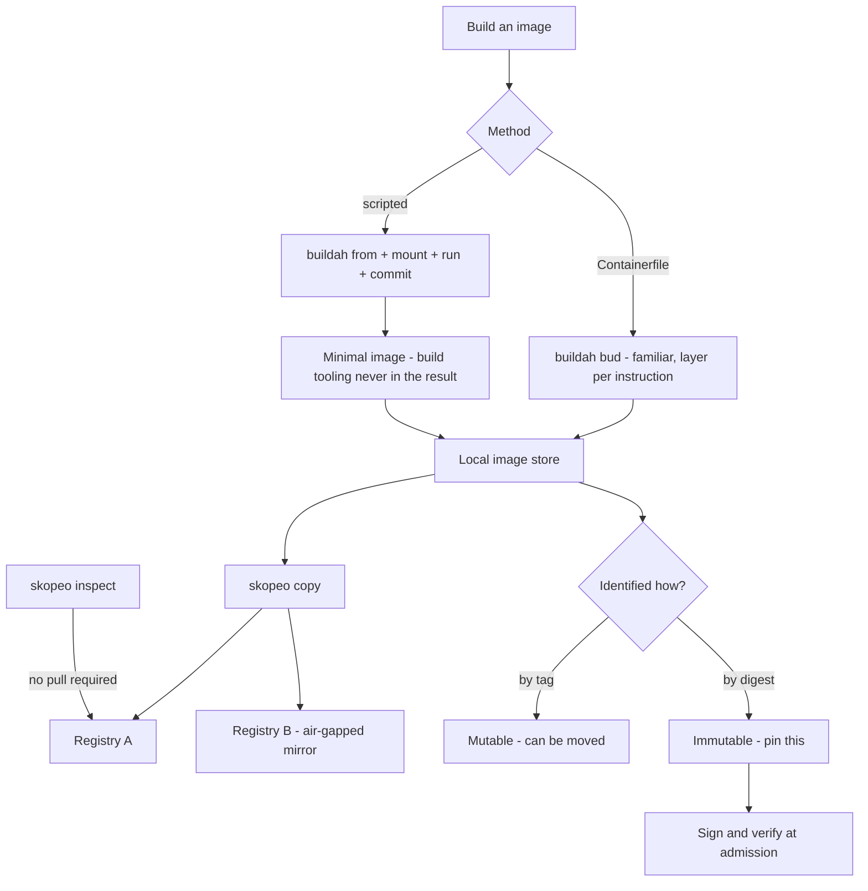

# Image Building with Buildah and Registry Operations with Skopeo

**Level:** Intermediate
**Tree:** [Containers & Virtualization on Linux](../README.md)
**Branch:** [Rootless Containers & Image Supply Chain](README.md)
**Forest:** [Linux](../../../README.md)

## Explanation

# Image Building with Buildah and Registry Operations with Skopeo

Building images from a Containerfile inside a running daemon is only one way to produce a container image, and it is not always the best one.

## Buildah

**Buildah** builds images without a daemon and without requiring root. It can consume a Containerfile exactly like docker build, but it can also build **scriptably**: mount a working container filesystem, run ordinary commands against it from the host, and commit.

That matters for two reasons. First, it allows genuinely minimal images - you can install packages into a scratch root and commit without the build tooling ever being present in the result. Second, it avoids the layer-per-instruction model when you do not want it.

## Skopeo

**Skopeo** operates on images in registries without pulling them into local storage. It can inspect an image manifest, copy between registries, delete tags and verify signatures - all remotely.

This is what makes air-gapped and multi-registry workflows practical. Mirroring a set of images into a disconnected environment with skopeo copy or skopeo sync moves them directly registry to registry, without a local daemon storing every layer.

It is also the correct tool for **inspection in a pipeline**: checking an image labels, architecture or digest without the cost and risk of pulling it.

## Supply chain

The digest is what identifies an image immutably; a tag can be moved. Anything that matters should be **pinned by digest**, and images should be **signed** with sigstore or GPG and verified at admission. Skopeo participates in all of this, which is why it belongs in the pipeline rather than only on an engineer laptop.

## Architecture and flow



## Commands

### Command 1

Build from a Containerfile exactly as docker build would, but daemonless

```text
buildah bud -t myapp:1.0 -f Containerfile .
```

### Command 2

Start a working container to build up scriptably

```text
ctr=$(buildah from registry.access.redhat.com/ubi9/ubi-minimal)
```

### Command 3

Run a command inside the working container during a scripted build

```text
buildah run $ctr -- microdnf install -y nginx
```

### Command 4

Add content and set image configuration

```text
buildah copy $ctr ./app /opt/app; buildah config --entrypoint '["/opt/app/run"]' $ctr
```

### Command 5

Commit the working container to an image, squashing layers

```text
buildah commit --squash $ctr myapp:1.0
```

### Command 6

Read a remote image manifest and labels without pulling it

```text
skopeo inspect docker://registry.example.com/myapp:1.0
```

### Command 7

Copy directly between registries - the basis of air-gapped mirroring

```text
skopeo copy docker://upstream/img:1.0 docker://internal.registry/img:1.0
```

### Command 8

Mirror a declared set of images into a disconnected registry

```text
skopeo sync --src yaml --dest docker images.yaml internal.registry
```

## Automation scripts

### Image digest pinning auditor

```bash
#!/usr/bin/env bash
# Flags images referenced by mutable tag rather than immutable digest, and
# resolves the current digest so references can be pinned.
set -uo pipefail
rc=0

command -v skopeo >/dev/null 2>&1 || { echo "skopeo not installed"; exit 2; }

if [ $# -eq 0 ]; then
  echo "usage: $0 <image-ref> [image-ref...]"
  echo "  e.g. $0 registry.access.redhat.com/ubi9/ubi:latest"
  exit 2
fi

for ref in "$@"; do
  if printf %s "$ref" | grep -q "@sha256:"; then
    echo "  OK      $ref"
    echo "          already pinned by digest"
    continue
  fi

  echo "  UNPINNED $ref"
  rc=1
  d=$(skopeo inspect --format "{{.Digest}}" "docker://$ref" 2>/dev/null || true)
  if [ -n "${d:-}" ]; then
    base=$(printf %s "$ref" | cut -d: -f1)
    echo "           pin as: ${base}@${d}"
  else
    echo "           could not resolve digest (auth or network?)"
  fi
done

echo
echo "note: a tag can be moved to point at different content at any time."
echo "      a digest cannot - pin anything that matters."
exit $rc
```

## Lab

**Objective:** Build a minimal image scriptably, mirror it to a second registry without pulling, and pin it by digest.

### Steps

1. Build an image from a Containerfile with buildah bud and record its size.
2. Rebuild the same application scriptably with buildah from, run, copy and commit, keeping build tooling out of the final image.
3. Compare the two image sizes and inspect the layers of each.
4. Use skopeo inspect to read the manifest of a remote image without pulling it.
5. Copy an image directly between two registries with skopeo copy and verify the digest is identical at both ends.
6. Move a tag to point at different content, then demonstrate that a digest reference still resolves to the original image.

### Validation

The scripted build produces a measurably smaller image than the naive equivalent, with both sizes recorded and the saving attributed to a specific change rather than to the tooling in general,A tag is moved to point at different content while the original digest still resolves to the original image, demonstrating directly that a tag is a mutable pointer and a digest is not,A deployment reference is pinned by digest, and the earlier tag-based reference is shown to have silently changed what it resolved to - the supply-chain failure this defends against,skopeo inspect is used to read a remote image without pulling it, and a copy is made between two registries with no container engine running, showing the operation does not require a daemon or local storage

## Operational automation

## Automating the image supply chain

**Pin by digest in anything that matters.** A tag is a mutable pointer; the same tag can serve different content tomorrow. Digests are the only immutable reference, and they are what makes a build reproducible and an audit meaningful.

**Mirror with skopeo sync rather than pull and push.** It moves images registry to registry from a declarative list, without a local daemon storing every layer, which is what makes disconnected environments practical to maintain.

**Inspect before pulling in pipelines.** skopeo inspect answers questions about architecture, labels and digest at negligible cost, where a pull may transfer gigabytes to learn the same thing.

**Sign images and verify at admission, not merely at build.** A signature that is never checked provides no protection at all; the verification step is where the security value actually is.

## Troubleshooting

### Scenario 1: skopeo reports authentication required for a registry that works with podman

**Likely cause:** skopeo does not automatically share every credential store location, or the auth file path differs

**Resolution:** Log in with podman login (which writes the standard auth file) or pass --authfile explicitly to skopeo

### Scenario 2: Images built with buildah are far larger than expected

**Likely cause:** Build tooling and package caches were installed into the final image rather than kept out of it

**Resolution:** Use the scripted approach so build steps happen against a mounted filesystem, or use a multi-stage Containerfile and buildah commit --squash

### Scenario 3: A deployment that worked last week now behaves differently with no change

**Likely cause:** The referenced tag was moved to point at new content

**Resolution:** Pin by digest instead of tag; use skopeo inspect to resolve and record the digest at release time

### Scenario 4: skopeo copy fails against an internal registry with a TLS error

**Likely cause:** The registry uses a certificate not trusted by the host, or is plain HTTP

**Resolution:** Add the CA to the host trust store; use --dest-tls-verify=false only in a lab, never as a permanent workaround

## Interview questions

### 1. Why pin container images by digest rather than tag?

Because a tag is a mutable pointer and a digest is an immutable content hash. The same tag can be republished to point at entirely different content at any time, whether through a legitimate rebuild or a compromise. That means a deployment referencing a tag is not reproducible - redeploying the identical manifest can produce different software. A digest reference cryptographically identifies exact content, so a rollback genuinely returns to what ran before and an audit can state precisely what was deployed. Tags are convenient for humans; digests are what should appear in anything that matters.

### 2. What does Skopeo let you do that pulling an image does not?

It operates on images remotely without ever bringing them into local storage. You can inspect a manifest to check architecture, labels or digest at essentially no cost, where a pull may transfer gigabytes to learn the same fact. More importantly it copies directly between registries, which is what makes air-gapped mirroring practical - skopeo sync moves a declared set of images from an upstream registry into a disconnected one without a local daemon caching every layer along the way. It also handles signatures and deletions remotely, so it fits naturally into a pipeline rather than requiring a container host.

### 3. When would you build with Buildah scriptably rather than from a Containerfile?

When you want precise control over what ends up in the image. The Containerfile model creates a layer per instruction and everything you run is inside the image being built, so build tooling and package caches tend to persist unless carefully cleaned. Buildah lets you mount a working container filesystem and operate on it from the host, so you can install into a minimal root using host tooling and commit only the result - the package manager never has to exist in the final image. That produces genuinely minimal images with a smaller attack surface, and it is also useful when the build logic is complex enough that expressing it as Containerfile instructions becomes awkward.

## Certification alignment

- Red Hat EX188 - Containers, Podman and OpenShift development
- RHCSA EX200 - manage container images
- CompTIA Linux+ XK0-005 - container image management
- Supply chain security practices (SLSA, sigstore)

## References

- Red Hat documentation - Building, running and managing Linux containers
- Buildah documentation and tutorials
- Skopeo documentation - copy, sync and inspect
- OCI image specification - manifests and digests

## Suggested video search

Buildah Skopeo container image build registry copy air-gapped mirror tutorial

---

> Validate commands, versions, permissions, licensing, and rollback procedures in an isolated lab before production use.
