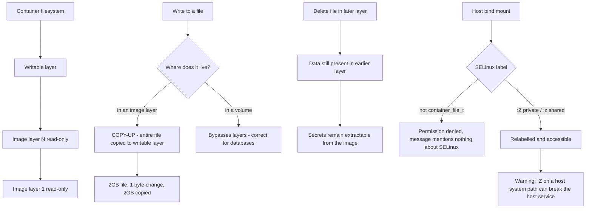

# Container Storage Drivers, Layers and SELinux Labelling

**Level:** Advanced
**Tree:** [Containers & Virtualization on Linux](../README.md)
**Branch:** [Rootless Containers & Image Supply Chain](README.md)
**Forest:** [Linux](../../../README.md)

## Explanation

# Container Storage Drivers, Layers and SELinux Labelling

Container storage causes a disproportionate share of production incidents, usually because the layered filesystem behaves in ways people do not expect.

## overlayfs and copy-up

**overlay2** stacks read-only image layers under a thin writable layer. Reads pass through to whichever layer holds the file; writes trigger **copy-up** - the entire file is copied into the writable layer before modification.

That single behaviour explains most container storage surprises. Modifying one byte of a 2 GB file copies 2 GB. A database writing to a file inside the container layer performs appallingly for exactly this reason, which is why databases belong on a **volume** that bypasses the layered filesystem entirely.

## Layer count and image design

Each Containerfile instruction creates a layer. Deleting a file in a later layer does not reclaim its space - the data remains in the earlier layer and is still shipped. This is how secrets get baked into images: added in one layer, deleted in another, and still fully extractable from the image.

## SELinux labelling

On RHEL, container processes run confined by SELinux with the type container_t and can only access files labelled container_file_t. Mounting a host directory whose label is anything else produces permission denied regardless of file mode - and the error message says nothing about SELinux.

**:Z** relabels the mount privately to that container, **:z** relabels it shared between containers. The important warning is that :Z on a directory shared with the host can relabel host content in ways that break the host service using it, so it should never be applied casually to system paths.

## Space exhaustion

Container storage fills quietly. Stopped containers keep their writable layers, dangling images keep their layers, and unused volumes are never reclaimed automatically. A host that runs out of space in the container graph root fails in confusing ways rather than reporting a clean disk-full error.

## Architecture and flow



## Commands

### Command 1

Which storage driver is in use and where the graph root lives

```text
podman info --format "{{.Store.GraphDriverName}} {{.Store.GraphRoot}}"
```

### Command 2

Space consumed by images, containers and volumes, with reclaimable amounts

```text
podman system df -v
```

### Command 3

Layer structure of an image and which layers are shared with others

```text
podman image tree myapp:1.0
```

### Command 4

Inspect and set SELinux context on a directory to be bind-mounted

```text
ls -Z /srv/appdata; chcon -Rt container_file_t /srv/appdata
```

### Command 5

Mount with private relabelling so the container can access the path

```text
podman run -v /srv/appdata:/data:Z myapp
```

### Command 6

Find the SELinux denial behind a permission error that has no other explanation

```text
ausearch -m avc -ts recent
```

### Command 7

Use a managed volume so database writes bypass the layered filesystem

```text
podman volume create appdata; podman run -v appdata:/var/lib/db postgres
```

### Command 8

Reclaim space from stopped containers, dangling images and unused volumes

```text
podman system prune -a --volumes; podman volume prune
```

## Automation scripts

### Container storage and label auditor

```bash
#!/usr/bin/env bash
# Reports reclaimable container storage and finds bind mounts whose SELinux label
# will cause permission denials that look like filesystem problems.
set -uo pipefail
rc=0

command -v podman >/dev/null 2>&1 || { echo "podman not installed"; exit 2; }

echo "== storage backend =="
podman info --format "  driver: {{.Store.GraphDriverName}}\n  root:   {{.Store.GraphRoot}}" 2>/dev/null

root=$(podman info --format "{{.Store.GraphRoot}}" 2>/dev/null)
if [ -n "${root:-}" ] && [ -d "$root" ]; then
  use=$(df -P "$root" | awk 'NR==2{gsub(/%/,"",$5); print $5}')
  echo "  filesystem usage: ${use}%"
  if   [ "${use:-0}" -ge 90 ]; then echo "  ALERT: container storage over 90% - expect confusing failures"; rc=2
  elif [ "${use:-0}" -ge 75 ]; then echo "  WARN: container storage over 75%"; rc=1; fi
fi

echo "== reclaimable =="
podman system df 2>/dev/null | sed 's/^/  /'

echo "== bind mount SELinux labels =="
if command -v getenforce >/dev/null 2>&1 && [ "$(getenforce)" != "Disabled" ]; then
  found=0
  while read -r line; do
    [ -n "$line" ] || continue
    src=$(printf %s "$line" | cut -d: -f1)
    [ -e "$src" ] || continue
    lbl=$(ls -Zd "$src" 2>/dev/null | awk '{print $1}')
    case "$lbl" in
      *container_file_t*|*container_share_t*) echo "  OK   $src ($lbl)" ;;
      *) echo "  RISK $src ($lbl) - container access will be denied without :Z or :z"; found=1; rc=1 ;;
    esac
  done < <(podman ps --format "{{range .Mounts}}{{.}}\n{{end}}" 2>/dev/null | grep "^/" || true)
  [ "$found" -eq 0 ] && echo "  no risky bind mounts detected"
else
  echo "  SELinux not enforcing - labelling not applicable"
fi
exit $rc
```

## Lab

**Objective:** Demonstrate copy-up cost, extract a deleted secret from an image, and fix an SELinux volume denial.

### Steps

1. Build an image containing a large file, then run a container and modify one byte of it while timing the operation.
2. Repeat with the same file on a volume and compare the times, quantifying the copy-up cost.
3. Build an image that adds a secret in one layer and deletes it in a later one.
4. Extract the secret from the image layers to prove deletion did not remove it.
5. Bind-mount a host directory without :Z and observe permission denied despite correct file modes.
6. Find the denial with ausearch, remount with :Z, and confirm access now works.

### Validation

The copy-up penalty is measured by timing the first write to a large file inherited from a lower layer against a subsequent write to the same file, so the cost is attributed to copy-up rather than to disk speed,A secret added in one layer and deleted in a later one is recovered from the image, proving deletion in an overlay is a whiteout in the upper layer and not removal of the data,A permission denial is traced to SELinux rather than file mode by reading the AVC denial in the audit log, with the file mode shown to be permissive at the time,The denial is resolved with the correct label rather than by disabling enforcement, and setenforce 0 is used only to confirm the diagnosis before being reverted - a permissive system is a fault hidden, not fixed

## Operational automation

## Automating container storage hygiene

**Monitor the graph root filesystem specifically.** Container storage exhaustion produces confusing failures rather than a clean disk-full error, and the graph root is frequently on a different filesystem from the one being monitored.

**Schedule pruning, but scope it carefully.** Unused images and stopped containers accumulate indefinitely. Automated pruning is necessary, but prune --volumes will delete data if a volume is temporarily unreferenced, so treat volumes differently from images.

**Never build secrets into images, even transiently.** Deleting in a later layer does not remove the data - it remains in the earlier layer and is fully extractable. Use build secrets or inject at runtime.

**Put write-heavy data on volumes, always.** Databases and anything with high write turnover perform badly on the layered filesystem because of copy-up, and the writable layer is discarded when the container is removed.

## Troubleshooting

### Scenario 1: A container cannot read a bind-mounted directory despite correct ownership and mode

**Likely cause:** SELinux - the host directory does not carry a container-accessible label, and the error mentions nothing about SELinux

**Resolution:** Confirm with ausearch -m avc; remount with :Z for private or :z for shared access, or set the context with chcon

### Scenario 2: Writing to a large file inside a container is extremely slow

**Likely cause:** overlayfs copy-up is copying the entire file into the writable layer before the modification

**Resolution:** Move the data onto a volume so writes bypass the layered filesystem entirely

### Scenario 3: A secret removed in the Containerfile is still recoverable from the image

**Likely cause:** Layers are additive - deleting in a later layer leaves the data in the earlier one

**Resolution:** Never add the secret in the first place; use build-time secret mounts or inject at runtime, and rotate the exposed credential

### Scenario 4: Host runs out of space and containers fail in unpredictable ways

**Likely cause:** Stopped container writable layers, dangling images and orphaned volumes accumulated in the graph root

**Resolution:** Run podman system df -v to see reclaimable space, prune on a schedule, and monitor the graph root filesystem specifically

## Interview questions

### 1. Why do databases perform badly when their data lives in the container layer?

Because of copy-up in the overlay filesystem. Image layers are read-only, so the first write to any existing file copies that entire file into the writable layer before the modification is applied. For a database with large data files that means enormous write amplification - changing a few bytes can copy gigabytes. On top of that the writable layer is discarded when the container is removed, so the data is not durable anyway. Volumes bypass the layered filesystem completely and write directly to the underlying storage, which is both dramatically faster and actually persistent.

### 2. A file was deleted in a later image layer. Is it gone?

No. Layers are additive and immutable - a deletion in a later layer records a whiteout marker that hides the file from the assembled view, but the data itself remains in the earlier layer and is still shipped with the image. Anyone who can pull the image can extract it. This is the standard way credentials end up leaked: added during a build step, deleted in a later instruction, and fully recoverable from the published image. The only real fixes are never adding the secret at all - using build-time secret mounts or runtime injection - and rotating anything that was exposed.

### 3. A container gets permission denied on a bind mount, but the file permissions are correct. What is happening?

Almost certainly SELinux. On RHEL, container processes run confined as container_t and can only access files labelled container_file_t. A host directory carrying its normal label is inaccessible regardless of ownership or mode, and the error is a plain permission denied that says nothing about SELinux, which is why it is so often misdiagnosed. The diagnostic is ausearch -m avc, which shows the actual denial. The fix is to mount with :Z to relabel privately or :z to relabel shared - though :Z on a path the host also uses can relabel content and break the host service, so it should not be applied casually to system directories.

## Certification alignment

- Red Hat EX188 - Containers and Podman
- RHCSA EX200 - manage containers and SELinux
- Red Hat EX415 - SELinux and security hardening
- CompTIA Linux+ XK0-005 - container storage and troubleshooting

## References

- Red Hat documentation - Building, running and managing Linux containers
- Kernel documentation - overlayfs
- container-selinux policy documentation and man 8 container_selinux
- OCI image specification - layer semantics and whiteouts

## Suggested video search

container storage overlayfs copy-up SELinux volume labelling podman troubleshooting

---

> Validate commands, versions, permissions, licensing, and rollback procedures in an isolated lab before production use.
