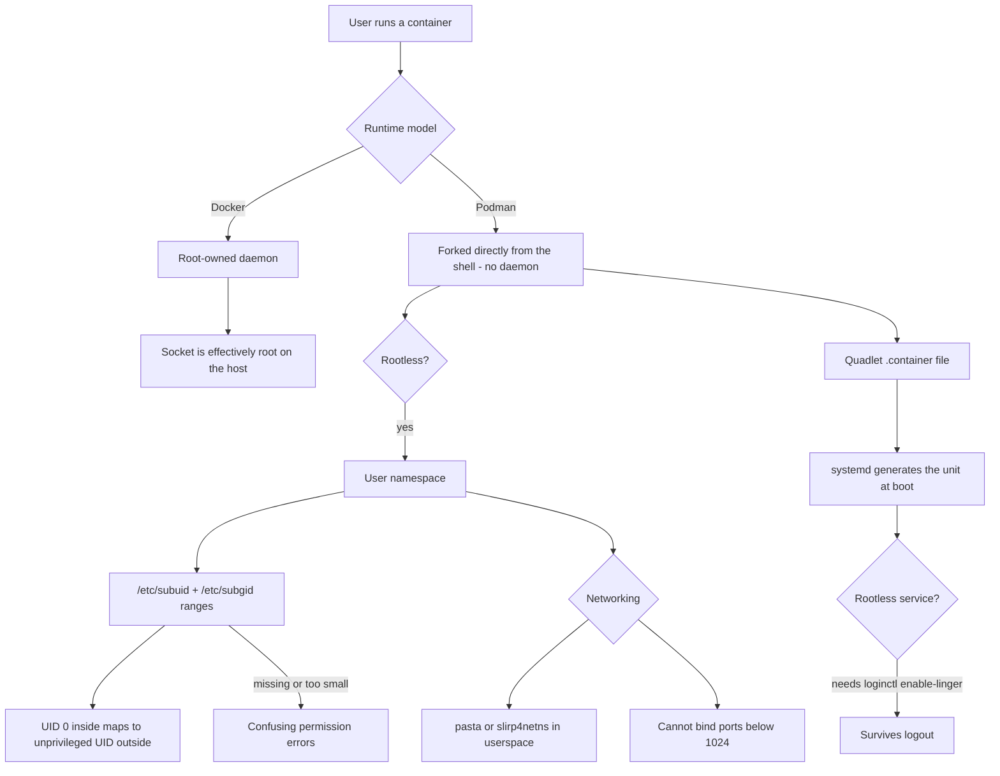

# Podman Rootless Containers and systemd Integration

**Level:** Advanced
**Tree:** [Containers & Virtualization on Linux](../README.md)
**Branch:** [Rootless Containers & Image Supply Chain](README.md)
**Forest:** [Linux](../../../README.md)

## Explanation

# Podman Rootless Containers and systemd Integration

Podman differs from Docker in two ways that matter operationally: there is **no daemon**, and containers can run **entirely as an unprivileged user**.

## Why daemonless changes things

Docker runs containers as children of a root-owned daemon. That daemon is a single point of failure, its socket is effectively root access to the host, and container lifetimes are tied to it.

Podman forks containers directly from your shell as ordinary child processes. There is no socket granting root, no daemon to restart, and normal process tools work as expected. The trade is that nothing supervises containers when you log out - which is precisely why systemd integration matters rather than being optional.

## How rootless actually works

A rootless container needs multiple UIDs, because processes inside expect to be root and to drop to service users. **User namespaces** provide this: the kernel maps a range of host UIDs, allocated in **/etc/subuid** and **/etc/subgid**, into the container so UID 0 inside is an unprivileged UID outside.

If that range is missing or too small, containers fail with confusing permission errors that look like filesystem problems.

Networking is the other constraint: an unprivileged user cannot bind ports below 1024 or create standard bridges. Podman uses **pasta** or **slirp4netns** in userspace, and the standard answer for low ports is to publish a high port and redirect, or lower net.ipv4.ip_unprivileged_port_start deliberately.

## Quadlet is the modern answer

The old approach generated a unit file with **podman generate systemd**, which produced a file that drifted from the container definition. **Quadlet** replaces it: you write a declarative .container file, and systemd generates the unit at boot. The definition stays the source of truth.

For rootless services surviving logout, **loginctl enable-linger** is mandatory - without it systemd tears down the user session and every container with it.

## Architecture and flow



## Commands

### Command 1

Confirm whether Podman is running rootless and which storage driver is in use

```text
podman info --debug | grep -Ei "rootless|graphDriver|runRoot"
```

### Command 2

Check the UID/GID ranges allocated for user namespaces - missing ranges break rootless

```text
grep "$USER" /etc/subuid /etc/subgid
```

### Command 3

Show the actual namespace mapping as the container sees it

```text
podman unshare cat /proc/self/uid_map
```

### Command 4

Allow the user systemd instance to persist after logout - required for rootless services

```text
loginctl enable-linger $USER
```

### Command 5

Manage user-scoped services generated from a Quadlet file

```text
systemctl --user daemon-reload; systemctl --user start myapp
```

### Command 6

Preserve the host UID inside the container and relabel the volume for SELinux

```text
podman run --userns=keep-id -v ./data:/data:Z alpine id
```

### Command 7

Deliberately permit unprivileged binding to low ports where that is acceptable

```text
sysctl -w net.ipv4.ip_unprivileged_port_start=80
```

### Command 8

Reclaim space from stopped containers, unused images and orphaned volumes

```text
podman system prune -a --volumes
```

## Automation scripts

### Rootless Podman readiness checker

```bash
#!/usr/bin/env bash
# Validates the three prerequisites that silently break rootless Podman:
# subuid/subgid ranges, lingering, and cgroups v2.
set -uo pipefail
rc=0
U="${USER:-$(id -un)}"

echo "== user namespace ranges =="
for f in /etc/subuid /etc/subgid; do
  line=$(grep "^${U}:" "$f" 2>/dev/null || true)
  if [ -z "$line" ]; then
    echo "  ALERT: no range for $U in $f - rootless containers will fail"
    rc=1
  else
    size=$(printf %s "$line" | cut -d: -f3)
    echo "  $f: $line"
    if [ "${size:-0}" -lt 65536 ]; then
      echo "    WARN: range of $size is small; 65536 is the usual minimum"
      rc=1
    fi
  fi
done

echo "== lingering =="
if loginctl show-user "$U" 2>/dev/null | grep -q "Linger=yes"; then
  echo "  OK: linger enabled - user services survive logout"
else
  echo "  WARN: linger disabled - rootless containers stop when $U logs out"
  echo "        fix: loginctl enable-linger $U"
  rc=1
fi

echo "== cgroups v2 =="
if [ -f /sys/fs/cgroup/cgroup.controllers ]; then
  echo "  OK: unified hierarchy (required for rootless resource limits)"
else
  echo "  WARN: cgroups v1 - rootless resource limits will not work"
  rc=1
fi

echo "== podman =="
if command -v podman >/dev/null 2>&1; then
  podman info --format "{{.Host.Security.Rootless}}" 2>/dev/null | sed 's/^/  rootless: /'
else
  echo "  podman not installed"; rc=2
fi
exit $rc
```

## Lab

**Objective:** Run a production-shaped rootless service under systemd and prove it survives both logout and reboot.

### Steps

1. Verify subuid and subgid ranges exist for your user and inspect the mapping with podman unshare.
2. Run a rootless container publishing a high port and confirm it serves traffic.
3. Attempt to publish port 80 as an unprivileged user and observe the failure.
4. Write a Quadlet .container file, reload the user systemd instance and start the service through systemd.
5. Log out without enabling linger and confirm the container is torn down.
6. Enable linger with loginctl, reboot, and confirm the container starts automatically with no login.

### Validation

A rootless container runs as a systemd user service and is confirmed still running after a full reboot with no session open, checked from a root shell rather than from the owning user session,The same service is shown stopping on logout when lingering is disabled, and surviving once loginctl enable-linger is set - the control that proves lingering is the mechanism rather than a coincidence of timing,The UID mapping is read from /etc/subuid and the running map in /proc, and the same file is shown owned by different UIDs inside and outside the container, so the mapping is evidenced rather than described,A port below 1024 is shown failing to bind rootless, and whichever remedy is chosen is recorded with its trade-off, since this is the constraint that most often sends people back to running as root

## Operational automation

## Automating rootless containers

**Provision subuid and subgid ranges at user creation.** A user added without them cannot run rootless containers at all, and the failure surfaces as a permission error that gives no hint about namespaces.

**Use Quadlet, not podman generate systemd.** The generated-unit approach produces a file that immediately drifts from the container definition; a .container file remains the single source of truth and systemd derives the unit from it.

**Always enable linger for service accounts running rootless workloads.** Without it the container silently disappears when the session ends, which typically means it works in testing and vanishes in production.

**Relabel volumes with :Z or :z on SELinux hosts.** Volume mount permission denials are overwhelmingly SELinux labelling rather than file mode, and the error message points at neither.

## Troubleshooting

### Scenario 1: Rootless container fails to start with a permission error mentioning newuidmap

**Likely cause:** No subuid/subgid range is allocated for the user, so the user namespace cannot be created

**Resolution:** Add a range with usermod --add-subuids 100000-165535 --add-subgids 100000-165535 <user>, then run podman system migrate

### Scenario 2: Containers stop when the user logs out

**Likely cause:** The user systemd instance is torn down at session end because lingering is not enabled

**Resolution:** Run loginctl enable-linger <user> so the user manager persists independently of login sessions

### Scenario 3: Cannot publish port 80 as an unprivileged user

**Likely cause:** Binding ports below 1024 requires privilege that a rootless process does not have

**Resolution:** Publish a high port and redirect with firewalld, or lower net.ipv4.ip_unprivileged_port_start deliberately with the security implication understood

### Scenario 4: A mounted volume is unreadable inside the container despite correct file permissions

**Likely cause:** SELinux labelling - the host directory does not carry a container-accessible context

**Resolution:** Mount with :Z for a private label or :z for a shared one, or apply the context manually with chcon

## Interview questions

### 1. What is the security advantage of Podman being daemonless?

The Docker daemon runs as root and its socket is effectively unrestricted root access to the host - anyone who can reach it can mount the host filesystem into a privileged container and take over the machine. Podman forks containers directly from the invoking user shell, so there is no root-owned daemon and no socket to protect. Combined with rootless mode, a container compromise is confined to an unprivileged user rather than landing on root. The trade-off is that nothing supervises containers after logout, which is why systemd integration is a requirement rather than a nicety.

### 2. How does a rootless container have a root user inside it?

Through user namespaces. The kernel maps a range of host UIDs, allocated to the user in /etc/subuid and /etc/subgid, into the container namespace. UID 0 inside the container maps to an ordinary unprivileged UID on the host, and the rest of the range covers the service users that applications inside expect. So a process believing it is root has genuine root capabilities within that namespace and none at all outside it. If the range is missing or smaller than the container needs, you get permission failures that read like filesystem problems and give no indication that namespaces are involved.

### 3. Why is Quadlet preferred over podman generate systemd?

Because generate produced a one-off unit file that was a snapshot of the container at the moment you ran it. Any subsequent change to the container meant regenerating and re-deploying the unit, and in practice the two drifted - the unit file became the real definition while the original command was forgotten. Quadlet inverts that: you write a declarative .container file describing intent, and systemd generates the unit from it at boot. The declaration stays the single source of truth, it is far more readable in version control, and there is no generated artefact to keep in sync.

## Certification alignment

- RHCSA EX200 - manage containers with Podman and systemd
- Red Hat EX188 - Containers, Podman and OpenShift development
- RHCE EX294 - automate container deployment with Ansible
- CompTIA Linux+ XK0-005 - containers and virtualization

## References

- Red Hat documentation - Building, running and managing Linux containers
- Podman documentation - rootless mode and Quadlet unit files
- man 5 subuid, man 5 subgid, man 7 user_namespaces
- man 5 podman-systemd.unit (Quadlet reference)

## Suggested video search

Podman rootless containers quadlet systemd subuid user namespace tutorial

---

> Validate commands, versions, permissions, licensing, and rollback procedures in an isolated lab before production use.
