# Linux Core Dumps systemd coredumpctl and Application Crash Troubleshooting

**Level:** Advanced
**Tree:** [Linux Estate Operations: Primitives, Diagnosis and Lifecycle](../README.md)
**Branch:** [Crash Analysis and Diagnostic Method](README.md)
**Forest:** [Linux](../../../README.md)

## Explanation

# Core Dumps and Crash Analysis

A core dump is the process memory image at the moment it died. It is the difference between *the service crashed* and *the service crashed dereferencing a null pointer in this function*.

Most estates cannot produce one when it matters, because the configuration was never checked and **the default on many systems is to produce nothing at all**.

## Four things must all be true

A missing core dump is almost never mysterious — one of these is false:

**The size limit is non-zero.** A **core** ulimit of 0 disables dumps entirely and is a common default. For a systemd service the limit comes from the unit, not from the login shell, which is the layer people set and then wonder why nothing changed.

**The kernel pattern points somewhere real.** On systemd systems it pipes to **systemd-coredump**; otherwise it is a path that must exist and be writable.

**There is disk space.** A dump is as large as the process resident memory, so a database crash writes tens of gigabytes — and a full filesystem silently produces no dump.

**The process is dumpable.** Setuid processes and those that called prctl to clear the dumpable flag produce nothing by design.

## systemd-coredump changed the workflow

Dumps go into a journal-managed store with metadata, and **coredumpctl** lists, inspects and hands them to a debugger directly. That is a genuine improvement — you get the executable, the command line, the signal and a backtrace without hunting for files.

The catch is **retention**. The store has size and age limits and rotates, so a dump from last week may be gone. If a crash matters, extract it immediately rather than assuming it will still be there.

## A backtrace needs symbols

Production binaries are stripped, so a backtrace is addresses rather than function names. **Debug symbol packages** must be installed, matching the exact build — the debuginfo for a slightly different version produces a plausible and wrong backtrace, which is worse than none.

Where debug packages are unavailable, a **build ID** in the binary lets you match a dump against the build that produced it, which is how you get symbols for something built in-house.

## Reading one without being a developer

The useful first pass is short: which signal killed it, which thread was running, and what the top few frames are.

**SIGSEGV** is an invalid memory access. **SIGABRT** is usually an assertion or a detected corruption — the process chose to die. **SIGBUS** is often a truncated memory-mapped file, which is genuinely an infrastructure problem rather than a code one.

That much is usually enough to decide whether this is an application defect, a configuration problem, or a hardware or storage fault — which is the decision an operator actually has to make.

## The dump is sensitive

Process memory contains whatever the process had: credentials, keys, customer data. **A core dump from a production database is a data extract**, and it must be handled and retained accordingly. Sending one to a vendor is a data transfer decision, and the default retention on the store is very likely not the retention your policy requires.

## Architecture and flow

```mermaid
flowchart TD
    C["A core dump is process memory at the moment it died"] --> C1["'The service crashed' vs 'crashed dereferencing null in THIS function'"]
    C1 --> C2["Most estates cannot produce one when it matters"]
    C2 --> C3["The default on many systems is NOTHING AT ALL"]
    F{"Four things must ALL be true"} --> F1["SIZE LIMIT non-zero"]
    F1 --> F1a["A core ulimit of 0 disables dumps entirely - a common default"]
    F1a --> F1b["For a systemd service the limit comes from THE UNIT"]
    F1b --> F1c["Not the login shell - the layer people set and see no change"]
    F --> F2["KERNEL PATTERN points somewhere real"]
    F2 --> F2a["systemd: pipes to systemd-coredump"]
    F2 --> F2b["Otherwise a path that must exist and be writable"]
    F --> F3["DISK SPACE"]
    F3 --> F3a["A dump is as large as resident memory"]
    F3a --> F3b["A database crash writes tens of gigabytes"]
    F3b --> F3c["A full filesystem silently produces nothing"]
    F --> F4["PROCESS IS DUMPABLE"]
    F4 --> F4a["Setuid and prctl-cleared processes produce nothing by design"]
    S["systemd-coredump changed the workflow"] --> S1["Journal-managed store with metadata"]
    S1 --> S2["coredumpctl lists, inspects, hands to a debugger"]
    S2 --> S3["Executable, command line, signal, backtrace - no file hunting"]
    S --> S4["CATCH: RETENTION"]
    S4 --> S5["Size and age limits, and it rotates"]
    S5 --> S6["Last week's dump may be gone"]
    S6 --> S7["If a crash matters, extract it IMMEDIATELY"]
    B["A backtrace needs SYMBOLS"] --> B1["Production binaries are stripped"]
    B1 --> B2["Backtrace is addresses, not function names"]
    B --> B3["Debug packages must match the EXACT build"]
    B3 --> B4["Debuginfo for a slightly different version"]
    B4 --> B5["...gives a plausible and WRONG backtrace - worse than none"]
    B --> B6["BUILD ID matches a dump to the build that produced it"]
    R["Reading one without being a developer"] --> R1["Which signal · which thread · top few frames"]
    R --> R2["SIGSEGV - invalid memory access"]
    R --> R3["SIGABRT - assertion or detected corruption"]
    R3 --> R3a["The process CHOSE to die"]
    R --> R4["SIGBUS - often a truncated memory-mapped file"]
    R4 --> R4a["Genuinely infrastructure, not code"]
    R --> R5["Enough to decide: app defect, config, or hardware/storage"]
    R5 --> R6["Which is the decision an operator actually has to make"]
    D["THE DUMP IS SENSITIVE"] --> D1["Memory contains credentials, keys, customer data"]
    D1 --> D2["A dump from a production database IS A DATA EXTRACT"]
    D2 --> D3["Sending one to a vendor is a data transfer decision"]
    D2 --> D4["Default store retention is very likely not your policy"]
```



## Commands

### Command 1

Check all three places the limit is set, since for a service the unit value is what applies rather than the shell

```text
ulimit -c; cat /proc/sys/kernel/core_pattern; systemctl show myservice -p LimitCORE
```

### Command 2

List captured dumps with their signal and executable, which is the modern entry point

```text
coredumpctl list --no-pager | tail -20
```

### Command 3

Read signal, command line and a backtrace for the most recent dump without extracting anything

```text
coredumpctl info | head -40
```

### Command 4

Hand the dump straight to a debugger with the matching executable already loaded

```text
coredumpctl debug PID
```

### Command 5

Extract a dump immediately, since the store rotates and a crash that matters may otherwise be gone

```text
coredumpctl dump PID --output=/secure/crash.core
```

### Command 6

Match a binary to its debug symbols by build ID, which is how symbols are found for an in-house build

```text
eu-readelf -n /usr/bin/myapp | grep -i "build id"; debuginfod-find debuginfo BUILDID
```

### Command 7

Read the retention policy and confirm there is space, since a full filesystem silently produces no dump

```text
grep -E "Storage|MaxUse|MaxAge" /etc/systemd/coredump.conf; df -h /var/lib/systemd/coredump
```

## Automation scripts

### verify-coredump-readiness.sh

```bash
#!/usr/bin/env bash
# Verifies that this host can actually produce a core dump, because the usual discovery is
# that it cannot - and that discovery happens after the crash you needed it for.
#
# A missing core dump is almost never mysterious. One of four things is false:
#
#   1. SIZE LIMIT. A core ulimit of 0 disables dumps entirely and is a common default. For
#      a systemd service the limit comes from the UNIT, not the login shell - which is the
#      layer people set before wondering why nothing changed.
#   2. KERNEL PATTERN. On systemd systems it pipes to systemd-coredump; otherwise it is a
#      path that must exist and be writable.
#   3. DISK SPACE. A dump is as large as the process resident memory, so a database crash
#      writes tens of gigabytes and a full filesystem silently produces nothing.
#   4. DUMPABLE. Setuid processes and those that cleared the prctl dumpable flag produce
#      nothing by design.
#
# It also checks symbols, because a stripped binary gives a backtrace of addresses - and
# debuginfo for a slightly different build produces a plausible, WRONG backtrace, which is
# worse than having none.

set -o nounset
set -o pipefail

service=${1:-}
findings=0

printf 'CORE DUMP READINESS\n\n'

# --- 1. limits ---------------------------------------------------------------------------
printf '1. SIZE LIMIT\n'
shell_limit=$(ulimit -c)
printf '   login shell : %s\n' "$shell_limit"
if [ -n "$service" ]; then
    unit_limit=$(systemctl show "$service" -p LimitCORE --value 2>/dev/null)
    printf '   unit %-12s: %s\n' "$service" "${unit_limit:-unknown}"
    case ${unit_limit:-0} in
        0)
            printf '   THE UNIT LIMIT IS ZERO. No dump will be produced for this service\n'
            printf '   regardless of what the login shell says. Set LimitCORE=infinity in the\n'
            printf '   unit - this is the layer that actually applies.\n'
            findings=$((findings + 1))
            ;;
    esac
elif [ "$shell_limit" = '0' ]; then
    printf '   ZERO - dumps disabled for shell-started processes.\n'
    findings=$((findings + 1))
fi

# --- 2. kernel pattern ----------------------------------------------------------------------
printf '\n2. KERNEL PATTERN\n'
pattern=$(cat /proc/sys/kernel/core_pattern 2>/dev/null)
printf '   %s\n' "$pattern"
case $pattern in
    \|*systemd-coredump*)
        printf '   piped to systemd-coredump - use coredumpctl\n'
        using_systemd=1
        ;;
    \|*)
        printf '   piped to a handler: %s\n' "${pattern#|}"
        using_systemd=0
        ;;
    core|core.*)
        printf '   RELATIVE PATH. The dump lands in the process working directory, which for a\n'
        printf '   daemon is frequently / and frequently not writable.\n'
        using_systemd=0
        findings=$((findings + 1))
        ;;
    *)
        using_systemd=0
        dir=$(dirname "$pattern")
        if [ -d "$dir" ] && [ -w "$dir" ]; then
            printf '   directory %s exists and is writable\n' "$dir"
        else
            printf '   DIRECTORY %s MISSING OR NOT WRITABLE - no dump will be written.\n' "$dir"
            findings=$((findings + 1))
        fi
        ;;
esac

# --- 3. space -------------------------------------------------------------------------------
printf '\n3. SPACE\n'
if [ "${using_systemd:-0}" -eq 1 ]; then
    store=/var/lib/systemd/coredump
else
    store=$(dirname "$pattern" 2>/dev/null)
    case $store in /*) : ;; *) store=/ ;; esac
fi
avail_kb=$(df -Pk "$store" 2>/dev/null | awk 'NR==2 {print $4}')
avail_gb=$(( ${avail_kb:-0} / 1024 / 1024 ))
printf '   %s has %s GiB free\n' "$store" "$avail_gb"
biggest_kb=$(ps -eo rss --no-headers | sort -rn | head -1)
biggest_gb=$(( ${biggest_kb:-0} / 1024 / 1024 ))
biggest_name=$(ps -eo rss,comm --no-headers | sort -rn | head -1 | awk '{print $2}')
printf '   largest process: %s at %s GiB resident\n' "${biggest_name:-?}" "$biggest_gb"
if [ "$avail_gb" -lt "$biggest_gb" ]; then
    printf '   INSUFFICIENT SPACE for a dump of the largest process. A dump is as large as\n'
    printf '   resident memory, and a full filesystem produces nothing at all - silently.\n'
    findings=$((findings + 1))
fi

# --- 4. retention -----------------------------------------------------------------------------
if [ "${using_systemd:-0}" -eq 1 ]; then
    printf '\n4. RETENTION\n'
    grep -hE '^[^#]*(MaxUse|KeepFree|MaxAge|Storage)' /etc/systemd/coredump.conf \
        /etc/systemd/coredump.conf.d/*.conf 2>/dev/null | sed 's/^/   /' ||
        printf '   defaults in force\n'
    printf '   The store rotates on size and age, so a dump from last week may be gone. If a\n'
    printf '   crash matters, extract it immediately with coredumpctl dump.\n'
    printf '\n   recent dumps:\n'
    coredumpctl list --no-pager 2>/dev/null | tail -5 | sed 's/^/   /' || printf '   none\n'
fi

# --- 5. symbols ---------------------------------------------------------------------------------
printf '\n5. SYMBOLS\n'
if command -v debuginfod-find >/dev/null 2>&1 || [ -n "${DEBUGINFOD_URLS:-}" ]; then
    printf '   debuginfod available - symbols can be fetched by build ID\n'
else
    printf '   no debuginfod configured\n'
fi
if [ -n "$service" ]; then
    exe=$(systemctl show "$service" -p ExecStart --value 2>/dev/null | grep -oE '/[^ ]+' | head -1)
    if [ -n "$exe" ] && [ -f "$exe" ]; then
        if file "$exe" 2>/dev/null | grep -q 'not stripped'; then
            printf '   %s retains symbols\n' "$exe"
        else
            printf '   %s is STRIPPED. A backtrace will be addresses rather than function\n' "$exe"
            printf '   names. Install the matching debuginfo package - and match the EXACT\n'
            printf '   build, because debuginfo for a slightly different version produces a\n'
            printf '   plausible and wrong backtrace, which is worse than none.\n'
            bid=$(eu-readelf -n "$exe" 2>/dev/null | grep -i 'build id' | awk '{print $NF}')
            [ -n "$bid" ] && printf '   build ID: %s\n' "$bid"
            findings=$((findings + 1))
        fi
    fi
fi

printf '\nWhen you do get a dump, the useful first pass is short: which signal killed it, which\n'
printf 'thread was running, and the top few frames. SIGSEGV is an invalid memory access,\n'
printf 'SIGABRT is usually an assertion or detected corruption where the process chose to\n'
printf 'die, and SIGBUS is often a truncated memory-mapped file - which is an infrastructure\n'
printf 'problem rather than a code one. That is enough to decide whether this is an\n'
printf 'application defect, a configuration problem, or hardware.\n'
printf '\nAnd handle it carefully: process memory contains whatever the process had - credentials,\n'
printf 'keys, customer data. A dump from a production database is a data extract, and sending\n'
printf 'one to a vendor is a data transfer decision.\n'

[ "$findings" -gt 0 ] && { printf '\n%d finding(s) - this host may not produce a usable dump.\n' "$findings"; exit 1; }
printf '\nReady.\n'
exit 0
```

## Lab

**Objective:** Make a system capable of producing a usable core dump and demonstrate each of the four conditions that prevent one.

### Steps

1. Check the core size limit in the shell and in a systemd unit, and note where they differ.
2. Write a program that crashes and confirm whether a dump is produced.
3. Set the shell limit to unlimited and retest a shell-started crash.
4. Set the unit limit and retest the service crash, recording which layer mattered.
5. Read the kernel core pattern and determine where dumps are being sent.
6. Fill the target filesystem and repeat the crash, recording what happens.
7. List captured dumps and read the signal and backtrace without extracting a file.
8. Extract a dump to a secure location and explain why immediately.
9. Attempt a backtrace against a stripped binary and record what you get.
10. Install matching debug symbols and repeat, comparing the two backtraces.

### Validation

The unit limit is shown to govern the service while the shell limit governs shell-started processes.,A full filesystem is demonstrated to produce no dump and no error.,The stripped backtrace shows addresses and the symbolised one shows function names.,The retention policy is read and the reason for immediate extraction articulated.

## Operational automation

## Automating crash readiness

**Verify dump capability as part of host build validation.** The usual discovery is that a host cannot produce a dump, and that discovery happens after the crash you needed it for.

**Assert LimitCORE in unit files rather than relying on shell limits.** For a service the unit is the layer that applies, and setting the shell limit is the most common wasted fix.

**Alert on dumps appearing at all, and extract them immediately.** The store rotates on size and age, so a dump that matters can disappear before anyone looks at it.

**Treat the dump store as sensitive data in retention and access policy.** Process memory contains credentials, keys and customer data, so a production dump is a data extract regardless of why it was captured.

## Troubleshooting

### Scenario 1: A service crashed and no core dump was produced

**Likely cause:** One of four conditions is false — size limit zero, kernel pattern pointing nowhere writable, no disk space, or the process is not dumpable

**Resolution:** Check all four rather than guessing; for a systemd service the size limit comes from the unit, not the login shell

### Scenario 2: The core limit was raised and dumps still are not produced

**Likely cause:** The limit was raised in the shell while the crashing process is a systemd service governed by the unit

**Resolution:** Set LimitCORE in the unit file; this is the most common wasted remediation in this area

### Scenario 3: A dump was expected and the filesystem was full

**Likely cause:** A dump is as large as the process resident memory, so a large process needs a large amount of free space

**Resolution:** Size the dump location against the largest resident process; a full filesystem produces nothing and reports nothing

### Scenario 4: A backtrace shows addresses instead of function names

**Likely cause:** The production binary is stripped and no matching debug symbols are installed

**Resolution:** Install the debuginfo matching the exact build, or resolve it by build ID; mismatched symbols produce a plausible and wrong backtrace

### Scenario 5: A dump from last week is no longer available

**Likely cause:** The systemd coredump store rotates on size and age

**Resolution:** Extract dumps that matter immediately rather than assuming they persist

### Scenario 6: A vendor requested a core dump from production

**Likely cause:** The dump contains whatever was in process memory, including credentials, keys and customer data

**Resolution:** Treat it as a data extract and route it through the same approval as any other data transfer

## Interview questions

### 1. Why do so many systems fail to produce a core dump?

Because four things all have to be true and at least one is usually false, and the failure is completely silent. The core size limit must be non-zero — a limit of zero disables dumps entirely and is a common default. The kernel core pattern must point somewhere real, which on a systemd system means piping to systemd-coredump and otherwise means a path that exists and is writable. There must be disk space, and a dump is as large as the process resident memory, so a database crash wants tens of gigabytes. And the process must be dumpable, which setuid processes and anything that cleared the prctl flag are not, by design. The one that catches people most often is the limit layer: for a systemd service the limit comes from the unit, not the login shell, so raising ulimit in a shell and retesting changes nothing at all.

### 2. How do you read a core dump without being a developer?

A short first pass gets you most of the operational value. Which signal killed it, which thread was running, and the top few stack frames. SIGSEGV is an invalid memory access — usually a code defect. SIGABRT means the process chose to die, typically an assertion firing or corruption it detected itself. SIGBUS is often a truncated memory-mapped file, and that one matters because it is genuinely an infrastructure problem rather than a code one — a filesystem that filled or a storage fault. That distinction is exactly the decision an operator has to make: is this an application defect to route to the development team, a configuration problem, or a hardware and storage fault. You do not need to understand the code to make it.

### 3. What makes a backtrace unreliable?

Mismatched symbols. Production binaries are stripped, so without debug information a backtrace is a list of addresses. The fix is installing the matching debuginfo package, and the word matching is doing real work there — debuginfo for a slightly different build of the same software produces a backtrace that looks entirely plausible and names the wrong functions. That is actively worse than having no symbols at all, because it sends the investigation somewhere confidently wrong. The mechanism for getting this right is the build ID embedded in the binary, which uniquely identifies the build and can be resolved through debuginfod, and it is how you get symbols for something built in-house where no distribution debuginfo package exists.

### 4. Is there a risk in collecting core dumps?

Yes, and it is routinely overlooked. A core dump is the process memory image, so it contains whatever the process had in memory at that moment — credentials, private keys, session tokens, customer records. A dump from a production database is, quite literally, a data extract. That has three consequences. The store needs the same access control as any other sensitive data. The retention configured by default on the systemd coredump store is very unlikely to match what your data policy requires, in either direction. And sending a dump to a software vendor for analysis is a data transfer decision that should go through the same approval as any other export, not something an engineer does informally during an incident because the vendor asked.

## Certification alignment

- Red Hat RHCSA and RHCE — troubleshooting and system recovery
- LPIC-2 — system troubleshooting
- CompTIA Linux+ — troubleshooting and diagnostics
- Linux Foundation LFCS — system monitoring and troubleshooting

## References

- core(5) and systemd-coredump(8) manual pages
- coredumpctl(1) and coredump.conf(5)
- elfutils debuginfod documentation
- Red Hat: how to enable and analyse core dumps

## Suggested video search

Linux core dump ulimit core kernel core_pattern systemd-coredump coredumpctl debuginfo build id SIGSEGV SIGABRT SIGBUS gdb backtrace

---

> Validate commands, versions, permissions, licensing, and rollback procedures in an isolated lab before production use.
