# Systematic Linux Diagnostic Methodology and Performance Troubleshooting Order

**Level:** Advanced
**Tree:** [Linux Estate Operations: Primitives, Diagnosis and Lifecycle](../README.md)
**Branch:** [Crash Analysis and Diagnostic Method](README.md)
**Forest:** [Linux](../../../README.md)

## Explanation

# Systematic Diagnostic Method

The difference between engineers who resolve incidents quickly and those who do not is rarely tool knowledge. It is **method** — specifically, refusing to change anything before establishing what is actually happening.

## The failure mode this exists to prevent

The common pattern is guess, change, check, repeat. It sometimes works, and it has three costs: you may fix the symptom and not the cause, you accumulate changes nobody tracked, and if the problem resolves you do not know which change did it — so you learn nothing and cannot prevent a recurrence.

**Changing things is not investigating.** The first discipline is separating the two.

## Establish the facts before forming a theory

Four questions, in order, and each one narrows the search dramatically:

**What exactly is the symptom?** Not *it is slow* — which operation, how slow, measured how, compared against what. A specific symptom eliminates most of the search space immediately.

**When did it start?** This is the highest-value question and the most often skipped, because it points directly at what changed. If it started at 09:14 on Tuesday, something happened at 09:14 on Tuesday.

**What is the scope?** One user, one host, one datacentre, everything. Scope tells you which layer to look at — one host is a host problem, everything is a shared dependency.

**Is it constant or intermittent?** Intermittent nearly always correlates with something periodic: a cron job, a backup window, a certificate refresh, a garbage collection cycle.

## The USE method for resources

For every resource — CPU, memory, disk, network — check **Utilisation**, **Saturation**, **Errors**.

The insight is that **saturation matters more than utilisation and is checked less**. CPU at 100% is not a problem if nothing is waiting; a run queue consistently longer than the core count is a problem even at 70% utilisation. The same applies to disk: throughput tells you little, and queue depth and await tell you whether requests are backing up.

Errors are checked least of all and are frequently the actual answer — interface errors, disk media errors, dropped packets.

## Work outward from the symptom

Start where the symptom is and follow the dependency chain: application, then its immediate dependencies, then the host, then the network, then downstream services.

Jumping straight to a favourite layer is what makes diagnosis slow. **An engineer who always checks the database first is right often enough to keep the habit and wrong often enough for it to cost real time.**

## Change one thing

When you do intervene: one change, observe, record. Two simultaneous changes mean you cannot attribute the outcome to either, and if the problem returns you have no information.

The uncomfortable corollary is that **a problem that resolves without a known cause is not resolved**. It is waiting.

## Write it down while it is happening

A short running log — what was observed, what was changed, at what time — is worth more than memory. It survives a handover mid-incident, it is the basis of the post-incident review, and it is the only reliable protection against the reconstructed narrative in which everything was obvious.

## Architecture and flow

```mermaid
flowchart TD
    D["The difference is METHOD, not tool knowledge"] --> D1["Refusing to change anything before establishing what is happening"]
    F["The failure mode this prevents"] --> F1["Guess, change, check, repeat"]
    F1 --> F2["Sometimes works, three costs"]
    F2 --> F3["May fix the symptom, not the cause"]
    F2 --> F4["Accumulates changes nobody tracked"]
    F2 --> F5["If it resolves, you do not know WHICH change did it"]
    F5 --> F6["So you learn nothing and cannot prevent recurrence"]
    F --> F7["CHANGING THINGS IS NOT INVESTIGATING"]
    Q{"Establish facts before theory - four questions"} --> Q1["WHAT exactly is the symptom?"]
    Q1 --> Q1a["Not 'it is slow' - which operation, how slow, measured how"]
    Q1a --> Q1b["A specific symptom eliminates most of the search space"]
    Q --> Q2["WHEN did it start?"]
    Q2 --> Q2a["Highest-value question, most often skipped"]
    Q2a --> Q2b["Points directly at what CHANGED"]
    Q2b --> Q2c["Started 09:14 Tuesday = something happened 09:14 Tuesday"]
    Q --> Q3["WHAT IS THE SCOPE?"]
    Q3 --> Q3a["One user · one host · one datacentre · everything"]
    Q3a --> Q3b["Tells you which LAYER to look at"]
    Q3b --> Q3c["One host = host problem · everything = shared dependency"]
    Q --> Q4["CONSTANT or INTERMITTENT?"]
    Q4 --> Q4a["Intermittent correlates with something PERIODIC"]
    Q4a --> Q4b["cron · backup window · cert refresh · GC cycle"]
    U["USE method per resource"] --> U1["UTILISATION · SATURATION · ERRORS"]
    U1 --> U2["SATURATION matters more and is checked less"]
    U2 --> U3["CPU at 100% is fine if nothing is WAITING"]
    U3 --> U4["Run queue longer than core count is a problem at 70%"]
    U2 --> U5["Disk: throughput tells you little"]
    U5 --> U6["Queue depth and await tell you if requests back up"]
    U --> U7["ERRORS checked least, frequently the actual answer"]
    U7 --> U8["Interface errors · media errors · dropped packets"]
    O["Work OUTWARD from the symptom"] --> O1["App -> its dependencies -> host -> network -> downstream"]
    O --> O2["Jumping to a favourite layer makes diagnosis slow"]
    O2 --> O3["Always checking the database first is right often enough to keep"]
    O3 --> O4["...and wrong often enough to cost real time"]
    C["CHANGE ONE THING"] --> C1["One change, observe, record"]
    C --> C2["Two changes = cannot attribute the outcome to either"]
    C --> C3["A problem that resolves with no known cause is NOT resolved"]
    C3 --> C4["It is waiting"]
    W["Write it down WHILE it is happening"] --> W1["Observed · changed · at what time"]
    W1 --> W2["Survives a handover mid-incident"]
    W1 --> W3["Basis of the post-incident review"]
    W1 --> W4["Protection against the reconstructed narrative"]
    W4 --> W5["...in which everything was obvious"]
```



## Commands

### Command 1

Read run queue length against core count, which is saturation rather than utilisation and is the more useful signal

```text
uptime; vmstat 1 5
```

### Command 2

Show queue depth and await per device, which reveal requests backing up where throughput alone does not

```text
iostat -x 1 5 | grep -A20 Device
```

### Command 3

Look back at historical load to answer when it started, which is the highest-value question

```text
sar -q -f /var/log/sa/sa$(date +%d -d yesterday) | head -20
```

### Command 4

Check interface errors and drops, the category checked least and frequently the actual answer

```text
ip -s link | grep -A2 -E "^[0-9]+:" | grep -B1 -E "errors|dropped" | head
```

### Command 5

Read what happened in the window the symptom started, rather than what is happening now

```text
journalctl --since "09:00" --until "09:30" --no-pager | head -40
```

### Command 6

Enumerate periodic work, which is what intermittent symptoms almost always correlate with

```text
systemctl list-timers --all --no-pager | head; crontab -l 2>/dev/null; ls /etc/cron.d/
```

### Command 7

Attribute I/O and context switching to specific processes once the resource with a problem is known

```text
pidstat -d 1 5; pidstat -w 1 5
```

## Automation scripts

### collect-diagnostic-baseline.sh

```bash
#!/usr/bin/env bash
# Collects a diagnostic snapshot in the order a systematic investigation actually proceeds,
# and changes nothing.
#
# The failure this exists to prevent is guess-change-check-repeat. That pattern sometimes
# works and has three costs: you may fix the symptom rather than the cause, you accumulate
# changes nobody tracked, and if the problem resolves you do not know which change did it -
# so you learn nothing and cannot prevent a recurrence. Changing things is not investigating.
#
# The USE method drives the resource section: Utilisation, Saturation, Errors for each
# resource. The point worth internalising is that SATURATION matters more than utilisation
# and is checked far less. CPU at 100% is not a problem if nothing is waiting; a run queue
# consistently longer than the core count is a problem at 70%. And ERRORS are checked least
# of all while frequently being the actual answer.

set -o nounset
set -o pipefail

out=${1:-/tmp/diag-$(hostname -s).txt}
exec > >(tee "$out") 2>&1

cores=$(nproc)
printf '=== DIAGNOSTIC BASELINE ===\n'
printf 'host   : %s\n' "$(hostname -f 2>/dev/null || hostname)"
printf 'uptime : %s\n' "$(uptime -p 2>/dev/null)"
printf 'cores  : %s\n' "$cores"
printf 'output : %s\n\n' "$out"

printf '--- SCOPE AND TIMING ---\n'
printf 'Answer these before reading anything below. Each one narrows the search sharply:\n'
printf '  WHAT exactly is the symptom - which operation, how slow, measured how?\n'
printf '  WHEN did it start - this points directly at what changed, and it is the question\n'
printf '    most often skipped.\n'
printf '  SCOPE - one user, one host, one site, everything? One host is a host problem;\n'
printf '    everything is a shared dependency.\n'
printf '  CONSTANT or INTERMITTENT - intermittent nearly always correlates with something\n'
printf '    periodic. The timer and cron listing below is for exactly that.\n\n'

printf '--- CPU: saturation before utilisation ---\n'
load=$(awk '{print $1}' /proc/loadavg)
printf 'load 1m %s across %s core(s)\n' "$load" "$cores"
if awk -v l="$load" -v c="$cores" 'BEGIN{exit !(l > c)}'; then
    printf 'SATURATED: run queue exceeds core count. Processes are WAITING, which matters\n'
    printf 'more than any utilisation percentage.\n'
fi
vmstat 1 3 | tail -2
printf '\ncolumns that matter: r (runnable, compare against %s) and b (blocked on I/O)\n\n' "$cores"

printf '--- MEMORY ---\n'
free -h
printf '\nswap activity (si/so non-zero means active swapping, not merely swap used):\n'
vmstat 1 3 | tail -2 | awk '{printf "  si=%s so=%s\n", $7, $8}'
oom=$(dmesg 2>/dev/null | grep -ci 'out of memory' || echo 0)
[ "$oom" -gt 0 ] && printf '  %s OOM event(s) in the kernel ring buffer\n' "$oom"
printf '\n'

printf '--- DISK: queue depth and await, not throughput ---\n'
if command -v iostat >/dev/null 2>&1; then
    iostat -x 1 2 | awk '/^Device/{p=1} p' | tail -n +1 | head -20
    printf '\naqu-sz is saturation; await is latency. Throughput alone tells you very little.\n'
else
    printf 'iostat not installed (sysstat package)\n'
fi
printf '\nfilesystem fullness:\n'
df -hP | awk 'NR==1 || ($5+0) > 80'
printf '\ninode exhaustion (a full-looking filesystem with space free):\n'
df -iP | awk 'NR==1 || ($5+0) > 80'
printf '\n'

printf '--- NETWORK: errors are checked least and are often the answer ---\n'
ip -s link 2>/dev/null | awk '/^[0-9]+:/{iface=$2} /errors|dropped/{print iface, $0}' | head -10
printf '\nsocket summary:\n'
ss -s 2>/dev/null | head -5
printf '\n'

printf '--- ERRORS ---\n'
printf 'kernel ring buffer (last 15 error-level):\n'
dmesg --level=err,crit,alert,emerg 2>/dev/null | tail -15 | sed 's/^/  /' ||
    dmesg 2>/dev/null | tail -15 | sed 's/^/  /'
printf '\nfailed units:\n'
systemctl --failed --no-pager --no-legend 2>/dev/null | sed 's/^/  /' || printf '  none\n'
printf '\n'

printf '--- PERIODIC WORK (for intermittent symptoms) ---\n'
systemctl list-timers --all --no-pager --no-legend 2>/dev/null | head -10 | sed 's/^/  /'
for d in /etc/cron.d /etc/cron.hourly /etc/cron.daily; do
    [ -d "$d" ] && ls "$d" 2>/dev/null | head -5 | sed "s|^|  $d/|"
done
printf '\n'

printf '--- RECENT CHANGE (for the WHEN question) ---\n'
printf 'package changes, last 7 days:\n'
if command -v rpm >/dev/null 2>&1; then
    rpm -qa --last 2>/dev/null | head -10 | sed 's/^/  /'
elif [ -f /var/log/dpkg.log ]; then
    grep -h ' install \| upgrade ' /var/log/dpkg.log 2>/dev/null | tail -10 | sed 's/^/  /'
fi
printf '\nrecently modified configuration:\n'
find /etc -type f -mtime -7 2>/dev/null | head -15 | sed 's/^/  /'
printf '\nreboots:\n'
last -x reboot 2>/dev/null | head -5 | sed 's/^/  /'

printf '\n=== NEXT ===\n'
printf 'Work OUTWARD from the symptom: the application, then its immediate dependencies,\n'
printf 'then the host, then the network, then downstream services. Jumping straight to a\n'
printf 'favourite layer is what makes diagnosis slow - an engineer who always checks the\n'
printf 'database first is right often enough to keep the habit and wrong often enough for it\n'
printf 'to cost real time.\n\n'
printf 'When you intervene: ONE change, observe, record. Two simultaneous changes mean you\n'
printf 'cannot attribute the outcome to either. And a problem that resolves without a known\n'
printf 'cause is not resolved - it is waiting.\n\n'
printf 'Keep a running log as you go. It survives a handover mid-incident, it is the basis of\n'
printf 'the review, and it is the only reliable protection against the reconstructed\n'
printf 'narrative in which everything was obvious.\n'
exit 0
```

## Lab

**Objective:** Diagnose an injected fault using method rather than guesswork, and demonstrate that saturation and errors outrank utilisation.

### Steps

1. Have a colleague inject a fault without telling you what it is.
2. Write down the symptom precisely before touching anything.
3. Establish when it started using historical data rather than current state.
4. Establish the scope — whether it affects one host or several.
5. Determine whether it is constant or intermittent.
6. Check utilisation, saturation and errors for each resource in turn.
7. Record which of the three identified the problem.
8. Form one hypothesis and state what evidence would disprove it.
9. Make exactly one change and record the outcome before making another.
10. Compare your running log against what was actually injected.

### Validation

The symptom is stated specifically enough to eliminate most of the search space.,The start time is established from data rather than from recollection.,Saturation or errors, not utilisation, identify the fault.,The running log accounts for every change made, in order.

## Operational automation

## Automating the evidence, not the diagnosis

**Collect a diagnostic snapshot automatically when an alert fires.** The state at the moment of the problem is what matters, and by the time a human logs in it has frequently changed.

**Retain historical resource data so the when question is answerable.** Without history the highest-value question in the method has no answer, and everything after it is guesswork.

**Alert on saturation and errors, not only utilisation.** A run queue longer than the core count and rising interface error counts are both better leading indicators than a percentage.

**Do not automate the intervention.** A remediation that fires automatically removes the evidence and the attribution — it converts a diagnosable problem into a recurring mystery that appears to fix itself.

## Troubleshooting

### Scenario 1: A problem was fixed and nobody knows what fixed it

**Likely cause:** Several changes were made at once, so the outcome cannot be attributed to any of them

**Resolution:** Change one thing, observe, record; a problem that resolves without a known cause is not resolved, it is waiting

### Scenario 2: Investigation stalled with high CPU utilisation and no obvious cause

**Likely cause:** Utilisation was measured while saturation was not, and utilisation alone does not indicate a problem

**Resolution:** Compare run queue length against core count — processes waiting matters, a busy CPU with nothing queued does not

### Scenario 3: Disk throughput looked healthy and the application was slow

**Likely cause:** Throughput says little about latency; queue depth and await are what show requests backing up

**Resolution:** Read the extended I/O statistics rather than transfer rates

### Scenario 4: An intermittent fault could not be reproduced

**Likely cause:** Intermittent symptoms nearly always correlate with periodic work that was never enumerated

**Resolution:** List timers, cron entries and backup windows, then correlate against the times the symptom appeared

### Scenario 5: The team could not say when the problem started

**Likely cause:** No historical resource data is retained, so the highest-value diagnostic question is unanswerable

**Resolution:** Retain historical statistics; without them everything after the first question is guesswork

### Scenario 6: A post-incident review produced a narrative in which everything was obvious

**Likely cause:** No running log was kept during the incident, so the account was reconstructed afterwards

**Resolution:** Log observations and changes with times as they happen; it also survives a handover mid-incident

## Interview questions

### 1. How do you approach a system that is slow?

By refusing to change anything until I can state what is actually happening, because changing things is not investigating. Four questions first, in order. What exactly is the symptom — not it is slow, but which operation, how slow, measured how, compared against what; a specific symptom eliminates most of the search space immediately. When did it start, which is the highest-value question and the most often skipped, because it points straight at what changed. What is the scope — one user, one host, one site, everything — because that tells you which layer to look at. And is it constant or intermittent, because intermittent nearly always correlates with something periodic: a cron job, a backup window, a certificate refresh. Only then do I start looking at resources, and I work outward from the symptom rather than jumping to a favourite layer.

### 2. What is the USE method and what does it get right?

For every resource — CPU, memory, disk, network — you check utilisation, saturation and errors. What it gets right is the emphasis: saturation matters more than utilisation and is checked far less often. CPU at a hundred percent is not a problem if nothing is waiting; a run queue consistently longer than the core count is a problem even at seventy percent, because processes are queuing. The same applies to disk, where throughput tells you very little and queue depth and await tell you whether requests are backing up. And errors are checked least of all while being frequently the actual answer — interface errors, dropped packets, disk media errors. A dashboard showing three green utilisation gauges can sit on top of an interface quietly discarding frames.

### 3. Why does changing one thing at a time matter so much?

Because attribution is the entire value of the exercise. If you make two changes and the problem goes away, you do not know which one did it — so you cannot document the cause, cannot prevent recurrence, and cannot safely revert the unnecessary change. You have traded a diagnosable problem for a working system you do not understand. The corollary I would state plainly is that a problem which resolves without a known cause is not resolved, it is waiting. That is uncomfortable to say when the pressure is to declare the incident closed, but treating it as closed is precisely how the same outage happens again three weeks later with nobody any better prepared.

### 4. What do you do that people skip?

Keep a running log while it is happening — what was observed, what was changed, at what time. It costs almost nothing and it does three things. It survives a handover, which matters because long incidents cross shift boundaries and the reconstruction at handover is where information is lost. It is the raw material for the post-incident review, so the review is based on what happened rather than on what people remember. And it is the only reliable protection against the narrative that forms afterwards in which everything was obvious and the cause was clear from the start — that story is almost never true, and believing it prevents the review from producing anything useful.

## Certification alignment

- Linux Foundation LFCS — system monitoring and troubleshooting
- Red Hat RHCE — troubleshooting methodology
- LPIC-2 — system maintenance and troubleshooting
- Google Professional Cloud DevOps Engineer — SRE incident practice

## References

- Brendan Gregg: the USE method and Linux performance checklists
- vmstat(8), iostat(1) and sar(1) manual pages
- Google SRE Book: effective troubleshooting
- Linux Performance Analysis in 60 Seconds

## Suggested video search

Linux performance troubleshooting method USE method utilisation saturation errors run queue await iostat vmstat sar systematic diagnosis

---

> Validate commands, versions, permissions, licensing, and rollback procedures in an isolated lab before production use.
