# LXC System Containers and Linux Container Isolation Without Docker

**Level:** Advanced
**Tree:** [Linux Estate Operations: Primitives, Diagnosis and Lifecycle](../README.md)
**Branch:** [Hosting Workloads on Linux](README.md)
**Forest:** [Linux](../../../README.md)

## Explanation

# LXC and System Containers

LXC and Docker use the same kernel primitives — namespaces, cgroups, capabilities — and produce genuinely different things. The distinction is **system container versus application container**, and it decides which tool fits.

## What a system container is

A **system container** boots an init system and runs a full userspace: multiple processes, its own service manager, its own logging, its own users. It behaves like a lightweight virtual machine that shares the host kernel.

An **application container** runs one process. No init, no service manager, no cron. When that process exits, the container is finished.

Neither is better. They answer different questions.

## When a system container is the right answer

**Migrating a legacy application that assumes a whole machine.** Something expecting cron, syslog, a service manager and several cooperating daemons fits a system container immediately and fits an application container only after being rewritten.

**Multi-tenant density where a VM is too heavy.** Hosting providers use LXC because a system container gives tenants something that feels like a server at a fraction of the memory cost.

**Long-lived stateful environments** — a development environment someone lives in for months, where the container-as-cattle model is simply wrong.

## When it is the wrong answer

Anything designed to be scaled horizontally, replaced rather than repaired, or orchestrated by Kubernetes. Running one process per container is what makes the orchestration model work, and a system container fights it.

## The isolation question, stated honestly

**A container is not a virtual machine.** Every container shares the host kernel, so a kernel vulnerability is a shared exposure regardless of the container tooling.

That matters most for **multi-tenant hosting of untrusted workloads**, which is exactly where LXC is often used. The mitigations are real and worth knowing:

**Unprivileged containers** map container root to an unprivileged host UID through user namespaces, so root inside is nobody outside. **This is the single most important LXC security setting** and it is not always the default.

**AppArmor or SELinux profiles** constrain what the container can do even with capabilities.

**seccomp** filters which syscalls are reachable, reducing kernel attack surface.

Where the threat model genuinely requires kernel isolation, the answer is a **VM or a sandboxed runtime** such as Kata or Firecracker, not a better-configured container.

## LXD, Incus and the management layer

Raw LXC is a low-level toolkit. **LXD** — and its fork **Incus** — provide the management layer: an API, image handling, storage pools, networking, snapshots and live migration.

In practice that is what people mean by using LXC. The distinction matters when reading documentation, because the low-level tools and the management layer have separate command sets and separate concepts.

## Storage and networking follow the host

Backing stores are ZFS, Btrfs, LVM or plain directories, and the choice determines whether snapshots are instant and whether copy-on-write is available.

Networking is the primitives directly: a bridge on the host with a veth pair per container, which is why understanding those makes LXC networking immediately readable.

## Architecture and flow

```mermaid
flowchart TD
    S["Same kernel primitives: namespaces, cgroups, capabilities"] --> S1["Genuinely different results"]
    S1 --> S2["SYSTEM container versus APPLICATION container"]
    A["SYSTEM CONTAINER"] --> A1["Boots an init system, runs a full userspace"]
    A1 --> A2["Multiple processes · own service manager · own logging · own users"]
    A2 --> A3["Behaves like a light VM sharing the host kernel"]
    B["APPLICATION CONTAINER"] --> B1["One process. No init, no service manager, no cron"]
    B1 --> B2["Process exits, container is finished"]
    A3 --> N["Neither is better - different questions"]
    B2 --> N
    R["When a system container fits"] --> R1["Legacy app that assumes a WHOLE MACHINE"]
    R1 --> R2["Expects cron, syslog, a service manager, cooperating daemons"]
    R2 --> R3["Fits immediately; fits an app container only after a rewrite"]
    R --> R4["Multi-tenant density where a VM is too heavy"]
    R4 --> R5["Tenants get something that feels like a server, fraction of the memory"]
    R --> R6["Long-lived stateful environments"]
    R6 --> R7["A dev environment someone lives in - cattle model is simply wrong"]
    W["When it is wrong"] --> W1["Anything scaled horizontally"]
    W --> W2["Anything replaced rather than repaired"]
    W --> W3["Anything orchestrated by Kubernetes"]
    W3 --> W4["One process per container is what makes orchestration work"]
    I{"Isolation, stated honestly"} --> I1["A CONTAINER IS NOT A VM"]
    I1 --> I2["Every container shares the host kernel"]
    I2 --> I3["A kernel vulnerability is a shared exposure"]
    I3 --> I4["Matters most for multi-tenant untrusted workloads"]
    I4 --> I5["...which is exactly where LXC is often used"]
    M["Real mitigations"] --> M1["UNPRIVILEGED containers via user namespaces"]
    M1 --> M2["Container root maps to an unprivileged host UID"]
    M2 --> M3["Root inside is nobody outside"]
    M3 --> M4["The single most important LXC security setting"]
    M4 --> M5["And not always the default"]
    M --> M6["AppArmor or SELinux profiles"]
    M --> M7["seccomp filters reachable syscalls"]
    M --> M8["Genuine kernel isolation needed? VM or Kata/Firecracker"]
    M8 --> M9["Not a better-configured container"]
    L["LXD and Incus are the management layer"] --> L1["Raw LXC is a low-level toolkit"]
    L --> L2["API · images · storage pools · networking · snapshots · live migration"]
    L2 --> L3["What people usually mean by 'using LXC'"]
    L3 --> L4["Separate command sets and concepts - matters when reading docs"]
    T["Storage and networking follow the host"] --> T1["ZFS · Btrfs · LVM · plain directory"]
    T1 --> T2["Decides instant snapshots and copy-on-write"]
    T --> T3["Networking is the primitives directly"]
    T3 --> T4["A bridge plus a veth pair per container"]
```



## Commands

### Command 1

List containers with state, address, type and snapshot count through the management layer

```text
lxc list --format table -c ns4tS
```

### Command 2

Start a system container and confirm it is running a real init with multiple services

```text
lxc launch images:ubuntu/22.04 web01; lxc exec web01 -- systemctl list-units --type=service --no-pager | head
```

### Command 3

Check whether the container is unprivileged, which is the single most important LXC security setting

```text
lxc config get web01 security.privileged; lxc config show web01 | grep -A3 idmap
```

### Command 4

Compare the user namespace mapping inside and outside, showing that container root is an unprivileged host UID

```text
cat /proc/self/uid_map; lxc exec web01 -- cat /proc/self/uid_map
```

### Command 5

Confirm which mandatory access control profile and syscall filter apply to the container

```text
lxc config show web01 | grep -E "apparmor|seccomp"; aa-status | grep lxc | head
```

### Command 6

Inspect the backing store, which determines whether snapshots are instant and copy-on-write available

```text
lxc storage list; lxc storage show default | head -20
```

### Command 7

Show the bridge and veth pairs, which is the same primitive structure as any other container networking

```text
lxc network show lxdbr0 | head -20; bridge link show | grep veth | head
```

## Automation scripts

### audit-lxc-isolation.sh

```bash
#!/usr/bin/env bash
# Audits LXC container isolation, leading with the setting that matters most and is not
# always the default.
#
# A container is not a virtual machine. Every container shares the host kernel, so a kernel
# vulnerability is a shared exposure regardless of tooling - and that matters most for
# multi-tenant hosting of untrusted workloads, which is exactly where LXC is most often
# used. Where the threat model genuinely requires kernel isolation the answer is a VM or a
# sandboxed runtime such as Kata or Firecracker, not a better-configured container.
#
# Within that limit, three mitigations are real:
#   UNPRIVILEGED  user namespaces map container root to an unprivileged host UID, so root
#                 inside is nobody outside. The single most important setting here.
#   MAC PROFILE   AppArmor or SELinux constrains what the container can do even with
#                 capabilities it holds.
#   SECCOMP       filters which syscalls are reachable, reducing kernel attack surface -
#                 which is the shared exposure above.

set -o nounset
set -o pipefail

if ! command -v lxc >/dev/null 2>&1; then
    printf 'lxc client not found. This audits LXD/Incus-managed containers.\n' >&2
    exit 2
fi

containers=$(lxc list --format csv -c n 2>/dev/null)
if [ -z "$containers" ]; then
    printf 'No containers found.\n'
    exit 0
fi

findings=0
printf 'LXC ISOLATION AUDIT\n\n'

for c in $containers; do
    printf '%s\n' "$c"

    # --- privileged? -------------------------------------------------------------------
    priv=$(lxc config get "$c" security.privileged 2>/dev/null)
    if [ "${priv:-false}" = 'true' ]; then
        printf '   PRIVILEGED. Container root IS host root. There is no user namespace\n'
        printf '   mapping, so a container escape is an immediate host compromise. This is\n'
        printf '   the single most important setting and it should be unset or false.\n'
        findings=$((findings + 1))
    else
        idmap=$(lxc config get "$c" volatile.idmap.current 2>/dev/null)
        if [ -n "$idmap" ]; then
            printf '   unprivileged - root inside maps to an unprivileged host UID\n'
        else
            printf '   unprivileged (no explicit idmap recorded)\n'
        fi
    fi

    # --- nesting and raw access ---------------------------------------------------------
    nesting=$(lxc config get "$c" security.nesting 2>/dev/null)
    [ "${nesting:-false}" = 'true' ] && {
        printf '   security.nesting enabled - broadens what the container may do\n'
        findings=$((findings + 1))
    }
    for k in security.syscalls.intercept.mknod security.syscalls.intercept.setxattr; do
        v=$(lxc config get "$c" "$k" 2>/dev/null)
        [ "${v:-false}" = 'true' ] && printf '   %s enabled\n' "$k"
    done

    # --- mandatory access control -------------------------------------------------------
    aa=$(lxc config get "$c" raw.apparmor 2>/dev/null)
    unconf=$(lxc config get "$c" security.apparmor 2>/dev/null)
    if [ "${unconf:-}" = 'false' ]; then
        printf '   APPARMOR DISABLED for this container\n'
        findings=$((findings + 1))
    else
        printf '   AppArmor confinement active%s\n' "$([ -n "$aa" ] && echo ' (with raw overrides)' || echo '')"
    fi

    # --- host device passthrough ----------------------------------------------------------
    devs=$(lxc config device list "$c" 2>/dev/null)
    for d in $devs; do
        dtype=$(lxc config device get "$c" "$d" type 2>/dev/null || true)
        case $dtype in
            disk)
                src=$(lxc config device get "$c" "$d" source 2>/dev/null)
                case $src in
                    /|/etc*|/root*|/var/lib/lxd*|/dev*)
                        printf '   SENSITIVE HOST PATH mounted: %s -> %s\n' "$d" "$src"
                        findings=$((findings + 1))
                        ;;
                esac
                ;;
            unix-char|unix-block|gpu)
                printf '   host device passed through: %s (%s)\n' "$d" "$dtype"
                ;;
        esac
    done

    printf '\n'
done

printf 'Remember what this can and cannot tell you. Every container above shares the host\n'
printf 'kernel. These settings reduce what a container can reach and how much syscall\n'
printf 'surface it has; none of them makes a kernel vulnerability not shared. If the threat\n'
printf 'model requires genuine kernel isolation - untrusted multi-tenant code - the answer is\n'
printf 'a VM or a sandboxed runtime, not a tighter container profile.\n'

[ "$findings" -gt 0 ] && exit 1
exit 0
```

## Lab

**Objective:** Run a system container and demonstrate concretely how it differs from an application container and what unprivileged mode actually changes.

### Steps

1. Launch an LXC system container and list the services running inside it.
2. Compare that against an application container running the same base image.
3. Confirm the system container has an init process and a service manager.
4. Check whether the container is privileged or unprivileged.
5. Read the user namespace UID map inside and outside the container.
6. Create a file as root inside the container and inspect its ownership from the host.
7. Make the container privileged, repeat the file test, and record the difference.
8. Confirm which AppArmor profile applies to the container.
9. Inspect the bridge and veth pair the container uses.
10. Take a snapshot and record whether it was instant, then relate that to the backing store.

### Validation

The system container runs multiple services under an init; the application container runs one process.,A file created as root inside an unprivileged container is owned by an unprivileged host UID.,The privileged container shows container root as host root, demonstrating the difference.,Snapshot behaviour is correctly attributed to the storage backend rather than to LXC.

## Operational automation

## Automating LXC governance

**Assert that containers are unprivileged as a fleet-wide check.** It is the single most important setting and it is not always the default, so a privileged container tends to appear one at a time and stay.

**Detect sensitive host paths mounted into containers.** A disk device sourced from the host root or /etc undoes most of the isolation regardless of the privilege setting.

**Record which AppArmor profile applies per container.** Confinement can be disabled per container, which is invisible unless something enumerates it.

**Do not automate the isolation decision itself.** Whether a workload needs kernel isolation is a threat-model judgement, and the honest answer for untrusted multi-tenant code is a VM or a sandboxed runtime rather than a better-configured container.

## Troubleshooting

### Scenario 1: A legacy application does not work in a container

**Likely cause:** It assumes a whole machine — cron, syslog, a service manager, several cooperating daemons — and was placed in an application container

**Resolution:** Use a system container, which boots an init and runs a full userspace; the alternative is rewriting the application

### Scenario 2: A container escape resulted in full host compromise

**Likely cause:** The container was privileged, so container root was host root with no user namespace mapping

**Resolution:** Run unprivileged so root inside maps to an unprivileged host UID; this is the setting that matters most and it is not always the default

### Scenario 3: Files created inside the container have unexpected ownership on the host

**Likely cause:** User namespace mapping shifts UIDs, which is the mechanism that makes unprivileged containers safe

**Resolution:** This is expected behaviour rather than a fault — read the UID map to understand the offset

### Scenario 4: Snapshots are slow or consume full disk space

**Likely cause:** The storage backend is a plain directory rather than a copy-on-write filesystem

**Resolution:** Use ZFS or Btrfs where instant snapshots matter; the behaviour follows the backing store rather than LXC

### Scenario 5: Kubernetes orchestration behaves oddly with a system container

**Likely cause:** One process per container is what makes the orchestration model work, and a system container fights it

**Resolution:** Use application containers for orchestrated workloads; system containers suit long-lived stateful environments instead

### Scenario 6: A security review rejected containers for untrusted tenant workloads

**Likely cause:** Every container shares the host kernel, so a kernel vulnerability is a shared exposure regardless of configuration

**Resolution:** Use virtual machines or a sandboxed runtime such as Kata or Firecracker where genuine kernel isolation is required

## Interview questions

### 1. What is the difference between LXC and Docker?

They use the same kernel primitives — namespaces, cgroups, capabilities — and produce different things. LXC produces a system container: it boots an init system and runs a full userspace with multiple processes, its own service manager, its own logging and its own users. It behaves like a lightweight virtual machine that happens to share the host kernel. Docker produces an application container running one process, with no init, no service manager and no cron, and when that process exits the container is finished. Neither is better; they answer different questions. A legacy application that expects cron, syslog and several cooperating daemons fits a system container immediately and fits an application container only after being rewritten. Anything meant to be scaled horizontally, replaced rather than repaired, or orchestrated by Kubernetes wants the application model, because one process per container is what makes orchestration work.

### 2. How strong is container isolation?

I would be direct about this: a container is not a virtual machine. Every container shares the host kernel, so a kernel vulnerability is a shared exposure regardless of how well the container is configured. That matters most for multi-tenant hosting of untrusted workloads, which is unfortunately exactly where LXC is often used. The mitigations within that limit are real and worth applying — unprivileged containers using user namespaces so container root maps to an unprivileged host UID, mandatory access control profiles constraining what the container can do, and seccomp filtering which syscalls are reachable, which directly reduces the shared kernel attack surface. But if the threat model genuinely requires kernel isolation, the honest answer is a virtual machine or a sandboxed runtime like Kata or Firecracker, not a tighter container profile.

### 3. What is the most important LXC security setting?

Unprivileged mode, by a distance. It uses user namespaces to map container root to an unprivileged UID on the host, so root inside the container is nobody outside it — a container escape lands you as an unprivileged user rather than as host root. The reason I would lead with it is that it is not always the default, and privileged containers tend to appear one at a time for a specific reason and then stay, because nothing surfaces them afterwards. It is easy to verify: create a file as root inside the container and look at its ownership from the host. In an unprivileged container it belongs to a high, offset UID. In a privileged one it belongs to root, which tells you immediately what an escape would give you.

### 4. What is the relationship between LXC, LXD and Incus?

Raw LXC is a low-level toolkit — the primitives and enough tooling to drive them. LXD, and its fork Incus, provide the management layer on top: an API, image handling, storage pools, networking, snapshots and live migration. When people talk about using LXC in practice they almost always mean LXD or Incus, and the distinction matters mainly when reading documentation, because the low-level tools and the management layer have separate command sets and separate concepts, and mixing guidance between them causes confusion. It is also worth knowing that storage and networking behaviour follows the host rather than LXC — snapshot speed depends on whether the backing store is ZFS or Btrfs versus a plain directory, and the networking is just a bridge with a veth pair per container, which is the same structure as any other container runtime.

## Certification alignment

- LPIC-2 — virtualisation and containers
- CompTIA Linux+ — virtualisation concepts
- Red Hat RHCSA (EX200) — containers with Podman
- CNCF Certified Kubernetes Administrator (CKA) — container runtime fundamentals

## References

- Linux Containers project documentation (LXC and LXD)
- Incus documentation
- user_namespaces(7) and lxc.container.conf(5)
- Kata Containers and Firecracker isolation models

## Suggested video search

LXC LXD Incus system container versus application container unprivileged user namespace idmap AppArmor seccomp ZFS storage pool

---

> Validate commands, versions, permissions, licensing, and rollback procedures in an isolated lab before production use.
