# Postfix SMTP Relay systemd Service and Linux Mail Delivery Troubleshooting

**Level:** Advanced
**Tree:** [Linux Estate Operations: Primitives, Diagnosis and Lifecycle](../README.md)
**Branch:** [Hosting Workloads on Linux](README.md)
**Forest:** [Linux](../../../README.md)

## Explanation

# Postfix, SMTP Relay and Mail Delivery

Most Linux servers need to send mail and never receive it — monitoring alerts, cron output, application notifications. That single fact should shape the configuration, and usually does not.

## The null client is the configuration most servers want

A **null client** accepts mail only from localhost, sends everything to a designated relay, and never listens on the network. It has no local delivery, no mailboxes and no exposure.

The common mistake is running a **full mail server configuration on every host** because that is what the package installs. That produces hundreds of machines each capable of accepting mail from the network, each with its own queue nobody watches, and each a potential open relay if a firewall rule is wrong.

**An open relay is found and abused within hours**, and the consequence is estate-wide: the sending domain reputation collapses and legitimate mail from every host stops being delivered.

## Why server mail silently fails

Mail from servers is treated with suspicion by design, and three mechanisms decide whether it arrives:

**SPF** — DNS records naming which hosts may send for a domain. A server sending directly, not listed, fails.

**DKIM** — a cryptographic signature. Mail relayed through a host that modifies it can break the signature.

**DMARC** — the policy tying the two together and telling receivers what to do on failure, plus where to send reports.

**The DMARC aggregate reports are the underused part.** They tell you exactly which hosts are sending as your domain, which is how you discover the forgotten application server nobody knew was emailing customers.

## The queue tells you what is wrong

Postfix queues mail it cannot deliver immediately and retries with increasing backoff. **The queue is the primary diagnostic**, and the shape of it is informative:

A queue **growing steadily** means the relay is unreachable or rejecting. A queue with **many deferred messages to one domain** means that domain is rate-limiting or blocking you. A queue containing **thousands of messages to random external addresses** means the host is relaying spam and something is seriously wrong.

**Deferred is not failed.** Postfix keeps retrying until the bounce timeout, so a deferred queue may clear on its own — and flushing repeatedly to force delivery can make rate-limiting worse.

## Authentication to the relay

Modern relays require **TLS and authentication**. Credentials live in a lookup table that must be hashed and permission-restricted, and the recurring failure is a world-readable password file.

**Opportunistic TLS accepts an invalid certificate.** For a relay carrying anything sensitive, that is not sufficient — verification has to be enforced deliberately.

## What to monitor

**Queue depth and age**, not just service status: Postfix runs happily while delivering nothing. **Deferred count by destination**, which identifies a blocking recipient before users report it. And **DMARC reports**, which are the only thing that tells you what receivers actually did with your mail.

## Architecture and flow

```mermaid
flowchart TD
    F["Most servers SEND mail and never receive it"] --> F1["Monitoring alerts · cron output · app notifications"]
    F1 --> F2["That fact should shape the config, and usually does not"]
    N["NULL CLIENT is what most servers want"] --> N1["Accepts mail only from localhost"]
    N --> N2["Sends everything to a designated relay"]
    N --> N3["Never listens on the network"]
    N3 --> N4["No local delivery, no mailboxes, no exposure"]
    M["The common mistake"] --> M1["Full mail server config on every host"]
    M1 --> M2["Because that is what the package installs"]
    M2 --> M3["Hundreds of machines accepting network mail"]
    M2 --> M4["Each with a queue nobody watches"]
    M2 --> M5["Each a potential OPEN RELAY if a firewall rule is wrong"]
    M5 --> M6["Found and abused within HOURS"]
    M6 --> M7["Domain reputation collapses"]
    M7 --> M8["Legitimate mail from EVERY host stops being delivered"]
    W["Why server mail silently fails"] --> W1["SPF - DNS naming which hosts may send"]
    W1 --> W1a["Server sending directly, not listed = fail"]
    W --> W2["DKIM - a cryptographic signature"]
    W2 --> W2a["A relay that modifies the message breaks it"]
    W --> W3["DMARC - ties them together, tells receivers what to do"]
    W3 --> W4["AGGREGATE REPORTS are the underused part"]
    W4 --> W5["They name exactly which hosts send as your domain"]
    W5 --> W6["How you find the forgotten server emailing customers"]
    Q["THE QUEUE is the primary diagnostic"] --> Q1["Growing steadily = relay unreachable or rejecting"]
    Q --> Q2["Many deferred to ONE domain = that domain is blocking you"]
    Q --> Q3["Thousands to random external addresses = relaying spam"]
    Q3 --> Q4["Something is seriously wrong"]
    Q --> Q5["DEFERRED IS NOT FAILED"]
    Q5 --> Q6["Postfix retries until the bounce timeout"]
    Q6 --> Q7["May clear on its own"]
    Q7 --> Q8["Repeated flushing can make rate-limiting WORSE"]
    A["Authentication to the relay"] --> A1["Modern relays require TLS and auth"]
    A1 --> A2["Credentials in a hashed, permission-restricted lookup table"]
    A2 --> A3["Recurring failure: a world-readable password file"]
    A --> A4["OPPORTUNISTIC TLS ACCEPTS AN INVALID CERTIFICATE"]
    A4 --> A5["Not sufficient for anything sensitive"]
    A5 --> A6["Verification must be enforced deliberately"]
    O["What to monitor"] --> O1["Queue DEPTH and AGE, not service status"]
    O1 --> O2["Postfix runs happily while delivering nothing"]
    O --> O3["Deferred count BY DESTINATION"]
    O3 --> O4["Finds a blocking recipient before users report it"]
    O --> O5["DMARC reports - the only thing telling you what receivers DID"]
```



## Commands

### Command 1

Read the settings that determine whether this is a null client or a full mail server

```text
postconf -n | grep -E "inet_interfaces|relayhost|mydestination|mynetworks"
```

### Command 2

Show queue depth, which is the primary diagnostic and the thing to monitor rather than service status

```text
postqueue -p | tail -3; postqueue -p | grep -c "^[A-F0-9]"
```

### Command 3

Group deferred mail by destination domain, which distinguishes a blocking recipient from a general failure

```text
postqueue -j 2>/dev/null | jq -r ".recipients[].address" | awk -F@ "{print \$2}" | sort | uniq -c | sort -rn | head
```

### Command 4

Summarise deferral reasons, which usually names the actual problem directly

```text
postqueue -p | grep -A1 "^[A-F0-9]" | grep -oE "\(.*\)" | sort | uniq -c | sort -rn | head
```

### Command 5

Check the SPF and DMARC records that determine whether server mail is accepted at all

```text
dig +short TXT example.com | grep spf; dig +short TXT _dmarc.example.com
```

### Command 6

Verify TLS enforcement and that the relay credential file is not world-readable

```text
postconf -n | grep -E "smtp_tls_security_level|smtp_sasl"; ls -l /etc/postfix/sasl_passwd*
```

### Command 7

Confirm the server is not listening for network mail, which is what makes an open relay possible

```text
ss -tlnp | grep :25; postconf inet_interfaces
```

## Automation scripts

### audit-mail-posture.sh

```bash
#!/usr/bin/env bash
# Audits a Linux host mail configuration for the exposure that matters and the queue shape
# that explains what is wrong.
#
# Most servers need to SEND mail and never receive it - monitoring alerts, cron output,
# application notifications. The configuration that fits is a null client: accepts mail only
# from localhost, relays everything to a designated host, never listens on the network. What
# usually happens instead is a full mail server configuration on every host, because that is
# what the package installs. The result is hundreds of machines accepting network mail, each
# with a queue nobody watches, and each a potential open relay if a firewall rule is wrong.
#
# An open relay is found and abused within hours, and the damage is estate-wide: the sending
# domain reputation collapses and legitimate mail from every host stops being delivered.

set -o nounset
set -o pipefail

domain=${1:-}
findings=0

if ! command -v postconf >/dev/null 2>&1; then
    printf 'Postfix not installed.\n' >&2
    exit 2
fi

printf 'MAIL POSTURE\n\n'

# --- null client or full server ------------------------------------------------------------
printf '1. EXPOSURE\n'
inet=$(postconf -h inet_interfaces 2>/dev/null)
mydest=$(postconf -h mydestination 2>/dev/null)
relay=$(postconf -h relayhost 2>/dev/null)
mynet=$(postconf -h mynetworks 2>/dev/null)

printf '   inet_interfaces : %s\n' "${inet:-unset}"
printf '   relayhost       : %s\n' "${relay:-unset}"
printf '   mydestination   : %s\n' "${mydest:-unset}"
printf '   mynetworks      : %s\n' "${mynet:-unset}"

case ${inet:-all} in
    *loopback-only*|127.0.0.1*|localhost*)
        printf '   NULL CLIENT - listening on loopback only. This is what most servers want.\n'
        ;;
    *)
        printf '   LISTENING ON THE NETWORK. If this host only needs to SEND mail, it should\n'
        printf '   be a null client: inet_interfaces = loopback-only, an empty mydestination,\n'
        printf '   and a relayhost. As configured it can accept mail from the network, which\n'
        printf '   is what makes an open relay possible when a firewall rule is wrong.\n'
        findings=$((findings + 1))
        ;;
esac

if [ -z "${relay:-}" ]; then
    printf '   NO RELAYHOST. This host delivers directly to the internet, so it must be\n'
    printf '   listed in SPF or its mail will fail - and direct-sending servers are the\n'
    printf '   usual source of unexplained delivery failures.\n'
    findings=$((findings + 1))
fi

if ss -tln 2>/dev/null | grep -q ':25 '; then
    listen=$(ss -tln 2>/dev/null | awk '/:25 /{print $4}' | head -3 | tr '\n' ' ')
    case $listen in
        *127.0.0.1*|*::1*) : ;;
        *) printf '   port 25 bound to %s\n' "$listen" ;;
    esac
fi

# --- credentials -----------------------------------------------------------------------------
printf '\n2. RELAY CREDENTIALS\n'
if [ -f /etc/postfix/sasl_passwd ]; then
    perms=$(stat -c '%a %U:%G' /etc/postfix/sasl_passwd 2>/dev/null)
    printf '   /etc/postfix/sasl_passwd %s\n' "$perms"
    mode=${perms%% *}
    case $mode in
        600|400) : ;;
        *)
            printf '   TOO PERMISSIVE. The relay password is readable beyond root. This is the\n'
            printf '   recurring failure in relay configuration.\n'
            findings=$((findings + 1))
            ;;
    esac
else
    printf '   no sasl_passwd file\n'
fi

tls=$(postconf -h smtp_tls_security_level 2>/dev/null)
printf '   smtp_tls_security_level: %s\n' "${tls:-unset}"
case ${tls:-none} in
    verify|secure) printf '   certificate verification enforced\n' ;;
    may|encrypt)
        printf '   OPPORTUNISTIC TLS ACCEPTS AN INVALID CERTIFICATE. For a relay carrying\n'
        printf '   anything sensitive that is not sufficient - use verify or secure.\n'
        findings=$((findings + 1))
        ;;
    *)
        printf '   TLS NOT ENFORCED - credentials and content travel in clear.\n'
        findings=$((findings + 1))
        ;;
esac

# --- the queue ---------------------------------------------------------------------------------
printf '\n3. QUEUE\n'
depth=$(postqueue -p 2>/dev/null | grep -c '^[A-F0-9]' || echo 0)
printf '   messages queued: %s\n' "$depth"
if [ "$depth" -gt 0 ]; then
    printf '   by destination domain:\n'
    postqueue -p 2>/dev/null | grep -oE '[A-Za-z0-9._%+-]+@[A-Za-z0-9.-]+' |
        awk -F@ '{print $2}' | sort | uniq -c | sort -rn | head -5 | sed 's/^/     /'
    printf '   deferral reasons:\n'
    postqueue -p 2>/dev/null | grep -oE '\(.*\)' | sort | uniq -c | sort -rn | head -5 |
        cut -c1-100 | sed 's/^/     /'

    top=$(postqueue -p 2>/dev/null | grep -oE '[A-Za-z0-9._%+-]+@[A-Za-z0-9.-]+' |
          awk -F@ '{print $2}' | sort | uniq -c | sort -rn | head -1 | awk '{print $1}')
    if [ "${top:-0}" -gt $(( depth / 2 )) ] && [ "$depth" -gt 20 ]; then
        printf '   Most of the queue is for ONE domain - that domain is rate-limiting or\n'
        printf '   blocking you, rather than the relay being broken.\n'
    fi
    if [ "$depth" -gt 1000 ]; then
        printf '   QUEUE OVER 1000. If these are random external addresses this host is\n'
        printf '   relaying spam and should be isolated now.\n'
        findings=$((findings + 1))
    fi
    printf '   Note: deferred is not failed. Postfix retries until the bounce timeout, so\n'
    printf '   this may clear on its own - and repeated flushing to force delivery can make\n'
    printf '   rate-limiting worse.\n'
fi

# --- sender authentication -------------------------------------------------------------------
if [ -n "$domain" ]; then
    printf '\n4. SENDER AUTHENTICATION for %s\n' "$domain"
    spf=$(dig +short TXT "$domain" 2>/dev/null | grep -i 'v=spf1' | head -1)
    dmarc=$(dig +short TXT "_dmarc.$domain" 2>/dev/null | head -1)
    printf '   SPF   : %s\n' "${spf:-NOT PUBLISHED}"
    printf '   DMARC : %s\n' "${dmarc:-NOT PUBLISHED}"
    [ -z "$spf" ] && findings=$((findings + 1))
    if [ -z "$dmarc" ]; then
        findings=$((findings + 1))
    else
        case $dmarc in
            *rua=*)
                printf '   Aggregate reporting configured. Those reports are the underused part -\n'
                printf '   they name exactly which hosts are sending as your domain, which is how\n'
                printf '   you find the forgotten application server emailing customers.\n'
                ;;
            *)
                printf '   No rua= aggregate reporting address. Without it you have no visibility\n'
                printf '   of what receivers actually did with your mail.\n'
                findings=$((findings + 1))
                ;;
        esac
    fi
fi

printf '\nMonitor queue DEPTH and AGE rather than service status - Postfix runs happily while\n'
printf 'delivering nothing at all.\n'

[ "$findings" -gt 0 ] && { printf '\n%d finding(s).\n' "$findings"; exit 1; }
printf '\nNo findings.\n'
exit 0
```

## Lab

**Objective:** Configure a null client correctly and demonstrate why queue shape rather than service status is the diagnostic.

### Steps

1. Inspect the default Postfix configuration and determine whether it listens on the network.
2. Reconfigure it as a null client with loopback-only interfaces and a relay host.
3. Confirm it no longer accepts connections from another machine.
4. Send a message and confirm it reaches the relay.
5. Stop the relay and send several messages, then examine the queue.
6. Record the deferral reason and explain why deferred is not failed.
7. Restart the relay and observe the queue clearing without intervention.
8. Send mail to a domain that rejects it and examine how the queue shape differs.
9. Check the SPF record and determine whether this host is permitted to send.
10. Read a DMARC aggregate report and identify every host sending as the domain.

### Validation

The null client refuses network connections while still relaying local mail.,A queue caused by an unreachable relay is distinguishable from one caused by a rejecting recipient.,Deferred mail is shown to clear without manual flushing.,The DMARC report identifies at least one sending host that was not expected.

## Operational automation

## Automating mail reliability

**Monitor queue depth and message age rather than service status.** Postfix runs happily while delivering nothing, so a service check reports healthy through a complete delivery outage.

**Alert on deferred count grouped by destination.** A single domain dominating the queue means that recipient is blocking or rate-limiting you, which is a completely different response from a broken relay.

**Enforce the null client configuration in build automation.** The full server configuration is what the package installs, so this drifts back on every rebuild unless something asserts it.

**Parse DMARC aggregate reports automatically.** They are the only source that tells you which hosts are sending as your domain and what receivers did with the mail, and they are almost universally ignored.

## Troubleshooting

### Scenario 1: Server-generated mail is not arriving and nothing appears broken

**Likely cause:** The host sends directly and is not listed in SPF, so receivers reject or quarantine it

**Resolution:** Relay through an authorised host, or add the sender to SPF; direct-sending servers are the usual cause of unexplained delivery failure

### Scenario 2: A host was found relaying spam

**Likely cause:** It ran a full mail server configuration accepting network mail, and a firewall change exposed it

**Resolution:** Configure servers that only send as null clients with loopback-only interfaces; an exposed relay is found and abused within hours

### Scenario 3: The mail queue is growing and the service reports healthy

**Likely cause:** Postfix continues running while unable to deliver, so service status says nothing about delivery

**Resolution:** Monitor queue depth and message age instead; this is the specific reason a service check is inadequate here

### Scenario 4: A large queue exists for one destination domain only

**Likely cause:** That domain is rate-limiting or blocking, rather than the relay being unreachable

**Resolution:** Group the queue by destination to distinguish the two, and avoid repeated flushing which can worsen rate-limiting

### Scenario 5: Relay credentials were found in a readable file

**Likely cause:** The lookup table was created without restrictive permissions

**Resolution:** Restrict the credential file to root and confirm the hashed database has the same permissions

### Scenario 6: Mail is encrypted in transit and the certificate is never validated

**Likely cause:** Opportunistic TLS accepts an invalid certificate by design

**Resolution:** Set the security level to verify or secure where the relay carries anything sensitive

## Interview questions

### 1. How should a typical Linux server be configured for mail?

As a null client, in almost all cases. Most servers need to send mail and never receive any — monitoring alerts, cron output, application notifications — so the right configuration accepts mail only from localhost, relays everything to a designated host, and never listens on the network. No local delivery, no mailboxes, no exposure. What actually happens is that people leave the full mail server configuration the package installed, and you end up with hundreds of machines each capable of accepting network mail, each with a queue nobody watches, and each a potential open relay the moment a firewall rule is wrong. That last point is the serious one: an exposed relay is found and abused within hours, and the damage is estate-wide because the sending domain reputation collapses and legitimate mail from every host stops being delivered.

### 2. Why does server mail silently fail to arrive?

Because mail from servers is treated with suspicion by design, and three mechanisms decide the outcome. SPF is a DNS record naming which hosts may send for the domain — a server delivering directly and not listed simply fails. DKIM is a cryptographic signature, and a relay that modifies the message can break it. DMARC ties the two together and tells receivers what to do on failure. The part that is genuinely underused is the DMARC aggregate reports: they tell you exactly which hosts are sending as your domain, which is how organisations discover the forgotten application server that has been emailing customers for two years. Without them you have no visibility of what receivers actually did with your mail — you only see that it left.

### 3. What does the mail queue tell you?

It is the primary diagnostic, and the shape matters more than the depth. A queue growing steadily means the relay is unreachable or rejecting. A queue where most messages are for one destination domain means that domain is rate-limiting or blocking you, which is an entirely different problem and a different fix. And a queue containing thousands of messages to random external addresses means the host is relaying spam and needs isolating immediately. The distinction people miss is that deferred is not failed — Postfix retries with backoff until the bounce timeout, so a deferred queue frequently clears on its own, and repeatedly flushing to force delivery can actually make rate-limiting worse. The related monitoring point is that you must watch queue depth and age rather than service status, because Postfix runs perfectly happily while delivering nothing at all.

### 4. What is wrong with opportunistic TLS to a relay?

It accepts an invalid certificate. Opportunistic TLS will encrypt if the other end offers it, but it does not verify who the other end is, so it protects against passive interception and not against an active attacker. For general internet mail that is a reasonable trade, because the alternative is falling back to plaintext. For a relay inside your own estate carrying anything sensitive, it is not sufficient — you know who the relay should be, so verification should be enforced deliberately by setting the security level to verify or secure. The related recurring failure in relay configuration is much more mundane: the credential lookup table containing the relay password gets created without restrictive permissions and ends up readable by anything on the host.

## Certification alignment

- LPIC-2 — mail transfer agent basics
- Red Hat RHCE — configure a system to forward all email to a central mail server
- CompTIA Linux+ — network services
- Linux Foundation LFCS — service configuration and troubleshooting

## References

- Postfix documentation: null client and standard configuration examples
- RFC 7208 (SPF), RFC 6376 (DKIM), RFC 7489 (DMARC)
- postconf(5) and postqueue(1) manual pages
- Postfix TLS readme: security levels and verification

## Suggested video search

Postfix null client relayhost SPF DKIM DMARC aggregate reports mail queue deferred postqueue smtp sasl auth opportunistic TLS verify

---

> Validate commands, versions, permissions, licensing, and rollback procedures in an isolated lab before production use.
