# nginx and Apache Web Server Configuration and Reverse Proxy on Linux

**Level:** Intermediate
**Tree:** [Linux Estate Operations: Primitives, Diagnosis and Lifecycle](../README.md)
**Branch:** [Hosting Workloads on Linux](README.md)
**Forest:** [Linux](../../../README.md)

## Explanation

# nginx, Apache and Reverse Proxying

The two dominant Linux web servers differ in **concurrency model**, and almost every practical difference follows from that one thing.

## Event-driven versus process-per-request

**nginx** uses a small fixed number of worker processes, each handling many connections through an event loop. Memory use is roughly flat as connections rise, which is why it handles tens of thousands of idle or slow connections comfortably.

**Apache** historically used a process or thread per connection. Its **prefork** MPM is still common because it is required for **mod_php**, and it is the reason Apache memory use scales with concurrency. Apache's **event** MPM narrows the gap considerably, and estates frequently run prefork anyway for module compatibility.

The practical consequence: **nginx is better at holding many slow connections**, which is exactly what a public-facing reverse proxy does. That is why the common architecture is nginx in front and an application server behind — and why the choice is usually not either-or.

## Reverse proxy is the main job now

Most web servers today terminate TLS, apply policy and forward to an application, rather than serving files.

That makes a few things load-bearing.

**Headers must be forwarded deliberately.** The backend sees the proxy's address unless X-Forwarded-For and X-Forwarded-Proto are set, and an application that logs client IPs, rate limits or generates absolute URLs will behave incorrectly without them. **An application generating http:// links behind a TLS-terminating proxy is nearly always a missing X-Forwarded-Proto.**

**Timeouts exist at every hop** and the shortest wins. A gateway timeout is usually the proxy giving up on a backend that would have completed, and tuning the wrong one changes nothing.

**Buffering changes behaviour for streaming.** Proxy buffering is right for ordinary responses and wrong for server-sent events or long-polling, where it makes the application appear to hang.

## Configuration differences that cause real bugs

**nginx location matching is ordered and specific**: exact, prefix, regular expression, with a defined precedence that is not the order in the file. Two locations that both appear to match will not both run, and predicting which wins requires knowing the rules.

**A trailing slash on a proxy_pass target changes path handling.** With a trailing slash the matched location prefix is stripped; without it, it is preserved. This one character produces a large share of proxy path bugs.

**Apache configuration is directory-oriented** with .htaccess allowing per-directory overrides. That is convenient and it costs performance — Apache checks for those files on every request — and it means configuration lives in places a reviewer may not look.

## TLS and operational hygiene

Both support modern TLS, OCSP stapling and HTTP/2. The recurring operational failures are the same in both: **an expired certificate**, **a missing intermediate** that works in a browser with a cached chain and fails elsewhere, and **a reload that was never performed** so the new certificate is on disk and not in memory.

**Always validate configuration before reloading**, and prefer reload to restart — reload keeps existing connections alive while restart drops them.

## Architecture and flow

```mermaid
flowchart TD
    C["The difference is the CONCURRENCY MODEL"] --> C1["Almost every practical difference follows from it"]
    N["nginx: EVENT-DRIVEN"] --> N1["Small fixed number of workers"]
    N1 --> N2["Each handles many connections via an event loop"]
    N2 --> N3["Memory roughly FLAT as connections rise"]
    N3 --> N4["Tens of thousands of idle or slow connections comfortably"]
    A["Apache: historically PROCESS PER CONNECTION"] --> A1["prefork MPM still common - required for mod_php"]
    A1 --> A2["Memory scales with concurrency"]
    A --> A3["event MPM narrows the gap considerably"]
    A3 --> A4["Estates often run prefork anyway for module compatibility"]
    N4 --> P["nginx is better at holding many SLOW connections"]
    P --> P1["Exactly what a public reverse proxy does"]
    P1 --> P2["Hence: nginx in front, application server behind"]
    P2 --> P3["The choice is usually not either-or"]
    R["Reverse proxy is the main job now"] --> R1["Terminate TLS, apply policy, forward"]
    R1 --> R2["Rather than serving files"]
    H["HEADERS must be forwarded deliberately"] --> H1["Backend sees the PROXY address otherwise"]
    H1 --> H2["X-Forwarded-For and X-Forwarded-Proto"]
    H2 --> H3["Logging, rate limiting, absolute URLs all break without them"]
    H3 --> H4["App generating http:// links behind TLS = missing X-Forwarded-Proto"]
    T["TIMEOUTS exist at every hop"] --> T1["The SHORTEST one wins"]
    T1 --> T2["A gateway timeout is usually the proxy giving up"]
    T2 --> T3["On a backend that would have completed"]
    T3 --> T4["Tuning the wrong one changes nothing"]
    B["BUFFERING changes streaming behaviour"] --> B1["Right for ordinary responses"]
    B --> B2["Wrong for server-sent events or long-polling"]
    B2 --> B3["Makes the application appear to hang"]
    G["Config differences that cause real bugs"] --> G1["nginx location matching is ORDERED and SPECIFIC"]
    G1 --> G2["exact, prefix, regex - precedence is NOT file order"]
    G2 --> G3["Two apparently-matching locations: only one runs"]
    G --> G4["TRAILING SLASH on proxy_pass changes path handling"]
    G4 --> G5["With slash: matched prefix STRIPPED"]
    G4 --> G6["Without: prefix PRESERVED"]
    G6 --> G7["One character, a large share of proxy path bugs"]
    G --> G8["Apache is DIRECTORY-oriented with .htaccess overrides"]
    G8 --> G9["Convenient, costs performance - checked every request"]
    G9 --> G10["Config lives where a reviewer may not look"]
    O["Operational failures, same in both"] --> O1["Expired certificate"]
    O --> O2["Missing INTERMEDIATE - works in a browser with a cached chain"]
    O2 --> O3["...and fails everywhere else"]
    O --> O4["Reload never performed - cert on disk, not in memory"]
    O --> O5["Validate before reloading; prefer RELOAD to restart"]
    O5 --> O6["Reload keeps connections alive, restart drops them"]
```



## Commands

### Command 1

Validate configuration before reloading, and reload rather than restart so existing connections survive

```text
nginx -t && systemctl reload nginx
```

### Command 2

The Apache equivalent, with the same reason for preferring reload over restart

```text
apachectl configtest && systemctl reload apache2
```

### Command 3

Identify the Apache MPM in use and compare memory footprint, which follows directly from the concurrency model

```text
apachectl -V | grep -i mpm; ps -eo comm,rss --sort=-rss | grep -E "nginx|httpd|apache" | head
```

### Command 4

Dump the fully resolved configuration including includes, since location precedence is not file order

```text
nginx -T 2>/dev/null | grep -A5 "location" | head -40
```

### Command 5

Test whether the backend generates correct absolute URLs when told the original scheme

```text
curl -sI -H "X-Forwarded-Proto: https" http://backend.internal/ | grep -i location
```

### Command 6

Check certificate validity and issuer, which is where expiry and missing-intermediate problems surface

```text
openssl s_client -connect example.com:443 -servername example.com < /dev/null 2>/dev/null | openssl x509 -noout -dates -issuer
```

### Command 7

Count certificates served — one means the intermediate is missing and it will work in a browser with a cached chain

```text
echo | openssl s_client -connect example.com:443 -showcerts 2>/dev/null | grep -c "BEGIN CERTIFICATE"
```

## Automation scripts

### check-proxy-configuration.sh

```bash
#!/usr/bin/env bash
# Checks a reverse proxy for the four configuration mistakes that produce the most support
# tickets, none of which appears as an error in the proxy log.
#
#   1. MISSING FORWARDED HEADERS. The backend sees the proxy address unless X-Forwarded-For
#      and X-Forwarded-Proto are set. An application that logs client IPs, rate limits, or
#      generates absolute URLs will behave incorrectly - and an application producing http://
#      links behind a TLS-terminating proxy is nearly always a missing X-Forwarded-Proto.
#   2. TRAILING SLASH ON proxy_pass. With a trailing slash the matched location prefix is
#      stripped; without it, preserved. One character, and a large share of proxy path bugs.
#   3. BUFFERING ON A STREAMING ENDPOINT. Correct for ordinary responses, wrong for
#      server-sent events or long-polling, where it makes the application appear to hang.
#   4. CERTIFICATE CHAIN. A missing intermediate works in a browser that has the chain
#      cached and fails everywhere else, which makes it look intermittent.

set -o nounset
set -o pipefail

host=${1:-}
if [ -z "$host" ]; then
    printf 'usage: %s <hostname> [nginx-conf]\n' "${0##*/}" >&2
    exit 2
fi
conf=${2:-/etc/nginx/nginx.conf}
findings=0

printf 'REVERSE PROXY CHECK: %s\n\n' "$host"

# --- configuration validity --------------------------------------------------------------
printf '1. CONFIGURATION\n'
if command -v nginx >/dev/null 2>&1; then
    if nginx -t >/dev/null 2>&1; then
        printf '   nginx configuration valid\n'
    else
        printf '   NGINX CONFIGURATION INVALID:\n'
        nginx -t 2>&1 | sed 's/^/     /'
        findings=$((findings + 1))
    fi
    dump=$(nginx -T 2>/dev/null)
else
    dump=''
    printf '   nginx not present - skipping config checks\n'
fi

# --- forwarded headers ----------------------------------------------------------------------
if [ -n "$dump" ]; then
    printf '\n2. FORWARDED HEADERS\n'
    for h in X-Forwarded-For X-Forwarded-Proto Host; do
        if printf '%s\n' "$dump" | grep -qi "proxy_set_header $h"; then
            printf '   ok      %s\n' "$h"
        else
            printf '   MISSING %s\n' "$h"
            findings=$((findings + 1))
        fi
    done
    if ! printf '%s\n' "$dump" | grep -qi 'proxy_set_header X-Forwarded-Proto'; then
        printf '   Without X-Forwarded-Proto the backend cannot know the original scheme.\n'
        printf '   This is nearly always why an application behind a TLS-terminating proxy\n'
        printf '   generates http:// links.\n'
    fi

    # --- trailing slash ----------------------------------------------------------------------
    printf '\n3. PROXY_PASS PATH HANDLING\n'
    printf '%s\n' "$dump" | grep -E '^\s*proxy_pass' | while read -r line; do
        target=$(printf '%s' "$line" | awk '{print $2}' | tr -d ';')
        case $target in
            */) printf '   %-50s trailing slash - matched prefix STRIPPED\n' "$target" ;;
            *)  printf '   %-50s no slash - matched prefix PRESERVED\n' "$target" ;;
        esac
    done
    printf '   Confirm which of those you intended. One character changes the path the\n'
    printf '   backend receives, and it is a large share of proxy path bugs.\n'

    # --- buffering ---------------------------------------------------------------------------
    printf '\n4. BUFFERING\n'
    if printf '%s\n' "$dump" | grep -q 'proxy_buffering off'; then
        printf '   buffering disabled somewhere - correct for streaming endpoints\n'
    else
        printf '   buffering on everywhere. Correct for ordinary responses; on a\n'
        printf '   server-sent-events or long-polling endpoint it makes the application\n'
        printf '   appear to hang, with nothing in the proxy log.\n'
    fi
fi

# --- certificate chain -----------------------------------------------------------------------
printf '\n5. TLS CHAIN\n'
chain=$(echo | timeout 10 openssl s_client -connect "${host}:443" -servername "$host" -showcerts 2>/dev/null)
if [ -z "$chain" ]; then
    printf '   could not connect to %s:443\n' "$host"
    findings=$((findings + 1))
else
    count=$(printf '%s\n' "$chain" | grep -c 'BEGIN CERTIFICATE')
    printf '   certificates served: %s\n' "$count"
    if [ "$count" -lt 2 ]; then
        printf '   ONLY THE LEAF. The intermediate is missing. This works in a browser that\n'
        printf '   has the chain cached and fails everywhere else, which makes it look\n'
        printf '   intermittent and user-specific.\n'
        findings=$((findings + 1))
    fi
    dates=$(printf '%s\n' "$chain" | openssl x509 -noout -dates 2>/dev/null)
    printf '%s\n' "$dates" | sed 's/^/   /'
    end=$(printf '%s\n' "$dates" | awk -F= '/notAfter/ {print $2}')
    if [ -n "$end" ]; then
        end_s=$(date -d "$end" +%s 2>/dev/null || echo 0)
        now_s=$(date +%s)
        [ "$end_s" -gt 0 ] && days=$(( (end_s - now_s) / 86400 )) || days=-1
        if [ "$days" -ge 0 ] && [ "$days" -lt 30 ]; then
            printf '   EXPIRES IN %s DAYS\n' "$days"
            findings=$((findings + 1))
        fi
    fi

    served=$(printf '%s\n' "$chain" | openssl x509 -noout -fingerprint -sha256 2>/dev/null | cut -d= -f2)
    for f in /etc/ssl/certs/"$host".pem /etc/nginx/ssl/"$host".crt; do
        [ -f "$f" ] || continue
        ondisk=$(openssl x509 -in "$f" -noout -fingerprint -sha256 2>/dev/null | cut -d= -f2)
        if [ -n "$ondisk" ] && [ "$ondisk" != "$served" ]; then
            printf '   ON-DISK CERTIFICATE DIFFERS FROM THE ONE BEING SERVED.\n'
            printf '   A new certificate was installed and never reloaded. Run nginx -t then\n'
            printf '   systemctl reload nginx - reload keeps existing connections, restart\n'
            printf '   drops them.\n'
            findings=$((findings + 1))
        fi
    done
fi

printf '\n'
[ "$findings" -gt 0 ] && { printf '%d finding(s).\n' "$findings"; exit 1; }
printf 'No findings.\n'
exit 0
```

## Lab

**Objective:** Build a reverse proxy and reproduce the header, path and buffering failures that produce most proxy support tickets.

### Steps

1. Serve an application directly and record the client address it logs.
2. Put a reverse proxy in front with no forwarded headers and record what the application now logs.
3. Add the forwarded headers and confirm the original client address returns.
4. Terminate TLS at the proxy and observe the scheme the application uses in generated links.
5. Add the forwarded protocol header and confirm the links become https.
6. Configure a proxy target with a trailing slash and record the path the backend receives.
7. Remove the trailing slash and record the difference.
8. Create a streaming endpoint and access it through the proxy with buffering enabled.
9. Disable buffering for that location and compare the behaviour.
10. Install a certificate without its intermediate and test from a client with no cached chain.

### Validation

The application logs proxy addresses without forwarded headers and client addresses with them.,Generated links change scheme when the forwarded protocol header is added.,The trailing slash demonstrably changes the path the backend receives.,The streaming endpoint hangs with buffering on and works with it off.

## Operational automation

## Automating web server hygiene

**Validate configuration in CI and before every reload.** A syntax error caught at reload time is an outage; caught in CI it is a failed build.

**Monitor certificate expiry and chain completeness from outside the network.** A missing intermediate works in a browser with a cached chain, so testing from an engineer laptop is exactly the test that will not fail.

**Compare the certificate on disk against the one being served.** A new certificate installed and never reloaded is a common and entirely silent failure.

**Assert forwarded headers exist in configuration review.** Their absence produces application misbehaviour rather than proxy errors, so nothing in the proxy logs will ever point at it.

## Troubleshooting

### Scenario 1: The application logs the proxy address instead of the client address

**Likely cause:** Forwarded headers are not being set, so the backend only sees the connection it received

**Resolution:** Set X-Forwarded-For and configure the application to trust it; nothing in the proxy log indicates this is happening

### Scenario 2: An application behind a TLS proxy generates http:// links

**Likely cause:** X-Forwarded-Proto is missing, so the backend believes the original request was plain HTTP

**Resolution:** Set the header and ensure the framework is configured to honour it

### Scenario 3: The backend receives an unexpected path through the proxy

**Likely cause:** The trailing slash on the proxy target determines whether the matched location prefix is stripped or preserved

**Resolution:** Decide deliberately which behaviour you want; this single character causes a large share of proxy path bugs

### Scenario 4: A streaming endpoint appears to hang through the proxy

**Likely cause:** Proxy buffering is holding the response until it completes, which never happens for server-sent events

**Resolution:** Disable buffering for that location only, keeping it on for ordinary responses

### Scenario 5: TLS works in a browser and fails from other clients

**Likely cause:** The intermediate certificate is missing and the browser has the chain cached from elsewhere

**Resolution:** Serve the full chain and test from a client with no cache; this is why it presents as intermittent and user-specific

### Scenario 6: A renewed certificate is on disk and the old one is still served

**Likely cause:** The service was never reloaded, so the previous certificate remains in memory

**Resolution:** Validate and reload after installation, and compare on-disk against served fingerprints as a monitoring check

## Interview questions

### 1. What actually distinguishes nginx from Apache?

The concurrency model, and nearly every practical difference follows from it. nginx uses a small fixed number of worker processes each handling many connections through an event loop, so memory use is roughly flat as connection count rises — which is why it holds tens of thousands of idle or slow connections comfortably. Apache historically used a process or thread per connection, and its prefork MPM is still common because mod_php requires it, which is why Apache memory scales with concurrency. The event MPM narrows the gap considerably, though plenty of estates run prefork anyway for module compatibility. The practical consequence is that nginx is better at holding many slow connections, which is exactly what a public-facing reverse proxy does — and that is why the common architecture is nginx in front with an application server behind, rather than a choice between the two.

### 2. What breaks most often in a reverse proxy setup?

Forwarded headers, and what makes it awkward is that the failure appears in the application rather than the proxy. Without X-Forwarded-For the backend sees the proxy address, so anything logging client IPs, rate limiting, or applying geo-restriction is silently working on the wrong data. Without X-Forwarded-Proto the backend does not know TLS was terminated upstream, so it generates http:// absolute URLs — an application producing insecure links behind an HTTPS proxy is nearly always that one header. Nothing in the proxy log points at either, because from the proxy point of view everything succeeded. After headers I would put the trailing slash on the proxy target: with it, the matched location prefix is stripped; without it, preserved. One character, and it accounts for a large share of proxy path bugs.

### 3. Why do TLS problems present as intermittent?

Usually a missing intermediate certificate. If the server sends only the leaf, a browser that has previously encountered the intermediate elsewhere has it cached and completes the chain itself, so it works. A client with no cache — a different browser, a mobile app, a curl call, a partner system — cannot build the chain and fails. So the report is that it works for some people and not others, which sends people looking for a load balancer or a caching problem. The test is simply counting how many certificates are served: one means the chain is incomplete. The related silent failure is a renewed certificate installed on disk and never reloaded, where the old one stays in memory until the service is reloaded — which is why comparing the on-disk fingerprint against the served one is a genuinely useful monitoring check.

### 4. Reload or restart?

Reload, essentially always, and validate first. A reload re-reads configuration while keeping existing connections alive; a restart drops them, so every in-flight request fails. Both nginx and Apache have a configuration test that should run before either — a syntax error discovered at reload time on a production server is an outage, and the same error caught in CI is a failed build. It is a small discipline that removes an entire category of self-inflicted incident. The related point is that buffering and timeouts are per-location decisions rather than global ones: proxy buffering is correct for ordinary responses and wrong for streaming, and timeouts exist at every hop with the shortest one winning, so a gateway timeout is usually the proxy giving up on a backend that would have completed. Tuning the wrong timeout changes nothing at all.

## Certification alignment

- LPIC-2 — HTTP services and reverse proxy
- Red Hat RHCE — deploy and configure web services
- CompTIA Linux+ — network services configuration
- Linux Foundation LFCS — service configuration

## References

- nginx documentation: proxy module and location matching
- Apache HTTP Server: multi-processing modules
- Mozilla SSL Configuration Generator
- RFC 7239: Forwarded HTTP Extension

## Suggested video search

nginx event driven workers Apache MPM prefork event reverse proxy X-Forwarded-For proxy_pass trailing slash location matching TLS intermediate reload

---

> Validate commands, versions, permissions, licensing, and rollback procedures in an isolated lab before production use.
