# RHEL Ubuntu Pro and SLES Subscription Licensing and Enterprise Support Models

**Level:** Advanced
**Tree:** [Linux Estate Operations: Primitives, Diagnosis and Lifecycle](../README.md)
**Branch:** [Patching, Lifecycle and Commercial Models](README.md)
**Forest:** [Linux](../../../README.md)

## Explanation

# Linux Subscriptions and Support Models

Linux is free and enterprise Linux is not, and what you pay for is **not the software**. Understanding what the subscription actually buys is what makes the build-versus-buy conversation productive rather than ideological.

## What a subscription actually provides

**Access to tested binary builds and the update stream.** The source is free; the vendor's tested, signed, timely builds are the product.

**A long, published support lifecycle** — a decade or more — with a commitment to backport security fixes rather than requiring version upgrades. This is the property that matters most in an enterprise, because it decouples security from feature churn.

**Errata metadata linking updates to CVEs**, which is what makes evidence-based compliance reporting possible at all.

**Technical support with a response commitment**, and — genuinely valuable — **an escalation path into engineering** for a defect nobody else has hit.

**Certification.** Hardware vendors certify servers, and software vendors certify applications, against specific distributions. **This is frequently the real reason the choice is not open**, because a database vendor supporting only two distributions removes the decision entirely.

## The rebuilds are a legitimate option with a specific cost

AlmaLinux, Rocky and Oracle Linux provide binary compatibility without a subscription. They are viable for workloads with no third-party certification requirement and internal support capability.

What you give up is the **escalation path** and the certification, and what you take on is **tracking upstream changes yourself**. The CentOS Stream change demonstrated the real risk: a free rebuild depends on an upstream policy decision you do not control, and the cost of that risk landing is a migration you did not plan.

## The models differ in ways that affect design

**Red Hat** counts per physical host or per socket pair, with virtual datacentre subscriptions covering unlimited guests on a licensed host — which makes **virtualisation density a licensing decision**, exactly as it is on Windows.

**Ubuntu Pro** is per machine with a free tier for personal and small-scale use, and it extends the support window and adds security patching for the wider universe repository, which is a much larger surface than the base distribution.

**SUSE** offers per-system subscriptions with priority tiers.

In all three, **development, test and disaster recovery systems usually need entitlement too**, which is where estimates are wrong most often — a warm DR site is running and generally needs covering.

## Where estates lose money

**Paying for hosts that do not need support** — a build agent that is rebuilt hourly rarely needs a support entitlement.

**Paying the wrong tier**, buying premium support for systems whose failure nobody would call about at 3am.

**Not using the entitlements bought** — Satellite, insights, extended support, and certification tooling included in a subscription and never deployed.

**Not tracking entitlement against actual deployment**, which produces both true-up exposure and idle entitlement at the same time.

## The decision worth stating

A mixed estate is entirely defensible: subscribe where certification, escalation or regulatory expectation requires it, and use a rebuild where the workload is genuinely self-supported. The failure is not choosing either, and drifting into a mix that nobody designed.

## Architecture and flow

```mermaid
flowchart TD
    L["Linux is free; ENTERPRISE Linux is not"] --> L1["What you pay for is NOT THE SOFTWARE"]
    L1 --> L2["Knowing what it buys makes build-vs-buy productive, not ideological"]
    W["What a subscription provides"] --> W1["Tested, signed binary builds and the update stream"]
    W1 --> W1a["The source is free; the builds are the product"]
    W --> W2["A long PUBLISHED lifecycle - a decade or more"]
    W2 --> W2a["Backported security fixes, not forced version upgrades"]
    W2a --> W2b["Decouples SECURITY from FEATURE CHURN"]
    W2b --> W2c["The property that matters most in an enterprise"]
    W --> W3["Errata metadata linking updates to CVEs"]
    W3 --> W3a["What makes evidence-based compliance reporting possible"]
    W --> W4["Support with a response commitment"]
    W4 --> W4a["And an ESCALATION PATH into engineering"]
    W --> W5["CERTIFICATION"]
    W5 --> W5a["Hardware vendors certify servers; software vendors certify apps"]
    W5a --> W5b["Frequently the real reason the choice is not open"]
    W5b --> W5c["A database supporting two distributions removes the decision"]
    R["The rebuilds are legitimate"] --> R1["AlmaLinux · Rocky · Oracle Linux"]
    R1 --> R2["Binary compatible, no subscription"]
    R2 --> R3["Viable with no certification requirement and internal support"]
    R --> R4["You give up escalation and certification"]
    R --> R5["You take on tracking upstream yourself"]
    R --> R6["CentOS Stream showed the real risk"]
    R6 --> R7["A free rebuild depends on an upstream policy YOU DO NOT CONTROL"]
    R7 --> R8["Cost of that landing is an unplanned migration"]
    M["Models differ in ways that affect DESIGN"] --> M1["Red Hat: per host or socket pair"]
    M1 --> M1a["Virtual datacentre covers unlimited guests on a licensed host"]
    M1a --> M1b["So virtualisation density is a LICENSING decision"]
    M1b --> M1c["Exactly as it is on Windows"]
    M --> M2["Ubuntu Pro: per machine, free tier for small scale"]
    M2 --> M2a["Extends the window and covers the universe repository"]
    M2a --> M2b["A much larger surface than the base distribution"]
    M --> M3["SUSE: per system with priority tiers"]
    M --> M4["Dev, test and DR usually need entitlement too"]
    M4 --> M4a["Where estimates are wrong most often"]
    M4a --> M4b["A warm DR site is running and generally needs covering"]
    E["Where estates lose money"] --> E1["Paying for hosts that do not need support"]
    E1 --> E1a["A build agent rebuilt hourly rarely needs an entitlement"]
    E --> E2["Paying the WRONG TIER"]
    E2 --> E2a["Premium support for systems nobody would call about at 3am"]
    E --> E3["Not using entitlements already bought"]
    E3 --> E3a["Satellite · insights · extended support · certification tooling"]
    E --> E4["Not tracking entitlement against deployment"]
    E4 --> E4a["Produces true-up exposure AND idle entitlement at once"]
    D{"The decision worth stating"} --> D1["A MIXED estate is entirely defensible"]
    D1 --> D2["Subscribe where certification, escalation or regulation requires"]
    D1 --> D3["Rebuild where the workload is genuinely self-supported"]
    D --> D4["The failure is not choosing, and drifting into a mix nobody designed"]
```



## Commands

### Command 1

Show which entitlements this host actually consumes rather than what was purchased for it

```text
subscription-manager status; subscription-manager list --consumed
```

### Command 2

List available entitlements including type, which determines whether guests are covered

```text
subscription-manager list --available --all | grep -E "Subscription Name|Available|Type" | head -20
```

### Command 3

Read Ubuntu Pro entitlement and which repository surfaces are covered by security patching

```text
pro status --all 2>/dev/null; pro security-status 2>/dev/null | head -20
```

### Command 4

Check SUSE registration and subscription status on a SLES host

```text
SUSEConnect --status 2>/dev/null | python3 -m json.tool 2>/dev/null | head -20
```

### Command 5

Count guests on a hypervisor and identify whether this host is virtual, which drives per-host entitlement counting

```text
virsh list --all 2>/dev/null | wc -l; virt-what 2>/dev/null
```

### Command 6

Distinguish a subscribed distribution from a binary-compatible rebuild, which is not always obvious from the version

```text
cat /etc/os-release | grep -E "^ID=|^VERSION_ID="; rpm -q redhat-release almalinux-release rocky-release 2>/dev/null
```

### Command 7

Check which entitled repositories are actually enabled, since unused entitlements are a common source of waste

```text
subscription-manager repos --list-enabled | grep -c "Repo ID"; ls /usr/share/rhsm 2>/dev/null
```

## Automation scripts

### reconcile-linux-entitlements.py

```python
#!/usr/bin/env python3
"""Reconciles Linux subscription entitlement against actual deployment, and reports the
four ways estates lose money here - none of which is the headline subscription price.

What a subscription actually buys is not the software: it is tested signed builds, a long
published lifecycle with backported security fixes rather than forced version upgrades,
errata metadata linking updates to CVEs, a support escalation path into engineering, and
certification by hardware and software vendors. That last one is frequently the real reason
the choice is not open at all - a database vendor supporting only two distributions removes
the decision.

The four losses:
  1. ENTITLED HOSTS THAT DO NOT NEED SUPPORT. A build agent rebuilt hourly rarely does.
  2. WRONG TIER. Premium support on systems nobody would call about at 3am.
  3. ENTITLEMENTS BOUGHT AND NEVER USED. Satellite, insights, extended support and
     certification tooling are commonly included and never deployed.
  4. ENTITLEMENT NOT TRACKED AGAINST DEPLOYMENT, which produces true-up exposure and idle
     entitlement simultaneously.

Input CSV:
    host,distro,entitled,tier,role,criticality,guests,vendor_certified_apps
    dbprod01,rhel,yes,premium,database,critical,0,oracle
    build07,rocky,no,,build-agent,low,0,
    esx-h1,rhel,yes,standard,hypervisor,high,24,

Usage:
    python3 reconcile-linux-entitlements.py estate.csv
"""
import csv
import sys
from collections import Counter, defaultdict

EPHEMERAL_ROLES = {"build-agent", "ci-runner", "scratch", "sandbox", "ephemeral"}
LOW_CRIT = {"low", "none", "dev", "test"}


def truthy(v):
    return (v or "").strip().lower() in ("yes", "y", "true", "1")


def main(argv):
    if len(argv) != 2:
        print(__doc__)
        return 2
    try:
        with open(argv[1], newline="", encoding="utf-8") as fh:
            rows = list(csv.DictReader(fh))
    except OSError as exc:
        print("error: %s" % exc, file=sys.stderr)
        return 1
    if not rows:
        print("error: no hosts in inventory", file=sys.stderr)
        return 1

    by_distro = Counter()
    entitled = unentitled = 0
    over_entitled, wrong_tier, needs_entitlement = [], [], []
    hypervisors = []

    for r in rows:
        distro = (r.get("distro") or "?").strip().lower()
        by_distro[distro] += 1
        role = (r.get("role") or "").strip().lower()
        crit = (r.get("criticality") or "").strip().lower()
        tier = (r.get("tier") or "").strip().lower()
        certified = (r.get("vendor_certified_apps") or "").strip()
        try:
            guests = int(r.get("guests") or 0)
        except ValueError:
            guests = 0

        if truthy(r.get("entitled")):
            entitled += 1
            if role in EPHEMERAL_ROLES:
                over_entitled.append((r["host"], role))
            if tier in ("premium", "priority") and crit in LOW_CRIT:
                wrong_tier.append((r["host"], tier, crit))
        else:
            unentitled += 1
            if certified:
                needs_entitlement.append((r["host"], certified))

        if guests > 0:
            hypervisors.append((r["host"], guests, truthy(r.get("entitled"))))

    print("ESTATE")
    for d, n in by_distro.most_common():
        print("  %-14s %4d host(s)" % (d, n))
    print("  entitled %d · unentitled %d" % (entitled, unentitled))

    exit_code = 0

    if over_entitled:
        print("\nENTITLED BUT LIKELY UNNECESSARY (%d)" % len(over_entitled))
        for h, role in over_entitled[:12]:
            print("  %-18s %s" % (h[:18], role))
        print("  An ephemeral host rebuilt continuously rarely needs a support entitlement -")
        print("  nobody is going to raise a support case about it.")
        exit_code = 1

    if wrong_tier:
        print("\nPREMIUM TIER ON LOW-CRITICALITY HOSTS (%d)" % len(wrong_tier))
        for h, tier, crit in wrong_tier[:12]:
            print("  %-18s tier=%-9s criticality=%s" % (h[:18], tier, crit))
        print("  Premium support buys a response commitment for systems somebody would call")
        print("  about at 3am. These are not those systems.")
        exit_code = 1

    if needs_entitlement:
        print("\nUNENTITLED WITH VENDOR-CERTIFIED APPLICATIONS (%d)" % len(needs_entitlement))
        for h, apps in needs_entitlement[:12]:
            print("  %-18s %s" % (h[:18], apps))
        print("  Certification is frequently the real reason the distribution choice is not")
        print("  open. A vendor supporting only specific distributions removes the decision,")
        print("  and running their product on a rebuild may leave you unsupported by BOTH.")
        exit_code = 1

    if hypervisors:
        print("\nHYPERVISORS - virtualisation density is a licensing decision")
        total_guests = 0
        for h, g, ent in sorted(hypervisors, key=lambda t: -t[1])[:10]:
            total_guests += g
            print("  %-18s %3d guest(s)   entitled=%s" % (h[:18], g, "yes" if ent else "NO"))
        print("  Red Hat virtual datacentre subscriptions cover unlimited guests on a")
        print("  licensed host, so consolidation ratio changes the licence position exactly")
        print("  as it does on Windows. %d guest(s) across these hosts." % total_guests)

    print("\nCHECK SEPARATELY - these are not in this inventory and are where estimates are")
    print("most often wrong:")
    print("  - development, test and DR systems. A warm DR site is running and generally")
    print("    needs entitlement too.")
    print("  - entitlements already bought and never deployed: Satellite, insights, extended")
    print("    support, certification tooling. Unused entitlement is invisible waste.")

    rebuilds = sum(n for d, n in by_distro.items() if d in ("alma", "almalinux", "rocky", "oracle"))
    if rebuilds and entitled:
        print("\nMIXED ESTATE: %d subscribed, %d on binary-compatible rebuilds." % (entitled, rebuilds))
        print("  A mixed estate is entirely defensible - subscribe where certification,")
        print("  escalation or regulatory expectation requires it, and use a rebuild where the")
        print("  workload is genuinely self-supported. The failure is not choosing either and")
        print("  drifting into a mix nobody designed. Note also that a free rebuild depends on")
        print("  an upstream policy decision you do not control - the CentOS Stream change")
        print("  showed the cost of that landing is a migration you did not plan.")

    return exit_code


if __name__ == "__main__":
    sys.exit(main(sys.argv))
```

## Lab

**Objective:** Reconcile subscription entitlement against a real estate and identify what the subscription is actually providing.

### Steps

1. Determine which entitlement each host consumes and which tier it holds.
2. Identify hosts running a binary-compatible rebuild rather than a subscribed distribution.
3. List every entitlement purchased and compare against those actually consumed.
4. Find entitled capabilities that were bought and never deployed.
5. Identify hosts whose role suggests they do not need support at all.
6. Check which applications on the estate carry a vendor certification requirement.
7. Determine whether any certified application runs on an unsubscribed rebuild.
8. Count guests per hypervisor and relate that to the entitlement model.
9. Establish whether development, test and disaster recovery hosts are entitled.
10. Write the deliberate position: which workloads are subscribed and why, and which are self-supported.

### Validation

Consumed entitlement is reconciled against purchased entitlement with a stated difference.,At least one unused purchased capability is identified.,Certification requirements are checked against actual distribution per host.,A written position exists distinguishing subscribed from self-supported workloads.

## Operational automation

## Automating entitlement reconciliation

**Reconcile consumed entitlement against purchased entitlement on a schedule.** Estates commonly carry true-up exposure and idle entitlement at the same time, and only a reconciliation shows both.

**Flag entitled hosts whose role does not warrant support.** Ephemeral build agents rebuilt continuously accumulate entitlement that nobody would ever raise a case against.

**Track guest counts per hypervisor as a licensing input.** Where the model covers unlimited guests on a licensed host, consolidation ratio changes the licence position directly.

**Report purchased capabilities that were never deployed.** Satellite, insights and extended support are frequently included and unused, and unused entitlement is invisible waste rather than a line item anyone reviews.

## Troubleshooting

### Scenario 1: A vendor declined to support an application on a Linux host

**Likely cause:** The distribution is a binary-compatible rebuild rather than the certified distribution

**Resolution:** Check certification before choosing the distribution; running a certified product on a rebuild can leave you unsupported by both parties

### Scenario 2: Subscription cost rose without any new systems

**Likely cause:** Entitlement is not tracked against deployment, so consumption drifted upward unnoticed

**Resolution:** Reconcile consumed against purchased on a schedule; this typically reveals idle entitlement at the same time

### Scenario 3: A capability included in the subscription was purchased separately

**Likely cause:** Entitled tooling such as Satellite or insights was never deployed and its inclusion was forgotten

**Resolution:** Inventory purchased capabilities against deployed ones; unused entitlement is invisible waste rather than a reviewed line item

### Scenario 4: A disaster recovery site was found unentitled during an audit

**Likely cause:** DR and test systems are commonly omitted from estimates although they are running

**Resolution:** Include development, test and DR in the entitlement count; a warm site generally needs covering

### Scenario 5: A free rebuild distribution changed its release model unexpectedly

**Likely cause:** A rebuild depends on an upstream policy decision outside your control

**Resolution:** Treat that as a recognised risk with a migration contingency; the CentOS Stream change is the worked example of the cost when it lands

### Scenario 6: Consolidating virtual machines increased licence cost unexpectedly

**Likely cause:** The entitlement model counts per host or socket pair, so density is a licensing decision

**Resolution:** Model the licence position alongside the consolidation design, exactly as you would for Windows

## Interview questions

### 1. What does a Linux subscription actually buy?

Not the software — the source is free. It buys tested, signed binary builds and the update stream; a long published support lifecycle, typically a decade or more, with backported security fixes rather than forced version upgrades, which is the property that matters most in an enterprise because it decouples security from feature churn; errata metadata linking updates to CVEs, which is what makes evidence-based compliance reporting possible at all; technical support with a response commitment and an escalation path into engineering for a defect nobody else has hit; and certification. That last one is frequently the real reason the choice is not open — a database or storage vendor supporting only two distributions removes the decision entirely, and it is worth establishing early rather than treating the distribution as a free choice.

### 2. Are the free rebuilds a viable option?

Yes, for workloads with no third-party certification requirement and genuine internal support capability. AlmaLinux, Rocky and Oracle Linux give binary compatibility without a subscription, and for a large fleet of self-supported infrastructure that is a real saving. What you give up is the escalation path and the certification, and what you take on is tracking upstream changes yourself. The risk that is easy to underweight is that a free rebuild depends on an upstream policy decision you do not control — the CentOS Stream change is the worked example, and the cost when that risk lands is a migration nobody planned or budgeted for. So I would treat it as a recognised risk with a contingency rather than as a free lunch, and I would be comfortable with a mixed estate: subscribe where certification, escalation or regulatory expectation requires it, rebuild where the workload is genuinely self-supported. The failure is not choosing either and drifting into a mix nobody designed.

### 3. How do the licensing models affect design?

Red Hat counts per physical host or socket pair, and virtual datacentre subscriptions cover unlimited guests on a licensed host — which makes virtualisation density a licensing decision, in exactly the way it is on Windows. So consolidation ratio and host sizing have a commercial consequence that belongs in the design conversation rather than in procurement. Ubuntu Pro is per machine with a free tier for small-scale use, and it both extends the support window and adds security patching for the universe repository, which is a much larger package surface than the base distribution and is often the actual reason to buy it. SUSE is per system with priority tiers. Across all three, the place estimates go wrong most often is development, test and disaster recovery — a warm DR site is running and generally needs entitlement, and it is routinely left out of the count.

### 4. Where do estates waste money on this?

Four places, and none of them is the headline price. Paying for hosts that do not need support at all — a build agent rebuilt hourly is never going to be the subject of a support case. Paying the wrong tier, which usually means premium support on systems nobody would actually call about at three in the morning. Not using entitlements already bought: Satellite, insights, extended support and certification tooling are commonly included in a subscription and never deployed, and unused entitlement is invisible waste because it is not a line item anyone reviews. And not tracking entitlement against actual deployment, which manages to produce true-up exposure and idle entitlement simultaneously — you are both over-consuming in one place and paying for nothing in another, and only a reconciliation shows both at once.

## Certification alignment

- Red Hat Certified System Administrator (EX200) — subscription management
- Red Hat Certified Specialist in Satellite — content and subscription management
- FinOps Certified Practitioner — licence and commitment optimisation
- CompTIA Linux+ — Linux distributions and support models

## References

- Red Hat Enterprise Linux subscription guide and virtual datacenter subscriptions
- Ubuntu Pro service description and coverage
- SUSE subscription and support level documentation
- AlmaLinux and Rocky Linux project governance statements

## Suggested video search

Red Hat subscription virtual datacenter Ubuntu Pro ESM SLES subscription AlmaLinux Rocky Oracle Linux CentOS Stream certification escalation

---

> Validate commands, versions, permissions, licensing, and rollback procedures in an isolated lab before production use.
