# Linux OS Lifecycle End-of-Life Planning and Major Version Upgrade Paths

**Level:** Advanced
**Tree:** [Linux Estate Operations: Primitives, Diagnosis and Lifecycle](../README.md)
**Branch:** [Patching, Lifecycle and Commercial Models](README.md)
**Forest:** [Linux](../../../README.md)

## Explanation

# OS Lifecycle and Major Version Upgrades

Every enterprise Linux release has a published end date, and the pattern that causes trouble is entirely predictable: the date is known for years, nothing happens, and the estate reaches it unprepared.

## What end of life actually means

After the support end date there are **no security updates**. A CVE published the following week is never fixed for that release.

That is the whole risk, and it is worth stating plainly because *end of life* sounds administrative. It is not — it is the moment a system stops being defensible, and no compensating control fully substitutes for a vendor patch.

**Extended support** exists — Red Hat ELS, Ubuntu ESM — and buys time at a cost. It is a legitimate tactic for a constrained subset and a poor strategy for an estate, because the cost rises while the population that needs it should be shrinking.

## The lifecycle phases matter for planning

Enterprise distributions have phases: **full support** where bugs and features land, **maintenance** where only important fixes do, and **extended** where only critical security fixes do.

The planning consequence is that **the useful deadline is not the end date**. A release in its final maintenance phase is already receiving less than you assume, so a workload that needs a non-critical bug fixed is effectively unsupported well before the published date.

## In-place upgrade or rebuild

**In-place** — leapp on RHEL, do-release-upgrade on Ubuntu — preserves the machine and its configuration. It is faster for a stateful host, and it inherits everything: accumulated configuration drift, unpackaged software installed by hand, and any problem the machine already had.

**Rebuild** produces a clean machine from current automation, which is cleaner and requires that the automation is genuinely complete. **The rebuild path is the honest test of whether infrastructure-as-code is real**, and it commonly fails that test on the first attempt.

The sound default is rebuild for anything stateless and in-place only where state genuinely cannot move. Where in-place is used, a **snapshot and a tested rollback** matter more than usual, because a failed major upgrade frequently leaves a machine that will not boot.

## Why upgrades are hard, and it is not the OS

The OS upgrade generally works. What breaks is **everything sitting on top**: a major Python or PHP version change, an OpenSSL version that removes an algorithm an old client depends on, a systemd change, a filesystem default that changed, or a vendor product that supports only the previous release.

**Vendor support matrices are the usual blocker**, and they are also the most predictable — checking them early converts a surprise into a schedule.

Crucially, **application compatibility testing is the long pole**, not the operating system work. Programmes that plan for the OS and not the applications overrun.

## Planning it properly

**Inventory by release with support dates attached**, so the exposure is a date rather than a feeling.

**Start eighteen to twenty-four months out** for a large estate. That sounds excessive until you count application owners who must each test.

**Upgrade a representative host early** — not the easiest one, which teaches you nothing.

**Track what remains** and be explicit about what will still be on the old release at the end date, because something always will be. The plan is not complete until that residue has a decision: extended support, isolation, or accepted risk with an owner.

## Architecture and flow

```mermaid
flowchart TD
    P["The pattern is entirely predictable"] --> P1["Date known for years · nothing happens · estate arrives unprepared"]
    E["What end of life MEANS"] --> E1["NO SECURITY UPDATES after the date"]
    E1 --> E2["A CVE published next week is never fixed for that release"]
    E2 --> E3["'End of life' sounds administrative. It is not."]
    E3 --> E4["It is when a system stops being defensible"]
    E4 --> E5["No compensating control fully substitutes for a vendor patch"]
    E --> E6["EXTENDED SUPPORT buys time at a cost"]
    E6 --> E7["Legitimate for a constrained subset"]
    E6 --> E8["Poor strategy for an estate - cost rises as the population should shrink"]
    L["Phases matter for planning"] --> L1["FULL - bugs and features"]
    L --> L2["MAINTENANCE - important fixes only"]
    L --> L3["EXTENDED - critical security only"]
    L3 --> L4["The useful deadline is NOT the end date"]
    L4 --> L5["A release in final maintenance already gives less than you assume"]
    L5 --> L6["A workload needing a non-critical fix is effectively unsupported early"]
    U{"In-place or rebuild"} --> U1["IN-PLACE: leapp, do-release-upgrade"]
    U1 --> U1a["Preserves the machine and its configuration"]
    U1a --> U1b["Faster for a stateful host"]
    U1b --> U1c["Inherits EVERYTHING"]
    U1c --> U1d["Config drift · hand-installed software · existing problems"]
    U --> U2["REBUILD: clean machine from current automation"]
    U2 --> U2a["Requires the automation to be genuinely complete"]
    U2a --> U2b["THE HONEST TEST OF WHETHER IaC IS REAL"]
    U2b --> U2c["Commonly fails that test on the first attempt"]
    U --> U3["Default: rebuild for stateless, in-place only where state cannot move"]
    U3 --> U4["If in-place: snapshot and TESTED rollback"]
    U4 --> U5["A failed major upgrade often leaves a machine that will not boot"]
    W["Why upgrades are hard - it is not the OS"] --> W1["The OS upgrade generally works"]
    W1 --> W2["What breaks is everything on top"]
    W2 --> W3["Major Python or PHP version change"]
    W2 --> W4["OpenSSL removing an algorithm an old client needs"]
    W2 --> W5["systemd change · filesystem default change"]
    W2 --> W6["Vendor product supporting only the previous release"]
    W6 --> W7["Support matrices are the usual blocker"]
    W7 --> W8["And the most predictable - checking early makes it a schedule"]
    W --> W9["APPLICATION TESTING IS THE LONG POLE, not the OS work"]
    W9 --> W10["Programmes planning for the OS and not the apps overrun"]
    N["Planning it"] --> N1["Inventory by release WITH support dates"]
    N1 --> N2["Exposure becomes a date rather than a feeling"]
    N --> N3["Start 18-24 months out for a large estate"]
    N3 --> N4["Sounds excessive until you count the application owners"]
    N --> N5["Upgrade a REPRESENTATIVE host early"]
    N5 --> N6["Not the easiest one - that teaches you nothing"]
    N --> N7["Track the RESIDUE - something always remains"]
    N7 --> N8["Extended support, isolation, or accepted risk WITH AN OWNER"]
```



## Commands

### Command 1

Establish the exact release, which is the first input to any lifecycle inventory

```text
cat /etc/os-release; hostnamectl | grep -E "Operating System|Kernel"
```

### Command 2

Read the support status the vendor reports for this host rather than inferring it from the version

```text
ubuntu-security-status 2>/dev/null || subscription-manager release --show 2>/dev/null
```

### Command 3

Run the pre-upgrade assessment, which reports inhibitors before anything is changed

```text
leapp preupgrade --target 9.4 2>/dev/null | tail -30
```

### Command 4

Read the inhibitors that would block an in-place upgrade, which is the real planning input

```text
cat /var/log/leapp/leapp-report.txt 2>/dev/null | grep -A3 -i "high\|inhibitor" | head -30
```

### Command 5

Check whether a release upgrade is available and which upgrade policy the host follows

```text
do-release-upgrade -c 2>/dev/null; cat /etc/update-manager/release-upgrades
```

### Command 6

Find third-party packages, which are where vendor support matrices become the blocker

```text
rpm -qa --qf "%{NAME} %{VENDOR}\n" 2>/dev/null | grep -vi "red hat\|fedora\|centos" | sort -u | head -20
```

### Command 7

Locate software installed outside the package manager, which an in-place upgrade inherits and a rebuild loses

```text
find / -name "*.py" -path "*/site-packages/*" -newer /etc/os-release 2>/dev/null | head; pip list --outdated 2>/dev/null | head
```

## Automation scripts

### plan-os-lifecycle.py

```python
#!/usr/bin/env python3
"""Turns an OS inventory into a lifecycle plan, and forces the two things such plans
usually omit.

The pattern that causes trouble is entirely predictable: the end date is known for years,
nothing happens, and the estate arrives unprepared. After the support end date there are no
security updates at all - a CVE published the following week is never fixed for that
release. That is the whole risk, and it is worth stating plainly because 'end of life'
sounds administrative when it is actually the point at which a system stops being
defensible.

What this forces:
  1. THE RESIDUE. Something always remains on the old release at the end date. The plan is
     not complete until that population has a decision - extended support, isolation, or
     accepted risk with a named owner.
  2. APPLICATION TESTING AS THE LONG POLE. The OS upgrade generally works. What breaks is
     everything on top: a major language runtime change, an OpenSSL version dropping an
     algorithm an old client needs, a vendor product supporting only the previous release.
     Programmes that plan for the OS and not the applications overrun.

Input CSV:
    host,release,eol_date,role,app_owner,upgrade_path,vendor_products
    app01,rhel8,2029-05-31,app,payments-team,rebuild,
    db01,rhel7,2024-06-30,database,dba-team,in-place,oracle;veritas

Usage:
    python3 plan-os-lifecycle.py inventory.csv --today 2026-08-05 --lead-months 18
"""
import argparse
import csv
import sys
from collections import defaultdict
from datetime import date, datetime


def parse_date(s):
    try:
        return datetime.strptime(s.strip(), "%Y-%m-%d").date()
    except (ValueError, AttributeError):
        return None


def main():
    ap = argparse.ArgumentParser(description=__doc__,
                                 formatter_class=argparse.RawDescriptionHelpFormatter)
    ap.add_argument("csvfile")
    ap.add_argument("--today", required=True, help="YYYY-MM-DD, passed in explicitly")
    ap.add_argument("--lead-months", type=int, default=18,
                    help="lead time a large estate needs; 18-24 is realistic")
    args = ap.parse_args()

    today = parse_date(args.today)
    if not today:
        print("error: --today must be YYYY-MM-DD", file=sys.stderr)
        return 1

    try:
        with open(args.csvfile, newline="", encoding="utf-8") as fh:
            rows = list(csv.DictReader(fh))
    except OSError as exc:
        print("error: %s" % exc, file=sys.stderr)
        return 1
    if not rows:
        print("error: no hosts in inventory", file=sys.stderr)
        return 1

    by_release = defaultdict(list)
    expired, urgent, planned = [], [], []
    no_owner, no_path, vendor_risk = [], [], []

    for r in rows:
        host = r.get("host", "?")
        rel = r.get("release", "?")
        eol = parse_date(r.get("eol_date", ""))
        by_release[rel].append(r)

        if not eol:
            print("error: %s has no parseable eol_date" % host, file=sys.stderr)
            return 1

        days = (eol - today).days
        months = days / 30.44
        if days < 0:
            expired.append((r, -days))
        elif months < args.lead_months:
            urgent.append((r, months))
        else:
            planned.append((r, months))

        if not (r.get("app_owner") or "").strip():
            no_owner.append(host)
        if not (r.get("upgrade_path") or "").strip():
            no_path.append(host)
        if (r.get("vendor_products") or "").strip():
            vendor_risk.append((host, r["vendor_products"]))

    print("ESTATE BY RELEASE")
    for rel in sorted(by_release, key=lambda k: -len(by_release[k])):
        hosts = by_release[rel]
        eol = parse_date(hosts[0].get("eol_date", ""))
        print("  %-12s %4d host(s)   EOL %s" % (rel, len(hosts), eol))

    exit_code = 0

    if expired:
        print("\nPAST END OF LIFE (%d) - THE RESIDUE" % len(expired))
        for r, over in sorted(expired, key=lambda t: -t[1])[:15]:
            print("  %-16s %-10s %d days past EOL   owner=%s"
                  % (r["host"][:16], r.get("release"), over, r.get("app_owner") or "NONE"))
        print("  These receive NO security updates. A CVE published today is never fixed for")
        print("  them, and no compensating control fully substitutes for a vendor patch.")
        print("  Something always remains at the end date - the plan is not complete until")
        print("  this population has a decision: extended support, isolation, or accepted")
        print("  risk with a NAMED owner. Extended support is a legitimate tactic for a")
        print("  constrained subset and a poor strategy for an estate, because its cost rises")
        print("  while the population needing it should be shrinking.")
        exit_code = 1

    if urgent:
        print("\nINSIDE THE LEAD TIME (%d) - under %d months" % (len(urgent), args.lead_months))
        for r, m in sorted(urgent, key=lambda t: t[1])[:15]:
            print("  %-16s %-10s %4.1f months   path=%s"
                  % (r["host"][:16], r.get("release"), m, r.get("upgrade_path") or "UNDECIDED"))
        print("  %d months sounds excessive until you count the application owners who each"
              % args.lead_months)
        print("  have to test. Application compatibility testing is the long pole, not the")
        print("  operating system work.")
        exit_code = 1

    if vendor_risk:
        print("\nTHIRD-PARTY PRODUCTS PRESENT (%d hosts)" % len(vendor_risk))
        for h, prods in vendor_risk[:12]:
            print("  %-16s %s" % (h[:16], prods))
        print("  Vendor support matrices are the usual blocker AND the most predictable one.")
        print("  Checking them early converts a surprise into a schedule.")

    if no_path:
        print("\nNO UPGRADE PATH DECIDED (%d)" % len(no_path))
        for h in no_path[:12]:
            print("  %s" % h)
        print("  Default to rebuild for anything stateless and in-place only where state")
        print("  genuinely cannot move. Note that rebuild is the honest test of whether")
        print("  infrastructure-as-code is real, and it commonly fails that test on the first")
        print("  attempt - which is a good reason to try it early rather than late.")
        exit_code = 1

    if no_owner:
        print("\nNO APPLICATION OWNER (%d)" % len(no_owner))
        for h in no_owner[:12]:
            print("  %s" % h)
        print("  Without an owner nobody can test the applications, which is the work that")
        print("  actually determines the timeline.")
        exit_code = 1

    inplace = [r for r in rows if (r.get("upgrade_path") or "").lower() == "in-place"]
    if inplace:
        print("\nIN-PLACE UPGRADES PLANNED (%d)" % len(inplace))
        print("  For each of these confirm a snapshot and a TESTED rollback exist. A failed")
        print("  major upgrade frequently leaves a machine that will not boot, and in-place")
        print("  inherits everything the machine already had - configuration drift, software")
        print("  installed by hand outside the package manager, and any existing problem.")

    print("\nUpgrade a REPRESENTATIVE host early rather than the easiest one. The easiest host")
    print("teaches you nothing about the estate.")
    return exit_code


if __name__ == "__main__":
    sys.exit(main())
```

## Lab

**Objective:** Assess a major version upgrade properly and demonstrate that the operating system is not the hard part.

### Steps

1. Establish the exact release and its published end-of-support date.
2. Determine which lifecycle phase the release is currently in.
3. Run the pre-upgrade assessment and read the reported inhibitors.
4. Identify third-party packages and check each against its vendor support matrix.
5. Find software installed outside the package manager on the host.
6. Decide in-place or rebuild for this host and justify the choice.
7. Take a snapshot and verify the rollback actually restores a bootable system.
8. Perform the upgrade and record what broke that was not the operating system.
9. Identify which language runtime or library version change caused the breakage.
10. Estimate the application testing effort and compare it against the OS effort.

### Validation

The pre-upgrade inhibitors are read before any change is made.,The rollback is tested rather than assumed, and produces a bootable machine.,The breakage encountered is attributable to software above the OS rather than the OS.,Application testing effort is shown to exceed the operating system effort.

## Operational automation

## Automating lifecycle visibility

**Maintain an inventory by release with support dates attached.** It converts exposure from a feeling into a date, which is the only form in which it gets funded.

**Alert at the lead time, not the end date.** Eighteen to twenty-four months sounds excessive until you count the application owners who each have to test, and an alert at six months guarantees an overrun.

**Run the pre-upgrade assessment across the fleet as a reporting job.** It reports inhibitors without changing anything, which turns an unknown into a work list.

**Report the residue explicitly and continuously.** Something always remains on the old release; a plan is incomplete until that population has a decision and an owner, and it is the part that quietly disappears from status reporting.

## Troubleshooting

### Scenario 1: An upgrade programme overran badly

**Likely cause:** It was planned around the operating system work when application compatibility testing is the long pole

**Resolution:** Size the programme on application owners and their testing capacity; the OS upgrade itself generally works

### Scenario 2: A vendor product stopped working after a major upgrade

**Likely cause:** The product supports only the previous release, and the support matrix was not checked early

**Resolution:** Check vendor support matrices at the start — they are the usual blocker and also the most predictable, which turns a surprise into a schedule

### Scenario 3: A failed in-place upgrade left an unbootable machine

**Likely cause:** No snapshot or an untested rollback, and a failed major upgrade frequently leaves the machine in that state

**Resolution:** Snapshot and test the rollback before starting; this matters more for in-place than for any other change

### Scenario 4: A rebuilt host was missing software nobody had documented

**Likely cause:** It was installed by hand outside the package manager, and rebuild does not inherit it

**Resolution:** This is the honest test of whether infrastructure-as-code is complete — treat the gap as the finding rather than the obstacle

### Scenario 5: Hosts remained on an unsupported release after the programme closed

**Likely cause:** The residue was never given a decision, and something always remains

**Resolution:** Report the residue explicitly with extended support, isolation or accepted risk and a named owner for each

### Scenario 6: A non-critical bug could not be fixed on a supported release

**Likely cause:** The release is in a later lifecycle phase where only critical security fixes are issued

**Resolution:** Plan against the phase rather than the end date — a release in final maintenance is already delivering less than assumed

## Interview questions

### 1. What does end of life actually mean and why does it matter?

It means no security updates. A CVE published the week after the support end date is never fixed for that release, and no compensating control fully substitutes for a vendor patch. I would be direct about that because end of life sounds like an administrative milestone when it is actually the point at which a system stops being defensible in a review. Extended support programmes exist and do buy time — Red Hat ELS, Ubuntu ESM — and they are a legitimate tactic for a constrained subset of hosts. They are a poor strategy for an estate, because the cost rises over time while the population needing it should be shrinking, so the economics work against you exactly as the problem should be getting smaller.

### 2. In-place upgrade or rebuild?

Rebuild for anything stateless, in-place only where state genuinely cannot move. In-place preserves the machine and its configuration, which is faster for a stateful host, and it inherits everything — accumulated configuration drift, software someone installed by hand outside the package manager, and any problem the machine already had. Rebuild produces a clean machine from current automation, which is obviously better provided the automation is complete. The interesting part is that rebuild is the honest test of whether infrastructure-as-code is real, and it commonly fails that test on the first attempt: something turns out to have been configured manually years ago and never recorded. That is a good argument for attempting it early in the programme rather than late, because the gap it exposes takes time to close.

### 3. Why do major upgrades go wrong?

Because the operating system is not the hard part. The OS upgrade generally works. What breaks is everything sitting on top of it — a major Python or PHP version change, an OpenSSL version that removed an algorithm some old client still depends on, a systemd behaviour change, a filesystem default that changed, or a vendor product that supports only the previous release. Vendor support matrices are the usual blocker, and they are simultaneously the most predictable thing in the whole programme, so checking them at the start converts a surprise into a schedule. The consequence for planning is that application compatibility testing is the long pole rather than the OS work, and programmes sized on the OS effort overrun essentially every time.

### 4. How would you plan an estate-wide upgrade?

Start with an inventory by release with support dates attached, because that converts the exposure from a feeling into a date and a date is the only form in which it gets funded. Start eighteen to twenty-four months out for a large estate — which sounds excessive until you count how many application owners each need to test, and that is the work that determines the timeline. Upgrade a representative host early rather than the easiest one, because the easiest host teaches you nothing about the estate. And track the residue explicitly: something always remains on the old release at the end date, and the plan is not complete until that population has an actual decision attached — extended support, network isolation, or accepted risk with a named owner. The residue is the part that quietly disappears from status reporting, and it is the part that ends up in the audit finding.

## Certification alignment

- Red Hat RHCSA and RHCE — system upgrade and maintenance
- Red Hat Certified Specialist in Satellite — lifecycle management
- CompTIA Linux+ — system maintenance and upgrades
- ISACA CISA — asset lifecycle and change management

## References

- Red Hat Enterprise Linux Life Cycle policy
- Ubuntu release cycle and Expanded Security Maintenance
- leapp upgrade documentation for RHEL
- SUSE product support lifecycle

## Suggested video search

RHEL Ubuntu lifecycle end of life extended support ELS ESM leapp do-release-upgrade major version upgrade vendor support matrix

---

> Validate commands, versions, permissions, licensing, and rollback procedures in an isolated lab before production use.
