# Linux Patch Management yum dnf apt Repository and Errata Strategy

**Level:** Advanced
**Tree:** [Linux Estate Operations: Primitives, Diagnosis and Lifecycle](../README.md)
**Branch:** [Patching, Lifecycle and Commercial Models](README.md)
**Forest:** [Linux](../../../README.md)

## Explanation

# Patch Management and Repository Strategy

The technical act of patching is trivial. The difficulty is entirely in **controlling which packages a fleet can see**, because a repository is a supply chain and an uncontrolled one means every host may be running something different.

## Point to a mirror you control, always

Pointing production hosts directly at a vendor or community repository has three problems, and only the first is obvious.

**You cannot reproduce a build.** The upstream moves, so a host built today differs from one built last week with identical configuration.

**You cannot stage.** Test and production see the same content at the same instant, which means test is not testing anything.

**You depend on upstream availability** at the moment you need to patch, which is often during an incident.

A local mirror — Satellite, Spacewalk, Katello, aptly, or a plain reverse proxy cache — fixes all three by making content something you promote rather than something that arrives.

## Snapshots are what make staging real

A mirror that syncs continuously has the same reproducibility problem with an extra hop. **The useful pattern is a dated snapshot**: freeze the repository at a point in time, expose that snapshot to test, and promote the same snapshot to production once it has been validated.

That gives you the property that matters — **production installs the bytes that were tested**, not a later version of the same package name.

## Errata carry the information a version number does not

Enterprise distributions publish errata: security advisories, bug fixes and enhancements, each linked to CVEs. That lets you ask *which hosts are missing a security fix for this CVE* rather than *which hosts are not fully up to date* — a much more answerable and more useful question.

**Security-only patching is possible and is a genuine trade.** It reduces change risk and it accumulates a backlog of non-security updates, which eventually forces a large and risky catch-up. Applying everything is more churn and less accumulated risk. Neither is wrong; drifting between them without deciding is.

## Where fleets actually go wrong

**Version drift across a cluster**, because hosts were patched at different times against a moving repository. Nodes that should be identical are not, and it surfaces as behaviour that differs by node.

**Kernel updates requiring a reboot that never happens.** The package is installed and the running kernel is unchanged, so the vulnerability is still present and the tooling reports the host as patched. **Live patching narrows this and does not eliminate it.**

**Held or excluded packages** pinned during an incident and never released, silently excluding a package from patching indefinitely.

**Third-party repositories with a higher priority** than the distribution, quietly replacing base packages.

## What to measure

Not patch compliance percentage. **Age of the oldest unpatched security erratum**, and **the count of hosts running a kernel older than the installed one** — the first is the actual exposure and the second is the gap between installed and effective.

## Architecture and flow

```mermaid
flowchart TD
    T["The technical act is trivial"] --> T1["The difficulty is controlling WHAT A FLEET CAN SEE"]
    T1 --> T2["A repository is a supply chain"]
    T2 --> T3["Uncontrolled means every host may run something different"]
    M["Point at a mirror YOU control"] --> M1["Direct to vendor: three problems"]
    M1 --> M2["Cannot REPRODUCE a build - upstream moves"]
    M2 --> M2a["Host built today differs from last week, same config"]
    M1 --> M3["Cannot STAGE - test and prod see the same content at once"]
    M3 --> M3a["So test is not testing anything"]
    M1 --> M4["Depend on upstream availability when you need to patch"]
    M4 --> M4a["Which is often during an incident"]
    M --> M5["Satellite · Katello · aptly · a proxy cache"]
    M5 --> M6["Content becomes something you PROMOTE, not something that arrives"]
    S["SNAPSHOTS make staging real"] --> S1["A continuously-syncing mirror has the same problem, one hop later"]
    S --> S2["Freeze the repo at a point in time"]
    S2 --> S3["Expose that snapshot to test"]
    S3 --> S4["Promote the SAME snapshot to production after validation"]
    S4 --> S5["Production installs THE BYTES THAT WERE TESTED"]
    S5 --> S6["Not a later version of the same package name"]
    E["ERRATA carry what a version number does not"] --> E1["Security, bugfix, enhancement - each linked to CVEs"]
    E1 --> E2["Ask: which hosts miss a fix for THIS CVE"]
    E2 --> E3["Rather than: which hosts are not fully up to date"]
    E --> E4["SECURITY-ONLY is a genuine trade"]
    E4 --> E5["Less change risk"]
    E4 --> E6["Accumulates a backlog of non-security updates"]
    E6 --> E7["Eventually forces a large, risky catch-up"]
    E --> E8["Neither is wrong; DRIFTING BETWEEN THEM is"]
    W["Where fleets go wrong"] --> W1["VERSION DRIFT across a cluster"]
    W1 --> W2["Patched at different times against a moving repo"]
    W2 --> W3["Surfaces as behaviour that differs by node"]
    W --> W4["KERNEL installed, reboot never happened"]
    W4 --> W5["Running kernel unchanged, vulnerability still present"]
    W5 --> W6["And the tooling reports the host as PATCHED"]
    W6 --> W7["Live patching narrows this, does not eliminate it"]
    W --> W8["HELD packages pinned in an incident, never released"]
    W --> W9["Third-party repo priority quietly replacing base packages"]
    N{"What to measure"} --> N1["NOT patch compliance percentage"]
    N --> N2["AGE of the oldest unpatched security erratum"]
    N2 --> N2a["The actual exposure"]
    N --> N3["Hosts running a kernel older than the one installed"]
    N3 --> N3a["The gap between INSTALLED and EFFECTIVE"]
```



## Commands

### Command 1

List available security errata specifically, which is a different and more useful question than what is out of date

```text
dnf updateinfo list security --available | head -20
```

### Command 2

Ask whether a specific CVE is addressed on this host rather than whether the host is fully current

```text
dnf updateinfo info --cve CVE-2024-0001 2>/dev/null; apt list --upgradable 2>/dev/null | head
```

### Command 3

Determine whether the running kernel matches the installed one, which is the gap between installed and effective

```text
needs-restarting -r; echo "exit $?"
```

### Command 4

Compare the running kernel against installed kernels, since an unrebooted host reports as patched

```text
uname -r; rpm -q kernel --last 2>/dev/null | head -3 || dpkg -l "linux-image*" | tail -3
```

### Command 5

Confirm hosts point at a controlled mirror rather than directly at an upstream that moves

```text
dnf repolist --verbose | grep -E "Repo-id|Repo-baseurl|Repo-expire" | head -20
```

### Command 6

Find packages held or pinned during an incident and never released, which silently excludes them from patching

```text
dnf versionlock list 2>/dev/null; apt-mark showhold 2>/dev/null
```

### Command 7

Check third-party repository priority, which can quietly replace distribution base packages

```text
dnf repolist --verbose | grep -E "Repo-id|priority"; grep -r priority /etc/yum.repos.d/ 2>/dev/null | head
```

## Automation scripts

### audit-patch-posture.sh

```bash
#!/usr/bin/env bash
# Reports patch posture using the two measures that reflect real exposure, and deliberately
# does not compute a compliance percentage.
#
#   AGE OF THE OLDEST UNPATCHED SECURITY ERRATUM. This is the actual exposure. A host at
#   94% compliant with a two-year-old critical security advisory outstanding is in a worse
#   position than one at 70% that is current on security.
#
#   HOSTS RUNNING A KERNEL OLDER THAN THE INSTALLED ONE. This is the gap between installed
#   and effective. The package is in place, the running kernel is unchanged, the
#   vulnerability is still present - and patch tooling reports the host as patched. Live
#   patching narrows this and does not eliminate it.
#
# It also flags the three quiet ways a fleet drifts: pointing at a moving upstream rather
# than a controlled mirror, packages held during an incident and never released, and
# third-party repositories with a priority high enough to replace base packages.

set -o nounset
set -o pipefail

findings=0
printf 'PATCH POSTURE: %s\n\n' "$(hostname -s)"

if command -v dnf >/dev/null 2>&1; then
    pm=dnf
elif command -v yum >/dev/null 2>&1; then
    pm=yum
elif command -v apt-get >/dev/null 2>&1; then
    pm=apt
else
    printf 'no supported package manager found\n' >&2
    exit 2
fi
printf 'package manager: %s\n\n' "$pm"

# --- 1. security errata age -----------------------------------------------------------------
printf '1. OUTSTANDING SECURITY ERRATA\n'
if [ "$pm" != 'apt' ]; then
    sec=$($pm updateinfo list security --available 2>/dev/null | grep -cE '^(RHSA|ELSA|ALSA)' || echo 0)
    printf '   %s outstanding security advisory/advisories\n' "$sec"
    if [ "$sec" -gt 0 ]; then
        printf '   oldest few:\n'
        $pm updateinfo list security --available 2>/dev/null | head -5 | sed 's/^/     /'
        crit=$($pm updateinfo list security --available --severity Critical 2>/dev/null | grep -c . || echo 0)
        [ "$crit" -gt 0 ] && {
            printf '   %s CRITICAL\n' "$crit"
            findings=$((findings + 1))
        }
    fi
else
    sec=$(apt-get -s upgrade 2>/dev/null | grep -ci security || echo 0)
    printf '   %s security update(s) available\n' "$sec"
    [ "$sec" -gt 0 ] && findings=$((findings + 1))
fi

# --- 2. installed versus effective ------------------------------------------------------------
printf '\n2. INSTALLED VERSUS EFFECTIVE\n'
running=$(uname -r)
printf '   running kernel : %s\n' "$running"
if command -v needs-restarting >/dev/null 2>&1; then
    if needs-restarting -r >/dev/null 2>&1; then
        printf '   no reboot required\n'
    else
        printf '   REBOOT REQUIRED. A newer kernel is installed and not running, so the\n'
        printf '   vulnerability is still present while patch tooling reports this host as\n'
        printf '   patched. This is the gap that matters.\n'
        findings=$((findings + 1))
    fi
else
    newest=$(rpm -q kernel --qf '%{VERSION}-%{RELEASE}.%{ARCH}\n' 2>/dev/null | sort -V | tail -1)
    if [ -n "$newest" ] && [ "$newest" != "$running" ]; then
        printf '   newest installed: %s - DOES NOT MATCH RUNNING\n' "$newest"
        findings=$((findings + 1))
    fi
fi
if [ -f /var/run/reboot-required ]; then
    printf '   /var/run/reboot-required is present\n'
    findings=$((findings + 1))
fi
if command -v canonical-livepatch >/dev/null 2>&1; then
    printf '   live patching present - narrows this window, does not eliminate it\n'
fi

# --- 3. repository control ---------------------------------------------------------------------
printf '\n3. REPOSITORY CONTROL\n'
if [ "$pm" != 'apt' ]; then
    urls=$($pm repolist --verbose 2>/dev/null | awk '/Repo-baseurl|Repo-mirrors/{print $NF}' | head -10)
else
    urls=$(grep -rhE '^deb ' /etc/apt/sources.list /etc/apt/sources.list.d/ 2>/dev/null | awk '{print $2}' | head -10)
fi
external=0
for u in $urls; do
    case $u in
        *localhost*|*.internal*|*.corp*|*.local*|*satellite*|*mirror*)
            printf '   internal : %s\n' "$u" ;;
        http*://*)
            printf '   EXTERNAL : %s\n' "$u"
            external=$((external + 1)) ;;
    esac
done
if [ "$external" -gt 0 ]; then
    printf '   %s repository/repositories point directly at an upstream that moves.\n' "$external"
    printf '   Three consequences: builds are not reproducible, test and production see the\n'
    printf '   same content at the same instant so test is not testing anything, and you\n'
    printf '   depend on upstream availability at the moment you need to patch - which is\n'
    printf '   often during an incident. Use a dated SNAPSHOT you promote.\n'
    findings=$((findings + 1))
fi

# --- 4. holds and priorities -------------------------------------------------------------------
printf '\n4. HELD PACKAGES AND PRIORITIES\n'
if [ "$pm" != 'apt' ]; then
    held=$($pm versionlock list 2>/dev/null | grep -vc '^$' || echo 0)
    excl=$(grep -rhE '^exclude=' /etc/dnf/dnf.conf /etc/yum.conf /etc/yum.repos.d/ 2>/dev/null | head -5)
else
    held=$(apt-mark showhold 2>/dev/null | grep -c . || echo 0)
    excl=''
fi
printf '   held/locked packages: %s\n' "$held"
if [ "${held:-0}" -gt 0 ]; then
    [ "$pm" != 'apt' ] && $pm versionlock list 2>/dev/null | head -5 | sed 's/^/     /'
    [ "$pm" = 'apt' ] && apt-mark showhold 2>/dev/null | head -5 | sed 's/^/     /'
    printf '   Holds pinned during an incident and never released silently exclude a package\n'
    printf '   from patching indefinitely. Each of these needs an owner and an expiry.\n'
    findings=$((findings + 1))
fi
[ -n "${excl:-}" ] && { printf '   exclude directives:\n'; printf '%s\n' "$excl" | sed 's/^/     /'; }

prio=$(grep -rh 'priority' /etc/yum.repos.d/ 2>/dev/null | head -5)
if [ -n "$prio" ]; then
    printf '   repository priorities set:\n'
    printf '%s\n' "$prio" | sed 's/^/     /'
    printf '   A third-party repository with higher priority than the distribution can\n'
    printf '   quietly replace base packages.\n'
fi

printf '\nDeliberately not reported: a patch compliance percentage. It rewards clearing easy\n'
printf 'updates and hides whether the serious ones are outstanding. Report the AGE of the\n'
printf 'oldest security erratum and the installed-versus-running gap instead.\n'

[ "$findings" -gt 0 ] && exit 1
exit 0
```

## Lab

**Objective:** Build a controlled patch supply chain with snapshots and demonstrate the installed-versus-effective gap.

### Steps

1. Determine whether hosts point at an upstream repository or a controlled mirror.
2. Create a local mirror and take a dated snapshot of it.
3. Point a test host at the snapshot and confirm the package set is frozen.
4. Apply updates on the test host and record the exact versions installed.
5. Promote the same snapshot to a production host and confirm identical versions.
6. Sync the mirror again and confirm the promoted snapshot did not change.
7. Install a kernel update without rebooting and check what patch tooling reports.
8. Compare the running kernel against the newest installed one.
9. Hold a package, confirm it is excluded from updates, and check whether anything reports the hold.
10. List outstanding security errata and identify the oldest by date.

### Validation

The promoted snapshot installs identical package versions in test and production.,A later mirror sync does not alter the promoted snapshot.,The unrebooted host reports as patched while running the old kernel.,The held package is silently excluded and the oldest erratum age is established.

## Operational automation

## Automating patch supply chain control

**Promote dated snapshots rather than syncing continuously.** It is the only way production installs the bytes that were tested rather than a later build of the same package name.

**Report the age of the oldest outstanding security erratum per host.** A compliance percentage rewards clearing easy updates and hides whether the serious ones remain.

**Reconcile running kernel against installed kernel across the fleet.** An unrebooted host reports as patched while remaining vulnerable, which is the single most misleading state in patch reporting.

**Give every package hold an owner and an expiry.** Holds applied during an incident are almost never released, and nothing surfaces them afterwards.

## Troubleshooting

### Scenario 1: Two supposedly identical hosts behave differently

**Likely cause:** They were patched at different times against a repository that moved between them

**Resolution:** Use dated snapshots promoted through environments so the package set is a decision rather than a timestamp

### Scenario 2: Patch reporting shows a host as compliant and a scanner still flags a kernel CVE

**Likely cause:** The kernel package is installed and the host has not rebooted, so the running kernel is unchanged

**Resolution:** Reconcile running against installed kernel; this is the gap between installed and effective and patch tooling does not show it

### Scenario 3: A package has not been updated for months and nobody noticed

**Likely cause:** It was held or excluded during an incident and never released

**Resolution:** Require an owner and expiry on every hold, and report holds as part of patch posture

### Scenario 4: A base system package was replaced by a third-party version

**Likely cause:** A third-party repository has a priority high enough to override the distribution

**Resolution:** Review repository priorities and constrain third-party repositories to the packages they are meant to provide

### Scenario 5: Patching could not proceed during an incident

**Likely cause:** Hosts point directly at an upstream repository that was unavailable

**Resolution:** Mirror locally so patch availability does not depend on upstream at the moment you most need it

### Scenario 6: A security-only patching policy produced a large risky upgrade later

**Likely cause:** Non-security updates accumulated into a backlog that eventually had to be cleared at once

**Resolution:** Decide the policy deliberately and hold to it; both approaches are defensible and drifting between them is what produces the accumulation

## Interview questions

### 1. Why does repository strategy matter more than patching itself?

Because the act of patching is trivial and the supply chain is not. If production hosts point directly at a vendor or community repository, three things follow. You cannot reproduce a build, because upstream moves — a host built today differs from one built last week with identical configuration. You cannot stage, because test and production see the same content at the same instant, so test is not actually testing what production will get. And you depend on upstream availability at the moment you need to patch, which is frequently during an incident. A local mirror fixes all three, but only if it is snapshotted: a mirror that syncs continuously has exactly the same reproducibility problem with an extra hop. The pattern that works is a dated snapshot promoted through environments, so production installs the bytes that were tested rather than a later version of the same package name.

### 2. What is the most misleading number in patch reporting?

Compliance percentage, and the most misleading state behind it is the unrebooted kernel. A kernel package is installed, the tooling records the host as patched, and the running kernel is unchanged — so the vulnerability is still present and every report says otherwise. Live patching narrows that window and does not eliminate it. So the two measures I would actually report are the age of the oldest outstanding security erratum, which is the real exposure, and the count of hosts running a kernel older than the one installed, which is the gap between installed and effective. A host at ninety-four percent compliant with a two-year-old critical advisory outstanding is in a worse position than one at seventy percent that is current on security, and the percentage cannot express that.

### 3. Security-only patching or everything?

Both are defensible and the failure is drifting between them without deciding. Security-only reduces change risk, which matters in an estate where every reboot is a negotiation — and it accumulates a backlog of non-security updates that eventually forces a large, risky catch-up, usually driven by something else entirely like a major version upgrade. Applying everything means more frequent churn and less accumulated risk. What makes the difference is the errata metadata that enterprise distributions publish: because advisories are linked to CVEs, you can ask which hosts are missing a fix for a specific CVE rather than which hosts are not fully up to date. That is a far more answerable question and it is what makes a security-only policy operable rather than just a slogan.

### 4. What quietly breaks a well-run patching regime?

Held packages, mostly. Someone pins a version during an incident to stop it moving, the incident closes, and the hold is never released — so that package is silently excluded from patching indefinitely and nothing reports it. I would require an owner and an expiry on every hold and surface them in patch posture reporting, because they are invisible otherwise. The second one is third-party repository priority: a repository configured with a priority high enough to override the distribution can quietly replace base packages, and you discover it when a base library behaves unexpectedly. Both share a property — they are configuration made once for a good reason that then persists past the reason, which is exactly the class of thing that needs automated reporting rather than reliance on anyone remembering.

## Certification alignment

- Red Hat RHCSA (EX200) — install and update software packages
- Red Hat Certified Specialist in Satellite — content lifecycle management
- LPIC-1 — package management
- CompTIA Linux+ — software management and patching

## References

- dnf(8), yum(8) and apt(8) manual pages
- Red Hat Satellite content views and lifecycle environments
- Debian and Ubuntu snapshot archive documentation
- dnf-plugin-versionlock and apt-mark documentation

## Suggested video search

Linux patch management repository mirror snapshot promotion errata CVE security only kernel reboot needs-restarting live patching yum dnf apt pinning

---

> Validate commands, versions, permissions, licensing, and rollback procedures in an isolated lab before production use.
