# AIDE File Integrity Monitoring and Baseline Verification on Linux

**Level:** Advanced
**Tree:** [Linux Estate Operations: Primitives, Diagnosis and Lifecycle](../README.md)
**Branch:** [Mandatory Access Control and File Integrity](README.md)
**Forest:** [Linux](../../../README.md)

## Explanation

# AIDE and File Integrity Monitoring

File integrity monitoring answers one question: **has anything on this system changed that should not have?** AIDE takes a cryptographic baseline of the filesystem and reports differences against it.

It is required by most security frameworks and it is one of the most commonly misconfigured controls, for a reason worth understanding.

## How it works, and where the weakness is

AIDE records selected attributes — permissions, ownership, size, timestamps, and cryptographic hashes — for a defined set of paths, into a database. A later check re-reads and reports what differs.

**The database is the weakness.** If it lives on the machine it protects, an attacker with root can regenerate it after making changes, and the next check is clean. So the database must be **stored off the host or on read-only media**, and the check should ideally run from somewhere the host does not control.

An AIDE installation with its database sitting writable next to the binary satisfies an audit checklist and detects nothing determined.

## The real difficulty is noise

A default configuration monitoring everything produces thousands of changes on every check, because normal operation changes files constantly — logs, caches, temporary files, package metadata, PID files.

An alert nobody reads is not a control, and **this is how file integrity monitoring usually fails**: not switched off, just ignored.

The fix is scoping. Monitor **things that should not change between deployments**: system binaries, libraries, configuration under /etc, cron and systemd unit definitions, authentication and SSH configuration, and the AIDE configuration itself. Exclude by design: /var/log, /tmp, /proc, /sys, and application data directories.

**Attribute selection matters as much as path selection.** Checking mtime on a file whose content matters produces noise; checking only the hash on a file whose permissions matter misses the finding.

## Package updates are the other noise source

A legitimate patch changes hundreds of monitored files, producing an enormous report that is entirely expected.

The workable pattern is: **update the baseline as part of the change process**, so a planned change re-baselines and an unplanned one stands out. Without that discipline, every patch cycle produces a report so large it is skipped, and the habit of skipping persists into the cycle where something real is present.

## Alternatives, and what they do differently

**Tripwire** is the commercial equivalent with similar mechanics. **The package manager's own verification** — rpm -Va or debsums — checks files against package metadata, which is narrower but requires no baseline and is a genuinely useful quick check. **auditd** watches access in real time rather than comparing state periodically, which answers a different question: not *what changed* but *who touched it*.

The two are complementary, and in a regulated estate you generally want both.

## What good looks like

A scoped configuration, a database stored off-host, a scheduled check, a re-baseline step inside the change process, and alerts small enough that somebody actually reads them.

## Architecture and flow

```mermaid
flowchart TD
    Q["One question: has anything changed that should not have?"] --> Q1["Cryptographic baseline, then report differences"]
    Q1 --> Q2["Required by most frameworks"]
    Q2 --> Q3["One of the most commonly misconfigured controls"]
    H["How it works"] --> H1["Records permissions, ownership, size, timestamps, HASHES"]
    H1 --> H2["For a defined set of paths, into a database"]
    H2 --> H3["Later check re-reads and reports differences"]
    W{"THE DATABASE IS THE WEAKNESS"} --> W1["If it lives on the machine it protects..."]
    W1 --> W2["An attacker with root regenerates it after changing things"]
    W2 --> W3["The next check is clean"]
    W --> W4["Store it OFF-HOST or on read-only media"]
    W4 --> W5["Ideally check from somewhere the host does not control"]
    W --> W6["Database writable next to the binary"]
    W6 --> W7["Satisfies an audit checklist, detects nothing determined"]
    N["The real difficulty is NOISE"] --> N1["Default config monitoring everything"]
    N1 --> N2["Thousands of changes every check"]
    N2 --> N3["Logs · caches · temp files · package metadata · PID files"]
    N3 --> N4["An alert nobody reads is not a control"]
    N4 --> N5["This is how FIM usually fails - not switched off, IGNORED"]
    S["The fix is SCOPING"] --> S1["Monitor what should not change between deployments"]
    S1 --> S2["System binaries · libraries · /etc"]
    S1 --> S3["cron and systemd units · auth and SSH config"]
    S1 --> S4["...and the AIDE configuration itself"]
    S --> S5["Exclude by design: /var/log /tmp /proc /sys app data"]
    S --> S6["ATTRIBUTE selection matters as much as path selection"]
    S6 --> S7["mtime on a content file = noise"]
    S6 --> S8["hash-only on a permissions file = missed finding"]
    P["Package updates are the other noise source"] --> P1["A legitimate patch changes hundreds of files"]
    P1 --> P2["Enormous and entirely expected report"]
    P --> P3["Pattern: RE-BASELINE as part of the change process"]
    P3 --> P4["Planned change re-baselines; unplanned one stands out"]
    P3 --> P5["Without it, every patch cycle produces a skipped report"]
    P5 --> P6["And the habit persists into the cycle that matters"]
    A["Alternatives"] --> A1["Tripwire - commercial, similar mechanics"]
    A --> A2["rpm -Va / debsums - narrower, no baseline needed"]
    A2 --> A2a["A genuinely useful quick check"]
    A --> A3["auditd - watches access in REAL TIME"]
    A3 --> A3a["Different question: not what changed, but WHO TOUCHED IT"]
    A3a --> A3b["Complementary - a regulated estate wants both"]
```



## Commands

### Command 1

Create the initial baseline database, which is the reference every later check compares against

```text
aide --init && mv /var/lib/aide/aide.db.new.gz /var/lib/aide/aide.db.gz
```

### Command 2

Run a check and read the differences, which on an unscoped configuration will be overwhelming

```text
aide --check | head -40
```

### Command 3

Count reported changes, since an alert too large to read is the usual way this control fails

```text
aide --check | grep -c "^changed\|^added\|^removed"
```

### Command 4

Review which paths are included and excluded, which is where noise is controlled

```text
grep -vE "^#|^$" /etc/aide/aide.conf | grep -E "^(/|!)" | head -30
```

### Command 5

Verify files against package metadata, a narrower check that needs no baseline at all

```text
rpm -Va --nofiles --nodigest 2>/dev/null | head -20 || debsums -c 2>/dev/null | head -20
```

### Command 6

Watch a file for access in real time, which answers who touched it rather than what changed

```text
auditctl -w /etc/ssh/sshd_config -p wa -k sshd_config_change; auditctl -l
```

### Command 7

Re-baseline after a planned change and store the database off the host it protects

```text
aide --update && cp /var/lib/aide/aide.db.new.gz /mnt/readonly-store/aide.db.gz
```

## Automation scripts

### assess-fim-configuration.sh

```bash
#!/usr/bin/env bash
# Assesses whether file integrity monitoring is a real control or an audit artefact.
#
# Two failure modes, and both leave the tool installed and apparently working:
#
#   1. THE DATABASE ON THE HOST IT PROTECTS. This is the weakness in the whole design. An
#      attacker with root regenerates the baseline after making changes and the next check
#      comes back clean. The database must live off-host or on read-only media, and ideally
#      the check should run from somewhere the host does not control. A writable database
#      sitting next to the binary satisfies a checklist and detects nothing determined.
#
#   2. NOISE. A default configuration monitoring everything reports thousands of changes on
#      every run, because normal operation changes files constantly - logs, caches, temp
#      files, package metadata, PID files. An alert nobody reads is not a control, and this
#      is how file integrity monitoring usually fails: not switched off, just ignored.
#
# It also checks whether the paths that MATTER are covered, and whether re-baselining is
# part of the change process - without that, every patch cycle produces a report too large
# to read, and the habit of skipping persists into the cycle where something real is there.

set -o nounset
set -o pipefail

conf=${1:-/etc/aide/aide.conf}
[ -f "$conf" ] || conf=/etc/aide.conf
findings=0

printf 'FILE INTEGRITY MONITORING ASSESSMENT\n\n'

if ! command -v aide >/dev/null 2>&1; then
    printf 'AIDE is not installed.\n'
    printf 'A narrower check needing no baseline is available right now:\n'
    printf '  rpm -Va      (RPM systems)\n'
    printf '  debsums -c   (Debian systems)\n'
    printf 'Those verify files against package metadata. Useful, and they cover only\n'
    printf 'packaged files - not configuration you wrote.\n'
    exit 1
fi

if [ ! -f "$conf" ]; then
    printf 'Configuration not found at %s\n' "$conf" >&2
    exit 1
fi
printf 'configuration: %s\n\n' "$conf"

# --- 1. where does the database live -----------------------------------------------------
printf '1. DATABASE LOCATION\n'
dbpath=$(grep -E '^database(_in)?\s*=' "$conf" 2>/dev/null | head -1 | sed 's/.*=\s*//' | sed 's|^file://||')
dbpath=${dbpath:-/var/lib/aide/aide.db.gz}
printf '   %s\n' "$dbpath"

if [ -f "$dbpath" ]; then
    mountpoint=$(df -P "$dbpath" 2>/dev/null | awk 'NR==2 {print $6}')
    opts=$(awk -v m="$mountpoint" '$2==m {print $4}' /proc/mounts 2>/dev/null | head -1)
    printf '   filesystem %s (%s)\n' "${mountpoint:-?}" "${opts:-unknown}"
    case ${opts:-} in
        ro,*|*,ro|ro) printf '   read-only - good\n' ;;
        *)
            printf '   WRITABLE and on the host it protects.\n'
            printf '   This is the weakness in the whole design: an attacker with root can\n'
            printf '   regenerate the baseline after making changes, and the next check comes\n'
            printf '   back clean. Store it off-host or on read-only media.\n'
            findings=$((findings + 1))
            ;;
    esac
else
    printf '   DATABASE DOES NOT EXIST. No baseline has ever been taken - aide --init.\n'
    findings=$((findings + 1))
fi

# --- 2. scoping ---------------------------------------------------------------------------
printf '\n2. SCOPE\n'
included=$(grep -cE '^/' "$conf" 2>/dev/null || echo 0)
excluded=$(grep -cE '^!' "$conf" 2>/dev/null || echo 0)
printf '   included rules %s   excluded rules %s\n' "$included" "$excluded"

printf '   paths that should be covered:\n'
for p in /etc /bin /sbin /usr/bin /usr/sbin /lib /etc/ssh /etc/cron.d /etc/systemd; do
    if grep -qE "^${p}(\s|$|/)" "$conf" 2>/dev/null; then
        printf '     ok      %s\n' "$p"
    else
        printf '     MISSING %s\n' "$p"
        findings=$((findings + 1))
    fi
done

printf '   paths that should be EXCLUDED (noise sources):\n'
for p in /var/log /tmp /proc /sys /var/cache; do
    if grep -qE "^!${p}" "$conf" 2>/dev/null; then
        printf '     ok      %s\n' "$p"
    else
        printf '     not excluded  %s  - normal operation changes these constantly\n' "$p"
        findings=$((findings + 1))
    fi
done

if ! grep -qE "^${conf}" "$conf" 2>/dev/null; then
    printf '   The AIDE configuration itself is not monitored. An attacker editing the\n'
    printf '   config to exclude their changes would go unnoticed.\n'
    findings=$((findings + 1))
fi

# --- 3. noise volume -----------------------------------------------------------------------
printf '\n3. REPORT SIZE\n'
if [ -f "$dbpath" ]; then
    printf '   running a check (this may take a while) ...\n'
    changes=$(timeout 300 aide --check 2>/dev/null | grep -cE '^(changed|added|removed)' || echo '?')
    printf '   %s reported change(s)\n' "$changes"
    case $changes in
        ''|*[!0-9]*) printf '   check did not complete\n' ;;
        *)
            if [ "$changes" -gt 200 ]; then
                printf '   TOO LARGE TO READ. An alert nobody reads is not a control, and this\n'
                printf '   is how file integrity monitoring usually fails - not switched off,\n'
                printf '   just ignored. Tighten the scope, and note that attribute selection\n'
                printf '   matters as much as path selection: checking mtime on a file whose\n'
                printf '   content matters produces noise.\n'
                findings=$((findings + 1))
            fi
            ;;
    esac
fi

# --- 4. re-baseline in the change process ---------------------------------------------------
printf '\n4. RE-BASELINE DISCIPLINE\n'
if grep -rqs 'aide --update' /etc/cron* /usr/local/bin /etc/systemd 2>/dev/null; then
    printf '   an aide --update step exists somewhere in automation\n'
else
    printf '   NO RE-BASELINE STEP FOUND. A legitimate patch changes hundreds of monitored\n'
    printf '   files and produces an enormous, entirely expected report. Without a\n'
    printf '   re-baseline inside the change process, every patch cycle produces a report so\n'
    printf '   large it is skipped - and that habit persists into the cycle where something\n'
    printf '   real is present.\n'
    findings=$((findings + 1))
fi

printf '\nConsider auditd alongside this. AIDE compares state periodically and tells you WHAT\n'
printf 'changed; auditd watches access in real time and tells you WHO TOUCHED IT. They\n'
printf 'answer different questions and a regulated estate generally wants both.\n'

[ "$findings" -gt 0 ] && { printf '\n%d finding(s).\n' "$findings"; exit 1; }
printf '\nNo findings.\n'
exit 0
```

## Lab

**Objective:** Configure file integrity monitoring so that it is a control rather than an audit artefact, and demonstrate the database weakness.

### Steps

1. Install AIDE and take a baseline with the default configuration.
2. Run a check after normal system activity and count the reported changes.
3. Identify which paths are generating the majority of the noise.
4. Scope the configuration to files that should not change between deployments.
5. Re-baseline and re-check, comparing the report size.
6. Modify a system binary and confirm the check detects it.
7. As root, regenerate the baseline after the modification and re-check.
8. Record what the second check reported and what that implies.
9. Move the database to read-only media and repeat the tampering attempt.
10. Apply a package update, observe the report size, and re-baseline as part of the change.

### Validation

Scoping reduces the report from unreadable to reviewable.,Regenerating the baseline on-host is shown to hide a real modification.,The read-only database prevents that concealment.,A package update is handled by re-baselining rather than by ignoring the report.

## Operational automation

## Automating integrity monitoring properly

**Store the baseline off the host and compare from somewhere the host does not control.** A database an attacker with root can regenerate is the single design weakness, and everything else is downstream of fixing it.

**Alert on report size as well as content.** A check returning hundreds of changes is not a finding, it is a scoping defect — and it is the state in which real findings get missed.

**Put the re-baseline step inside the change process rather than beside it.** Then a planned change re-baselines automatically and an unplanned one stands out, which is the entire value proposition.

**Run package verification as a cheap complement.** It needs no baseline at all and catches modification of packaged files immediately, which makes it useful even where AIDE is not deployed.

## Troubleshooting

### Scenario 1: Every check reports thousands of changes

**Likely cause:** The configuration monitors paths that change during normal operation — logs, caches, temporary files, package metadata

**Resolution:** Scope to files that should not change between deployments and exclude the noise sources explicitly; an alert nobody reads is not a control

### Scenario 2: A compromise modified system files and integrity monitoring reported nothing

**Likely cause:** The baseline database was on the host and writable, so it was regenerated after the change

**Resolution:** Store the database off-host or on read-only media; this is the design weakness rather than a configuration error

### Scenario 3: Reports after patching are so large they are skipped

**Likely cause:** A legitimate update changes hundreds of monitored files and no re-baseline step exists in the change process

**Resolution:** Re-baseline as part of the change, so planned changes are absorbed and unplanned ones stand out

### Scenario 4: An attacker edited the monitoring configuration and was not detected

**Likely cause:** The AIDE configuration file itself is not in the monitored set

**Resolution:** Include the configuration in its own scope; excluding it leaves an obvious concealment path

### Scenario 5: File changes are detected but nobody knows who made them

**Likely cause:** AIDE compares state periodically and cannot attribute a change to an actor

**Resolution:** Run auditd alongside it — it watches access in real time and answers who touched it, which is a different and complementary question

### Scenario 6: Monitoring flags files whose timestamps changed but content did not

**Likely cause:** Attribute selection includes mtime on files where only content matters

**Resolution:** Choose attributes per path — attribute selection matters as much as path selection, in both directions

## Interview questions

### 1. What is the fundamental weakness in file integrity monitoring?

The baseline database. AIDE records hashes and attributes for a set of paths and reports differences later, which works — but if the database lives on the machine it protects, an attacker with root can simply regenerate it after making their changes, and the next check comes back perfectly clean. So the database has to be stored off the host or on read-only media, and ideally the check itself should run from somewhere the host does not control. An installation with the database sitting writable next to the binary satisfies an audit checklist and detects nothing determined, which is worse than not having it because it produces false confidence. That single design consideration matters more than any amount of configuration tuning.

### 2. Why does file integrity monitoring usually fail in practice?

Noise, and it fails by being ignored rather than by being switched off. A default configuration monitoring everything reports thousands of changes on every check, because normal operation changes files constantly — logs, caches, temporary files, package metadata, PID files. An alert nobody reads is not a control. The fix is scoping: monitor the things that should not change between deployments, which is system binaries, libraries, configuration under /etc, cron and systemd unit definitions, authentication and SSH configuration, and the AIDE configuration itself. Exclude the known noise sources by design. And attribute selection matters as much as path selection in both directions — checking mtime on a file whose content matters produces noise, and checking only the hash on a file whose permissions matter misses the finding entirely.

### 3. How do you handle patching?

By re-baselining as part of the change process rather than beside it. A legitimate patch changes hundreds of monitored files and produces an enormous report that is entirely expected, so the question is not how to suppress it but where the re-baseline step sits. If it is inside the change process, a planned change absorbs itself into the new baseline and an unplanned change stands out against it — which is exactly the discrimination you wanted from the control. Without that discipline, every patch cycle produces a report too large to read, it gets skipped, and the habit of skipping persists into the cycle where something real is present. That is the failure that actually happens, and it is a process design problem rather than a tooling one.

### 4. What complements it?

auditd, because it answers a different question. AIDE compares state periodically and tells you what changed; auditd watches access in real time and tells you who touched it and when. In an investigation both matter — knowing a binary was modified is useful and knowing which account modified it at what time is what actually progresses the incident. In a regulated estate you generally want both, and they are not substitutes. There is also a much cheaper option worth mentioning: the package manager own verification, rpm -Va or debsums, checks files against package metadata and needs no baseline at all. It is narrower — it only covers packaged files, not configuration you wrote — but it is available immediately on any system and catches modification of system binaries with no setup whatsoever.

## Certification alignment

- Red Hat RHCSA and RHCE — system security and auditing
- CompTIA Linux+ — security and file integrity
- LPIC-3 Security — host security and intrusion detection
- ISACA CISA — change control and integrity monitoring

## References

- AIDE manual and aide.conf(5)
- auditd and auditctl documentation
- CIS Benchmarks: file integrity monitoring requirements
- rpm(8) verify mode and debsums(1)

## Suggested video search

AIDE file integrity monitoring baseline database off-host read-only tripwire rpm -Va debsums auditd real time watch scoping noise

---

> Validate commands, versions, permissions, licensing, and rollback procedures in an isolated lab before production use.
