# AppArmor Profiles SELinux Comparison and Mandatory Access Control Hardening on Linux

**Level:** Advanced
**Tree:** [Linux Estate Operations: Primitives, Diagnosis and Lifecycle](../README.md)
**Branch:** [Mandatory Access Control and File Integrity](README.md)
**Forest:** [Linux](../../../README.md)

## Explanation

# AppArmor, SELinux and Mandatory Access Control

Standard Linux permissions are **discretionary** — the owner of a file decides who may access it, and a process runs with the full authority of its user. If a web server runs as a user who can read the private keys, a compromised web server reads the private keys.

**Mandatory access control** adds a second layer the process cannot override: a policy that says *this program may do these things and nothing else*, enforced by the kernel regardless of file ownership.

## AppArmor and SELinux take opposite approaches

**AppArmor is path-based.** A profile names filesystem paths and the permissions granted on them. It is comparatively easy to read and write, and its weakness follows from its strength: **a path is not an identity**. Rename or hard-link a file and the policy may no longer apply the way you expected.

**SELinux is label-based.** Every file and process carries a security context, and policy is expressed between labels rather than paths. It is stronger — a renamed file keeps its label — and considerably harder to author, which is why so many estates run it permissive and stop there.

Neither is a substitute for the other and both are widely deployed: AppArmor is the default on Ubuntu and SUSE, SELinux on RHEL and derivatives.

## Modes matter more than profiles

A profile runs in **enforce** or **complain** mode. Complain logs what would have been denied without blocking it, which is the correct way to develop a profile: run the application, collect the denials, extend the profile, repeat until quiet.

**Shipping a profile straight to enforce is how AppArmor gets disabled organisation-wide.** One application breaks in production, the fastest fix is to turn the whole thing off, and it never comes back.

## Reading a denial is the actual skill

Denials appear in the audit log or kernel log with the profile, the operation and the path. **aa-logprof** reads them and proposes profile changes interactively, which is the practical way to build a profile from observed behaviour rather than from imagination.

The common failure is not knowing to look. An application that fails for no visible reason, with no error in its own logs, is a classic MAC denial — the program simply gets permission denied from a syscall it expects to succeed.

## Where it earns its cost

MAC is most valuable on **the services most likely to be compromised and least likely to need broad access**: web servers, mail transfer agents, DNS servers, anything parsing untrusted input. A profile that confines a web server to its document root and its sockets converts a remote code execution into a much smaller problem.

It is least valuable on general-purpose systems where the workload is unpredictable, because the profile becomes so permissive it stops meaning anything.

## The honest limitations

**A profile is only as good as its scope.** A profile granting broad filesystem access is theatre.

**Containers complicate it.** A container runtime typically applies its own default profile, and understanding which policy is actually in force takes deliberate checking.

**Distribution-supplied profiles are a starting point rather than a finished control**, and treating them as complete is common.

## Architecture and flow

```mermaid
flowchart TD
    D["Standard permissions are DISCRETIONARY"] --> D1["The owner decides who may access"]
    D1 --> D2["A process runs with the FULL authority of its user"]
    D2 --> D3["Web server user can read the keys = compromise reads the keys"]
    M["MANDATORY access control adds a second layer"] --> M1["This program may do THESE things and nothing else"]
    M1 --> M2["Enforced by the kernel regardless of file ownership"]
    M2 --> M3["The process cannot override it"]
    A{"Opposite approaches"} --> A1["APPARMOR is PATH-based"]
    A1 --> A1a["Profile names paths and permissions on them"]
    A1a --> A1b["Easy to read and write"]
    A1b --> A1c["Weakness follows from strength: A PATH IS NOT AN IDENTITY"]
    A1c --> A1d["Rename or hard-link and policy may not apply as expected"]
    A --> A2["SELINUX is LABEL-based"]
    A2 --> A2a["Every file and process carries a security context"]
    A2a --> A2b["Policy between LABELS, not paths"]
    A2b --> A2c["Stronger - a renamed file keeps its label"]
    A2c --> A2d["Much harder to author"]
    A2d --> A2e["Which is why many estates run it permissive and stop"]
    A --> A3["Both widely deployed: AppArmor on Ubuntu/SUSE, SELinux on RHEL"]
    O["MODES matter more than profiles"] --> O1["COMPLAIN - logs what would be denied, blocks nothing"]
    O1 --> O2["The correct way to develop: run, collect denials, extend, repeat"]
    O --> O3["ENFORCE - blocks"]
    O3 --> O4["Shipping straight to enforce is how MAC gets DISABLED estate-wide"]
    O4 --> O5["One app breaks, fastest fix is turning it off, never comes back"]
    R["Reading a denial is the actual skill"] --> R1["Audit or kernel log: profile, operation, path"]
    R --> R2["aa-logprof reads them and proposes changes interactively"]
    R2 --> R3["Build from OBSERVED behaviour, not imagination"]
    R --> R4["Common failure: not knowing to look"]
    R4 --> R5["App fails, nothing in its own logs"]
    R5 --> R6["Classic MAC denial - permission denied from an expected syscall"]
    V["Where it earns its cost"] --> V1["Most likely compromised, least needing broad access"]
    V1 --> V2["Web servers · MTAs · DNS · anything parsing untrusted input"]
    V2 --> V3["Confining a web server turns RCE into a much smaller problem"]
    V --> V4["Least valuable on general-purpose systems"]
    V4 --> V5["Profile becomes so permissive it stops meaning anything"]
    L["Honest limitations"] --> L1["A profile is only as good as its SCOPE"]
    L1 --> L2["Broad filesystem access is theatre"]
    L --> L3["Containers: runtime applies its own default profile"]
    L3 --> L4["Which policy is in force takes deliberate checking"]
    L --> L5["Distribution profiles are a STARTING POINT, not finished"]
```



## Commands

### Command 1

Show which profiles are loaded and whether each is enforcing or complaining, which matters more than the profile content

```text
aa-status
```

### Command 2

Move a profile to complain mode, which is the correct way to develop one without breaking the application

```text
aa-complain /etc/apparmor.d/usr.sbin.nginx
```

### Command 3

Read denials, which is where an application failing with nothing in its own logs is explained

```text
journalctl -k | grep -i apparmor | tail -20; grep -i denied /var/log/audit/audit.log | tail -10
```

### Command 4

Build the profile interactively from observed denials rather than from imagination

```text
aa-logprof
```

### Command 5

Promote to enforcement only after the complain-mode log has gone quiet

```text
aa-enforce /etc/apparmor.d/usr.sbin.nginx; aa-status | grep -A3 enforce | head
```

### Command 6

On a label-based system, read the SELinux mode and file contexts, which travel with the file rather than the path

```text
getenforce 2>/dev/null; ls -Z /var/www/html 2>/dev/null | head
```

### Command 7

Determine which profile is actually in force for a container, since the runtime applies its own default

```text
docker inspect CONTAINER --format "{{.AppArmorProfile}}"; cat /proc/PID/attr/current 2>/dev/null
```

## Automation scripts

### audit-mac-posture.sh

```bash
#!/usr/bin/env bash
# Reports mandatory access control posture and the two states that make it decorative.
#
# Standard Linux permissions are discretionary: a process runs with the full authority of
# its user, so a compromised web server can read anything its user can read. MAC adds a
# kernel-enforced layer the process cannot override. But it only helps if it is actually
# enforcing and actually scoped.
#
# The two failure states this looks for:
#   1. LOADED BUT NOT ENFORCING. A complain-mode profile logs and blocks nothing. That is
#      correct while developing a profile - run the application, collect denials, extend,
#      repeat until quiet - and it is not a control. An estate where everything sits in
#      complain mode has the paperwork and none of the protection.
#   2. ENFORCING BUT UNSCOPED. A profile granting broad filesystem access is theatre.
#      Distribution-supplied profiles are a starting point rather than a finished control,
#      and treating them as complete is common.
#
# It also flags UNCONFINED processes among the services that most warrant confinement:
# web servers, mail transfer agents, DNS - anything likely to be compromised and unlikely
# to need broad access.

set -o nounset
set -o pipefail

HIGH_VALUE='nginx apache2 httpd postfix sendmail named bind9 dovecot vsftpd'
findings=0

printf 'MANDATORY ACCESS CONTROL POSTURE\n\n'

# --- which system is in use --------------------------------------------------------------
if command -v aa-status >/dev/null 2>&1 && aa-status >/dev/null 2>&1; then
    mac='apparmor'
elif command -v getenforce >/dev/null 2>&1; then
    mac='selinux'
else
    printf 'Neither AppArmor nor SELinux tooling is present.\n'
    printf 'Without MAC, a process runs with the full authority of its user - a compromised\n'
    printf 'service can read everything that user can read.\n'
    exit 1
fi
printf 'system: %s\n\n' "$mac"

if [ "$mac" = 'selinux' ]; then
    mode=$(getenforce)
    printf 'MODE: %s\n' "$mode"
    if [ "$mode" != 'Enforcing' ]; then
        printf '  NOT ENFORCING. SELinux is label-based and stronger than path-based policy -\n'
        printf '  a renamed file keeps its label - but it is also considerably harder to\n'
        printf '  author, which is exactly why so many estates run it permissive and stop\n'
        printf '  there. Permissive logs and blocks nothing.\n'
        findings=$((findings + 1))
    fi
    printf '\nRECENT DENIALS\n'
    grep -i 'avc.*denied' /var/log/audit/audit.log 2>/dev/null | tail -8 | sed 's/^/  /' ||
        printf '  none readable\n'
    exit $([ "$findings" -gt 0 ] && echo 1 || echo 0)
fi

# --- apparmor ------------------------------------------------------------------------------
enforcing=$(aa-status --enforced 2>/dev/null || echo 0)
complaining=$(aa-status --complaining 2>/dev/null || echo 0)
printf 'PROFILES\n'
printf '  enforcing   %s\n' "$enforcing"
printf '  complaining %s\n' "$complaining"

if [ "${complaining:-0}" -gt "${enforcing:-0}" ]; then
    printf '  MORE COMPLAINING THAN ENFORCING. Complain mode logs what would have been\n'
    printf '  denied and blocks nothing. That is the correct way to DEVELOP a profile and it\n'
    printf '  is not a control - this estate has the paperwork and none of the protection.\n'
    findings=$((findings + 1))
fi

printf '\nHIGH-VALUE SERVICES\n'
for svc in $HIGH_VALUE; do
    pids=$(pgrep -x "$svc" 2>/dev/null || true)
    [ -z "$pids" ] && continue
    for pid in $pids; do
        prof=$(cat "/proc/$pid/attr/current" 2>/dev/null | tr -d '\0')
        case ${prof:-unconfined} in
            unconfined*|"")
                printf '  %-12s pid %-7s UNCONFINED\n' "$svc" "$pid"
                printf '                 This is exactly the class of service MAC is for -\n'
                printf '                 likely to be compromised, unlikely to need broad\n'
                printf '                 access. Confining it turns a remote code execution\n'
                printf '                 into a much smaller problem.\n'
                findings=$((findings + 1))
                ;;
            *"(complain)")
                printf '  %-12s pid %-7s %s  <-- logging only\n' "$svc" "$pid" "$prof"
                findings=$((findings + 1))
                ;;
            *)
                printf '  %-12s pid %-7s %s\n' "$svc" "$pid" "$prof"
                ;;
        esac
        break
    done
done

printf '\nRECENT DENIALS\n'
denials=$(journalctl -k --since '24 hours ago' 2>/dev/null | grep -i 'apparmor="DENIED"' | tail -8)
if [ -n "$denials" ]; then
    printf '%s\n' "$denials" | sed 's/^/  /'
    printf '  An application failing with NOTHING in its own logs is the classic MAC denial -\n'
    printf '  it simply gets permission denied from a syscall it expected to succeed. Use\n'
    printf '  aa-logprof to build the profile from these observed denials rather than from\n'
    printf '  imagination.\n'
else
    printf '  none in the last 24 hours\n'
fi

printf '\nNote: a profile is only as good as its scope. One granting broad filesystem access\n'
printf 'is theatre, and distribution-supplied profiles are a starting point rather than a\n'
printf 'finished control. For containers, check which profile the RUNTIME applied - it has\n'
printf 'its own default and that is frequently what is actually in force.\n'

[ "$findings" -gt 0 ] && exit 1
exit 0
```

## Lab

**Objective:** Develop an AppArmor profile from observed behaviour and demonstrate why path-based policy differs from label-based policy.

### Steps

1. Confirm which MAC system the distribution uses and read its current mode.
2. Identify a service running unconfined that handles untrusted input.
3. Put its profile into complain mode and exercise the application normally.
4. Collect the denials that were logged without blocking.
5. Extend the profile from those denials using the interactive tool.
6. Repeat until the complain log is quiet.
7. Promote the profile to enforce and re-test the application.
8. Attempt an access the profile forbids and confirm it is denied with nothing in the application log.
9. Hard-link a protected file to a path outside the profile and attempt access through the new path.
10. Explain what a label-based system would have done differently.

### Validation

The profile is built from observed denials rather than authored speculatively.,The application works under enforcement after the complain log goes quiet.,A denial is shown to produce no error in the application own logs.,The hard-link test demonstrates the path-versus-label distinction concretely.

## Operational automation

## Automating MAC assurance

**Report enforcing versus complaining counts, not profile counts.** An estate where most profiles sit in complain mode has the paperwork and none of the protection, and a profile count alone hides that completely.

**Alert on high-value services running unconfined.** Web servers, mail transfer agents and DNS are the class of service MAC exists for; anything else being unconfined matters much less.

**Collect denials centrally and treat a spike as a change signal.** A new denial after a deployment usually means the application changed rather than that the policy is wrong.

**Check which profile a container runtime actually applied.** The runtime supplies its own default, and assuming the host profile is in force is a common and wrong assumption.

## Troubleshooting

### Scenario 1: An application fails with no error in its own logs

**Likely cause:** A mandatory access control denial — the process simply gets permission denied from a syscall it expected to succeed

**Resolution:** Check the kernel and audit logs for denials; not knowing to look here is the single most common cause of wasted time

### Scenario 2: MAC was disabled across the estate after one incident

**Likely cause:** A profile was shipped straight to enforce, an application broke in production, and disabling was the fastest fix

**Resolution:** Develop profiles in complain mode until the log is quiet, then promote; the disable is rarely reverted afterwards

### Scenario 3: A profile is loaded and provides no protection

**Likely cause:** It is in complain mode, which logs what would have been denied and blocks nothing

**Resolution:** Report enforcing versus complaining counts rather than profile counts, since the two look identical in a simple inventory

### Scenario 4: Access was granted through an unexpected path despite a profile

**Likely cause:** AppArmor is path-based and a path is not an identity — a hard link or rename can reach the same file by a path the profile does not cover

**Resolution:** Scope profiles carefully, and understand that a label-based system would have carried the label with the file

### Scenario 5: A container behaves differently from the same binary on the host

**Likely cause:** The container runtime applied its own default profile, which is what is actually in force

**Resolution:** Inspect the profile the runtime assigned rather than assuming the host profile applies

### Scenario 6: A distribution profile did not prevent an obvious action

**Likely cause:** Supplied profiles are a starting point rather than a finished control and are often broadly scoped

**Resolution:** Treat them as a base to tighten; a profile granting broad filesystem access provides very little

## Interview questions

### 1. What does mandatory access control add?

A layer the process cannot override. Standard Linux permissions are discretionary — the owner of a file decides who may access it, and a process runs with the full authority of its user. So if a web server runs as a user who can read the private keys, a compromised web server reads the private keys, and nothing in the permission model prevents that. MAC adds a kernel-enforced policy saying this program may do these specific things and nothing else, regardless of file ownership. That is why it is most valuable on exactly the services most likely to be compromised and least likely to need broad access: web servers, mail transfer agents, DNS, anything parsing untrusted input. Confining a web server to its document root and its sockets turns a remote code execution into a much smaller problem.

### 2. How do AppArmor and SELinux differ?

They take opposite approaches. AppArmor is path-based: a profile names filesystem paths and the permissions granted on them, which makes it comparatively easy to read and write. Its weakness follows directly from that strength — a path is not an identity, so a rename or a hard link can reach the same file by a path the profile does not cover. SELinux is label-based: every file and process carries a security context and policy is expressed between labels, so a renamed file keeps its label. That is genuinely stronger, and it is considerably harder to author, which is exactly why so many estates run SELinux permissive and stop there. Both are widely deployed — AppArmor is the default on Ubuntu and SUSE, SELinux on RHEL and derivatives — so it is usually not a choice you make so much as one the distribution made.

### 3. How would you introduce a profile without breaking production?

Complain mode first, always. A profile in complain mode logs what would have been denied and blocks nothing, so you run the application through its real workload, collect the denials, extend the profile, and repeat until the log goes quiet. Only then promote to enforce. The reason this matters so much is the failure mode it prevents: shipping a profile straight to enforce is how MAC gets disabled organisation-wide. One application breaks in production, the fastest available fix is to turn the whole thing off, and it never comes back on. I would also build the profile from observed denials using something like aa-logprof rather than authoring it speculatively, because a profile written from imagination will always be missing something the application actually does.

### 4. What are the honest limitations?

Three. A profile is only as good as its scope — one granting broad filesystem access is theatre, and distribution-supplied profiles are a starting point rather than a finished control, which is a common misreading. Containers complicate it, because the runtime typically applies its own default profile, so working out which policy is actually in force takes deliberate checking rather than assuming the host profile applies. And it is least valuable on general-purpose systems where the workload is unpredictable, because the profile has to become so permissive to avoid breaking things that it stops meaning much. The related operational cost is that a MAC denial produces no error in the application own logs — it just gets permission denied from a syscall it expected to work — so teams lose real time to it until they learn where to look.

## Certification alignment

- Red Hat RHCSA (EX200) — manage SELinux security
- CompTIA Linux+ — security best practices and access control
- LPIC-3 Security — mandatory access control
- CNCF Certified Kubernetes Security Specialist (CKS) — runtime security

## References

- AppArmor documentation: profiles, modes and aa-logprof
- SELinux Project: contexts and policy concepts
- apparmor.d(5) profile syntax
- Red Hat SELinux user and administrator guide

## Suggested video search

AppArmor profiles complain enforce mode aa-logprof aa-genprof SELinux contexts labels audit denials path based versus label based MAC

---

> Validate commands, versions, permissions, licensing, and rollback procedures in an isolated lab before production use.
