# Bash Scripting for Linux System Administration Error Handling and Safety

**Level:** Intermediate
**Tree:** [Script Safety, Fleet Drift, Snapshots and Resource Accounting](../README.md)
**Branch:** [Script Safety and Fleet Drift](README.md)
**Forest:** [Linux](../../../README.md)

## Explanation

# Bash Safety for Administrative Scripts

An administrative script runs as root on a production host. That single fact should change how it is written, and usually does not — most operational scripts are written as a sequence of commands that happened to work when someone ran them by hand.

## The failure that destroys data

The canonical bug is a removal built from an unset variable:

**rm -rf "$TARGET"/** where **TARGET** was never set removes the root filesystem. This has taken down real systems, in production, repeatedly.

The defences are three lines at the top of every script:

**set -o nounset** turns an unset variable into an error instead of an empty string. This alone prevents the class.

**set -o errexit** stops on the first failing command, so a script does not continue after its precondition failed.

**set -o pipefail** makes a pipeline fail if any stage fails, not just the last one. Without it, **thing_that_fails | grep x** succeeds.

## errexit is weaker than people believe

This matters because it is relied on as the safety net and it has exceptions that surprise:

**A command in a condition does not trigger it.** In **if failing_command; then**, the failure is the point.

**A command in a pipeline other than the last** does not, without pipefail.

**A function called in a condition context loses errexit inside it entirely**, which is the one that catches experienced people.

So errexit is a useful default and not a substitute for checking what matters. **Check the things whose failure is dangerous explicitly.**

## Quoting is the other data-loss route

An unquoted variable undergoes word splitting and glob expansion. **rm $FILE** where FILE is *my report.txt* removes two files, neither of them the intended one.

The rule is simple and absolute: **quote every expansion unless you specifically want splitting.** That includes **"$@"**, which preserves arguments, where **$@** does not.

## Idempotence is what makes a script safe to re-run

An operational script will be run twice — after a partial failure, by two people, or by an automation retry. If the second run breaks something, the script is a hazard during exactly the incident it was written for.

**Create if absent. Append only if not present. Check state before changing it.** A script that appends a line to a config file every run has a defect that surfaces as a file with forty identical lines.

## What separates a script from a tool

**Refuse to run with wrong input** rather than proceeding. Validate arguments and exit non-zero with a usage message.

**A dry-run mode** for anything destructive, and it should be the default where the blast radius is large.

**Exit codes that mean something**, because something will eventually call this from cron or a pipeline and the only thing it sees is the exit code.

**Log what changed, not what was attempted.** During an incident the question is what this script actually did.

## When to stop using bash

Bash is right for orchestrating commands. It is poor at data structures, arithmetic, error handling across boundaries and anything needing tests. **The signal is nesting: once you have arrays of associative arrays or three levels of conditional, you wanted Python an hour ago.**

## Architecture and flow

```mermaid
flowchart TD
    A["An admin script runs as ROOT on production"] --> A1["That should change how it is written"]
    A1 --> A2["Most are a sequence that worked once by hand"]
    F["The failure that destroys data"] --> F1["rm -rf $TARGET/ where TARGET was never set"]
    F1 --> F2["Removes the root filesystem"]
    F2 --> F3["Has taken down real production systems, repeatedly"]
    D["Three lines at the top"] --> D1["set -o nounset - unset variable becomes an ERROR"]
    D1 --> D1a["This alone prevents the class"]
    D --> D2["set -o errexit - stop on first failure"]
    D2 --> D2a["Do not continue after a precondition failed"]
    D --> D3["set -o pipefail - a pipeline fails if ANY stage does"]
    D3 --> D3a["Without it, fails | grep x SUCCEEDS"]
    E{"errexit is weaker than believed"} --> E1["A command in a CONDITION does not trigger it"]
    E1 --> E1a["if failing_command - the failure is the point"]
    E --> E2["A pipeline stage other than the last, without pipefail"]
    E --> E3["A function called in a condition LOSES errexit INSIDE it"]
    E3 --> E3a["The one that catches experienced people"]
    E --> E4["A useful default, not a substitute for checking"]
    E4 --> E5["Check explicitly what is dangerous to get wrong"]
    Q["Quoting is the other data-loss route"] --> Q1["Unquoted = word splitting AND glob expansion"]
    Q1 --> Q2["rm $FILE where FILE is 'my report.txt'"]
    Q2 --> Q3["Removes TWO files, neither intended"]
    Q --> Q4["Quote every expansion unless you want splitting"]
    Q4 --> Q5["Including quoted $@ - which preserves arguments"]
    I["IDEMPOTENCE makes it safe to re-run"] --> I1["It WILL run twice"]
    I1 --> I2["Partial failure · two people · an automation retry"]
    I2 --> I3["If the second run breaks something..."]
    I3 --> I4["...it is a hazard during the incident it was written for"]
    I --> I5["Create if absent · append only if not present · check before changing"]
    I5 --> I6["Appending every run = a config file with 40 identical lines"]
    T["Script versus tool"] --> T1["REFUSE wrong input rather than proceeding"]
    T --> T2["Dry-run mode for anything destructive"]
    T2 --> T2a["Default where the blast radius is large"]
    T --> T3["Exit codes that MEAN something"]
    T3 --> T3a["cron and pipelines see only the exit code"]
    T --> T4["Log what CHANGED, not what was attempted"]
    S["When to stop using bash"] --> S1["Right for orchestrating commands"]
    S --> S2["Poor at data structures, arithmetic, error handling, tests"]
    S --> S3["The signal is NESTING"]
    S3 --> S4["Arrays of associative arrays, or three levels of conditional"]
    S4 --> S5["You wanted Python an hour ago"]
```



## Commands

### Command 1

Static-check a script before it runs anywhere, which catches unquoted expansions and the unset-variable class

```text
shellcheck -S warning deploy.sh
```

### Command 2

Parse without executing, which is the cheapest possible gate on a script about to run as root

```text
bash -n deploy.sh && echo "syntax ok"
```

### Command 3

Trace execution with a dry run to see exactly what would be done before anything is done

```text
bash -x deploy.sh --dry-run 2>&1 | head -40
```

### Command 4

Find destructive operations in a script set, which is where the unset-variable failure does its damage

```text
grep -nE "rm -rf|rm -fr|mkfs|dd if=" *.sh
```

### Command 5

List scripts that do not enable nounset, which is the single defence against the root-filesystem deletion

```text
grep -LnE "set -o nounset|set -u" *.sh
```

### Command 6

Locate unquoted variable expansions, which undergo word splitting and glob expansion

```text
grep -nE "\$[A-Za-z_][A-Za-z0-9_]*[^\"]" *.sh | grep -v "^\s*#" | head -20
```

### Command 7

Demonstrate that errexit does not catch a failing pipeline stage without pipefail

```text
bash -c "set -o errexit; false | grep x; echo 'still running'"; echo "exit=$?"
```

## Automation scripts

### audit-script-safety.sh

```bash
#!/usr/bin/env bash
# Audits administrative shell scripts for the failure modes that destroy data on a
# production host, in the order of how much damage each one does.
#
# The canonical bug is a removal built from an unset variable: rm -rf on a path that was
# never set removes the root filesystem, and this has taken down real production systems
# repeatedly. set -o nounset alone prevents the entire class by turning an unset variable
# into an error rather than an empty string.
#
# It also checks the two safety options people believe are stronger than they are:
#   errexit does NOT trigger for a command in a condition, for a pipeline stage other than
#   the last without pipefail, or - the one that catches experienced people - inside a
#   function called in a condition context, where errexit is lost entirely.
#   pipefail is what makes 'something_that_fails | grep x' actually fail. Without it, it
#   succeeds, and the script continues on a false premise.

set -o nounset
set -o errexit
set -o pipefail

dir=${1:-.}
findings=0

if [ ! -d "$dir" ]; then
    printf 'usage: %s <directory-of-scripts>\n' "${0##*/}" >&2
    exit 2
fi

printf 'SHELL SCRIPT SAFETY AUDIT: %s\n\n' "$dir"

mapfile -t scripts < <(find "$dir" -maxdepth 2 -name '*.sh' -type f 2>/dev/null | sort)
if [ "${#scripts[@]}" -eq 0 ]; then
    printf 'no .sh files found\n'
    exit 0
fi
printf 'scripts: %d\n\n' "${#scripts[@]}"

for s in "${scripts[@]}"; do
    issues=()

    # --- 1. the safety options -----------------------------------------------------------
    grep -qE 'set -o nounset|set -[a-z]*u' "$s" || issues+=('NO NOUNSET - an unset variable expands to empty, which is how rm -rf deletes the root filesystem')
    grep -qE 'set -o errexit|set -[a-z]*e' "$s" || issues+=('no errexit - the script continues after a failed precondition')
    grep -qE 'set -o pipefail' "$s" || issues+=('no pipefail - a failing pipeline stage other than the last is invisible')

    # --- 2. destructive operations -------------------------------------------------------
    while IFS= read -r line; do
        [ -z "$line" ] && continue
        n=${line%%:*}
        text=${line#*:}
        case $text in
            *'rm -rf'*|*'rm -fr'*)
                # a destructive removal built from an expansion is the dangerous shape
                if printf '%s' "$text" | grep -qE '\$\{?[A-Za-z_]'; then
                    issues+=("line $n: destructive removal built from a variable - verify it cannot be empty")
                fi
                ;;
            *'mkfs'*|*'dd if='*)
                issues+=("line $n: irreversible disk operation")
                ;;
        esac
    done < <(grep -nE 'rm -rf|rm -fr|mkfs|dd if=' "$s" 2>/dev/null || true)

    # --- 3. unquoted expansions ------------------------------------------------------------
    unquoted=$(grep -nE '(^|[^"$])\$\{?[A-Za-z_][A-Za-z0-9_]*\}?([^"]|$)' "$s" 2>/dev/null |
               grep -vE '^\s*[0-9]+:\s*#' | grep -cE 'rm |mv |cp |chown|chmod' || true)
    [ "${unquoted:-0}" -gt 0 ] && issues+=("$unquoted unquoted expansion(s) on a file-modifying command - word splitting and glob expansion apply")

    # --- 4. idempotence --------------------------------------------------------------------
    if grep -qE '^\s*(echo|printf|cat).*>>' "$s"; then
        grep -qE 'grep -q|if.*grep' "$s" ||
            issues+=('appends to a file with no prior check - running twice produces duplicate lines')
    fi

    # --- 5. tool qualities -------------------------------------------------------------------
    grep -qE 'dry.?run|DRY_RUN|--check|-n\)' "$s" ||
        grep -qE 'rm -rf|mkfs|dd if=' "$s" && grep -qE 'dry.?run|DRY_RUN' "$s" ||
        { grep -qE 'rm -rf|mkfs|dd if=' "$s" && issues+=('destructive with no dry-run mode'); }
    grep -qE 'exit [1-9]|exit \$' "$s" ||
        issues+=('no non-zero exit path - cron and pipelines see only the exit code')
    grep -qE 'trap .* EXIT|trap .* INT' "$s" ||
        issues+=('no trap - a partial run leaves temporary state behind')

    if [ "${#issues[@]}" -gt 0 ]; then
        printf '%s\n' "$s"
        for i in "${issues[@]}"; do printf '    %s\n' "$i"; done
        printf '\n'
        findings=$((findings + ${#issues[@]}))
    fi
done

printf 'A note on errexit, because it is relied on as the safety net and has real exceptions:\n'
printf '  it does not trigger for a command used as a CONDITION - which is correct, the\n'
printf '  failure is the point there - nor for a pipeline stage other than the last without\n'
printf '  pipefail, nor inside a function called in a condition context, where it is lost\n'
printf '  entirely. Treat it as a useful default and check explicitly whatever is dangerous\n'
printf '  to get wrong.\n\n'
printf 'And the signal to stop using bash is nesting: once there are arrays of associative\n'
printf 'arrays or three levels of conditional, Python was the right answer an hour earlier.\n'

[ "$findings" -gt 0 ] && exit 1
printf '\nNo findings.\n'
exit 0
```

## Lab

**Objective:** Reproduce the failure modes that destroy data, then demonstrate that the safety options prevent them and where they do not.

### Steps

1. Write a script that removes a path built from a variable, and run it without setting the variable.
2. Record what was removed and why.
3. Add nounset and repeat, recording the difference.
4. Create a file with a space in its name and remove it through an unquoted variable.
5. Record how many files were affected and why.
6. Write a script with a failing command inside a pipeline and confirm errexit does not stop it.
7. Add pipefail and repeat.
8. Call a failing function from inside an if condition and confirm errexit is lost inside it.
9. Run an appending script twice and inspect the resulting configuration file.
10. Make it idempotent and confirm the second run changes nothing.

### Validation

The unset variable causes an unintended deletion, and nounset prevents it.,An unquoted variable containing a space affects more files than intended.,errexit is demonstrated not to catch a mid-pipeline failure, and not to apply inside a function called in a condition.,The idempotent version produces identical state on a second run.

## Operational automation

## Automating script safety

**Run shellcheck in CI on every administrative script.** It catches unquoted expansions and unset-variable use statically, which is considerably cheaper than catching them on a production host.

**Fail a build for any script lacking nounset.** It is the single defence against the removal-from-empty-variable class, and that class destroys root filesystems rather than causing an inconvenience.

**Require a dry-run mode on anything destructive, and default to it.** The blast radius of an operational script is the estate, and the default should be the safe direction.

**Do not automate around bad exit codes.** A script that always exits zero is invisible to cron and to every pipeline that calls it, and the failure is silent by construction.

## Troubleshooting

### Scenario 1: A script deleted far more than intended

**Likely cause:** A removal path was built from a variable that was never set, so it expanded to empty

**Resolution:** Enable nounset in every administrative script; this single option prevents the class that removes root filesystems

### Scenario 2: A script removed the wrong files when a filename contained a space

**Likely cause:** An unquoted expansion underwent word splitting, so one filename became two arguments

**Resolution:** Quote every expansion unless splitting is specifically wanted, including the argument array

### Scenario 3: A script continued after a command clearly failed

**Likely cause:** The failure was in a pipeline stage other than the last, which errexit does not catch without pipefail

**Resolution:** Enable pipefail, and check explicitly anything whose failure is dangerous rather than relying on errexit

### Scenario 4: errexit did not stop a script inside a function

**Likely cause:** The function was called in a condition context, where errexit is lost entirely inside it

**Resolution:** Check return values explicitly in that pattern; this exception catches experienced people rather than beginners

### Scenario 5: A configuration file accumulated duplicate lines

**Likely cause:** The script appends unconditionally and has been run more than once

**Resolution:** Make it idempotent — check before appending; an operational script will be run twice, often during the incident it was written for

### Scenario 6: A scheduled script fails silently

**Likely cause:** It exits zero regardless of outcome, so cron and any calling pipeline see success

**Resolution:** Return meaningful exit codes; the exit code is the only thing an automated caller can observe

## Interview questions

### 1. What are the first three lines of an administrative script?

nounset, errexit and pipefail, and the most important of the three is nounset. It turns an unset variable into an error rather than an empty string, and that single change prevents the canonical data-destroying bug: a removal built from a path variable that was never set, which expands to nothing and removes the root filesystem. That has taken down real production systems more than once. errexit stops the script on the first failing command so it does not continue after a precondition failed, and pipefail makes a pipeline fail if any stage fails rather than only the last — without it, something that fails piped into grep succeeds, and the script proceeds on a false premise.

### 2. Is errexit sufficient protection?

No, and it is worth knowing exactly where it does not apply because it is relied on as a safety net. It does not trigger for a command used as a condition, which is correct — in an if statement the failure is the point. It does not trigger for a pipeline stage other than the last unless pipefail is also set. And the one that catches experienced people: a function called in a condition context loses errexit inside it entirely, so a multi-step function that fails halfway continues to the end and returns whatever the last command produced. So I would treat errexit as a useful default rather than a guarantee, and check explicitly anything whose failure is genuinely dangerous.

### 3. Why does idempotence matter for an operational script?

Because the script will be run twice, and usually at the worst moment. After a partial failure, by two people who are both trying to help, or by an automation retry. If the second run breaks something, the script is a hazard during precisely the incident it was written for. The concrete pattern is create-if-absent, append-only-if-not-present, check-state-before-changing-it. The classic defect is a script that appends a line to a configuration file every run, which surfaces weeks later as a file with forty identical entries and a service that will no longer start. It is cheap to build in and expensive to retrofit once the script is in a runbook.

### 4. When should you stop using bash?

The signal is nesting. Bash is genuinely good at orchestrating commands — that is what it is for, and reaching for Python to run five commands in sequence is over-engineering. It is poor at data structures, arithmetic, error handling across function boundaries, and anything you want to write tests for. So once you find yourself building arrays of associative arrays, or three levels of conditional, or parsing structured data with string manipulation, you wanted a real language an hour earlier. The other marker is testability: if the script matters enough that you want tests for it, that is itself the answer, because testing bash is possible and unpleasant enough that nobody does it consistently.

## Certification alignment

- Red Hat RHCSA (EX200) — create and run simple shell scripts
- LPIC-1 — 105.2 customise or write simple scripts
- Linux Foundation LFCS — essential commands and scripting
- CompTIA Linux+ — scripting and automation

## References

- bash(1): the set builtin and shell options
- ShellCheck: static analysis for shell scripts
- Google Shell Style Guide
- Bash Pitfalls (Greg wiki)

## Suggested video search

bash set -euo pipefail nounset errexit pipefail quoting word splitting idempotent script dry run shellcheck exit codes trap cleanup

---

> Validate commands, versions, permissions, licensing, and rollback procedures in an isolated lab before production use.
