# Linux Fleet Management at Scale with Ansible and systemd Configuration Drift

**Level:** Advanced
**Tree:** [Script Safety, Fleet Drift, Snapshots and Resource Accounting](../README.md)
**Branch:** [Script Safety and Fleet Drift](README.md)
**Forest:** [Linux](../../../README.md)

## Explanation

# Fleet Management and What Actually Drifts

The interesting question is not how to run a configuration tool across a thousand hosts. It is **what changes on a Linux host between runs**, because that determines what the tool must assert and how often.

## Four sources of drift, and they need different answers

**Package state.** An update installs a new default configuration file, or a dependency pulls in a service that starts enabled. This is the drift nobody causes.

**Manual change during an incident.** Someone edits a file at 3am to restore service and never tells anyone. This is the most common and the most defensible.

**Another tool.** A monitoring agent, a security agent or a vendor installer writes configuration that your tool then reverts, producing a fight nobody is watching.

**The tool itself.** A role whose behaviour changed, or a variable resolved differently because inventory changed.

The fourth is the one people do not look for, and it presents as widespread simultaneous change, which is the signature.

## Check mode is the measurement, and it is underused

Running in check mode reports what **would** change without changing it. That output is a drift report, and running it on a schedule separately from enforcement is the single most useful thing here.

**The count matters more than the content.** A fleet where check mode reports nothing is either genuinely converged or the tool is asserting almost nothing — and those look identical in a success summary.

## Push versus pull changes the failure mode

**Push** — a controller connects out — gives ordered, observable runs and depends on reachability at the moment you run. A host that was down during the run is silently unconverged.

**Pull** — each host fetches and applies — converges hosts that were unavailable, and gives up ordering. There is no moment when the fleet is known to be consistent.

The practical middle: **pull for baseline convergence, push for orchestrated change** where sequence matters.

## systemd is where enforcement is weakest

A unit file is easy to manage. What drifts is **unit state**: enabled versus disabled, masked, and drop-ins.

**A drop-in overrides the unit without changing it.** A tool asserting the unit file content sees no drift while the effective configuration is different, which is invisible unless you compare **systemctl cat** rather than the file on disk.

**Masking is stronger than disabling** and survives things disabling does not, so a masked service that should be running looks like a scheduling problem rather than a configuration one.

## What makes fleet management fail

**Asserting too little.** A tool managing ten files on a host with a thousand that matter gives convergence reporting that means very little.

**Long intervals.** A daily run means up to a day of drift, which is fine for consistency and not for a security control.

**No exception mechanism.** A host that must differ gets removed from management entirely rather than being managed with a documented variation, and it is then unmanaged for everything else too.

**Convergence conflated with correctness.** A fleet perfectly converged on a wrong configuration reports 100%.

## Architecture and flow

```mermaid
flowchart TD
    Q["The question is not how to run a tool on 1000 hosts"] --> Q1["It is WHAT CHANGES between runs"]
    Q1 --> Q2["That determines what to assert, and how often"]
    D{"Four sources of drift, four answers"} --> D1["PACKAGE STATE - update installs a new default"]
    D1 --> D1a["Or a dependency pulls in a service that starts enabled"]
    D1a --> D1b["The drift nobody causes"]
    D --> D2["MANUAL CHANGE during an incident"]
    D2 --> D2a["Edited at 3am to restore service, never mentioned"]
    D2a --> D2b["Most common, and the most defensible"]
    D --> D3["ANOTHER TOOL"]
    D3 --> D3a["Monitoring, security or vendor installer writes config"]
    D3a --> D3b["Your tool reverts it - a fight nobody is watching"]
    D --> D4["THE TOOL ITSELF"]
    D4 --> D4a["A role changed, or a variable resolved differently"]
    D4a --> D4b["Nobody looks for this one"]
    D4b --> D4c["Signature: widespread SIMULTANEOUS change"]
    C["CHECK MODE is the measurement"] --> C1["Reports what WOULD change, changes nothing"]
    C1 --> C2["That output is a drift report"]
    C2 --> C3["Run it on a schedule SEPARATELY from enforcement"]
    C --> C4["The COUNT matters more than the content"]
    C4 --> C5["Reports nothing = converged, OR asserting almost nothing"]
    C5 --> C6["Identical in a success summary"]
    P{"Push versus pull"} --> P1["PUSH - controller connects out"]
    P1 --> P1a["Ordered, observable runs"]
    P1 --> P1b["Depends on reachability at that moment"]
    P1b --> P1c["A host that was down is silently unconverged"]
    P --> P2["PULL - each host fetches and applies"]
    P2 --> P2a["Converges hosts that were unavailable"]
    P2 --> P2b["Gives up ordering"]
    P2b --> P2c["No moment when the fleet is KNOWN consistent"]
    P --> P3["Middle: pull for baseline, push for orchestrated change"]
    S["systemd is where enforcement is weakest"] --> S1["A unit FILE is easy to manage"]
    S1 --> S2["What drifts is unit STATE"]
    S2 --> S3["Enabled vs disabled · masked · DROP-INS"]
    S3 --> S4["A drop-in overrides the unit WITHOUT changing it"]
    S4 --> S5["Tool asserting file content sees NO DRIFT"]
    S5 --> S6["While effective configuration differs"]
    S6 --> S7["Invisible unless you compare systemctl cat, not the file"]
    S3 --> S8["Masking is stronger than disabling"]
    S8 --> S9["A masked service looks like a scheduling problem"]
    F["What makes it fail"] --> F1["Asserting too little"]
    F1 --> F2["10 files managed on a host where 1000 matter"]
    F --> F3["Long intervals - a day of drift"]
    F3 --> F4["Fine for consistency, not for a security control"]
    F --> F5["No exception mechanism"]
    F5 --> F6["A host that must differ is REMOVED from management"]
    F6 --> F7["...and is then unmanaged for everything else too"]
    F --> F8["Convergence conflated with CORRECTNESS"]
    F8 --> F9["A fleet converged on a wrong config reports 100%"]
```



## Commands

### Command 1

Produce a drift report without changing anything, which is the measurement most fleets never take

```text
ansible-playbook site.yml --check --diff | tail -30
```

### Command 2

Count hosts reporting drift, since the count distinguishes a converged fleet from one asserting almost nothing

```text
ansible-playbook site.yml --check 2>&1 | grep -E "changed=|failed=" | sort | uniq -c | sort -rn | head
```

### Command 3

Show the effective unit including drop-ins, which is what a tool asserting file content does not see

```text
systemctl cat nginx | head -30
```

### Command 4

List every override and drop-in on the host, which is where systemd drift actually lives

```text
systemd-delta --type=extended | head -20
```

### Command 5

Find masked units, since masking is stronger than disabling and presents as a scheduling failure

```text
systemctl list-unit-files --state=masked; systemctl list-unit-files --state=enabled | wc -l
```

### Command 6

Compare hosts that responded against hosts in inventory, which identifies silently unconverged machines under push

```text
ansible all -m setup --tree /tmp/facts >/dev/null 2>&1; ls /tmp/facts | wc -l; ansible all --list-hosts | wc -l
```

### Command 7

Detect package-state drift independently of the configuration tool, which is the drift nobody causes

```text
rpm -Va --nofiles --nodigest 2>/dev/null | head -20 || debsums -c 2>/dev/null | head -20
```

## Automation scripts

### measure-fleet-drift.py

```python
#!/usr/bin/env python3
"""Turns check-mode output into a drift measurement, and distinguishes the four sources of
drift because they need different answers.

  PACKAGE STATE      an update installed a new default config, or a dependency pulled in a
                     service that starts enabled. The drift nobody causes.
  MANUAL CHANGE      someone edited a file at 3am to restore service and never said. The
                     most common source and the most defensible one.
  ANOTHER TOOL       a monitoring, security or vendor agent writes configuration that your
                     tool then reverts - a fight nobody is watching.
  THE TOOL ITSELF    a role whose behaviour changed, or a variable resolving differently
                     because inventory changed. Nobody looks for this one, and its
                     signature is widespread SIMULTANEOUS change across unrelated hosts.

The count matters more than the content: a fleet where check mode reports nothing is either
genuinely converged or asserting almost nothing, and those are indistinguishable in a
success summary.

Input CSV (one row per host per run):
    run_date,host,changed_tasks,total_tasks,unreachable,role_version
    2026-08-05,web01,3,240,no,v4.2
    2026-08-05,web02,3,240,no,v4.2

Usage:
    python3 measure-fleet-drift.py runs.csv --inventory-size 840
"""
import argparse
import csv
import sys
from collections import defaultdict


def main():
    ap = argparse.ArgumentParser(description=__doc__,
                                 formatter_class=argparse.RawDescriptionHelpFormatter)
    ap.add_argument("csvfile")
    ap.add_argument("--inventory-size", type=int, required=True,
                    help="hosts that SHOULD be managed, so silent absence is visible")
    args = ap.parse_args()

    try:
        with open(args.csvfile, newline="", encoding="utf-8") as fh:
            rows = list(csv.DictReader(fh))
    except OSError as exc:
        print("error: %s" % exc, file=sys.stderr)
        return 1
    if not rows:
        print("error: no runs listed", file=sys.stderr)
        return 1

    by_run = defaultdict(list)
    for r in rows:
        by_run[(r.get("run_date") or "?").strip()].append(r)

    findings = 0
    print("DRIFT BY RUN")
    prev_drifted = None

    for run in sorted(by_run):
        hosts = by_run[run]
        reachable = [h for h in hosts if (h.get("unreachable") or "").lower() not in ('yes', 'y', 'true')]
        unreachable = len(hosts) - len(reachable)

        drifted, total_changed, total_tasks = [], 0, 0
        versions = set()
        for h in reachable:
            try:
                ch = int(h.get("changed_tasks") or 0)
                tt = int(h.get("total_tasks") or 0)
            except ValueError:
                continue
            total_changed += ch
            total_tasks = max(total_tasks, tt)
            if ch:
                drifted.append((h.get("host"), ch))
            versions.add((h.get("role_version") or "").strip())

        missing = args.inventory_size - len(hosts)
        print("\n  %s  reported=%d  reachable=%d  drifted=%d  tasks asserted=%d"
              % (run, len(hosts), len(reachable), len(drifted), total_tasks))

        if missing > 0:
            print("      %d HOST(S) IN INVENTORY DID NOT REPORT AT ALL." % missing)
            print("      Under push, a host that was down during the run is silently")
            print("      unconverged - the run reports success for everything it reached.")
            findings += 1
        if unreachable:
            print("      %d unreachable" % unreachable)

        if total_tasks and total_tasks < 30:
            print("      ONLY %d TASKS ASSERTED PER HOST. A fleet reporting no drift while" % total_tasks)
            print("      managing very little is indistinguishable from a converged one in any")
            print("      success summary. The count of what is ASSERTED is the context that")
            print("      makes a zero-drift result meaningful.")
            findings += 1

        # --- source attribution ---------------------------------------------------------
        if drifted:
            ratio = len(drifted) / float(len(reachable)) if reachable else 0
            same_count = len({c for _h, c in drifted}) == 1
            if ratio > 0.8 and same_count:
                print("      WIDESPREAD SIMULTANEOUS DRIFT - %.0f%% of hosts, identical task count."
                      % (ratio * 100))
                print("      That is the signature of THE TOOL changing rather than the hosts:")
                print("      a role whose behaviour changed, or a variable resolving differently")
                print("      because inventory changed. Check role versions before investigating")
                print("      the hosts - this is the source nobody looks for.")
                findings += 1
            elif ratio > 0.5:
                print("      %.0f%% of hosts drifted. At this scale suspect package state - an"
                      % (ratio * 100))
                print("      update installing a new default config, or a dependency enabling a")
                print("      service. That is the drift nobody causes and it arrives in batches.")
            else:
                print("      Scattered drift across %d host(s) - consistent with manual change"
                      % len(drifted))
                print("      during incidents, which is the most common source and the most")
                print("      defensible. Worth asking rather than reverting silently.")
                for h, c in drifted[:8]:
                    print("        %-20s %d task(s)" % (str(h)[:20], c))

        if len(versions) > 1:
            print("      MIXED ROLE VERSIONS in one run: %s" % ", ".join(sorted(v for v in versions if v)))
            print("      Hosts are being asserted against different definitions.")
            findings += 1

        if prev_drifted is not None and len(drifted) > prev_drifted * 3 and prev_drifted > 0:
            print("      Drift tripled since the previous run.")
        prev_drifted = len(drifted)

    print("\nWHAT THIS CANNOT SEE")
    print("  systemd unit STATE. A drop-in overrides a unit without changing the unit file,")
    print("  so a tool asserting file content reports no drift while the effective")
    print("  configuration is different. Compare systemctl cat rather than the file on disk,")
    print("  and check systemd-delta for overrides.")
    print("  CORRECTNESS. A fleet perfectly converged on a wrong configuration reports 100%,")
    print("  and convergence is not the same claim as correctness.")
    return 1 if findings else 0


if __name__ == "__main__":
    sys.exit(main())
```

## Lab

**Objective:** Measure drift rather than enforcing it, and demonstrate that systemd state drifts invisibly to a file-based assertion.

### Steps

1. Run the configuration tool in check mode across a set of hosts and record the drift count.
2. Compare the number of tasks asserted against the number of configuration items that matter on the host.
3. Change a managed file on one host and confirm check mode detects it.
4. Add a systemd drop-in that overrides a managed unit without changing the unit file.
5. Run check mode again and record whether the drift is detected.
6. Compare the unit file on disk against the effective unit and explain the difference.
7. Mask a service that the tool asserts should be enabled, and observe how the failure presents.
8. Take one host offline, run in push mode, and confirm it is reported as anything other than converged.
9. Update a role definition and re-run, observing the drift pattern across the fleet.
10. Distinguish that pattern from the pattern produced by individual manual changes.

### Validation

A systemd drop-in produces effective configuration change with no file drift reported.,A masked unit presents as a service failure rather than a configuration finding.,An offline host is shown to be silently unconverged under push.,Tool-driven drift is distinguishable from host-driven drift by its simultaneity.

## Operational automation

## Automating drift measurement

**Run check mode on a schedule separately from enforcement.** Enforcement fixes drift and destroys the evidence of it; the measurement is what tells you which of the four sources you have.

**Report the count of tasks asserted alongside the drift count.** Zero drift on a host where the tool manages ten files is not convergence, and the two are indistinguishable in a success summary.

**Reconcile hosts that reported against the full inventory.** Under push, a machine that was down is silently unconverged and the run still reports success.

**Compare effective systemd configuration rather than unit files.** A drop-in changes behaviour without touching the file, which is exactly the drift a file-based assertion cannot see.

## Troubleshooting

### Scenario 1: The fleet reports fully converged and hosts behave differently

**Likely cause:** The tool asserts a small subset of what matters, so convergence describes very little

**Resolution:** Report tasks asserted alongside drift count; zero drift with minimal assertion looks identical to genuine convergence

### Scenario 2: A service behaves differently from its managed unit file

**Likely cause:** A systemd drop-in overrides the unit without changing it, and file-based assertion cannot see that

**Resolution:** Compare the effective unit rather than the file, and enumerate overrides explicitly

### Scenario 3: Nearly every host drifted in the same run by the same amount

**Likely cause:** The tool changed — a role behaviour change or a variable resolving differently — rather than the hosts

**Resolution:** Check role versions before investigating hosts; simultaneity across unrelated hosts is the signature

### Scenario 4: A host has been unmanaged for months without anyone noticing

**Likely cause:** It was removed from management because it legitimately needed to differ, and there is no exception mechanism

**Resolution:** Manage it with a documented variation; removing a host from management makes it unmanaged for everything else too

### Scenario 5: Hosts that were offline are never brought into line

**Likely cause:** Push depends on reachability at the moment of the run, and the run reports success for what it reached

**Resolution:** Reconcile reporting hosts against inventory, or use pull for baseline convergence

### Scenario 6: A managed service will not start despite correct configuration

**Likely cause:** The unit is masked, which is stronger than disabled and survives what disabling does not

**Resolution:** Check for masked units; this presents as a scheduling or dependency failure rather than a configuration one

## Interview questions

### 1. What actually drifts on a Linux host?

Four things, and they need different responses. Package state — an update installs a new default configuration file, or a dependency pulls in a service that starts enabled; that is the drift nobody causes and it arrives in batches after patching. Manual change during an incident, where someone edits a file at three in the morning to restore service and never mentions it; that is the most common source and also the most defensible, so it is worth asking about rather than silently reverting. Another tool — a monitoring or security agent writing configuration that your tool then reverts, producing a fight nobody is watching. And the tool itself: a role whose behaviour changed or a variable resolving differently. That last one is the source nobody looks for, and its signature is widespread simultaneous change across unrelated hosts.

### 2. How do you measure drift rather than just fixing it?

Check mode, run on a schedule and separately from enforcement. Check mode reports what would change without changing it, and that output is a drift report — whereas an enforcement run fixes the drift and destroys the evidence of what it was. The measurement is what tells you which of the four sources you are dealing with. The subtlety worth stating is that the count matters more than the content, and it needs context: a fleet where check mode reports nothing is either genuinely converged or the tool is asserting almost nothing, and those two are completely indistinguishable in a success summary. So I would report tasks asserted per host alongside the drift count, because a zero on ten managed files means something very different from a zero on four hundred.

### 3. Where is enforcement weakest?

systemd, and specifically unit state rather than unit files. A unit file is easy to manage and easy to assert. What drifts is whether the unit is enabled, disabled or masked, and whether there are drop-ins. A drop-in overrides the unit without changing the unit file at all, so a tool asserting file content reports perfect convergence while the effective configuration is materially different — you only see it by comparing the effective unit rather than the file on disk. Masking is the other one: it is stronger than disabling and survives things disabling does not, so a masked service that should be running presents as a scheduling or dependency failure rather than as a configuration finding, and people investigate the wrong layer.

### 4. Push or pull?

Both, for different purposes. Push gives ordered, observable runs — you know what happened and in what sequence — and it depends entirely on reachability at the moment you run, so a host that was down is silently unconverged while the run reports success for everything it reached. Pull converges hosts that were unavailable, because each host fetches and applies on its own schedule, and it gives up ordering entirely: there is no moment at which the fleet is known to be consistent. The practical arrangement is pull for baseline convergence and push for orchestrated change where sequence genuinely matters. And regardless of which, I would reconcile reporting hosts against the full inventory, because a host that simply did not appear is the failure neither model reports on its own.

## Certification alignment

- Red Hat Certified Engineer (EX294) — Ansible automation
- Red Hat Certified Specialist in Ansible Automation
- Linux Foundation LFCS — system configuration management
- CompTIA Linux+ — automation and orchestration

## References

- Ansible documentation: check mode and diff mode
- systemd.unit(5): drop-in directories and overrides
- systemd-delta(1) and systemctl cat
- Infrastructure as Code: convergence and idempotence

## Suggested video search

Ansible check mode drift detection push pull configuration management systemd drop-in override masked unit systemctl cat idempotence fleet convergence

---

> Validate commands, versions, permissions, licensing, and rollback procedures in an isolated lab before production use.
