# Linux Backup Strategy Filesystem Snapshots and Restore Verification

**Level:** Advanced
**Tree:** [Script Safety, Fleet Drift, Snapshots and Resource Accounting](../README.md)
**Branch:** [Snapshots and Resource Accounting](README.md)
**Forest:** [Linux](../../../README.md)

## Explanation

# Filesystem Snapshots and What They Are Not

The single most important thing here: **a snapshot is not a backup.** It shares fate with the volume it was taken from. If the array fails, the filesystem corrupts, or the volume group is destroyed, the snapshot goes with it.

Snapshots are excellent at what they are for — an instant rollback point before a change, and a consistent source to back up from. They are worthless against the failure a backup exists for.

## The three snapshot mechanisms behave differently

**LVM** snapshots are copy-on-write into a fixed-size allocation. The behaviour that catches people is that **an LVM snapshot that fills becomes invalid** — not degraded, invalid — and the space needed is proportional to how much changes, not to the volume size. A snapshot taken before a large migration and sized at ten percent will die during it.

**Btrfs and ZFS** snapshots are native to the filesystem, effectively free at creation, and consume space only as data diverges. There is no fixed allocation to exhaust; the pool fills instead, which fails differently and just as hard.

**Application-consistent versus crash-consistent** applies to all three. A snapshot of a running database is crash-consistent — it will recover on start, usually. Quiescing the application first makes it consistent and requires the application to cooperate.

## The 3-2-1 rule stated properly

Three copies, two media types, one off-site. On Linux the honest translation is: **the live filesystem, a snapshot for fast rollback, and a copy on separate infrastructure**.

The snapshot does not count as one of the three. It is a convenience layered on the first copy.

## Restore verification is the part that gets skipped

A backup that has never been restored is a file with an assumed property. Verification has levels and they are not equivalent:

**Checksum verification** proves the archive is intact. It says nothing about whether the contents are usable.

**Extraction test** proves the archive can be read.

**Restore to an alternative host** proves the data comes back.

**Application start from restored data** is the only one that proves the backup is a recovery.

Most estates do the first and describe it as verification.

## What Linux estates get wrong

**Backing up files and not the state that makes them meaningful.** A database backed up by copying files while running produces an inconsistent copy that restores and then fails to start.

**Not backing up what is not in the backup path** — crontabs, systemd units in /etc, package selections, firewall rules. A restored server that boots and does nothing is the result.

**Retention on the same storage.** Snapshots and backups on the volume they protect satisfy a policy and survive nothing.

**No test of the restore path under pressure.** Restoring one file is not the same exercise as restoring a system, and only one of those is what you need.

## Architecture and flow

```mermaid
flowchart TD
    S["A SNAPSHOT IS NOT A BACKUP"] --> S1["It shares fate with the volume"]
    S1 --> S2["Array fails · filesystem corrupts · VG destroyed"]
    S2 --> S3["The snapshot goes with it"]
    S --> S4["Excellent at what they ARE for"]
    S4 --> S5["Instant rollback before a change"]
    S4 --> S6["A consistent source to back up FROM"]
    S --> S7["Worthless against the failure a backup exists for"]
    M{"Three mechanisms, different behaviour"} --> M1["LVM - copy-on-write into a FIXED allocation"]
    M1 --> M2["A full LVM snapshot becomes INVALID"]
    M2 --> M3["Not degraded. Invalid."]
    M1 --> M4["Space needed is proportional to CHANGE, not volume size"]
    M4 --> M5["10% allocation before a large migration dies during it"]
    M --> M6["Btrfs and ZFS - native, free at creation"]
    M6 --> M7["Consume space only as data diverges"]
    M7 --> M8["No fixed allocation; the POOL fills instead"]
    M8 --> M9["Fails differently and just as hard"]
    M --> M10["App-consistent vs crash-consistent applies to all three"]
    M10 --> M11["A running database snapshot is crash-consistent"]
    M11 --> M12["Quiescing needs the application to cooperate"]
    R["3-2-1 stated properly"] --> R1["Three copies · two media · one off-site"]
    R1 --> R2["Live filesystem · snapshot for rollback · copy on separate infrastructure"]
    R2 --> R3["THE SNAPSHOT DOES NOT COUNT as one of the three"]
    R3 --> R4["It is a convenience layered on the first copy"]
    V{"Restore verification has LEVELS"} --> V1["Checksum - the archive is intact"]
    V1 --> V1a["Says nothing about whether contents are usable"]
    V --> V2["Extraction - the archive can be read"]
    V --> V3["Restore to another host - the data comes back"]
    V --> V4["APPLICATION STARTS from restored data"]
    V4 --> V5["The only level that proves it is a recovery"]
    V --> V6["Most estates do the first and call it verification"]
    W["What Linux estates get wrong"] --> W1["Backing up files, not the state that makes them meaningful"]
    W1 --> W2["A live database file copy restores and fails to start"]
    W --> W3["Not backing up what is outside the backup path"]
    W3 --> W4["crontabs · systemd units · package selections · firewall rules"]
    W4 --> W5["A restored server that boots and does nothing"]
    W --> W6["Retention on the storage being protected"]
    W6 --> W7["Satisfies a policy, survives nothing"]
    W --> W8["Restoring one FILE is not restoring a SYSTEM"]
```



## Commands

### Command 1

Show snapshot fill percentage, since an LVM snapshot that fills becomes invalid rather than degraded

```text
lvs -o lv_name,lv_size,data_percent,snap_percent,origin --units g
```

### Command 2

Create a snapshot sized against expected change rather than against volume size

```text
lvcreate -L 20G -s -n data_snap /dev/vg0/data && lvs vg0/data_snap
```

### Command 3

Take a read-only Btrfs snapshot and check pool usage, which is what fills instead of a fixed allocation

```text
btrfs subvolume snapshot -r /data /snapshots/data-$(date +%F); btrfs filesystem df /data
```

### Command 4

List ZFS snapshots with the space they hold and confirm pool headroom

```text
zfs list -t snapshot -o name,used,refer -s creation | tail -10; zpool list -o name,capacity,health
```

### Command 5

Replicate a snapshot to separate infrastructure, which is what turns it into a copy that survives the volume

```text
zfs send -i pool/data@yesterday pool/data@today | ssh backup-host zfs recv -F backup/data
```

### Command 6

Distinguish an extraction test from a checksum, since only the former proves the archive can be read

```text
tar -tzf /backups/etc-$(date +%F).tgz >/dev/null && echo "readable"; sha256sum -c /backups/etc.sha256
```

### Command 7

Check whether the state that makes a restored server functional is inside the backup path

```text
for f in /var/spool/cron/crontabs /etc/systemd/system /etc/sysconfig/iptables; do grep -q "$f" /etc/backup/include.conf && echo "covered $f" || echo "NOT BACKED UP $f"; done
```

## Automation scripts

### verify-backup-recoverability.sh

```bash
#!/usr/bin/env bash
# Assesses whether a Linux host is actually recoverable, starting from the fact people most
# often get wrong.
#
# A SNAPSHOT IS NOT A BACKUP. It shares fate with the volume it was taken from - if the
# array fails, the filesystem corrupts, or the volume group is destroyed, the snapshot goes
# with it. Snapshots are excellent at what they are for: an instant rollback point before a
# change, and a consistent source to back up FROM. They are worthless against the failure a
# backup exists for, and an estate relying on them has one copy.
#
# It also checks the two things that produce a restored server which boots and does nothing:
#   STATE OUTSIDE THE BACKUP PATH - crontabs, systemd units in /etc, package selections,
#   firewall rules. The files come back and the machine does not do its job.
#   VERIFICATION LEVEL - a checksum proves the archive is intact and says nothing about
#   whether the contents are usable. Only an application starting from restored data proves
#   the backup is a recovery.

set -o nounset
set -o pipefail

findings=0
printf 'BACKUP RECOVERABILITY: %s\n\n' "$(hostname -s)"

# --- 1. snapshots -----------------------------------------------------------------------
printf '1. SNAPSHOTS\n'
has_snap=0

if command -v lvs >/dev/null 2>&1; then
    snaps=$(lvs --noheadings -o lv_name,origin,snap_percent 2>/dev/null | awk '$2 != ""')
    if [ -n "$snaps" ]; then
        has_snap=1
        printf '   LVM:\n'
        printf '%s\n' "$snaps" | while read -r name origin pct; do
            printf '     %-24s of %-16s %s%% full\n' "$name" "$origin" "${pct%%.*}"
            case ${pct%%.*} in
                ''|*[!0-9]*) ;;
                *) [ "${pct%%.*}" -gt 70 ] && printf '       OVER 70%% - an LVM snapshot that FILLS becomes INVALID, not\n       degraded. Space needed is proportional to how much CHANGES, not to\n       the volume size.\n' ;;
            esac
        done
    fi
fi

if command -v zfs >/dev/null 2>&1; then
    zsnaps=$(zfs list -H -t snapshot -o name 2>/dev/null | wc -l)
    [ "$zsnaps" -gt 0 ] && { has_snap=1; printf '   ZFS: %s snapshot(s)\n' "$zsnaps"; }
    cap=$(zpool list -H -o capacity 2>/dev/null | tr -d '%' | sort -rn | head -1)
    if [ -n "${cap:-}" ] && [ "$cap" -gt 80 ]; then
        printf '   POOL AT %s%% - ZFS and Btrfs snapshots have no fixed allocation to exhaust,\n' "$cap"
        printf '   so the pool fills instead. That fails differently and just as hard.\n'
        findings=$((findings + 1))
    fi
fi

if command -v btrfs >/dev/null 2>&1 && btrfs subvolume list / >/dev/null 2>&1; then
    bsnaps=$(btrfs subvolume list -s / 2>/dev/null | wc -l)
    [ "$bsnaps" -gt 0 ] && { has_snap=1; printf '   Btrfs: %s snapshot(s)\n' "$bsnaps"; }
fi

[ "$has_snap" -eq 0 ] && printf '   none present\n'

# --- 2. is there a copy off the volume ----------------------------------------------------
printf '\n2. COPIES OFF THIS STORAGE\n'
offhost=0
for marker in /etc/borgmatic /etc/restic /etc/bacula /etc/amanda /etc/duplicity; do
    [ -e "$marker" ] && { printf '   backup client configured: %s\n' "$marker"; offhost=1; }
done
if command -v zfs >/dev/null 2>&1 && crontab -l 2>/dev/null | grep -q 'zfs send'; then
    printf '   zfs send replication scheduled\n'; offhost=1
fi
if [ "$offhost" -eq 0 ]; then
    printf '   NO OFF-HOST COPY DETECTED.\n'
    if [ "$has_snap" -eq 1 ]; then
        printf '   Snapshots are present and they share fate with the volume. 3-2-1 means three\n'
        printf '   copies, two media types, one off-site - and the snapshot does NOT count as\n'
        printf '   one of the three. It is a convenience layered on the first copy.\n'
    fi
    findings=$((findings + 1))
fi

# --- 3. state outside the backup path ------------------------------------------------------
printf '\n3. STATE THAT MAKES A RESTORE FUNCTIONAL\n'
critical='/etc /var/spool/cron /etc/systemd/system /root'
for path in $critical; do
    [ -e "$path" ] || continue
    covered=0
    for conf in /etc/borgmatic/config.yaml /etc/restic/include /etc/backup/include.conf; do
        [ -f "$conf" ] && grep -q "$path" "$conf" 2>/dev/null && covered=1
    done
    if [ "$covered" -eq 1 ]; then
        printf '   covered      %s\n' "$path"
    else
        printf '   NOT CONFIRMED %s\n' "$path"
        findings=$((findings + 1))
    fi
done
printf '   Also confirm package selections are captured. A restored server that boots and\n'
printf '   does nothing is the result of backing up files without the state that makes them\n'
printf '   meaningful.\n'
if command -v rpm >/dev/null 2>&1; then
    printf '   capture with: rpm -qa > packages.txt\n'
elif command -v dpkg >/dev/null 2>&1; then
    printf '   capture with: dpkg --get-selections > packages.txt\n'
fi

# --- 4. verification level -------------------------------------------------------------------
printf '\n4. VERIFICATION LEVEL\n'
printf '   Verification has levels and they are NOT equivalent:\n'
printf '     checksum          the archive is intact - says nothing about usability\n'
printf '     extraction test   the archive can be read\n'
printf '     restore elsewhere the data comes back\n'
printf '     APPLICATION START the only level that proves the backup is a RECOVERY\n'
last_restore=$(find /var/log -name '*restore*' -mtime -90 2>/dev/null | head -1)
if [ -n "${last_restore:-}" ]; then
    printf '   restore activity found in the last 90 days: %s\n' "$last_restore"
else
    printf '   NO RESTORE ACTIVITY IN 90 DAYS. Most estates checksum and describe it as\n'
    printf '   verification. A backup that has never been restored is a file with an assumed\n'
    printf '   property - and restoring one FILE is not the same exercise as restoring a\n'
    printf '   SYSTEM, which is the one you actually need.\n'
    findings=$((findings + 1))
fi

printf '\n'
[ "$findings" -gt 0 ] && { printf '%d finding(s).\n' "$findings"; exit 1; }
printf 'No findings.\n'
exit 0
```

## Lab

**Objective:** Demonstrate that a snapshot shares fate with its volume, and that an LVM snapshot fails differently from a Btrfs or ZFS one.

### Steps

1. Create an LVM snapshot sized at ten percent of the origin volume.
2. Write data to the origin until the snapshot allocation fills.
3. Attempt to use the snapshot and record what state it is in.
4. Create a Btrfs or ZFS snapshot and fill the pool instead.
5. Compare how the two mechanisms fail.
6. Destroy the volume group containing an LVM snapshot and attempt recovery from it.
7. Replicate a snapshot to another host and repeat the destruction test.
8. Snapshot a running database, restore it elsewhere and attempt to start the application.
9. Quiesce the database, snapshot again, and compare the start behaviour.
10. Restore a full system to a new host and list what is missing that stops it working.

### Validation

The filled LVM snapshot is shown to be invalid rather than degraded.,Destroying the volume group destroys the snapshot, and the replicated copy survives.,The crash-consistent database requires recovery on start and the quiesced one does not.,The system restore identifies at least one piece of state outside the backup path.

## Operational automation

## Automating backup assurance

**Alert on LVM snapshot fill percentage, not just existence.** A snapshot that fills becomes invalid rather than degraded, and it does so silently — the alert has to fire before it happens rather than after.

**Verify that a copy exists off the storage being protected.** Snapshots and backups on the volume they protect satisfy a retention policy and survive nothing that a backup exists for.

**Escalate verification from checksum to application start on a schedule.** A checksum proves the archive is intact and nothing about whether it is a recovery, and most estates stop at the checksum and call it verification.

**Capture package selections and service state alongside files.** A restored server that boots and does nothing is the result of backing up files without the state that makes them meaningful.

## Troubleshooting

### Scenario 1: An LVM snapshot became unusable during a large change

**Likely cause:** The copy-on-write allocation filled, and a full LVM snapshot becomes invalid rather than degrading

**Resolution:** Size snapshots against expected change rate rather than volume size, and monitor fill percentage before it reaches capacity

### Scenario 2: Snapshots existed and nothing could be recovered after a storage failure

**Likely cause:** A snapshot shares fate with the volume it was taken from

**Resolution:** Replicate to separate infrastructure; the snapshot is a convenience layered on the first copy and does not count toward 3-2-1

### Scenario 3: A restored database will not start

**Likely cause:** It was captured as a file copy while running, producing a crash-consistent image

**Resolution:** Quiesce the application before snapshotting, or use its own backup mechanism; crash-consistent recovery is a hope rather than a guarantee

### Scenario 4: A restored server boots and does not perform its function

**Likely cause:** Crontabs, systemd units, package selections or firewall rules were outside the backup path

**Resolution:** Capture the state that makes the files meaningful, not just the files

### Scenario 5: Backups verified successfully and could not be restored

**Likely cause:** Verification was a checksum, which proves the archive is intact and nothing about usability

**Resolution:** Escalate to extraction, then restore elsewhere, then application start — only the last proves recovery

### Scenario 6: A ZFS or Btrfs snapshot regime ran out of space unexpectedly

**Likely cause:** These have no fixed allocation, so the pool fills instead as data diverges

**Resolution:** Monitor pool capacity and expire snapshots on a schedule; the failure mode differs from LVM but is equally hard

## Interview questions

### 1. Is a snapshot a backup?

No, and this is the single most important thing to be clear about. A snapshot shares fate with the volume it was taken from — if the array fails, the filesystem corrupts, or the volume group is destroyed, the snapshot goes with it. What snapshots are genuinely excellent at is instant rollback before a risky change, and providing a consistent source to back up from without taking the application down. Both of those are real value. But an estate relying on snapshots as its backup has exactly one copy of the data with a convenience layer on top. When I state 3-2-1 for a Linux estate — three copies, two media, one off-site — the snapshot does not count as one of the three.

### 2. How do the snapshot mechanisms differ?

LVM uses copy-on-write into a fixed-size allocation, and the behaviour that catches people is that a snapshot which fills becomes invalid rather than degraded — it is simply gone. The space required is proportional to how much changes, not to the size of the volume, so a snapshot sized at ten percent taken before a large data migration will die during exactly the operation it was protecting. Btrfs and ZFS snapshots are native to the filesystem, effectively free to create, and consume space only as data diverges. There is no fixed allocation to exhaust, which sounds better and means the pool fills instead — a failure that is different in shape and just as damaging. Across all three, a snapshot of a running database is crash-consistent unless you quiesce the application first, and that requires the application to cooperate.

### 3. What does restore verification actually mean?

It has levels, and they are not equivalent — which matters because most estates perform the weakest one and describe it as verification. A checksum proves the archive is intact and says nothing whatsoever about whether the contents are usable. An extraction test proves the archive can be read. Restoring to an alternative host proves the data comes back. And starting the application from restored data is the only level that proves the backup is actually a recovery rather than a file. I would also distinguish restoring one file from restoring a system: they are different exercises with different failure modes, and only the second is the one you need during an incident.

### 4. What makes a restored Linux server fail to work?

State that was outside the backup path. The files come back and the machine does nothing useful, because the backup captured /home and /var/lib and not the crontabs, the systemd units in /etc, the package selections, or the firewall rules. Each of those is small and each is load-bearing. Package selections in particular are worth capturing explicitly, because restoring configuration onto a base image without the packages the configuration refers to produces a machine that boots cleanly and fails every service. The other one is retention on the same storage — snapshots and backups sitting on the volume they protect, which satisfies a policy on paper and survives nothing that a backup exists for.

## Certification alignment

- Red Hat RHCSA (EX200) — manage logical volumes and snapshots
- LPIC-2 — system maintenance and backup
- CompTIA Linux+ — backup and recovery
- Linux Foundation LFCS — filesystem and storage management

## References

- lvmthin(7) and lvcreate(8) snapshot behaviour
- ZFS snapshot and send/receive documentation
- Btrfs subvolume and snapshot documentation
- The 3-2-1 backup rule and its limitations

## Suggested video search

LVM snapshot copy on write invalid full Btrfs ZFS snapshot send receive 3-2-1 rule restore verification application consistent quiesce bare metal restore

---

> Validate commands, versions, permissions, licensing, and rollback procedures in an isolated lab before production use.
