# Linux Fleet Capacity Planning Rightsizing and systemd Resource Accounting

**Level:** Advanced
**Tree:** [Script Safety, Fleet Drift, Snapshots and Resource Accounting](../README.md)
**Branch:** [Snapshots and Resource Accounting](README.md)
**Forest:** [Linux](../../../README.md)

## Explanation

# Capacity Planning from Kernel Accounting

Capacity planning on Linux is usually done from host-level averages, which are the least informative numbers available. **The kernel already keeps per-service accounting**, and using it changes the question from *is this host busy* to *what on this host is consuming it*.

## systemd resource accounting is off by default and cheap

Enabling CPU, memory and IO accounting makes **systemctl status** report per-unit consumption, and **systemd-cgtop** shows it live by unit rather than by process.

That matters because a process view attributes nothing usefully — a service with forty worker processes appears as forty entries, and its total is what you actually need. Per-unit accounting gives you the number that maps to a service you can size.

## The averages that mislead

**Mean CPU utilisation** hides the peak that matters. A host at 30% average and 95% at 09:00 is a host that is undersized.

**Load average is not CPU utilisation.** It counts runnable *and* uninterruptible processes, so a host blocked on I/O shows a high load with idle CPU — and sizing on load in that state buys the wrong resource entirely.

**Memory free is nearly meaningless.** Linux uses free memory for page cache by design, so low free memory is normal and healthy. **Available** is the number, and swap activity — not swap used — is the signal that memory is actually short.

## Rightsizing needs percentiles and a peak window

The useful figures are **95th percentile over a representative period** and the **peak within the period you must survive**. An average tells you what to buy for a system that never has a busy day.

The period has to include the real cycle: month-end, a quarterly batch, a marketing event. Sizing on a quiet fortnight is how a fleet is provisioned for a workload it does not have.

## Where the headroom actually goes

**Failure headroom.** In a cluster of N, capacity must absorb the loss of one — so a fleet running at 80% cannot lose a node.

**Growth to the next procurement cycle**, which is a lead-time question rather than a technical one.

**Burst**, which is different from growth and is what percentiles capture.

Those are three separate allowances and they get conflated into one vague *keep 30% free*.

## Constraining rather than only measuring

Once accounting is on, the same mechanism enforces. **MemoryMax** on a unit prevents one service consuming the host; **CPUWeight** sets relative priority under contention; **IOWeight** does the same for disk.

The distinction that matters: **MemoryMax kills, MemoryHigh throttles.** Setting Max where High was wanted turns a slow service into a dead one, and the OOM kill looks like a crash rather than a limit.

## What makes fleet capacity planning fail

**Sizing every host the same** because the fleet is managed as one, when consumption varies by an order of magnitude across roles.

**Planning on provisioned rather than used**, which is the same requests-versus-usage error that dominates Kubernetes cost.

**No per-service attribution**, so the only available action is buying a bigger host.

**Ignoring the constraint that actually binds.** A fleet short on memory does not benefit from more cores, and host-level dashboards rarely make clear which resource is the limit.

## Architecture and flow

```mermaid
flowchart TD
    C["Usually done from host-level AVERAGES"] --> C1["The least informative numbers available"]
    C1 --> C2["The kernel already keeps PER-SERVICE accounting"]
    C2 --> C3["Changes the question"]
    C3 --> C4["From 'is this host busy' to 'what is consuming it'"]
    A["systemd accounting: OFF by default, cheap"] --> A1["CPU, memory and IO accounting per unit"]
    A1 --> A2["systemd-cgtop shows it live BY UNIT"]
    A2 --> A3["A process view attributes nothing usefully"]
    A3 --> A4["40 workers appear as 40 entries"]
    A4 --> A5["The TOTAL is what you need, and it maps to a service"]
    M{"Averages that mislead"} --> M1["MEAN CPU hides the peak that matters"]
    M1 --> M2["30% average, 95% at 09:00 = undersized"]
    M --> M3["LOAD AVERAGE IS NOT CPU UTILISATION"]
    M3 --> M4["Counts runnable AND uninterruptible"]
    M4 --> M5["Blocked on I/O = high load, idle CPU"]
    M5 --> M6["Sizing on load there buys the wrong resource"]
    M --> M7["MEMORY FREE is nearly meaningless"]
    M7 --> M8["Linux uses free memory for page cache by design"]
    M8 --> M9["AVAILABLE is the number"]
    M9 --> M10["Swap ACTIVITY, not swap used, is the shortage signal"]
    P["Rightsizing needs percentiles"] --> P1["95th percentile over a representative period"]
    P --> P2["Peak within the period you must survive"]
    P2 --> P3["An average sizes a system that never has a busy day"]
    P --> P4["The period must include the real cycle"]
    P4 --> P5["Month-end · quarterly batch · a marketing event"]
    P5 --> P6["A quiet fortnight provisions for a workload you do not have"]
    H["Where headroom goes - THREE separate allowances"] --> H1["FAILURE - a cluster of N must absorb losing one"]
    H1 --> H1a["A fleet at 80% cannot lose a node"]
    H --> H2["GROWTH to the next procurement cycle - a lead-time question"]
    H --> H3["BURST - different from growth, captured by percentiles"]
    H3 --> H4["All three get conflated into 'keep 30% free'"]
    E["The same mechanism CONSTRAINS"] --> E1["MemoryMax stops one service consuming the host"]
    E --> E2["CPUWeight sets relative priority under contention"]
    E --> E3["IOWeight does the same for disk"]
    E --> E4["MEMORYMAX KILLS · MEMORYHIGH THROTTLES"]
    E4 --> E5["Max where High was wanted turns slow into dead"]
    E5 --> E6["And the OOM kill looks like a crash, not a limit"]
    F["What makes it fail"] --> F1["Sizing every host the same"]
    F1 --> F2["Consumption varies by an order of magnitude across roles"]
    F --> F3["Planning on PROVISIONED rather than USED"]
    F3 --> F4["The same error that dominates Kubernetes cost"]
    F --> F5["No per-service attribution"]
    F5 --> F6["Only available action is buying a bigger host"]
    F --> F7["Ignoring which resource actually BINDS"]
    F7 --> F8["A fleet short on memory gains nothing from more cores"]
```



## Commands

### Command 1

Check whether per-unit accounting is enabled and read current consumption for a service

```text
systemctl show nginx -p CPUAccounting,MemoryAccounting,IOAccounting,MemoryCurrent,CPUUsageNSec
```

### Command 2

Show live consumption by unit rather than by process, which is what maps to a service you can size

```text
systemd-cgtop --order=memory --iterations=1 | head -15
```

### Command 3

Enable accounting, which is off by default and inexpensive

```text
systemctl set-property nginx.service CPUAccounting=yes MemoryAccounting=yes IOAccounting=yes
```

### Command 4

Compare load average against core count and against the runnable and blocked columns, since load is not utilisation

```text
uptime; nproc; vmstat 1 5 | tail -3
```

### Command 5

Read available rather than free memory, and watch swap in and out, which is the actual shortage signal

```text
free -h; vmstat 1 5 | awk "NR>2 {print \$7, \$8}"
```

### Command 6

Derive a high percentile from historical data rather than sizing on the mean

```text
sar -u -f /var/log/sa/sa$(date -d yesterday +%d) | awk '{print $3}' | sort -n | tail -20 | head -1
```

### Command 7

Distinguish a throttling limit from a killing one, since MemoryMax produces what looks like a crash

```text
systemctl show myapp -p MemoryMax,MemoryHigh; journalctl -u myapp | grep -i "killed process\|oom" | tail -5
```

## Automation scripts

### size-fleet-from-accounting.py

```python
#!/usr/bin/env python3
"""Sizes a Linux fleet from per-service accounting and percentiles rather than from host
averages, and separates the three headroom allowances that normally get conflated.

The kernel already keeps per-unit accounting once it is enabled, which changes the question
from 'is this host busy' to 'what on this host is consuming it'. A process view attributes
nothing usefully - a service with forty workers appears as forty entries and the total is
what you need.

Averages that mislead, all three of which appear on standard dashboards:
  MEAN CPU is not the peak. 30% average with 95% at 09:00 is an undersized host.
  LOAD AVERAGE IS NOT UTILISATION - it counts runnable AND uninterruptible, so a host
  blocked on I/O shows high load with idle CPU, and sizing on it buys the wrong resource.
  MEMORY FREE is nearly meaningless because Linux uses free memory for page cache by
  design. Available is the number, and swap ACTIVITY rather than swap used is the signal.

Input CSV (per host per role, from sar and systemd accounting):
    host,role,cores,mem_gb,cpu_p95,cpu_peak,mem_avail_min_gb,swap_in_kb,load_p95,blocked_p95
    web01,web,8,32,41,78,11,0,3.2,0.1
    db01,database,16,128,22,64,9,4200,14.0,9.4

Usage:
    python3 size-fleet-from-accounting.py fleet.csv --cluster-size 6
"""
import argparse
import csv
import sys
from collections import defaultdict


def main():
    ap = argparse.ArgumentParser(description=__doc__,
                                 formatter_class=argparse.RawDescriptionHelpFormatter)
    ap.add_argument("csvfile")
    ap.add_argument("--cluster-size", type=int, required=True,
                    help="nodes in the cluster, so N+1 failure headroom can be computed")
    ap.add_argument("--growth-pct", type=float, default=20.0,
                    help="expected growth to the next procurement cycle")
    args = ap.parse_args()

    if args.cluster_size < 2:
        print("error: failure headroom is undefined below two nodes", file=sys.stderr)
        return 1

    try:
        with open(args.csvfile, newline="", encoding="utf-8") as fh:
            rows = list(csv.DictReader(fh))
    except OSError as exc:
        print("error: %s" % exc, file=sys.stderr)
        return 1
    if not rows:
        print("error: no hosts listed", file=sys.stderr)
        return 1

    by_role = defaultdict(list)
    findings = 0

    print("PER-HOST ANALYSIS")
    for r in rows:
        host = (r.get("host") or "?").strip()
        role = (r.get("role") or "?").strip()
        by_role[role].append(r)
        try:
            cores = float(r.get("cores") or 0)
            mem = float(r.get("mem_gb") or 0)
            cpu95 = float(r.get("cpu_p95") or 0)
            cpupk = float(r.get("cpu_peak") or 0)
            avail = float(r.get("mem_avail_min_gb") or 0)
            swapin = float(r.get("swap_in_kb") or 0)
            load95 = float(r.get("load_p95") or 0)
            blocked = float(r.get("blocked_p95") or 0)
        except ValueError:
            print("  error: non-numeric value for %s" % host, file=sys.stderr)
            return 1

        print("\n  %-14s %-12s %.0f cores %.0f GB" % (host[:14], role[:12], cores, mem))
        print("      cpu p95 %.0f%%  peak %.0f%%   mem available min %.1f GB"
              % (cpu95, cpupk, avail))

        # binding resource
        cpu_pressure = cpupk / 100.0
        mem_pressure = 1.0 - (avail / mem) if mem else 0
        binding = "memory" if mem_pressure > cpu_pressure else "CPU"
        print("      binding resource at peak: %s" % binding)

        if swapin > 0:
            print("      SWAPPING IN (%.0f KB). Swap USED is normal; swap ACTIVITY means memory"
                  % swapin)
            print("      is genuinely short. This host needs memory, and more cores would do")
            print("      nothing for it.")
            findings += 1

        if cores and load95 > cores and blocked > cores * 0.5:
            print("      LOAD %.1f ABOVE %.0f CORES, with %.1f blocked. Load average counts"
                  % (load95, cores, blocked))
            print("      uninterruptible processes too, so this is I/O pressure presenting as")
            print("      CPU load. Buying cores here buys the wrong resource entirely.")
            findings += 1

        if cpupk > 0 and cpu95 > 0 and cpupk / cpu95 > 2.5:
            print("      Peak is %.1fx the p95 - a spiky profile. Sizing on the average would"
                  % (cpupk / cpu95))
            print("      provision for a system that never has a busy day.")

    print("\n\nPER-ROLE SIZING")
    for role in sorted(by_role):
        hosts = by_role[role]
        peaks = sorted(float(h.get("cpu_peak") or 0) for h in hosts)
        p95s = sorted(float(h.get("cpu_p95") or 0) for h in hosts)
        if not peaks:
            continue
        med_peak = peaks[len(peaks) // 2]
        med_p95 = p95s[len(p95s) // 2]
        spread = (peaks[-1] - peaks[0]) if len(peaks) > 1 else 0

        print("\n  %-14s %d host(s)  median p95 %.0f%%  median peak %.0f%%"
              % (role[:14], len(hosts), med_p95, med_peak))
        if spread > 40:
            print("      SPREAD OF %.0f POINTS across hosts in the same role. Sizing them" % spread)
            print("      identically wastes capacity on the quiet ones and under-provisions the")
            print("      busy ones - consumption varies by an order of magnitude across roles")
            print("      and sometimes within them.")
            findings += 1

        # three separate headroom allowances
        failure_pct = 100.0 / args.cluster_size
        print("      HEADROOM - three separate allowances, not one vague reserve:")
        print("        failure  %.0f%%  (cluster of %d must absorb losing one node)"
              % (failure_pct, args.cluster_size))
        print("        growth   %.0f%%  (to the next procurement cycle - a lead-time question)"
              % args.growth_pct)
        print("        burst    %.0f%%  (peak over p95, which is what percentiles capture)"
              % max(0.0, med_peak - med_p95))
        total_needed = med_p95 + failure_pct + args.growth_pct + max(0.0, med_peak - med_p95)
        print("        target steady-state utilisation: below %.0f%%" % min(95.0, 100.0 - (total_needed - med_p95)))
        if med_peak + failure_pct > 100:
            print("      AT PEAK THIS ROLE CANNOT LOSE A NODE - peak %.0f%% plus %.0f%%"
                  % (med_peak, failure_pct))
            print("      redistribution exceeds capacity.")
            findings += 1

    print("\nENFORCEMENT")
    print("  The same accounting mechanism constrains: MemoryMax stops one service consuming")
    print("  the host, CPUWeight sets relative priority under contention, IOWeight does the")
    print("  same for disk. The distinction that matters is that MEMORYMAX KILLS while")
    print("  MEMORYHIGH THROTTLES - setting Max where High was wanted turns a slow service")
    print("  into a dead one, and the OOM kill presents as a crash rather than as a limit")
    print("  being reached.")
    return 1 if findings else 0


if __name__ == "__main__":
    sys.exit(main())
```

## Lab

**Objective:** Size a host from per-service accounting and percentiles, and demonstrate that the standard host-level metrics mislead.

### Steps

1. Enable CPU, memory and IO accounting on a service and confirm consumption is reported per unit.
2. Compare that against the same service viewed as a set of processes.
3. Generate I/O pressure and record load average against CPU utilisation.
4. Explain why load rose while CPU did not.
5. Fill page cache and compare free memory against available memory.
6. Induce genuine memory pressure and observe swap activity rather than swap used.
7. Collect a week of data and derive the 95th percentile and the peak.
8. Calculate the difference between sizing on the mean and sizing on the percentile.
9. Set MemoryHigh on a service and observe throttling under pressure.
10. Set MemoryMax instead and record how the failure presents in the journal.

### Validation

Per-unit accounting attributes consumption to a service where the process view does not.,Load average rises with I/O pressure while CPU remains idle.,Available memory is shown to be the meaningful figure and swap activity the shortage signal.,MemoryHigh throttles and MemoryMax kills, with the kill appearing as a crash in the journal.

## Operational automation

## Automating capacity measurement

**Enable systemd accounting fleet-wide as a build default.** It is off by default and cheap, and without it the only available action when a host is short is buying a bigger one.

**Collect percentiles and peaks, not averages.** The mean sizes a system that never has a busy day, and the peak window must include month-end and any batch cycle.

**Alert on swap activity rather than swap used, and on available rather than free memory.** Both of the intuitive metrics are actively misleading on Linux and both appear on default dashboards.

**Report the binding resource per role.** A fleet short on memory gains nothing from more cores, and a host-level dashboard rarely makes clear which resource is the limit.

## Troubleshooting

### Scenario 1: A host shows high load average with idle CPU

**Likely cause:** Load counts uninterruptible processes as well as runnable ones, so I/O pressure appears as load

**Resolution:** Read the blocked column alongside load; sizing on load in this state buys cores that will not help

### Scenario 2: Memory appears almost fully used on a healthy system

**Likely cause:** Linux uses free memory for page cache by design, so low free memory is normal

**Resolution:** Use available rather than free, and treat swap activity rather than swap used as the shortage signal

### Scenario 3: A host sized on average utilisation is overloaded at peak

**Likely cause:** The mean hides the peak, and a 30% average with a 95% morning peak is an undersized host

**Resolution:** Size on the 95th percentile and the peak within the cycle you must survive, including month-end

### Scenario 4: A service was killed and the journal shows what looks like a crash

**Likely cause:** MemoryMax was set where MemoryHigh was intended, so the limit kills rather than throttles

**Resolution:** Use MemoryHigh to throttle and reserve Max for a genuine hard ceiling; the OOM kill does not present as a limit

### Scenario 5: Hosts in the same role differ enormously in utilisation

**Likely cause:** They were sized identically because the fleet is managed as one

**Resolution:** Size by role from measured consumption; the spread within a role is often as large as between roles

### Scenario 6: A capacity problem can only be solved by buying a bigger host

**Likely cause:** No per-service attribution exists, so nothing identifies what is consuming the resource

**Resolution:** Enable systemd accounting; per-unit consumption is what makes any action other than expansion available

## Interview questions

### 1. What is wrong with host-level capacity metrics?

They tell you a host is busy without telling you what is consuming it, which leaves buying a bigger host as the only available action. The kernel already keeps per-service accounting through cgroups, and enabling systemd CPU, memory and IO accounting is cheap and off by default. Once it is on, systemd-cgtop shows consumption by unit rather than by process — and that distinction matters more than it sounds, because a service with forty worker processes appears as forty entries in a process view, and its total is the number you actually need to size against. Per-unit attribution changes the question from is this host busy to what on this host is consuming it, and only the second question has actions attached to it.

### 2. Which standard Linux metrics mislead?

Three, and all of them appear on default dashboards. Mean CPU utilisation hides the peak — a host at thirty percent average and ninety-five percent at nine in the morning is undersized, and the average says it is comfortable. Load average is not CPU utilisation: it counts runnable and uninterruptible processes together, so a host blocked on I/O shows a high load with an idle CPU, and anyone sizing on that number buys cores that will do nothing. And memory free is nearly meaningless, because Linux uses free memory for page cache by design — low free memory is the expected healthy state. Available is the figure that means something, and the signal that memory is genuinely short is swap activity rather than swap used, since swap being occupied is normal and swapping in and out is not.

### 3. How much headroom should a fleet carry?

Three separate allowances that usually get conflated into a vague keep thirty percent free. Failure headroom: in a cluster of N, the remaining nodes must absorb the load of one that is gone, so a six-node cluster needs roughly seventeen percent set aside and a fleet running at eighty percent simply cannot lose a node. Growth headroom to the next procurement cycle, which is a lead-time question rather than a technical one — how long from deciding you need capacity to having it. And burst headroom, which is different from growth and is exactly what the gap between the ninety-fifth percentile and the peak measures. Separating them makes the number defensible, and it also makes it obvious which one you are short of.

### 4. Can the same mechanism enforce as well as measure?

Yes, and that is one of the more useful properties of doing this through systemd. Once accounting is enabled, MemoryMax stops a single service consuming the whole host, CPUWeight sets relative priority under contention rather than a hard cap, and IOWeight does the same for disk. The distinction I would be careful about is that MemoryMax kills and MemoryHigh throttles. Setting Max where High was intended turns a service that would have run slowly under pressure into one that is killed outright — and the OOM kill appears in the journal as something that looks like a crash rather than as a limit being reached, so it gets investigated as an application defect. High is usually what people actually want.

## Certification alignment

- Red Hat RHCSA (EX200) — manage system resources and tuning
- Linux Foundation LFCS — system monitoring and resource management
- LPIC-2 — capacity planning and resource measurement
- FinOps Certified Practitioner — rightsizing methodology

## References

- systemd.resource-control(5): accounting and limit directives
- systemd-cgtop(1) and cgroups v2 documentation
- proc(5): loadavg, meminfo and the available field
- Brendan Gregg: Linux performance methodology and the USE method

## Suggested video search

systemd resource accounting CPUAccounting MemoryAccounting systemd-cgtop MemoryMax MemoryHigh CPUWeight load average versus utilisation available memory percentile sizing

---

> Validate commands, versions, permissions, licensing, and rollback procedures in an isolated lab before production use.
