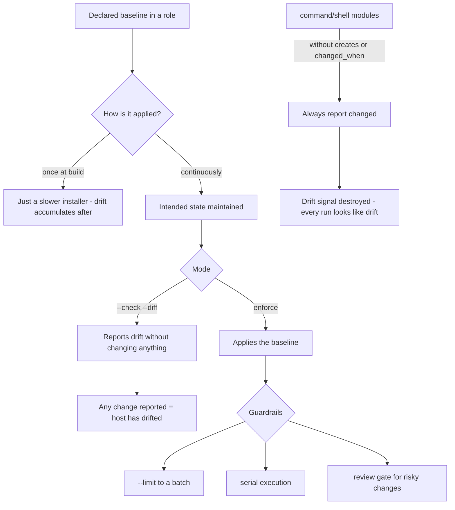

# Ansible Configuration Baselines and Drift Remediation

**Level:** Advanced
**Tree:** [Enterprise Operations at Fleet Scale](../README.md)
**Branch:** [Logging & Fleet Management](README.md)
**Forest:** [Linux](../../../README.md)

## Explanation

# Ansible Configuration Baselines and Drift Remediation

Configuration management is only valuable if it describes the whole intended state and is applied continuously. Applied once at build, it is just a slower installer.

## Idempotence is the whole point

A playbook must be safe to run repeatedly, changing nothing when the system already matches the intended state. That property is what makes it possible to run continuously and to trust the change count as a drift signal.

Idempotence is easy to lose. The **command** and **shell** modules are not idempotent by default - they run every time and always report changed. Using them without **creates**, **removes** or a **changed_when** condition destroys the signal, because every run reports changes whether or not anything actually differed.

## Check mode is the drift detector

Running with **--check --diff** reports what would change without changing it. That is the mechanism for continuous drift detection: schedule it, and any host reporting changes has drifted from its intended state.

This is far more meaningful than a compliance scan, because it compares against **your** declared intent rather than a generic benchmark.

## Roles, not playbook sprawl

Baselines belong in **roles** with variables separating what differs per environment. The system roles that ship with RHEL cover common areas - firewall, selinux, storage, network, timesync - and are supported and tested, which is preferable to reimplementing them.

## The part people get wrong

Remediating drift automatically is powerful and can be dangerous. An automated remediation that runs unattended across the fleet will faithfully apply a mistake everywhere within minutes.

The mature pattern is **detect automatically, remediate deliberately**: continuous check mode reporting drift, with enforcement gated behind review for anything outside a well-understood set. And **--limit** plus serial execution so a bad change reaches a batch rather than the estate.

## Architecture and flow



## Commands

### Command 1

Report what would change without changing it - the drift detection mechanism

```text
ansible-playbook baseline.yml --check --diff
```

### Command 2

Apply to a subset in batches so a bad change cannot reach the whole fleet

```text
ansible-playbook baseline.yml --limit web --serial 5
```

### Command 3

Catch non-idempotent patterns and bad practice before they reach a host

```text
ansible-lint baseline.yml
```

### Command 4

Validate syntax before execution

```text
ansible-playbook baseline.yml --syntax-check
```

### Command 5

Gather facts to confirm inventory grouping matches reality

```text
ansible all -m setup -a "filter=ansible_distribution*"
```

### Command 6

Install the supported system roles rather than reimplementing common baselines

```text
ansible-galaxy collection install redhat.rhel_system_roles
```

### Command 7

Check only one aspect of the baseline for faster targeted drift detection

```text
ansible-playbook baseline.yml --tags security --check
```

### Command 8

Encrypt a secret for inclusion in version-controlled variables

```text
ansible-vault encrypt_string --stdin-name db_password
```

## Automation scripts

### Fleet drift detector

```bash
#!/usr/bin/env bash
# Runs the baseline in check mode and reports which hosts have drifted.
# Detection only - it deliberately never enforces.
set -uo pipefail
PLAYBOOK="${1:?usage: $0 <playbook.yml> [inventory]}"
INV="${2:-}"
rc=0

command -v ansible-playbook >/dev/null 2>&1 || { echo "ansible not installed"; exit 2; }
[ -r "$PLAYBOOK" ] || { echo "cannot read $PLAYBOOK"; exit 2; }

args=(--check --diff)
[ -n "$INV" ] && args+=(-i "$INV")

tmp=$(mktemp); trap 'rm -f "$tmp"' EXIT

echo "== running baseline in check mode (no changes will be made) =="
ansible-playbook "$PLAYBOOK" "${args[@]}" > "$tmp" 2>&1 || true

echo "== drift by host =="
drifted=0
while read -r host ok changed unreachable failed rest; do
  case "$host" in ""|PLAY*|TASK*) continue ;; esac
  c=$(printf %s "$changed" | tr -dc '0-9')
  u=$(printf %s "$unreachable" | tr -dc '0-9')
  f=$(printf %s "$failed" | tr -dc '0-9')
  if [ "${u:-0}" -gt 0 ]; then
    echo "  UNREACHABLE $host"; rc=1; continue
  fi
  if [ "${f:-0}" -gt 0 ]; then
    echo "  FAILED      $host"; rc=1; continue
  fi
  if [ "${c:-0}" -gt 0 ]; then
    echo "  DRIFTED     $host ($c task(s) would change)"
    drifted=$((drifted+1)); rc=1
  else
    echo "  OK          $host"
  fi
done < <(sed -n '/PLAY RECAP/,$p' "$tmp" | tail -n +2 | sed 's/:[[:space:]]*/ /; s/=/ /g')

echo
echo "  $drifted host(s) drifted from the declared baseline"
echo "  note: this script detects only. remediate deliberately, in batches,"
echo "        after reviewing what would change."
exit $rc
```

## Lab

**Objective:** Build an idempotent baseline, use check mode to detect drift, and see how a non-idempotent task destroys the signal.

### Steps

1. Write a role declaring packages, a service state, a configuration file and a firewall rule.
2. Apply it and confirm the second run reports zero changes, proving idempotence.
3. Change something manually on one host, run in check mode and confirm only that host reports drift.
4. Add a shell task without changed_when, run twice and observe every host now reports changes.
5. Fix it with a changed_when condition and confirm the drift signal is restored.
6. Apply a deliberately wrong value with --limit and serial, and observe it reaching only the first batch.

### Validation

Check mode reliably distinguishes drifted from clean hosts, and you have seen how one non-idempotent task makes that signal useless.

## Operational automation

## Automating baselines safely

**Run check mode continuously, enforce deliberately.** Scheduled drift detection is safe and highly informative; unattended enforcement across a fleet will apply a mistake everywhere within minutes.

**Never leave command or shell tasks without a changed_when or creates guard.** They report changed on every run, which destroys the drift signal and trains people to ignore the report entirely.

**Use serial and limit in every enforcement run.** A bad change should reach a batch, be caught by validation, and stop - not reach the whole estate simultaneously.

**Prefer the supported system roles.** firewall, selinux, storage, network and timesync roles are tested and maintained, which is better than a locally written equivalent that only one person understands.

## Troubleshooting

### Scenario 1: Every playbook run reports changes even when nothing has changed

**Likely cause:** Non-idempotent tasks, typically command or shell without creates or changed_when

**Resolution:** Add appropriate guards or replace with a proper module; run ansible-lint to find them systematically

### Scenario 2: Check mode reports failures that do not occur in a real run

**Likely cause:** A task depends on something an earlier task would have created, which check mode did not actually create

**Resolution:** Mark such tasks with check_mode: false where safe, and design playbooks so early tasks do not gate later checks

### Scenario 3: A wrong configuration value was applied to the entire fleet at once

**Likely cause:** Enforcement ran unattended with no batching or validation gate

**Resolution:** Use serial with a small batch size and a validation task between batches so a failure halts the rollout

### Scenario 4: A host is reported unreachable although SSH works manually

**Likely cause:** A different user, key, or Python interpreter path is being used by Ansible than by the manual session

**Resolution:** Check the inventory variables for ansible_user, ansible_python_interpreter and connection settings

## Interview questions

### 1. Why does idempotence matter so much in configuration management?

Because it is what makes continuous application safe and what makes the change count meaningful. If a playbook is genuinely idempotent, running it against a compliant host changes nothing and reports nothing, so any reported change is real information - that host has drifted. That gives you drift detection for free, using the same code that enforces the baseline. Lose idempotence and you lose both: you cannot run it continuously without churn, and the report becomes noise that everyone learns to ignore. The usual culprits are command and shell tasks without creates or changed_when, which report changed on every single run.

### 2. How would you use Ansible for drift detection rather than enforcement?

Run the baseline with --check --diff on a schedule. Check mode reports what would change without changing anything, so a host reporting zero changes matches the declared intent and any host reporting changes has drifted, with the diff showing exactly what. This is more useful than a generic compliance scan because it compares against your own declared configuration rather than a standard benchmark, so it catches organisation-specific drift too. The key discipline is keeping detection and enforcement separate - detect continuously and automatically, but enforce deliberately, in batches, after someone has looked at what would change.

### 3. What is the danger of automated remediation?

That it applies mistakes at machine speed. Automation that detects drift and immediately corrects it will faithfully push an incorrect baseline to every host in the fleet within minutes, and the blast radius is the entire estate rather than one server. It can also fight legitimate emergency changes - someone makes an urgent fix during an incident and automation reverts it. The mature pattern is continuous detection with deliberate enforcement, and when you do enforce, using serial with small batches and a validation gate between them so a bad change is caught after a handful of hosts rather than all of them.

## Certification alignment

- RHCE EX294 - Red Hat Certified Engineer, Ansible automation
- RHCSA EX200 - foundations of system configuration
- Red Hat EX374 - developing advanced automation
- CompTIA Linux+ XK0-005 - automation and scripting

## References

- Red Hat documentation - Automating system administration with RHEL system roles
- Ansible documentation - check mode, idempotency and best practices
- ansible-lint rules documentation
- Red Hat Ansible Automation Platform architecture guides

## Suggested video search

Ansible idempotent playbooks check mode drift detection system roles tutorial

---

> Validate commands, versions, permissions, licensing, and rollback procedures in an isolated lab before production use.
