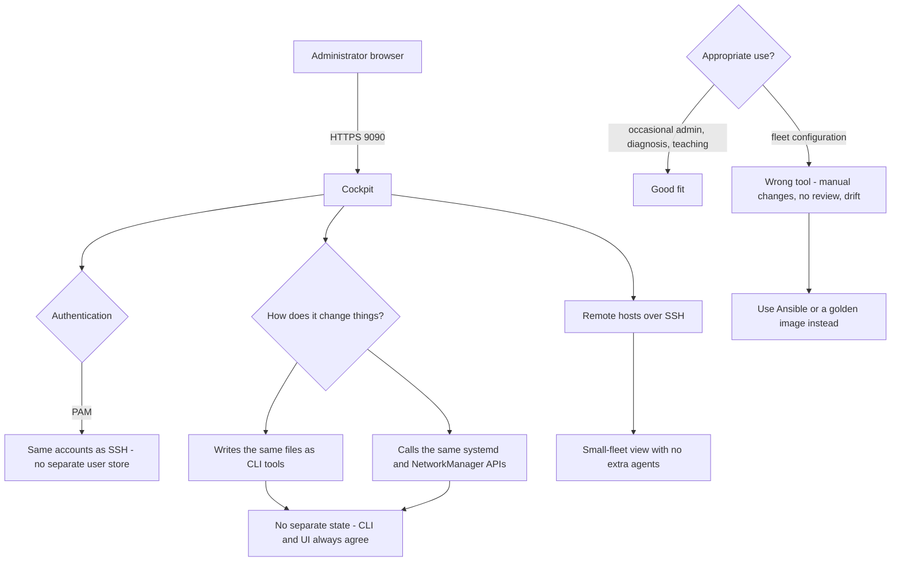

# Cockpit and Ansible Web-Based Linux Fleet Administration

**Level:** Beginner
**Tree:** [Enterprise Operations at Fleet Scale](../README.md)
**Branch:** [Logging & Fleet Management](README.md)
**Forest:** [Linux](../../../README.md)

## Explanation

# Cockpit for Web-Based Fleet Administration

Cockpit provides a web interface for Linux system administration. It is worth understanding properly because it occupies a specific and useful niche, and because it is frequently either dismissed or misused.

## What makes it different

Cockpit **does not maintain its own state or configuration**. It reads and writes the same files and calls the same APIs that command-line tools use, and it authenticates users as themselves through PAM rather than having its own accounts.

That means a change made in Cockpit is identical to the equivalent command, and a change made at the command line appears in Cockpit immediately. There is no drift between the two views, which is the failure mode of most management interfaces that keep their own database.

## Where it genuinely helps

It is effective for **occasional administrators** who cannot be expected to remember command syntax, for **rapid diagnosis** where the graphical journal and metrics views are faster than composing queries, and for **teaching** - the interface shows the underlying commands, so it can be a route into the CLI rather than a replacement for it.

The **remote hosts** feature connects to other machines over SSH, giving a small-fleet view without additional agents.

## Where it does not belong

Cockpit is **not configuration management**. Changes made through it are manual changes, invisible to version control and unreviewable, and at any scale that is exactly the drift you are trying to eliminate. Anything that should be consistent across hosts belongs in Ansible or an image, not in a web form.

## Securing it

It listens on 9090 and grants full administrative access to anyone who can authenticate. It should not be exposed to a general network - restrict it to a management segment, keep it behind the firewall, and prefer accessing remote hosts through a single Cockpit instance rather than enabling it everywhere.

## Architecture and flow



## Commands

### Command 1

Enable Cockpit via socket activation so it only runs when accessed

```text
systemctl enable --now cockpit.socket
```

### Command 2

Permit Cockpit on a management zone only, never on a public zone

```text
firewall-cmd --permanent --zone=internal --add-service=cockpit && firewall-cmd --reload
```

### Command 3

Confirm what Cockpit is listening on and on which addresses

```text
ss -tlnp | grep 9090
```

### Command 4

Add modules for virtual machines, containers and storage management

```text
dnf install cockpit-machines cockpit-podman cockpit-storaged
```

### Command 5

Review Cockpit access and authentication activity

```text
journalctl -u cockpit -u cockpit.socket -S -1h
```

### Command 6

List which Cockpit packages and pages are installed

```text
cockpit-bridge --packages
```

### Command 7

Ensure Cockpit refuses unencrypted connections

```text
echo "AllowUnencrypted=false" >> /etc/cockpit/cockpit.conf
```

### Command 8

Check status and disable Cockpit on hosts that should not expose it

```text
systemctl status cockpit.socket; systemctl disable --now cockpit.socket
```

## Automation scripts

### Cockpit exposure auditor

```bash
#!/usr/bin/env bash
# Cockpit grants full administrative access to anyone who can authenticate.
# This checks it is not reachable from anywhere it should not be.
set -uo pipefail
rc=0

if ! systemctl is-enabled --quiet cockpit.socket 2>/dev/null; then
  echo "cockpit.socket is not enabled on this host"
  exit 0
fi

echo "== listener =="
ss -tlnp 2>/dev/null | grep 9090 | sed 's/^/  /' || echo "  not listening"

if ss -tln 2>/dev/null | grep -q "0.0.0.0:9090\|\[::\]:9090"; then
  echo "  WARN: listening on all interfaces"
  rc=1
fi

echo "== firewall exposure =="
if command -v firewall-cmd >/dev/null 2>&1; then
  for z in $(firewall-cmd --get-active-zones 2>/dev/null | grep -v "^ "); do
    if firewall-cmd --zone="$z" --list-services 2>/dev/null | grep -qw cockpit; then
      target=$(firewall-cmd --zone="$z" --get-target 2>/dev/null)
      echo "  zone=$z permits cockpit (target=${target:-default})"
      case "$z" in
        public|external|dmz)
          echo "    ALERT: cockpit reachable from an untrusted zone"
          echo "           restrict to a management zone or source network"
          rc=2 ;;
      esac
    fi
  done
fi

echo "== encryption =="
if grep -qs "AllowUnencrypted[[:space:]]*=[[:space:]]*true" /etc/cockpit/cockpit.conf 2>/dev/null; then
  echo "  ALERT: AllowUnencrypted is true - credentials may cross the network in clear"
  rc=2
else
  echo "  OK: unencrypted access not permitted"
fi

echo "== recent authentication =="
journalctl -u cockpit -S -24h --no-pager 2>/dev/null | grep -ci "authentication" | sed 's/^/  auth events (24h): /' || true
exit $rc
```

## Lab

**Objective:** Use Cockpit for diagnosis and small-fleet management, and establish where it stops being appropriate.

### Steps

1. Enable cockpit.socket and restrict access to a management zone in firewalld.
2. Log in as an unprivileged user and confirm the limits of what is available without escalation.
3. Install cockpit-machines and cockpit-podman and manage a VM and a container through the interface.
4. Add a second machine under Remote Hosts over SSH and administer it without installing an agent there.
5. Change a network setting in Cockpit, then verify with nmcli that the same profile changed.
6. Make a change at the command line and confirm Cockpit reflects it immediately, demonstrating there is no separate state.

### Validation

You can show that Cockpit and the CLI operate on identical configuration with no drift between them, and you have restricted its network exposure appropriately.

## Operational automation

## Using Cockpit appropriately

**Enable it via socket activation.** cockpit.socket starts the service only when someone connects, so there is no persistent daemon to attack or maintain.

**Do not use it for fleet configuration.** A change made in a web form is a manual change: unversioned, unreviewed and invisible to anyone auditing later. Anything that must be consistent belongs in Ansible or a golden image.

**Restrict it to a management network.** It grants full administrative access to anyone who can authenticate, so exposure should be treated with the same seriousness as SSH - firewall it to a management zone and never leave it on a public one.

**Prefer one Cockpit instance with remote hosts.** Managing several machines from a single instance over SSH reduces the number of hosts exposing an administrative interface at all.

## Troubleshooting

### Scenario 1: Cockpit is unreachable although the service appears enabled

**Likely cause:** The firewall does not permit the cockpit service in the relevant zone, or it is only listening on localhost

**Resolution:** Add the cockpit service to the appropriate zone and confirm the listener with ss -tlnp

### Scenario 2: Login succeeds but most functions are unavailable

**Likely cause:** The account is not permitted to escalate privileges, so administrative actions are hidden

**Resolution:** Ensure the user is in the wheel group or has appropriate sudo rights, and use the administrative access toggle in the interface

### Scenario 3: The browser reports a certificate error every time

**Likely cause:** Cockpit generated a self-signed certificate on first start

**Resolution:** Install an organisation-issued certificate into /etc/cockpit/ws-certs.d so it is trusted

### Scenario 4: A configuration change made in Cockpit was overwritten

**Likely cause:** Configuration management reapplied the managed state, correctly reverting a manual change

**Resolution:** Make the change in the configuration management source instead; this is the system working as intended, not a Cockpit fault

## Interview questions

### 1. How does Cockpit differ from typical web management interfaces?

It has no state of its own. Most management interfaces maintain their own database of configuration and push changes out, which means the interface view and the actual system can drift apart, and a change made at the command line is either invisible or gets overwritten. Cockpit reads and writes exactly the same files and calls the same systemd and NetworkManager APIs that CLI tools use, and it authenticates users as themselves through PAM rather than having separate accounts. So a change made in Cockpit is indistinguishable from the equivalent command, and a command-line change appears in Cockpit immediately. There is nothing to reconcile.

### 2. Where is Cockpit the wrong tool?

Fleet configuration. Anything that should be consistent across many hosts must come from a reviewed, version-controlled source - Ansible, a golden image, or similar - because that is what makes the estate reproducible and auditable. A change made through a web form is a manual change: nobody reviewed it, it is not in version control, and six months later nobody can explain why one host differs. Cockpit is genuinely good for diagnosis, for occasional administrators who should not need to memorise syntax, and for teaching because it shows the underlying commands. Using it to configure a fleet reintroduces exactly the drift that configuration management exists to eliminate.

### 3. What security considerations apply to Cockpit?

It grants full administrative access to anyone who can authenticate, so it deserves the same treatment as SSH. It should be firewalled to a management network rather than reachable from general or public zones, and it should never permit unencrypted connections. Because it authenticates through PAM it inherits whatever account policy is in place, which is good - it means MFA and account lockout apply - but it also means a weak account is now exploitable over HTTP as well as SSH. I would also enable it via socket activation so there is no persistent daemon, and prefer running one Cockpit instance that reaches other machines over SSH rather than exposing an administrative interface on every host.

## Certification alignment

- RHCSA EX200 - manage systems using the web console
- CompTIA Linux+ XK0-005 - system management tools
- Red Hat system administration curriculum
- ITIL 4 - service operation tooling

## References

- Red Hat documentation - Managing systems using the RHEL web console
- Cockpit project documentation - remote hosts and available modules
- man 5 cockpit.conf
- Red Hat security guidance for administrative interfaces

## Suggested video search

Cockpit web console RHEL remote hosts system management tutorial

---

> Validate commands, versions, permissions, licensing, and rollback procedures in an isolated lab before production use.
