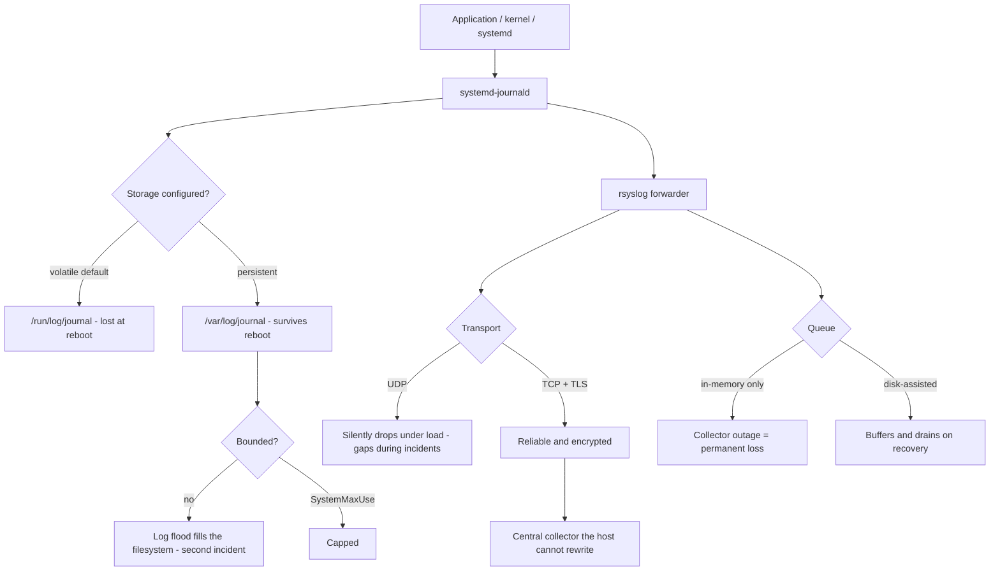

# journald, rsyslog and Central Log Aggregation

**Level:** Intermediate
**Tree:** [Enterprise Operations at Fleet Scale](../README.md)
**Branch:** [Logging & Fleet Management](README.md)
**Forest:** [Linux](../../../README.md)

## Explanation

# journald, rsyslog and Central Log Aggregation

Logs on the machine that generated them are useful for debugging and useless for incident response, because the machine you most need logs from is the one you can least trust.

## journald

**systemd-journald** collects structured, indexed records with rich metadata - unit, PID, UID, boot ID, and arbitrary fields - which makes precise querying possible without parsing text.

The default configuration is **volatile**: the journal lives in /run/log/journal and is discarded at reboot. That surprises people investigating a crash, because the evidence from before the reboot is simply gone. Persistence requires creating /var/log/journal, and it should be one of the first things configured on any server.

Storage must be bounded with **SystemMaxUse**, or a log-generating fault can fill the filesystem and cause a second, larger incident.

## rsyslog

rsyslog remains the standard forwarder. The essential design decisions are **transport** and **buffering**.

Use **TCP with TLS**, not UDP. UDP silently drops messages under load, which means logs go missing precisely when volume is highest - during an incident.

Configure a **disk-assisted queue**. Without one, if the central collector is unreachable, messages are lost. With one, they buffer locally and drain when connectivity returns, which is the difference between a gap in the record and a complete one.

## Off-host is the point

An attacker with root can edit local logs. Forwarding in near real time to a collector the host cannot rewrite is what makes logs evidential rather than merely diagnostic. That, plus synchronised time so records from different hosts can actually be correlated, is what turns log collection into something usable during an incident.

## Architecture and flow



## Commands

### Command 1

Journal size on disk and integrity check of the stored files

```text
journalctl --disk-usage; journalctl --verify
```

### Command 2

Make the journal persistent - do this before you need the history

```text
mkdir -p /var/log/journal && systemd-tmpfiles --create --prefix /var/log/journal && systemctl restart systemd-journald
```

### Command 3

Query one unit over a precise window with full structured fields

```text
journalctl -u nginx -S "2024-01-01 09:00" -U "2024-01-01 10:00" -o json-pretty
```

### Command 4

Errors from the previous boot - the investigation that fails without persistence

```text
journalctl -p err -b -1
```

### Command 5

Follow one unit by structured field rather than text matching

```text
journalctl -f -o cat _SYSTEMD_UNIT=sshd.service
```

### Command 6

Reclaim journal space by size or age

```text
journalctl --vacuum-size=500M; journalctl --vacuum-time=30d
```

### Command 7

Validate rsyslog configuration before restarting - a bad config stops log collection silently

```text
rsyslogd -N1
```

### Command 8

Confirm the forwarding connection to the central collector is actually established

```text
ss -tnp | grep -E ":514|:6514"
```

## Automation scripts

### Logging pipeline health check

```bash
#!/usr/bin/env bash
# Verifies the three things that make logs evidential rather than decorative:
# persistence, bounded growth, and reliable off-host forwarding.
set -uo pipefail
rc=0

echo "== journal persistence =="
if [ -d /var/log/journal ]; then
  echo "  OK: persistent journal enabled"
  journalctl --disk-usage 2>/dev/null | sed 's/^/  /'
else
  echo "  ALERT: journal is VOLATILE - all history is lost at reboot"
  echo "         fix: mkdir -p /var/log/journal && systemctl restart systemd-journald"
  rc=1
fi

echo "== bounded growth =="
max=$(grep -hs "^SystemMaxUse" /etc/systemd/journald.conf /etc/systemd/journald.conf.d/*.conf 2>/dev/null | tail -1)
if [ -n "${max:-}" ]; then
  echo "  OK: $max"
else
  echo "  WARN: SystemMaxUse not set - a log flood can fill the filesystem"
  rc=1
fi

echo "== boots retained =="
b=$(journalctl --list-boots 2>/dev/null | grep -c . || true)
echo "  $b boot(s) available for investigation"
[ "${b:-0}" -le 1 ] && echo "    note: only the current boot - cannot investigate a prior crash"

echo "== off-host forwarding =="
if systemctl is-active --quiet rsyslog 2>/dev/null; then
  fw=$(grep -rhs -E "^\*\.\*|@@|action\(.*omfwd" /etc/rsyslog.conf /etc/rsyslog.d/ 2>/dev/null | grep -c "@" || true)
  if [ "${fw:-0}" -gt 0 ]; then
    echo "  OK: forwarding rules present"
    if grep -rhqs "@@" /etc/rsyslog.conf /etc/rsyslog.d/ 2>/dev/null; then
      echo "    transport: TCP (@@) - reliable"
    else
      echo "    WARN: appears to use UDP (@) - messages drop silently under load"
      rc=1
    fi
    if grep -rhqs -i "queue.type\|ActionQueueType" /etc/rsyslog.conf /etc/rsyslog.d/ 2>/dev/null; then
      echo "    OK: a queue is configured (buffers during collector outage)"
    else
      echo "    WARN: no disk-assisted queue - logs lost if the collector is unreachable"
      rc=1
    fi
  else
    echo "  ALERT: no forwarding configured - logs are local only and attacker-modifiable"
    rc=1
  fi
else
  echo "  rsyslog not active"
fi
exit $rc
```

## Lab

**Objective:** Make logs survive a reboot and an outage of the central collector, and prove UDP loses messages.

### Steps

1. Confirm the journal is volatile, reboot, and observe that previous-boot logs are unavailable.
2. Enable persistence, reboot again, and confirm journalctl -b -1 now returns the prior boot.
3. Set SystemMaxUse and verify the journal is capped rather than growing without limit.
4. Configure rsyslog forwarding over UDP, generate a high message rate and count messages received centrally.
5. Switch to TCP with a disk-assisted queue and repeat, comparing the received count.
6. Stop the central collector, generate messages, restart it and confirm the buffered messages arrive.

### Validation

You measured message loss under UDP that did not occur with TCP plus a queue, and previous-boot logs are now available for investigation.

## Operational automation

## Automating log collection

**Enable journal persistence in the base image.** A host that has never been configured for persistence loses exactly the evidence you need after a crash, and by then it is too late to enable it.

**Always bound journal size.** An application logging in a tight loop can fill the filesystem and turn a minor fault into an outage; SystemMaxUse is a one-line preventive control.

**Forward over TCP with TLS and a disk-assisted queue.** UDP drops silently under load, which means gaps appear precisely during incidents. A disk queue means a collector outage delays logs rather than destroying them.

**Monitor that forwarding is actually working.** A host where rsyslog is running but the connection to the collector has been down for weeks looks healthy to every process check and is contributing nothing.

## Troubleshooting

### Scenario 1: No logs are available from before the most recent reboot

**Likely cause:** The journal is in its default volatile mode, stored in /run and discarded at boot

**Resolution:** Create /var/log/journal and restart systemd-journald; this must be done before the incident, not after

### Scenario 2: The root filesystem filled up and the journal is enormous

**Likely cause:** No SystemMaxUse limit, so an application logging heavily consumed all available space

**Resolution:** Set SystemMaxUse in journald.conf, reclaim immediately with journalctl --vacuum-size, and fix the underlying log volume

### Scenario 3: Some log messages never reach the central collector during busy periods

**Likely cause:** UDP transport is dropping messages under load with no retransmission

**Resolution:** Switch to TCP with @@ syntax or an omfwd action, and add a disk-assisted queue to survive collector outages

### Scenario 4: rsyslog is running but no logs arrive centrally

**Likely cause:** A configuration error, a firewall blocking the destination port, or a TLS certificate problem

**Resolution:** Validate with rsyslogd -N1, confirm the connection with ss, and check for TLS errors in the local journal

## Interview questions

### 1. Why is the default journald configuration a problem for incident response?

Because it is volatile. By default the journal lives in /run/log/journal, which is tmpfs, so everything is discarded when the host reboots. That means the single most common investigation - working out why a machine crashed or was rebooted - has no evidence available, because the reboot destroyed it. Enabling persistence is simply creating /var/log/journal and restarting journald, but it has to be done in advance, ideally in the base image. Alongside that you need SystemMaxUse set, because an unbounded journal can fill the filesystem and cause a worse incident than the one being logged.

### 2. Why should syslog forwarding use TCP rather than UDP?

Because UDP has no delivery guarantee and no backpressure, so under load it simply drops messages, silently. That means logs go missing exactly when volume is highest - during an incident or an attack, which is precisely when you need them complete. TCP gives reliable delivery and lets you add TLS for confidentiality and integrity in transit. Just as important is a disk-assisted queue: without one, an outage of the central collector means those messages are gone permanently, whereas with one they buffer on disk and drain when the collector returns, so you get delayed logs rather than a hole in the record.

### 3. Why does it matter that logs leave the host at all?

Because logs stored only on the machine that generated them are under the control of whoever compromised that machine. An attacker with root can edit or delete them, so local-only logs prove nothing about an incident on that host. Forwarding in near real time to a collector the host cannot rewrite is what makes the record evidential rather than merely diagnostic. It also makes correlation possible - you can only reconstruct an attack path across several systems if their logs are in one place, and that in turn depends on their clocks being synchronised, which is why time and logging are really the same problem.

## Certification alignment

- RHCSA EX200 - manage system logging with journald and rsyslog
- RHCE EX294 - automate logging configuration
- CompTIA Linux+ XK0-005 and Security+ - logging and monitoring
- CIS Benchmark for RHEL - logging and audit controls

## References

- Red Hat documentation - Configuring a remote logging solution
- man 5 journald.conf, man 1 journalctl, man 5 rsyslog.conf
- rsyslog documentation - queues, TLS and reliable forwarding
- CIS Benchmark logging requirements

## Suggested video search

systemd journald persistent storage rsyslog TLS forwarding disk queue tutorial

---

> Validate commands, versions, permissions, licensing, and rollback procedures in an isolated lab before production use.
