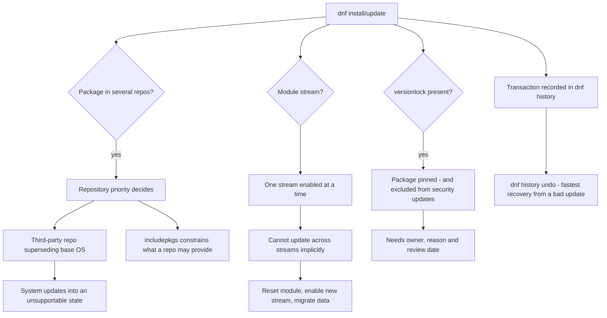

# DNF and YUM Package Management: Modules, Repository Priority and Version Locking

**Level:** Intermediate
**Tree:** [Enterprise Operations at Fleet Scale](../README.md)
**Branch:** [Content, Patching & Lifecycle](README.md)
**Forest:** [Linux](../../../README.md)

## Explanation

# dnf Modules, Repository Priority and Version Locking

Most package management is unremarkable until an update breaks an application, at which point the details of how packages are selected become urgent.

## Modules

AppStream **modules** let one release ship multiple versions of the same software - PostgreSQL 13 and 15, several Node.js releases - as parallel **streams**. You enable one stream, and the module system prevents accidentally jumping to another.

The practical consequence people meet is that **you cannot simply update across streams**. Moving from one stream to another requires resetting the module and installing the new stream deliberately, usually with data migration in between. dnf refuses to do it implicitly, which looks like an obstruction and is actually a safety property.

## Repository priority

When the same package exists in several repositories, priority decides which wins. Third-party repositories that unintentionally supersede base OS packages are a classic cause of a system that updates itself into an unsupportable state. **Setting priority and using includepkgs or excludepkgs to constrain third-party repositories to only the packages they should provide** is basic hygiene that is very often skipped.

## Version locking

**dnf versionlock** pins a package to a specific version so an update cannot move it. This is genuinely necessary - a certified application stack may require an exact kernel or database version - but every lock is also a permanent exclusion from security updates for that package.

Locks accumulate. A fleet where nobody can explain why a package is locked is a fleet carrying unmanaged security risk, so every lock needs a documented reason, an owner, and a review date.

## Transaction history

dnf records every transaction, and **dnf history undo** can reverse one. That is the fastest recovery when an update breaks something, and it is worth knowing before you need it rather than after.

## Architecture and flow



## Commands

### Command 1

Show which module streams are enabled and which profile is installed

```text
dnf module list --enabled
```

### Command 2

Switch streams deliberately - the only supported way to move between them

```text
dnf module reset postgresql; dnf module enable postgresql:15
```

### Command 3

Inspect repository priorities and package constraints

```text
dnf repolist -v | grep -E "Repo-id|Repo-priority|Repo-excludepkgs"
```

### Command 4

Constrain a third-party repository so it cannot supersede base packages

```text
dnf config-manager --setopt=epel.priority=99 --setopt=epel.includepkgs=htop,jq --save
```

### Command 5

Review existing locks and pin a package to a specific version

```text
dnf versionlock list; dnf versionlock add kernel-5.14.0-284.el9
```

### Command 6

Review transaction history and inspect exactly what one transaction changed

```text
dnf history list; dnf history info 47
```

### Command 7

Reverse a transaction - the fastest recovery when an update breaks something

```text
dnf history undo 47
```

### Command 8

List only security advisories rather than all available updates

```text
dnf updateinfo list --security
```

## Automation scripts

### Package policy auditor

```bash
#!/usr/bin/env bash
# Audits the three package-management risks: unconstrained third-party repos,
# undocumented version locks, and outstanding security errata.
set -uo pipefail
rc=0

echo "== repositories =="
while read -r id; do
  [ -n "$id" ] || continue
  case "$id" in rhel-*|ubi-*|baseos*|appstream*) continue ;; esac
  prio=$(dnf config-manager --dump "$id" 2>/dev/null | awk -F= '/^priority/{gsub(/ /,"",$2); print $2}')
  inc=$(dnf config-manager --dump "$id" 2>/dev/null | awk -F= '/^includepkgs/{gsub(/ /,"",$2); print $2}')
  echo "  $id (priority=${prio:-default})"
  if [ -z "${inc:-}" ]; then
    echo "    WARN: no includepkgs - this repo may supersede base OS packages"
    rc=1
  fi
done < <(dnf repolist --enabled 2>/dev/null | tail -n +2 | awk '{print $1}')

echo "== version locks =="
if dnf versionlock list >/dev/null 2>&1; then
  n=$(dnf versionlock list 2>/dev/null | grep -c . || true)
  echo "  $n package(s) locked"
  dnf versionlock list 2>/dev/null | sed 's/^/    /'
  if [ "${n:-0}" -gt 0 ]; then
    echo "    note: each lock excludes that package from security updates."
    echo "          every lock needs an owner, a reason and a review date."
    rc=1
  fi
fi

echo "== outstanding security errata =="
sec=$(dnf updateinfo list --security 2>/dev/null | grep -c "RHSA\|Important\|Critical" || true)
echo "  $sec security advisory line(s) applicable"
[ "${sec:-0}" -gt 0 ] && rc=1

echo "== last transaction =="
dnf history list 2>/dev/null | head -3 | sed 's/^/  /'
exit $rc
```

## Lab

**Objective:** Break a system with a third-party repository, recover with history undo, and switch a module stream properly.

### Steps

1. Enable a third-party repository with no priority or includepkgs constraint.
2. Update and identify any base OS packages that were replaced by third-party builds.
3. Recover with dnf history undo, confirming the original packages are restored.
4. Re-enable the repository with a priority and includepkgs list, then confirm it can no longer supersede base packages.
5. List enabled module streams, then attempt to install a different stream version directly and observe the refusal.
6. Reset the module, enable the new stream and install it, then apply a versionlock and confirm updates skip that package.

### Validation

You have caused and reversed a repository-priority incident, and can explain why dnf refuses to cross module streams implicitly.

## Operational automation

## Automating package policy

**Constrain every third-party repository with priority and includepkgs.** An unconstrained repository can replace base OS packages during a routine update and move hosts into a state the vendor will not support, and it happens silently.

**Audit version locks continuously with an owner and expiry.** Locks are sometimes genuinely required, but each one permanently excludes a package from security updates. A lock nobody can justify is unmanaged risk.

**Automate security-only patching separately from full updates.** dnf update --security lets you close security exposure on a fast cadence while feature updates follow a slower, more tested path.

**Capture dnf history before and after automated patching.** It is the fastest available rollback, and knowing the transaction ID in advance turns a broken update into a two-minute recovery instead of an investigation.

## Troubleshooting

### Scenario 1: A base OS package was replaced by a third-party build after a routine update

**Likely cause:** The third-party repository had equal or higher priority and no includepkgs constraint

**Resolution:** Recover with dnf history undo, then set priority and includepkgs so the repository can only provide its intended packages

### Scenario 2: dnf refuses to install a newer version of a modular package

**Likely cause:** A different module stream is enabled, and dnf will not cross streams implicitly

**Resolution:** Reset the module, enable the required stream and install; plan for data migration between major versions

### Scenario 3: Security updates are being skipped for a specific package

**Likely cause:** A versionlock is pinning it, usually applied long ago for a reason nobody recorded

**Resolution:** Review with dnf versionlock list, establish whether the constraint still applies, and remove or re-document it with an expiry

### Scenario 4: An update broke an application and needs reverting quickly

**Likely cause:** A package changed behaviour or dependencies in the latest version

**Resolution:** Use dnf history to identify the transaction and dnf history undo to reverse it, then versionlock the package while the issue is investigated properly

## Interview questions

### 1. Why will dnf not let you update across module streams?

Because streams represent genuinely different major versions of the same software, and moving between them is usually not a package operation at all - it typically requires data migration and application compatibility work. PostgreSQL 13 to 15 changes the on-disk format, so silently upgrading the package would leave a database that will not start. By requiring an explicit module reset and enable, dnf forces the operator to acknowledge that they are performing a major version change rather than a routine update. It reads as an obstruction the first time you meet it, but it is preventing a class of outage that used to be common.

### 2. What is the risk of an unconstrained third-party repository?

It can supersede base operating system packages during an ordinary update. If a third-party repository provides its own build of a system library or a common utility at a higher version, dnf may prefer it, and the host quietly moves to a package set the OS vendor will not support - which typically surfaces months later during an unrelated incident. The mitigation is to set an explicit priority so base repositories win, and to use includepkgs so the repository can only ever provide the specific packages you added it for. Both are quick to configure and very often skipped.

### 3. When is a versionlock appropriate, and what does it cost?

It is appropriate when something genuinely requires an exact version - a certified application stack pinned to a specific kernel, or a database version an application vendor supports. The cost is that the locked package no longer receives security updates at all, so you have traded a compatibility risk for a security one. That trade is sometimes correct, but it must be a decision rather than an accident. In practice locks accumulate over years and nobody can explain why they exist, which means the fleet is carrying unmanaged exposure. Every lock should have a recorded reason, a named owner and a review date.

## Certification alignment

- RHCSA EX200 - install, update and manage software packages
- RHCE EX294 - automate package and repository management
- CompTIA Linux+ XK0-005 - package management and repositories
- Red Hat EX403 - Satellite content management

## References

- Red Hat documentation - Managing software with the DNF tool
- Red Hat documentation - Installing, managing and removing user-space components (modularity)
- man 8 dnf, man 8 dnf.conf, man 8 dnf-versionlock
- Red Hat modularity and AppStream lifecycle documentation

## Suggested video search

dnf modules streams repository priority versionlock history undo RHEL tutorial

---

> Validate commands, versions, permissions, licensing, and rollback procedures in an isolated lab before production use.
