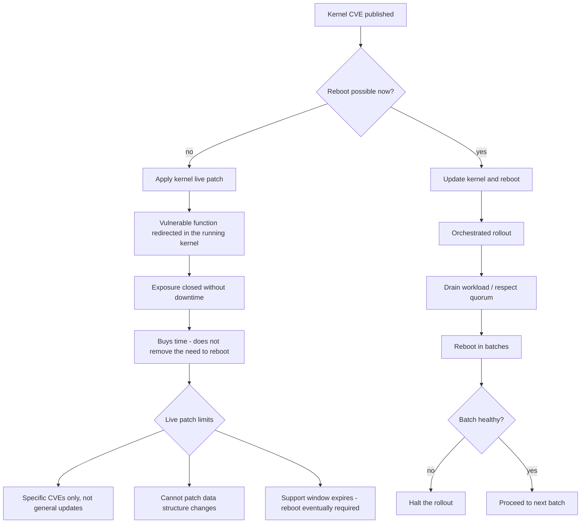

# Live Kernel Patching and Reboot Orchestration

**Level:** Advanced
**Tree:** [Enterprise Operations at Fleet Scale](../README.md)
**Branch:** [Content, Patching & Lifecycle](README.md)
**Forest:** [Linux](../../../README.md)

## Explanation

# Live Kernel Patching and Reboot Orchestration

Kernel vulnerabilities require a new kernel, and a new kernel normally requires a reboot. At fleet scale that is a scheduling problem that can leave critical systems exposed for weeks.

## What kpatch actually does

**kpatch** (Red Hat calls the service **kernel live patching**) loads a module that redirects execution from a vulnerable kernel function to a corrected one, without rebooting. The running kernel is effectively hot-fixed.

The important limits are frequently misunderstood:

Live patches address **specific CVEs**, typically the high and critical severity ones. They are not a general kernel update mechanism.

They **cannot patch everything** - changes to data structures, or to functions currently on a call stack in a way that cannot be safely redirected, are not live-patchable.

They **accumulate against a specific kernel version**, and a live patch stream has a limited support window. The host must eventually be rebooted onto the properly updated kernel.

The correct mental model is that live patching **buys time**, converting an emergency reboot into a scheduled one. Treating it as a permanent substitute leaves hosts running old kernels with stacked patches and an expiring support window.

## Orchestrating the reboots you cannot avoid

When reboots must happen, the risk is doing them simultaneously. Orchestration means **respecting cluster quorum**, draining workloads first, rebooting in batches with health validation between them, and stopping the rollout automatically if a batch fails.

**needs-restarting** identifies which hosts actually require a reboot and which services merely need restarting after a library update - a distinction that avoids a great many unnecessary reboots.

## Rollback

A live patch is **unloadable**: kpatch unload removes it and the kernel returns to its unpatched behaviour without a reboot. That is genuinely unusual among kernel changes and is the main operational advantage - the change and its reversal are both non-disruptive.

What does not roll back is a **reboot into a new kernel**. That is a second, disruptive change, and reverting means another reboot into the previous entry. Live patching and kernel replacement therefore have very different risk profiles and should not share a change process.

## Security implications

Live patching **closes a vulnerability without a reboot**, which is precisely its value: the alternative is an exposure window lasting until the next maintenance window, often weeks.

The limit is worth stating honestly. Live patches cover a **subset of kernel CVEs** - not changes to data structures, and not anything outside the kernel. A host live-patched against a kernel CVE is still running the old kernel, and reporting it as fully patched is a real misstatement of posture.

## Monitoring

Track **applied live patches separately from installed kernel version**, because the two now disagree by design. A host reporting an old kernel may be fully protected, and a compliance report reading only uname will be wrong in both directions.

Monitor **accumulated patch depth and uptime together**. Long uptime with many stacked patches is the signal that a reboot is overdue - deferred indefinitely rather than eliminated, which is the failure mode of live patching as a strategy.

## High availability and disaster recovery

Live patching **reduces the need to fail over**, and that is a benefit with a hidden cost: failover paths that are never exercised stop being trustworthy. If reboots were the routine that proved failover worked, removing them removes the proof.

Schedule **deliberate reboots anyway**, at a cadence the business can absorb. A host with a year of uptime has an unverified boot path, an untested fstab, and an initramfs nobody has regenerated - and it will all be discovered during an unplanned outage.

## Anti-patterns

**Treating live patching as a reboot replacement.** It defers reboots; it does not remove the need for them, and the deferral compounds.

**Reporting compliance from uname alone.** It understates protection on live-patched hosts and overstates it where a patch failed to apply.

**Restarting nothing after a library update.** A patched glibc does nothing for processes still mapping the old copy, which is what needs-restarting exists to find.

## Change control

Live patching is **low risk and reversible in seconds**, so it suits a lighter process than a kernel upgrade - which is the point, and the reason to define the two separately rather than treating all kernel work as one class.

The item that needs a gate is the **eventual reboot**, because it accumulates every deferred change at once: new kernel, fstab edits, module changes, and anything else added since. The longer live patching defers it, the larger and less predictable that change becomes.

## Architecture and flow



## Commands

### Command 1

Show loaded and installed live patch modules for the running kernel

```text
kpatch list
```

### Command 2

Install the live patch stream matching the running kernel version

```text
dnf install kpatch-patch-$(uname -r | cut -d- -f1)
```

### Command 3

Report whether a reboot is genuinely required, distinct from services needing restart

```text
needs-restarting -r
```

### Command 4

List services using deleted libraries - these need restarting but not a reboot

```text
needs-restarting -s
```

### Command 5

Show kernel security advisories applicable to this host

```text
dnf updateinfo list --security kernel
```

### Command 6

Compare installed kernels against the running one - a mismatch means a pending reboot

```text
rpm -q kernel; uname -r
```

### Command 7

Reboot with a reason recorded in the journal for change traceability

```text
systemctl reboot --message="Scheduled kernel patch window CHG0012345"
```

### Command 8

Verify and control which kernel will be booted next

```text
grubby --default-kernel; grubby --set-default /boot/vmlinuz-<version>
```

## Automation scripts

### Fleet reboot requirement and live patch reporter

```bash
#!/usr/bin/env bash
# Distinguishes hosts that genuinely need a reboot from those that only need a
# service restart, and reports live patch coverage and kernel age.
set -uo pipefail
rc=0

echo "== kernel state =="
running=$(uname -r)
latest=$(rpm -q kernel --qf "%{VERSION}-%{RELEASE}.%{ARCH}\n" 2>/dev/null | sort -V | tail -1)
echo "  running:   $running"
echo "  installed: $latest"
if [ "$running" != "$latest" ]; then
  echo "  PENDING: a newer kernel is installed but not running - reboot required"
  rc=1
fi

echo "== reboot requirement =="
if command -v needs-restarting >/dev/null 2>&1; then
  if needs-restarting -r >/dev/null 2>&1; then
    echo "  OK: no reboot required"
  else
    echo "  REBOOT REQUIRED"
    rc=1
  fi
  n=$(needs-restarting -s 2>/dev/null | grep -c . || true)
  echo "  services needing restart (no reboot): ${n:-0}"
  [ "${n:-0}" -gt 0 ] && needs-restarting -s 2>/dev/null | head -8 | sed 's/^/    /'
else
  echo "  needs-restarting unavailable (install dnf-utils)"
fi

echo "== live patching =="
if command -v kpatch >/dev/null 2>&1; then
  loaded=$(kpatch list 2>/dev/null | awk '/Loaded patch modules:/{f=1;next} /Installed/{f=0} f && NF' | grep -c . || true)
  echo "  loaded live patch modules: ${loaded:-0}"
  [ "${loaded:-0}" -eq 0 ] && echo "    note: no live patches loaded - kernel CVEs require a reboot to close"
  echo "    reminder: live patches buy time; the support window expires and a"
  echo "              reboot onto the updated kernel is still required."
else
  echo "  kpatch not installed"
fi

echo "== uptime =="
up=$(awk '{printf "%d", $1/86400}' /proc/uptime)
echo "  ${up} days"
[ "${up:-0}" -gt 180 ] && { echo "  WARN: uptime over 180 days - kernel is likely well behind"; rc=1; }
exit $rc
```

## Lab

**Objective:** Close a kernel CVE without rebooting, then prove that live patching does not remove the reboot requirement.

### Steps

1. Record the running kernel and check for applicable kernel security advisories.
2. Install the matching kpatch stream and confirm the live patch module loads.
3. Verify with kpatch list that the patch is active against the running kernel.
4. Use needs-restarting to distinguish a genuine reboot requirement from services needing only a restart.
5. Install a newer kernel package without rebooting and confirm running and installed versions now differ.
6. Reboot, confirm the new kernel is running, and observe that the live patch is no longer needed.

### Validation

You closed a kernel vulnerability with no downtime, and can articulate why the host still had to be rebooted afterwards.

## Operational automation

## Automating patching and reboots

**Use needs-restarting to avoid unnecessary reboots.** A library update usually requires restarting the services using it, not rebooting the host, and treating every update as a reboot creates avoidable downtime and change fatigue.

**Orchestrate reboots in batches with health gates.** Rebooting a cluster simultaneously is an outage. Automation should drain workloads, respect quorum, reboot a batch, validate health and only then proceed - halting automatically if a batch fails.

**Track live patch support windows explicitly.** A live patch stream expires, and a host still running the original kernel when it does is unprotected. The reboot must be scheduled, not deferred indefinitely.

**Alert on uptime as a patch-compliance proxy.** Very long uptime almost always means a kernel well behind current, and it is a simple fleet-wide signal that scheduled reboots are not happening.

## Troubleshooting

### Scenario 1: A kernel security advisory remains applicable after installing the live patch

**Likely cause:** That specific CVE is not live-patchable, or the patch stream does not match the running kernel version

**Resolution:** Confirm the kpatch stream matches the running kernel exactly; for non-patchable CVEs the only remedy is updating the kernel and rebooting

### Scenario 2: A host was rebooted but is still running the old kernel

**Likely cause:** The default boot entry was not updated, or the new kernel failed to boot and the system fell back

**Resolution:** Check grubby --default-kernel and the boot journal for a failed attempt; confirm the initramfs was generated for the new kernel

### Scenario 3: Applying updates triggered an unnecessary fleet-wide reboot

**Likely cause:** Automation treats any package update as requiring a reboot rather than checking

**Resolution:** Use needs-restarting -r to determine genuine reboot requirement and needs-restarting -s to restart only the affected services

### Scenario 4: A cluster lost quorum during a patching window

**Likely cause:** Too many nodes were rebooted concurrently, so the surviving partition had no majority

**Resolution:** Batch reboots to preserve quorum at all times, drain nodes first, and gate each batch on cluster health before proceeding

## Interview questions

### 1. Does kernel live patching remove the need to reboot?

No, it defers it, and treating it otherwise is the main way it gets misused. A live patch redirects execution away from a vulnerable kernel function so the specific CVE is closed on a running system, which converts an emergency reboot into a scheduled one - that is genuinely valuable. But it only covers particular CVEs rather than general kernel updates, it cannot patch changes involving data structures or functions that cannot be safely redirected, and each patch stream has a limited support window tied to a specific kernel version. A host still running the original kernel when that window expires is unprotected, so the reboot has to be planned rather than avoided indefinitely.

### 2. How do you decide whether a host actually needs rebooting after updates?

needs-restarting answers both halves of the question. With -r it reports whether a genuine reboot is required, which is essentially whether the running kernel or a core component like glibc or systemd has been replaced. With -s it lists services still using deleted library files, which need restarting but do not need the host to go down. Most updates fall into the second category, and treating every update as a reboot creates a large amount of avoidable downtime and change fatigue. The other reliable signal is comparing uname -r against the newest installed kernel package - if they differ, a reboot is pending.

### 3. How would you orchestrate reboots across a clustered fleet?

The core requirement is that the service stays up while individual hosts go down, so the automation has to be aware of the cluster rather than treating hosts as independent. That means draining workloads off a node first, checking that removing it will not break quorum, rebooting a small batch, then validating cluster and application health before proceeding to the next batch. Critically the rollout should halt automatically if a batch fails health checks, rather than continuing and compounding the problem. I would also want the reboot reason recorded - systemctl reboot takes a message that lands in the journal - so the change is traceable afterwards.

## Certification alignment

- RHCSA EX200 - manage software updates and the boot process
- RHCE EX294 - automate patching with Ansible
- Red Hat EX415 - security patching and vulnerability remediation
- ITIL 4 - change enablement and release management

## References

- Red Hat documentation - Applying patches with kernel live patching
- Red Hat kernel live patching support window and coverage policy
- man 1 kpatch, man 1 needs-restarting, man 8 grubby
- CVE remediation and vulnerability management practice guides

## Suggested video search

Red Hat kernel live patching kpatch reboot orchestration fleet patching tutorial

---

> Validate commands, versions, permissions, licensing, and rollback procedures in an isolated lab before production use.
