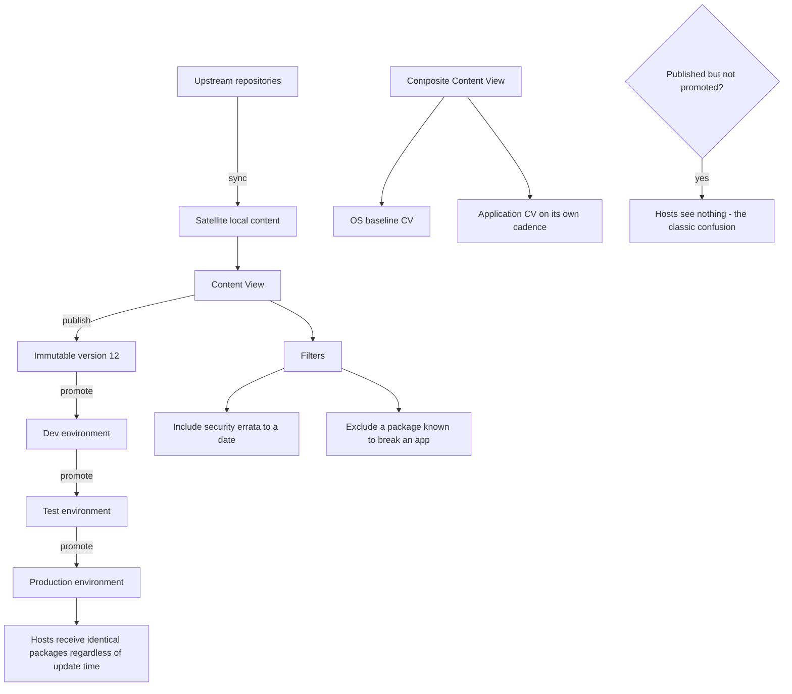

# Red Hat Satellite: Content Views and Lifecycle Environments

**Level:** Advanced
**Tree:** [Enterprise Operations at Fleet Scale](../README.md)
**Branch:** [Content, Patching & Lifecycle](README.md)
**Forest:** [Linux](../../../README.md)

## Explanation

# Red Hat Satellite: Content Views and Lifecycle Environments

Patching a fleet by pointing every host at an upstream repository means the packages a host receives depend on the moment it happened to run an update. Two servers built a week apart are then genuinely different, and nobody can say what is deployed. Satellite exists to remove that variability.

## Content is versioned, not live

Satellite syncs upstream repositories into local storage, then a **Content View** publishes a specific snapshot of that content as an immutable version. Publishing Content View version 12 freezes exactly which package versions it contains.

That snapshot then moves through **Lifecycle Environments** - typically Dev, Test, Production - by promotion. Hosts in Production consume whatever version was promoted there, so a Production host receives identical packages regardless of when it updates. **The same content that was tested is the content that ships.**

## Composite Content Views

A **Composite Content View** combines several Content Views, which is how you separate the operating system baseline from application repositories that change on a different cadence. Without composites, one application repository update forces a republish of everything.

## Errata and filters

Satellite tracks **errata** - security, bugfix and enhancement advisories - so you can report and act on security errata specifically rather than treating all updates as equal. **Filters** on a Content View allow including security errata up to a date while excluding a package known to break an application.

## The operational trap

The most common failure is **publishing without promoting**. Engineers publish a new Content View version, see it in the interface and assume hosts will receive it. Hosts see nothing until that version is promoted to the environment they are attached to, and the resulting confusion is invariably resolved by discovering the promotion was never done.

## Architecture and flow



## Commands

### Command 1

List Content Views and their latest published version

```text
hammer content-view list --organization "Example"
```

### Command 2

Publish a new immutable version snapshotting current synced content

```text
hammer content-view publish --name "RHEL9-Base" --organization "Example"
```

### Command 3

Promote a version so hosts in that environment actually receive it

```text
hammer content-view version promote --content-view "RHEL9-Base" --version 12 --to-lifecycle-environment "Production"
```

### Command 4

List security advisories specifically rather than all available updates

```text
hammer erratum list --organization "Example" --search "type = security"
```

### Command 5

Find hosts with outstanding errata - the fleet patching backlog

```text
hammer host list --search "applicable_errata > 0"
```

### Command 6

Apply a specific advisory to a host from the Satellite side

```text
hammer host errata apply --host web01.example.com --errata-ids RHSA-2024:1234
```

### Command 7

From the client, confirm which repositories and subscription state apply

```text
subscription-manager repos --list-enabled; subscription-manager status
```

### Command 8

Sync upstream content before publishing a new version

```text
hammer repository synchronize --name "RHEL9 BaseOS" --product "Red Hat Enterprise Linux 9" --organization "Example"
```

## Automation scripts

### Content view promotion drift reporter

```bash
#!/usr/bin/env bash
# Finds the classic Satellite mistake: a content view published but never promoted,
# so hosts are still receiving an older version than anyone believes.
set -uo pipefail
ORG="${1:?usage: $0 <organization>}"
rc=0

command -v hammer >/dev/null 2>&1 || { echo "hammer CLI not available"; exit 2; }

echo "== content view versions by environment =="
while IFS=, read -r id name rest; do
  case "$id" in ID|""|*[!0-9]*) continue ;; esac

  latest=$(hammer --csv content-view version list --content-view-id "$id" \
    --organization "$ORG" 2>/dev/null | awk -F, 'NR==2{print $3}')
  [ -n "${latest:-}" ] || continue

  echo "  CV: $name (latest published: $latest)"

  # what each environment is actually serving
  hammer --csv content-view version list --content-view-id "$id" --organization "$ORG" 2>/dev/null \
  | awk -F, 'NR>1 && $4!="" {print "    version " $3 " -> " $4}' | head -5

  promoted=$(hammer --csv content-view version list --content-view-id "$id" --organization "$ORG" 2>/dev/null \
    | awk -F, -v v="$latest" 'NR>1 && $3==v {print $4}')
  if [ -z "${promoted:-}" ] || [ "$promoted" = "\"\"" ]; then
    echo "    ALERT: latest version $latest is published but promoted NOWHERE"
    echo "           hosts will not see it until it is promoted"
    rc=1
  fi
done < <(hammer --csv content-view list --organization "$ORG" 2>/dev/null)

echo "== hosts with outstanding errata =="
n=$(hammer --csv host list --search "applicable_errata > 0" 2>/dev/null | tail -n +2 | grep -c . || true)
echo "  $n host(s) have applicable errata"
[ "${n:-0}" -gt 0 ] && rc=1
exit $rc
```

## Lab

**Objective:** Prove that lifecycle promotion, not publishing, is what determines the packages a host receives.

### Steps

1. Sync a repository and create a Content View containing it.
2. Publish version 1 and promote it to Dev, Test and Production; register a host to Production.
3. Update the upstream content and publish version 2, but promote it only to Dev.
4. Run an update on the Production host and confirm it receives nothing new.
5. Promote version 2 to Production and confirm the same host now sees the updates with no client-side change.
6. Add a filter excluding one package, republish, and confirm that package is no longer offered.

### Validation

You have demonstrated that a published-but-unpromoted version is invisible to hosts, and that content filters control exactly what a fleet can install.

## Operational automation

## Automating content lifecycle

**Automate sync, publish and promote as a scheduled pipeline.** Manual publishing leads directly to the published-but-not-promoted state, and to environments drifting months apart because nobody remembers which was promoted when.

**Promote to Production only after test validation passes.** The entire value of lifecycle environments is that Production receives the exact content that was tested; promoting straight through discards that guarantee entirely.

**Report on applicable errata as a fleet metric.** A host count with outstanding security advisories is a meaningful risk measure, where a per-host patch report is not actionable at scale.

**Keep filters minimal and dated.** A filter excluding a package to protect a fragile application quietly becomes a permanent security exception; every filter needs an owner and a review date.

## Troubleshooting

### Scenario 1: A new Content View version was published but hosts see no updates

**Likely cause:** The version was never promoted to the lifecycle environment those hosts are attached to

**Resolution:** Promote the version to the relevant environment; publishing alone changes nothing for hosts

### Scenario 2: A host reports no available repositories after registration

**Likely cause:** No activation key applied, or the host is attached to an environment with no promoted content view version

**Resolution:** Check subscription-manager status on the client and confirm the activation key maps to a populated environment

### Scenario 3: Two supposedly identical hosts have different package versions

**Likely cause:** They are attached to different lifecycle environments, or one was updated before a promotion and the other after

**Resolution:** Confirm environment membership for both; this is the exact drift lifecycle environments exist to prevent

### Scenario 4: Satellite storage fills rapidly

**Likely cause:** Old content view versions are retained indefinitely along with their full content

**Resolution:** Remove content view versions no longer promoted anywhere, and set a retention policy on published versions

## Interview questions

### 1. What problem do lifecycle environments actually solve?

They make the content a host receives deterministic. If every host updates directly from an upstream repository, the packages it gets depend on the moment it happened to run the update, so two servers built a week apart are genuinely running different software and nobody can state what is deployed. With Satellite, a Content View is published as an immutable version and promoted through Dev, Test and Production. A Production host receives exactly the version promoted there regardless of when it updates, which means the content that was tested is precisely the content that ships. That is what turns patching from an event into a controlled process.

### 2. An engineer published a new content view version but hosts see no updates. What happened?

They published without promoting. Publishing creates a new immutable version of the content view, but hosts consume content from the lifecycle environment they are attached to, not from the content view directly. Until that version is promoted into their environment, they see nothing at all. It is the single most common point of confusion with Satellite because the interface clearly shows the new version existing, which makes it look like the work is done. The fix is to promote, and the prevention is to automate publish and promote as one pipeline rather than two manual steps.

### 3. When would you use a Composite Content View?

When components of your content change on genuinely different cadences. Typically the operating system baseline is updated on a monthly patch cycle while an application repository or a third-party vendor repository changes independently. If they all live in one content view, updating any of them forces a republish and re-promotion of everything, which drags the whole estate through a change it did not need. A composite combines separately maintained content views into one thing hosts consume, so the OS baseline and the application content can each be versioned and promoted on their own schedule.

## Certification alignment

- Red Hat EX403 - Satellite 6 Administration
- RHCE EX294 - automate content and patch management
- RHCSA EX200 - manage software with subscription-manager and dnf
- ITIL 4 - release and deployment management practice

## References

- Red Hat Satellite documentation - Managing Content and Content Views
- Red Hat documentation - Content lifecycle environments and promotion
- man 8 hammer and the Satellite API reference
- Red Hat errata classification (RHSA, RHBA, RHEA) documentation

## Suggested video search

Red Hat Satellite content views lifecycle environments errata promotion tutorial

---

> Validate commands, versions, permissions, licensing, and rollback procedures in an isolated lab before production use.
