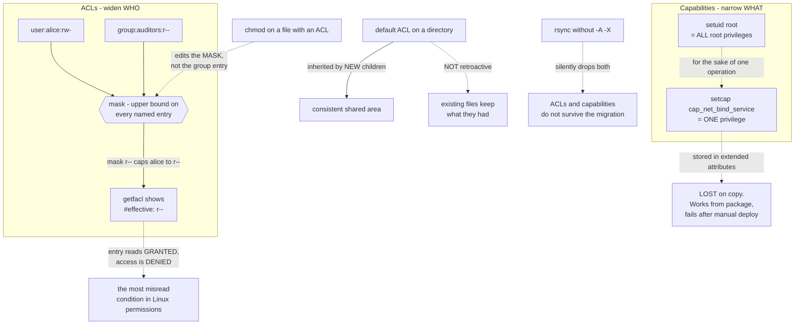

# Linux File Permissions Beyond Mode Bits: ACLs and File Capabilities

**Level:** Intermediate
**Tree:** [Linux Foundations](../README.md)
**Branch:** [Accounts and Access](README.md)
**Forest:** [Linux](../../../README.md)

## Explanation

Mode bits express exactly three subjects: one owner, one group, everyone else. Real access requirements routinely need more than that, and the two mechanisms that extend them work in completely different directions — ACLs widen who may access an object, capabilities narrow what a privileged program may do.

**ACLs add named entries, and the mask is what people get wrong.** setfacl grants a specific user or group access to a specific object, and ls -l signals their presence with a single trailing plus. The complication is the MASK: it is an upper bound on every named entry and on the group class. An entry granting rw- under a mask of r-- yields an effective permission of r--. getfacl marks this with an #effective: comment, and it is the single most misread condition in Linux permissions, because the entry reads as correct and access is still denied. Worse, chmod on a file with an ACL modifies the mask rather than the group entry, so tightening group permissions silently reduces every named entry at once.

**Default ACLs apply to a directory and are inherited by new children.** They are how you make a shared area behave consistently rather than fixing each file after the fact. A default ACL is not retroactive — existing files keep what they had — which is why applying one and assuming the problem is solved leaves a mixed population.

**Capabilities split root into pieces.** Historically a program needing one privileged operation — binding port 80, sending ICMP, changing system time — had to run as root via setuid, receiving every root privilege for the sake of one. Capabilities break that up: CAP_NET_BIND_SERVICE permits binding low ports and nothing else. Granting it with setcap is strictly better than setuid root because a compromise of that binary is bounded to that one privilege.

**Two things about capabilities routinely surprise people.** They are stored in extended attributes, so they are LOST when a binary is copied — an application that works from its package and fails after a manual deployment is usually this. And they do not survive most archiving unless the tool preserves extended attributes, which is why a restored binary can behave differently from the original.

**ACLs and capabilities are also the two layers most often forgotten during a migration**, because neither is visible in a plain ls -l and neither survives a naive copy. rsync needs -A for ACLs and -X for extended attributes; without those flags a migration silently drops both.

## Architecture and flow



## Commands

### Command 1

Read the full ACL. Look specifically for #effective: lines — they mean the mask is reducing a granted entry, which is the usual cause of an ACL that appears correct but denies.

```text
getfacl -p /srv/data/report.csv
```

### Command 2

Grant a named user access. The trailing plus in ls -l is the only indication in standard output that an ACL exists at all.

```text
setfacl -m u:alice:rw /srv/data/report.csv && ls -l /srv/data/report.csv
```

### Command 3

Widen the mask so named entries take effect. Setting an entry without checking the mask is why so many ACLs silently do nothing.

```text
setfacl -m m::rwx /srv/data/report.csv
```

### Command 4

Set a default ACL so new files inherit it. Not retroactive — existing files must be fixed separately.

```text
setfacl -d -m g:project:rwx /srv/project
```

### Command 5

Grant one privilege instead of setuid root, then verify. Capabilities live in extended attributes and are lost if the binary is copied.

```text
setcap cap_net_bind_service=+ep /usr/local/bin/myservice && getcap /usr/local/bin/myservice
```

### Command 6

Preserve ACLs (-A) and extended attributes (-X). Without both, a migration silently drops ACLs and capabilities.

```text
rsync -aAX /srv/data/ /backup/data/
```

## Automation scripts

### audit-acl-mask.sh

```bash
#!/usr/bin/env bash
# Finds ACLs whose MASK is reducing a granted entry, and binaries carrying capabilities.
#
# Both are invisible in ls -l beyond a single plus character, and both are silently dropped
# by a copy that does not preserve extended attributes. That combination is why they are the
# two layers most often lost in a migration and hardest to notice afterwards.
set -uo pipefail

SCAN="${1:-/srv}"
fail=0

# 1. The reducing mask. An entry can read as rw- while the mask caps it at r--, so the ACL
#    looks correct and access is denied. getfacl marks it with #effective:.
echo "== ACLs where the mask reduces a granted entry, under $SCAN =="
found=0
while IFS= read -r f; do
  [ -e "$f" ] || continue
  if getfacl -p "$f" 2>/dev/null | grep -q '#effective:'; then
    echo "   $f"
    getfacl -p "$f" 2>/dev/null | grep -E '#effective:|^mask' | sed 's/^/      /'
    found=1; fail=1
  fi
done < <(getfacl -Rsp "$SCAN" 2>/dev/null | awk '/^# file:/ {print substr($0,9)}')
[ "$found" -eq 0 ] && echo "   none"

# 2. Default ACLs are not retroactive, so a directory can carry one while the files already
#    in it do not match - a mixed population that looks configured.
echo
echo "== directories with a default ACL =="
while IFS= read -r d; do
  if getfacl -p "$d" 2>/dev/null | grep -q '^default:'; then
    n=$(find "$d" -maxdepth 1 -type f 2>/dev/null | wc -l)
    echo "   $d  ($n existing file(s) NOT covered - defaults apply only to new children)"
  fi
done < <(find "$SCAN" -type d 2>/dev/null | head -100)

# 3. Capabilities. Better than setuid root, but stored in xattrs and lost on copy - which is
#    why a binary works from its package and fails after a manual deployment.
echo
echo "== binaries carrying file capabilities =="
caps=$(getcap -r "$SCAN" 2>/dev/null || true)
if [ -n "$caps" ]; then
  printf '%s\n' "$caps" | sed 's/^/   /'
  echo "   These are LOST if the binary is copied without preserving extended attributes."
else
  echo "   none"
fi

# 4. setuid binaries that could use a capability instead - the actual remediation.
echo
echo "== setuid-root binaries (candidates for a narrower capability) =="
find "$SCAN" -type f -perm -4000 -user root -printf '   %M %p\n' 2>/dev/null | head -20 || echo "   none"

exit "$fail"
```

## Lab

**Objective:** Make each extended access-control layer deny access and then resolve it correctly, including the mask behaviour that makes a correct-looking ACL fail.

### Steps

1. Create a file readable only by its owner and confirm a second user is denied.
2. Grant that user rw with setfacl, verify with getfacl, and note the plus that appears in ls -l.
3. Set the mask to r-- and observe the entry still reading rw- while access is now read-only. Find the #effective: line.
4. Run chmod g-w on the file and observe that it changed the MASK, silently reducing the named entry.
5. Restore the mask and confirm full access returns.
6. Set a default ACL on a directory, create a new file, and confirm inheritance. Then confirm an existing file did NOT change.
7. Grant CAP_NET_BIND_SERVICE to a small program and bind port 80 without root.
8. Copy that binary with cp and observe the capability is gone; repeat with cp --preserve=xattr.
9. rsync the tree without -A -X, then with them, and compare what survived.

### Validation

The reducing-mask condition has been produced and explained, chmod has been shown to edit the mask, a default ACL demonstrably applies only to new children, a capability replaces setuid root successfully, and the rsync comparison shows exactly what a naive copy loses.

## Operational automation

## Keeping the invisible layers visible

- Audit for reducing ACL masks on a schedule. The condition is invisible without looking for #effective: and it produces access failures that read as application bugs.
- Prefer file capabilities to setuid root wherever a service needs one privilege, and keep an inventory of both. A capability bounds a compromise; setuid root does not.
- Always use rsync -aAX for migrations and backups of anything using ACLs or capabilities. Without -A and -X both are dropped silently, and the failure appears later as a permissions or startup problem with no obvious cause.
- Deploy binaries through packages rather than copying them. A package preserves capabilities; cp does not unless told to, which is why "it works on the build host" is such a common report.
- Treat a default ACL as applying to the future only. Applying one without remediating existing content leaves a mixed population that looks configured and behaves inconsistently.

## Troubleshooting

### Scenario 1: An ACL grants a user access but they are still denied

**Likely cause:** The mask is reducing the effective permission. The entry is correct and capped.

**Resolution:** Run getfacl and look for #effective:. Widen the mask with setfacl -m m::rwx. This is the most misread condition in Linux permissions.

### Scenario 2: Running chmod broke access for users granted by ACL entries

**Likely cause:** On a file with an ACL, chmod modifies the mask rather than the group entry, so every named entry is reduced at once.

**Resolution:** Re-set the mask explicitly after any chmod on an ACL-bearing file, or manage those files with setfacl only.

### Scenario 3: A binary works when installed from its package but fails after being copied into place

**Likely cause:** File capabilities live in extended attributes and are not preserved by an ordinary copy.

**Resolution:** Use cp --preserve=xattr, or deploy via the package. Verify with getcap on the deployed file rather than the source.

### Scenario 4: A default ACL was applied but existing files still have the wrong access

**Likely cause:** Default ACLs apply only to newly created children; they are not retroactive.

**Resolution:** Apply the access ACL recursively with setfacl -R for existing content, in addition to the default for future content.

### Scenario 5: After a migration, permissions look right but several applications fail

**Likely cause:** The copy did not preserve ACLs or extended attributes, so both ACLs and capabilities were lost while mode bits survived.

**Resolution:** Re-sync with rsync -aAX and verify with getfacl and getcap. Mode bits surviving is exactly why this looks fine at a glance.

## Interview questions

### 1. What is the ACL mask and why does it cause so much confusion?

The mask is an upper bound on every named entry and on the group class. An entry granting rw- under a mask of r-- has an effective permission of r--, so the ACL reads as correct and access is still denied. getfacl marks it with an #effective: comment, which is the only visible clue. It compounds because chmod on a file with an ACL edits the MASK rather than the group entry, so an ordinary permission tightening silently reduces every named entry at once. That combination — invisible in ls -l, and changed by a command that appears unrelated — is why it is the most misread condition in Linux permissions.

### 2. Why prefer a file capability over setuid root?

Because setuid root grants every root privilege for the sake of one. If a service needs to bind port 80, CAP_NET_BIND_SERVICE grants exactly that and nothing else, so a compromise of that binary is bounded to binding low ports rather than to full root. The operational catch is that capabilities live in extended attributes: they are lost when a binary is copied, and they do not survive archiving unless the tool preserves xattrs. An application that works from its package and fails after a manual deployment is very often exactly this.

### 3. What does a naive copy lose, and why does it look fine?

ACLs and extended attributes, which means capabilities too. Mode bits, ownership and timestamps survive an ordinary copy, so the result looks correct in ls -l — and that is precisely why it is missed. rsync needs -A for ACLs and -X for extended attributes; cp needs --preserve=xattr. Without them a migration completes cleanly and applications begin failing later for reasons that appear unconnected to the copy.

### 4. How does a default ACL differ from an access ACL?

An access ACL controls access to the object it is set on. A default ACL is set on a directory and is inherited by newly created children, which is how you make a shared area behave consistently without fixing every file afterwards. The important limitation is that it is not retroactive — existing files keep whatever they had. Applying a default ACL and assuming the directory is now consistent leaves a mixed population that looks configured and behaves unpredictably.

## Certification alignment

- RHCSA EX200 - configure access control lists and special permissions
- LPIC-2 - advanced file permissions, ACLs and extended attributes
- Linux Foundation LFCS - manage access control lists and file capabilities

## References

- Red Hat: Managing file systems - controlling access using ACLs
- acl(5), setfacl(1), getfacl(1) and capabilities(7) man pages
- rsync(1) - the -A and -X options and what a copy silently drops

## Suggested video search

Linux POSIX ACL setfacl getfacl mask effective permissions file capabilities setcap getcap extended attributes

---

> Validate commands, versions, permissions, licensing, and rollback procedures in an isolated lab before production use.
