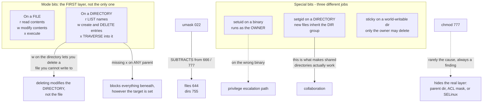

# Linux File Permissions, umask and Special Permission Bits

**Level:** Beginner
**Tree:** [Linux Foundations](../README.md)
**Branch:** [Accounts and Access](README.md)
**Forest:** [Linux](../../../README.md)

## Explanation

Linux permissions look simple and are misread constantly, because the mental model most people carry — owner, group, everyone — is only the first of four layers and does not explain the behaviour that actually causes tickets.

**Read, write and execute mean different things on a directory.** On a file they are obvious. On a directory, read lets you LIST names, execute lets you TRAVERSE into it and access things by name, and write lets you create and delete entries. The consequences surprise people: execute without read means you can open a file whose name you already know but cannot list the directory; write on a directory lets you delete a file you cannot write to, because deleting is modifying the directory, not the file. And a missing execute bit on any parent directory blocks access to everything beneath it regardless of how the target itself is set — which is why permission problems are so often several levels above where people are looking.

**umask subtracts, it does not set.** New files are created 666 minus umask and directories 777 minus umask, which is why files are never executable by default. A umask of 022 gives 644 and 755. The common mistake is treating umask as a permission value rather than a mask of bits to remove.

**The three special bits each solve a different problem.** **setuid** on an executable makes it run as the file owner rather than the caller — the mechanism behind passwd, and a privilege-escalation path if it is on the wrong binary. **setgid** on an executable does the same for the group; on a DIRECTORY it does something else entirely and far more useful: new files inherit the directory group rather than the creator primary group, which is what makes shared directories work. **The sticky bit** on a world-writable directory restricts deletion to the file owner, which is what makes /tmp safe.

**chmod 777 is not a diagnostic.** It is the most common response to permission denied and it is wrong twice: it usually does not fix the problem, because the cause is often a parent directory, an ACL mask or SELinux; and it creates a finding that outlives the incident. If 777 appears to fix something, the actual cause was still one of the layers above, and it is now hidden.

## Architecture and flow



## Commands

### Command 1

Check the target AND its parents. A missing execute bit on any parent directory blocks access to everything beneath it.

```text
ls -ld /path /path/.. /path/../..
```

### Command 2

Show the current mask in octal and symbolic form. It subtracts from 666 for files and 777 for directories — it is not a permission value.

```text
umask && umask -S
```

### Command 3

Set the setgid bit on a shared directory so new files inherit the directory group. This is the fix for shared directories, not looser permissions.

```text
chmod 2775 /srv/project && ls -ld /srv/project
```

### Command 4

List every setuid and setgid binary. Each is a potential escalation path, so the point is to diff against an approved baseline.

```text
find / -xdev -type f -perm /6000 -printf "%M %u %p\n" 2>/dev/null
```

### Command 5

Apply the sticky bit to a world-writable directory so users can only delete their own files — the mechanism that makes /tmp safe.

```text
chmod 1777 /shared/tmp && ls -ld /shared/tmp
```

## Automation scripts

### explain-access.sh

```bash
#!/usr/bin/env bash
# Explains WHY a specific user can or cannot reach a specific path, walking the whole
# ancestry rather than looking only at the target.
#
# Written because the usual approach - ls -l on the file - cannot see the most common cause.
# A missing execute bit on any PARENT directory blocks everything beneath it, however
# correct the file itself looks.
set -uo pipefail

USER="${1:?usage: explain-access.sh <user> <path>}"
TARGET="${2:?usage: explain-access.sh <user> <path>}"

id "$USER" >/dev/null 2>&1 || { echo "no such user: $USER" >&2; exit 1; }
[ -e "$TARGET" ] || { echo "no such path: $TARGET" >&2; exit 1; }

echo "user   : $USER  ($(id "$USER"))"
echo "target : $TARGET"
echo

# Walk from / down to the target. Traversal requires x on EVERY component.
echo "== ancestry (traversal needs x on every level) =="
path=""
blocked=0
IFS=/ read -ra parts <<< "$(readlink -f "$TARGET")"
for part in "${parts[@]}"; do
  [ -z "$part" ] && { path="/"; } || { path="${path%/}/$part"; }
  [ -e "$path" ] || continue
  perms=$(stat -c '%A %U %G' "$path")
  if sudo -u "$USER" test -x "$path" 2>/dev/null || [ ! -d "$path" ]; then
    mark="ok"
  else
    mark="NO TRAVERSE  <-- blocks everything below"
    blocked=1
  fi
  printf '   %-50s %s  %s\n' "$path" "$perms" "$mark"
done

# Only now look at the target itself, because if traversal failed the target is irrelevant.
echo
echo "== target =="
stat -c '   mode %A  owner %U  group %G' "$TARGET"
for op in r w x; do
  if sudo -u "$USER" test -${op} "$TARGET" 2>/dev/null; then echo "   $op : yes"; else echo "   $op : NO"; fi
done

# An ACL changes the answer and is invisible in ls -l except for one trailing character.
if [ -n "$(getfacl -p "$TARGET" 2>/dev/null | grep -v '^#' | grep -E '^(user|group):[^:]+:')" ]; then
  echo
  echo "== an ACL is present (the + in ls -l) =="
  getfacl -p "$TARGET" 2>/dev/null | sed 's/^/   /'
  if getfacl -p "$TARGET" 2>/dev/null | grep -q '#effective:'; then
    echo "   NOTE: the MASK is reducing at least one entry above."
    echo "   An entry can read as granted and still be denied. This is the most"
    echo "   misread condition in Linux permissions."
  fi
fi

echo
if [ "$blocked" -eq 1 ]; then
  echo "VERDICT: traversal is blocked by a PARENT directory. Fixing the target will not help."
  exit 1
fi
echo "VERDICT: traversal is fine. If access still fails, check the ACL mask, then file"
echo "capabilities, then SELinux - in that order. Do not reach for chmod 777."
```

## Lab

**Objective:** Produce each permission behaviour deliberately — including the ones that surprise people — so that permission denied becomes a diagnosis rather than a guess.

### Steps

1. Create a directory with read but not execute, and confirm you can list names but not open the files.
2. Reverse it: execute but not read. Confirm you can open a file by name but cannot list the directory.
3. Give a user write on a directory but not on a file inside it, then delete that file. Explain why this works.
4. Change umask to 077, create a file and a directory, and predict the resulting modes before checking.
5. Create a shared group directory without setgid, have two users create files, and observe the group ownership diverge.
6. Apply chmod 2775 and repeat, confirming new files now inherit the directory group.
7. Create a world-writable directory without the sticky bit and delete another user file. Apply the sticky bit and confirm you no longer can.
8. Run explain-access.sh against a path blocked by a parent directory and confirm it identifies the parent rather than the target.

### Validation

Every behaviour above has been produced and explained from first principles, the setgid directory keeps group ownership consistent, the sticky bit prevents cross-user deletion, and the diagnostic script correctly names a blocking parent. No step used chmod 777.

## Operational automation

## Permissions as a monitored property

- Maintain an approved baseline of setuid and setgid binaries and diff against it on a schedule. Their presence is normal; an UNEXPECTED entry is the finding, and only a baseline can tell the difference.
- Alert on world-writable files. Directories with the sticky bit are fine; files essentially never are.
- Scan for files with no valid owner. They are the fingerprint of an account deleted without a data decision, and they accumulate silently.
- Set umask deliberately in the service environment rather than relying on the interactive default. A daemon that inherits a permissive umask creates world-readable files for its entire lifetime, and nothing reports it.
- Ban chmod 777 in change review. If it appears to resolve an incident, the real cause was a parent directory, an ACL mask or SELinux — and it is now hidden behind a permission set that will outlive everyone who remembers why.

## Troubleshooting

### Scenario 1: A user has correct permissions on a file but still gets permission denied

**Likely cause:** A parent directory is missing the execute bit, so the path cannot be traversed.

**Resolution:** Check every directory from / down to the target. Traversal needs x on each level, and this is the single most common cause of a denial that looks impossible.

### Scenario 2: A user deleted a file they had no write permission on

**Likely cause:** Deletion modifies the DIRECTORY, not the file, so write permission on the directory is what governs it.

**Resolution:** Apply the sticky bit to shared directories so only the owner can delete their own files. This is the behaviour that makes /tmp safe.

### Scenario 3: Files in a shared directory keep ending up with the wrong group

**Likely cause:** New files take the creator primary group, not the directory group.

**Resolution:** Set the setgid bit on the directory with chmod 2775 and fix existing files with chgrp -R. Loosening permissions instead is the common wrong answer.

### Scenario 4: A service creates world-readable files

**Likely cause:** It inherited a permissive umask from its startup environment.

**Resolution:** Set UMask explicitly in the systemd unit. Relying on the interactive default means the behaviour depends on how the service happened to be started.

### Scenario 5: chmod 777 fixed it, so the permissions must have been the problem

**Likely cause:** Usually not. 777 masks a parent-directory, ACL-mask or SELinux issue as well as widening the file.

**Resolution:** Revert it and diagnose the layer properly with the ancestry walk. A 777 left in place is both a finding and a lost explanation.

## Interview questions

### 1. What do read, write and execute mean on a directory?

Read lets you list the names in it. Execute lets you traverse into it and access entries by name. Write lets you create and delete entries. The consequences catch people out: execute without read means you can open a file whose name you already know but cannot list the directory; and write on a directory lets you delete a file you cannot write to, because deletion modifies the directory rather than the file. That second one is why the sticky bit exists.

### 2. Explain umask to someone who thinks it sets permissions.

It subtracts. New files start from 666 and directories from 777, and umask removes bits from that. With umask 022 you get 644 and 755. Files never get the execute bit by default regardless of umask, which is why 666 rather than 777 is the file starting point. The practical trap is a service inheriting a permissive umask from however it was started — it then creates world-readable files for its whole lifetime and nothing reports it, which is why the umask belongs in the unit file.

### 3. What does setgid do, and why does it depend on what you set it on?

On an executable it makes the program run with the file group. On a DIRECTORY it does something completely different and far more useful: files created inside inherit the directory group rather than the creator primary group. That directory behaviour is what makes shared collaboration work, because without it two people in the same group create files the other cannot edit. Most real-world uses of setgid are the directory case, and people who only know the executable meaning tend to reach for looser permissions instead.

### 4. Why is chmod 777 a bad response to permission denied?

Two reasons. It usually does not fix the problem, because the cause is often a missing execute bit on a parent directory, an ACL mask reducing an entry, or SELinux — none of which the file mode controls. And it creates a security finding that outlives the incident and the person who applied it. Worse, if it does appear to work, the real cause is now hidden behind a permission set nobody will want to tighten later. The correct move is to walk the ancestry and identify the layer.

## Certification alignment

- RHCSA EX200 - list, set and change standard ugo/rwx permissions; special permissions
- LPIC-1 - manage file permissions and ownership, umask, setuid, setgid, sticky bit
- CompTIA Linux+ - file and directory permissions and privilege management

## References

- Red Hat: Managing file permissions - base and special permissions
- chmod(1), umask(1p) and inode(7) man pages
- CIS Benchmark for RHEL - filesystem permission requirements

## Suggested video search

Linux file permissions umask setuid setgid sticky bit directory execute traverse chmod octal

---

> Validate commands, versions, permissions, licensing, and rollback procedures in an isolated lab before production use.
