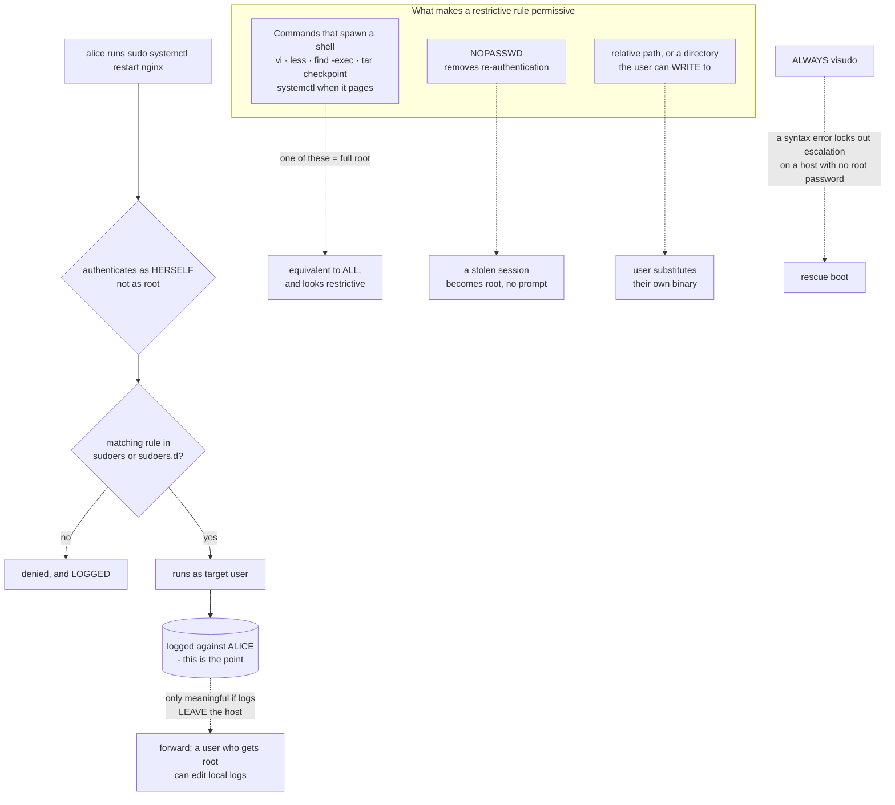

# Linux Privilege Delegation with sudo, sudoers and Least Privilege

**Level:** Intermediate
**Tree:** [Linux Foundations](../README.md)
**Branch:** [Accounts and Access](README.md)
**Forest:** [Linux](../../../README.md)

## Explanation

sudo exists to answer a question that su cannot: who did what as root. Sharing a root password gives you an audit trail that says root, which is worth nothing during an investigation. sudo runs a command as another user under the caller own authentication and logs it against the caller identity.

**Never edit sudoers directly.** visudo validates syntax before saving, and a syntax error in that file locks out privilege escalation on a host where you may need sudo to fix it. On a system with no root password set — the default on many cloud images — that is an unrecoverable state short of single-user mode or a rescue boot. Use visudo, and prefer drop-in files in /etc/sudoers.d so a package or a configuration tool can manage one concern without rewriting the whole file.

**The grammar is user, host, runas, command**, as in **alice ALL=(root) /usr/bin/systemctl restart nginx**. Two mistakes recur. The first is granting ALL when a specific command would do, which is not delegation at all. The second is far subtler: **many restricted commands can be escaped into a full shell.** Anything that can invoke an editor, a pager or a subshell — vi, less, find with -exec, tar with a checkpoint action, systemctl paging its output — hands back root. A rule permitting one of those is equivalent to permitting everything, and it looks restrictive on the page. **NOEXEC** mitigates some cases; choosing commands that cannot spawn is better.

**NOPASSWD deserves scrutiny every time.** It removes the re-authentication that stands between a stolen session and root. There are legitimate uses — automation that cannot type a password — but each should be scoped to a specific command, never to ALL, and recorded with a reason.

**Prefer groups to individuals.** A rule granting wheel is one line that stays correct as people join and leave; per-user rules accumulate into a file nobody dares change. And remember that sudo logging is only useful if the logs leave the host: a user who obtains root can edit local logs, so forwarding is what makes the audit trail meaningful.

**The command path matters.** A rule naming a relative path, or a directory the user can write to, can be satisfied by a binary of their choosing. Always specify absolute paths to locations the user cannot modify.

## Architecture and flow



## Commands

### Command 1

Validate sudoers syntax without editing. A syntax error can lock out privilege escalation entirely on a host with no root password.

```text
visudo -c
```

### Command 2

Edit a drop-in file with validation. Drop-ins let one concern be managed without rewriting the main file.

```text
visudo -f /etc/sudoers.d/nginx-restart
```

### Command 3

Show exactly what a user may run, resolved across sudoers and every drop-in. This is the authoritative answer, not a reading of the files.

```text
sudo -l -U alice
```

### Command 4

Find every rule that skips re-authentication. Each should be scoped to a specific command and justified.

```text
grep -rnE "^[^#]*NOPASSWD" /etc/sudoers /etc/sudoers.d
```

### Command 5

Find unrestricted grants. These are full root by another name and should be a deliberate, reviewed decision.

```text
grep -rnE "^[^#]*ALL\s*=\s*\(ALL(:ALL)?\)\s*ALL" /etc/sudoers /etc/sudoers.d
```

## Automation scripts

### audit-sudoers.sh

```bash
#!/usr/bin/env bash
# Audits sudo delegation for the conditions that make a restrictive-looking rule permissive.
#
# The finding that matters most is not "who has sudo" - it is which rules can be ESCAPED.
# A rule permitting vi, less, find or tar hands back a root shell, so it grants everything
# while reading as a narrow delegation. That is the gap between the policy people think they
# wrote and the one that is enforced.
set -uo pipefail

fail=0
FILES="/etc/sudoers $(find /etc/sudoers.d -type f 2>/dev/null | tr '\n' ' ')"

# 0. Syntax first. If this is broken nothing else matters, and it may already be too late.
echo "== syntax =="
if visudo -c >/dev/null 2>&1; then echo "   valid"; else echo "   INVALID - privilege escalation may be broken"; visudo -c; fail=1; fi

# 1. Commands that can spawn a shell. This is the headline check.
echo
echo "== rules permitting commands that can escape to a shell =="
ESCAPES='vi|vim|nano|emacs|less|more|man|find|tar|zip|awk|perl|python|ruby|env|nmap|systemctl'
esc=$(grep -rnE "^[^#]*(${ESCAPES})" $FILES 2>/dev/null || true)
if [ -n "$esc" ]; then
  printf '%s\n' "$esc" | sed 's/^/   /'
  echo
  echo "   Each of these can spawn a subshell or invoke an editor, which returns a ROOT"
  echo "   shell. The rule reads as a narrow delegation and grants everything."
  echo "   Mitigate with NOEXEC, or choose a command that cannot spawn."
  fail=1
else
  echo "   none"
fi

# 2. NOPASSWD - removes the re-authentication between a stolen session and root.
echo
echo "== NOPASSWD rules =="
np=$(grep -rnE '^[^#]*NOPASSWD' $FILES 2>/dev/null || true)
if [ -n "$np" ]; then
  printf '%s\n' "$np" | sed 's/^/   /'
  echo "   Legitimate for automation, but each should name a SPECIFIC command - never ALL -"
  echo "   and carry a recorded reason."
  if printf '%s' "$np" | grep -qE 'NOPASSWD:\s*ALL'; then
    echo "   CRITICAL: NOPASSWD: ALL grants passwordless root."
    fail=1
  fi
else
  echo "   none"
fi

# 3. Relative or user-writable command paths - the user can substitute their own binary.
echo
echo "== command paths that are relative or user-writable =="
rel=$(grep -rnE '^[^#]*=\s*\(?[^)]*\)?\s*[^/[:space:]]+[[:space:]]*$' $FILES 2>/dev/null | grep -vE 'ALL\s*$' || true)
if [ -n "$rel" ]; then
  printf '%s\n' "$rel" | sed 's/^/   /'
  echo "   A non-absolute path can be satisfied by a binary the user controls."
  fail=1
else
  echo "   none obvious"
fi

# 4. Who actually has what, resolved. Reading the files is not the same as asking sudo.
echo
echo "== resolved privileges per interactive user =="
while IFS=: read -r user _ uid _ _ _ shell; do
  [ "$uid" -ge 1000 ] || continue
  case "$shell" in */nologin|*/false) continue ;; esac
  out=$(sudo -l -U "$user" 2>/dev/null | sed -n '/may run/,$p' | tail -n +2)
  [ -n "$out" ] && { echo "   $user:"; printf '%s\n' "$out" | sed 's/^/      /'; }
done < /etc/passwd

# 5. Are the logs going anywhere a compromised root cannot reach?
echo
echo "== log forwarding =="
if grep -rqE '^\s*\*\.\*\s+@|^\s*action\(type="omfwd"' /etc/rsyslog.conf /etc/rsyslog.d 2>/dev/null; then
  echo "   remote forwarding configured"
else
  echo "   NO REMOTE FORWARDING. sudo logs stay local, and a user who obtains root can"
  echo "   edit them - which removes most of the value of the audit trail."
  fail=1
fi

exit "$fail"
```

## Lab

**Objective:** Write a delegation that is genuinely restricted, then break it yourself — escaping a restricted rule to a root shell is the only convincing way to learn why command choice matters more than rule syntax.

### Steps

1. Grant a test user permission to run a single systemctl restart via a drop-in file, edited with visudo -f.
2. Verify with sudo -l -U rather than by reading the file.
3. Confirm the user can restart that service and cannot restart another.
4. Now grant that user sudo access to less, and escape to a root shell from within it.
5. Repeat the escape using vi, and then using find with -exec.
6. Apply NOEXEC to one of those rules and observe which escapes it stops and which it does not.
7. Replace the escapable rules with commands that cannot spawn, and re-test.
8. Add a NOPASSWD rule, then simulate a stolen session and observe that no re-authentication stands in the way.
9. Point a rule at a relative path, place a binary of your own earlier in PATH, and confirm you executed it as root.
10. Run audit-sudoers.sh and confirm it identifies every weakness you deliberately introduced.

### Validation

You have personally escaped a restricted sudo rule to a root shell by at least two routes, the final rule set survives the audit script with no findings, and you can state for any proposed rule whether the named command can spawn a shell.

## Operational automation

## Delegation that stays least-privilege

- Manage sudo rules as code in /etc/sudoers.d, one file per concern, deployed by configuration management. A hand-edited monolithic sudoers file becomes something nobody is willing to change, which is how stale grants survive for years.
- Validate with visudo -c in the pipeline before deployment. A syntax error can lock out escalation on a host with no root password, and the recovery is a rescue boot.
- Run audit-sudoers.sh on a schedule. The check that pays for itself is the escape check — a rule permitting vi, less, find or tar grants root while reading as a narrow delegation.
- Grant to groups, not individuals. Group-based rules stay correct through joiners and leavers; per-user rules accumulate and are never removed.
- Forward sudo logs off the host. A user who obtains root can edit local logs, so local-only logging gives you an audit trail that fails precisely when it matters.
- Require a recorded reason for every NOPASSWD rule and review them on a cadence. Automation needs are real; unexplained ones are drift.

## Troubleshooting

### Scenario 1: A user with a narrowly scoped sudo rule obtained a root shell

**Likely cause:** The permitted command can spawn a subshell or invoke an editor — vi, less, find -exec, tar and systemctl paging all can.

**Resolution:** Replace it with a command that cannot spawn, or wrap the operation in a script that takes no arguments the user controls. NOEXEC helps but does not cover every case.

### Scenario 2: sudo stopped working for everyone after a sudoers edit

**Likely cause:** The file was edited directly and contains a syntax error, so sudo refuses to parse it.

**Resolution:** Recover through single-user mode or a rescue boot, then always use visudo, which validates before saving. On a host with no root password this is otherwise unrecoverable.

### Scenario 3: A rule appears correct but the user is still denied

**Likely cause:** A later matching rule overrides it — sudoers applies the LAST match, not the first.

**Resolution:** Use sudo -l -U to see the resolved result rather than reading the files, and check drop-ins as well as the main file.

### Scenario 4: A user ran their own binary as root through a legitimate rule

**Likely cause:** The rule specified a relative path or a directory the user can write to, so they substituted the binary.

**Resolution:** Always use absolute paths to locations the user cannot modify, and verify the directory is not user-writable.

### Scenario 5: sudo logs exist but proved useless after an incident

**Likely cause:** Logging was local only, and the account that obtained root was able to edit it.

**Resolution:** Forward to a remote collector. An audit trail that a compromised root can rewrite fails exactly when it is needed.

## Interview questions

### 1. Why is sudo preferable to sharing a root password?

Attribution. With a shared root password every action is logged as root, which tells an investigation nothing about who did it. sudo has the user authenticate as themselves and logs the command against their identity, so the audit trail names a person. It also allows delegation of specific commands rather than all-or-nothing access, and it removes the operational problem of rotating a shared secret whenever anyone leaves.

### 2. A rule permits a user to run only /usr/bin/less as root. What is wrong with that?

less can spawn a shell — and that shell runs as root. So the rule reads as a narrow, low-risk delegation and is equivalent to full root access. The same is true of vi, find with -exec, tar with a checkpoint action, awk, and systemctl when it pages its output. This is the most important thing to know about writing sudoers rules: the question is not whether the rule is narrow, it is whether the named command can spawn. NOEXEC mitigates some cases, but choosing a command that cannot spawn is the real fix.

### 3. When is NOPASSWD acceptable?

When automation genuinely cannot supply a password, and then only scoped to a specific command with a recorded reason. What it removes is the re-authentication standing between a stolen session and root — with NOPASSWD, anyone who gets a shell as that user has root immediately and silently. NOPASSWD: ALL is effectively passwordless root and should be treated as such in review. The mitigation is scope and documentation, not frequency of use.

### 4. Why must sudoers be edited with visudo?

Because visudo validates the syntax before saving, and sudo refuses to operate on a file it cannot parse. On a host with no root password set — the default on most cloud images — a syntax error means no one can escalate at all, and recovery requires single-user mode or a rescue boot. It is a small discipline that prevents an outage that is genuinely difficult to reverse remotely.

### 5. What makes sudo logging actually useful?

Getting the logs off the host. sudo records who ran what, but those records live locally, and a user who obtains root — whether through a legitimate rule or an escape — can edit them. So local-only logging produces an audit trail that is reliable except in the one circumstance you built it for. Forwarding to a collector the host cannot rewrite is what turns it into evidence.

## Certification alignment

- RHCSA EX200 - configure superuser access with sudo and manage sudoers
- LPIC-1 - delegate administrative privileges and manage sudo configuration
- CompTIA Linux+ - privilege escalation, sudo policy and auditing

## References

- Red Hat: Managing sudo access - drop-in files and least-privilege delegation
- sudoers(5) and visudo(8) man pages - grammar, NOEXEC and rule precedence
- GTFOBins - documented shell-escape techniques for commonly permitted binaries

## Suggested video search

Linux sudo sudoers visudo NOPASSWD least privilege command escape shell restricted commands audit

---

> Validate commands, versions, permissions, licensing, and rollback procedures in an isolated lab before production use.
