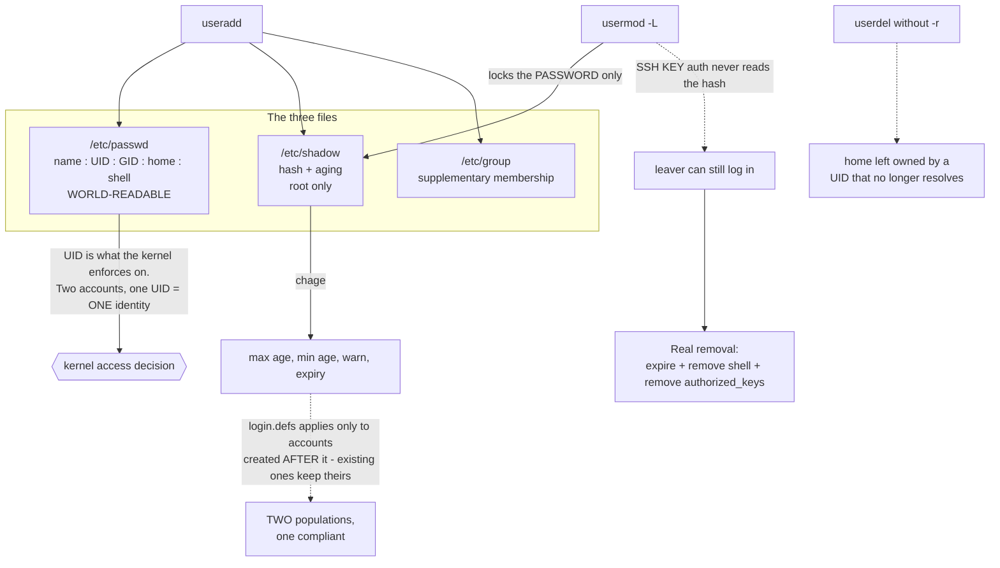

# Local Users, Groups, Password Aging and Account Lifecycle on RHEL

**Level:** Beginner
**Tree:** [Linux Foundations](../README.md)
**Branch:** [Accounts and Access](README.md)
**Forest:** [Linux](../../../README.md)

## Explanation

Every access decision Linux makes starts from an identity, and that identity is a number. The username is a label; the UID is what the kernel enforces on. Two accounts sharing a UID are the same identity to the kernel however different they look in /etc/passwd, which is why a duplicate UID 0 is a root account nobody calls root.

**The three files, and what each one is for.** /etc/passwd holds the account: name, UID, primary GID, home directory and login shell. It is world-readable, which is why no password has lived there for decades. /etc/shadow holds the password hash and the aging policy, readable only by root. /etc/group holds supplementary membership. A user has exactly one primary group, recorded in passwd, and any number of supplementary groups, recorded in group. New files get the primary group, which is the distinction that matters when collaboration breaks.

**Aging is set with chage and it is not optional to verify.** Setting a maximum age is one command; confirming it applied is another, and the two diverge more often than people expect because a policy in /etc/login.defs applies only to accounts created AFTER it. Existing accounts keep whatever they had. An estate that adopted a password policy last year and never remediated has two populations, and only one of them is compliant.

**Locking is where most leaver processes are wrong.** **usermod -L** prefixes the password hash with an exclamation mark so no password can match it. That is all it does. If the user has an authorised SSH key, key authentication never consults the hash and the login still succeeds. Genuinely removing access means expiring the account, removing the shell, and removing authorised keys — and the only way to know your process works is to test it against an account with a key.

**The system/user boundary is a convention worth respecting.** UIDs below 1000 are system accounts on RHEL; above 1000 are humans. Service accounts should have no login shell and no password, because a service does not log in. An account you can log into is an account an attacker can log into, and every service account with /bin/bash is a decision somebody made without noticing.

**Deleting a user does not delete their data.** **userdel** without -r leaves the home directory owned by a UID that no longer resolves, which is where unowned files come from. Reassign or archive deliberately, because a future account created with that recycled UID will inherit the files.

## Architecture and flow



## Commands

### Command 1

Create a user with a home directory, a login shell and supplementary group membership. Without -m there is no home directory and the first login lands in /.

```text
useradd -m -s /bin/bash -G wheel jsmith && passwd jsmith
```

### Command 2

Read the aging policy actually in force. Always verify after setting it — a policy in login.defs applies only to accounts created after the change.

```text
chage -l jsmith
```

### Command 3

Set maximum age, warning period and the inactivity grace after expiry. The grace decides whether an expired password locks the account or merely prompts.

```text
chage -M 90 -W 14 -I 7 jsmith
```

### Command 4

List every UID 0 account. More than one means a root equivalent exists under another name — the highest-severity local finding.

```text
awk -F: '$3 == 0 {print $1}' /etc/passwd
```

### Command 5

Actually remove access: no shell, account expired, keys gone. Locking the password alone leaves SSH key authentication working.

```text
usermod -s /sbin/nologin -e 1 jsmith && rm -f ~jsmith/.ssh/authorized_keys
```

## Automation scripts

### offboard-user.sh

```bash
#!/usr/bin/env bash
# Offboard a Linux account properly, because the common approach - usermod -L - does not
# remove access.
#
# usermod -L prefixes the password hash so no password matches. That is ALL it does. If the
# user has an authorised key, SSH never consults the hash and the login still works. Every
# step below exists because locking alone left a door open.
set -euo pipefail

USER="${1:?usage: offboard-user.sh <username> [--archive DIR]}"
ARCHIVE="${3:-/var/archive/offboard}"

id "$USER" >/dev/null 2>&1 || { echo "no such user: $USER" >&2; exit 1; }
uid=$(id -u "$USER")
[ "$uid" -ge 1000 ] || { echo "refusing to offboard system account (UID $uid)" >&2; exit 1; }

echo "offboarding $USER (uid $uid)"

# 1. Kill live sessions first. Everything after this is pointless while a shell is open.
if pgrep -u "$USER" >/dev/null 2>&1; then
  echo "  terminating active sessions"
  pkill -TERM -u "$USER" || true
  sleep 5
  pkill -KILL -u "$USER" || true
fi

# 2. Remove authorised keys. THE STEP THAT IS USUALLY MISSED - key auth bypasses the
#    password hash entirely, so a "locked" account with a key is not locked.
home=$(getent passwd "$USER" | cut -d: -f6)
if [ -n "$home" ] && [ -f "$home/.ssh/authorized_keys" ]; then
  echo "  removing authorised SSH keys"
  mkdir -p "$ARCHIVE/$USER"
  mv "$home/.ssh/authorized_keys" "$ARCHIVE/$USER/authorized_keys.removed"
fi

# 3. Remove the shell and expire the account. Together these deny interactive login
#    regardless of authentication method.
echo "  removing shell and expiring account"
usermod -s /sbin/nologin "$USER"
usermod -e 1 "$USER"
usermod -L "$USER"

# 4. Revoke sudo. An expired account with a sudoers entry is still a finding, and the entry
#    outlives the account unless it is removed.
if grep -rqE "^[^#]*\b${USER}\b" /etc/sudoers /etc/sudoers.d 2>/dev/null; then
  echo "  WARNING: sudoers entries remain for $USER:"
  grep -rnE "^[^#]*\b${USER}\b" /etc/sudoers /etc/sudoers.d 2>/dev/null | sed 's/^/     /'
  echo "  Remove them - an expired account with sudo is still an audit finding."
fi

# 5. Report owned files. Do NOT delete: a future account reusing this UID inherits them,
#    and deleting data during offboarding is how evidence disappears.
echo "  files owned by $USER outside the home directory:"
find / -xdev -uid "$uid" -not -path "$home/*" -printf '     %p\n' 2>/dev/null | head -20 || true
echo "  Reassign or archive these deliberately. userdel -r would delete them; the UID may be"
echo "  reissued to someone else, who would then inherit whatever was left behind."

echo "done. Verify with: chage -l $USER  and  ssh -o BatchMode=yes $USER@localhost"
```

## Lab

**Objective:** Build the account model that makes an audit trail possible, then prove a leaver process actually removes access rather than appearing to.

### Steps

1. Create three users with distinct UIDs and a shared supplementary group.
2. Confirm with id that each has one primary group and the shared group as supplementary.
3. Create a service account with no shell and no password, and explain why a service does not need to log in.
4. Set password aging with chage, then verify with chage -l rather than assuming it applied.
5. Add an authorised SSH key for one user and confirm key-based login works.
6. Lock that account with usermod -L and attempt SSH again. Observe that it STILL succeeds.
7. Now expire the account, remove the shell and remove the key, and confirm access is genuinely gone.
8. Create a second UID 0 account, find it with the awk one-liner, then remove it.
9. Delete a user without -r, then find the resulting unowned files.

### Validation

The locked-but-still-reachable account has been demonstrated first-hand, the full offboarding sequence denies access by every method, aging is verified from chage -l output, and the unowned files left by userdel have been located.

## Operational automation

## Making account hygiene continuous

- Run an account audit on a schedule and alert on the count trending upward, not on its absolute value. A rising number of non-aging interactive accounts means a provisioning path is bypassing policy — chasing the individual accounts treats the symptom.
- Check for duplicate UID 0 in monitoring, not at audit time. It is a one-line check and the highest-severity local finding there is.
- Automate offboarding as a script rather than a checklist. The step humans skip is removing authorised keys, because locking the password looks like it worked.
- Remember that a password policy in login.defs applies only to accounts created after it. Adopting a policy without remediating existing accounts leaves two populations; report them separately or the compliant figure is meaningless.
- Reconcile local accounts against the authoritative HR or directory source periodically. A local account with no owner in the source of truth is either a service account that should be documented or a leaver who was missed.

## Troubleshooting

### Scenario 1: A locked account can still log in over SSH

**Likely cause:** usermod -L locks the password hash only. Key-based authentication never consults it.

**Resolution:** Remove authorised keys, set the shell to /sbin/nologin and expire the account. Test with ssh -o BatchMode=yes rather than assuming the lock worked.

### Scenario 2: Users in the same group cannot edit each other files in a shared directory

**Likely cause:** New files receive the creator primary group, not the directory group, so ownership diverges as soon as anyone writes.

**Resolution:** Set the setgid bit on the directory (chmod 2775) so new files inherit the directory group. Fix existing files with chgrp -R.

### Scenario 3: A password policy was applied but many accounts still never expire

**Likely cause:** Settings in /etc/login.defs apply only to accounts created after the change; existing accounts keep their original aging.

**Resolution:** Remediate existing accounts explicitly with chage, and audit with chage -l rather than trusting the policy file.

### Scenario 4: Files appear owned by a number instead of a username

**Likely cause:** The owning account was deleted while it still owned files, so the UID no longer resolves.

**Resolution:** Locate them with find -nouser and reassign or archive. This is why userdel without a data decision creates future problems — a reissued UID inherits the files.

### Scenario 5: An account can run any command as root without being in wheel

**Likely cause:** A drop-in file in /etc/sudoers.d grants it directly, which group membership audits do not show.

**Resolution:** Audit /etc/sudoers.d as well as group membership. Checking only wheel or sudo membership misses direct grants entirely.

## Interview questions

### 1. Why is a duplicate UID 0 account more serious than an extra member of wheel?

Because the kernel enforces on the UID, not the name or the group. An account with UID 0 IS root — same privileges, no sudo involved, no sudo logging, and it does not appear in any review of wheel membership. Someone auditing privileged access by looking at group membership will not see it at all. A wheel member at least authenticates and generates a sudo audit trail; a second UID 0 account is root wearing a different name.

### 2. A leaver was locked with usermod -L. Are they gone?

No. usermod -L prefixes the password hash so no password matches, and that is the whole effect. If they have an authorised SSH key, key authentication never consults the hash and they can still log in. Genuinely removing access needs the account expired, the shell set to nologin, authorised keys removed and any sudoers entry deleted. The way to know your process is correct is to test it against an account that has a key — locking alone passes a superficial check and fails the real one.

### 3. What is the difference between a primary and a supplementary group, and when does it bite?

A user has exactly one primary group, recorded in /etc/passwd, and any number of supplementary groups in /etc/group. It bites on shared directories: a new file gets the creator primary group, so two people in the same supplementary group create files the other cannot edit. The fix is the setgid bit on the directory, which makes new files inherit the directory group instead. That is why collaboration breaks in a way that looks like a permissions bug but is actually a group-inheritance one.

### 4. Why should service accounts have no login shell?

Because a service does not log in — it is started by systemd, which does not need a shell. Giving it /bin/bash creates an interactive login path that only an attacker has a use for. Setting /sbin/nologin removes that path while leaving the account fully able to own files and run its service. It costs nothing and closes a door, which is why every service account with a real shell is a decision somebody made without noticing.

### 5. What should happen to a leaver files?

A deliberate decision, before the account is deleted. userdel without -r leaves files owned by a UID that no longer resolves, and userdel -r deletes data that may be needed. Worse, UIDs get reissued, so a future account can inherit whatever was left. The right sequence is to find everything owned by that UID, reassign or archive it, and only then remove the account — so the data has an owner and the audit trail survives the person.

## Certification alignment

- RHCSA EX200 - create, delete and modify local user accounts; manage password aging
- LPIC-1 - user and group management, /etc/passwd, /etc/shadow, /etc/group
- CompTIA Linux+ - account management and privilege escalation controls

## References

- Red Hat: Configuring basic system settings - managing user and group accounts
- shadow-utils man pages: useradd(8), usermod(8), chage(1), login.defs(5)
- CIS Benchmark for RHEL - account and access control requirements

## Suggested video search

Linux user account management useradd usermod chage shadow password aging UID GID service accounts

---

> Validate commands, versions, permissions, licensing, and rollback procedures in an isolated lab before production use.
