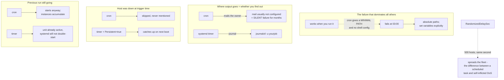

# cron, at and systemd Timers for Scheduled Work

**Level:** Beginner
**Tree:** [Linux Foundations](../README.md)
**Branch:** [Software and Processes](README.md)
**Forest:** [Linux](../../../README.md)

## Explanation

Scheduled work fails in ways interactive work does not, and almost all of it comes down to one thing: **the scheduler does not give your job the environment you tested in.**

**The environment is the first suspect, always.** cron runs with a minimal PATH and none of your shell configuration — no profile, no aliases, no exported variables. A script that works when you run it and fails at 03:00 is usually this, and the fix is to use absolute paths and set what you need explicitly rather than to debug the logic. Anyone who has spent an evening on a scheduled job that "works fine manually" has met this.

**Where the output goes decides whether you find out about failures.** cron mails output to the owner, which on most modern systems means it goes nowhere because mail was never configured. A job can fail every night for months in complete silence. systemd timers write to the journal, so **journalctl -u yourjob** answers the question directly — and that difference alone is a strong reason to prefer them.

**A missed run is handled differently.** If a host is down when cron would have fired, the run is skipped and never mentioned. anacron exists to address this for daily and weekly work. A systemd timer with **Persistent=true** records the last run and catches up on the next boot, which matters for anything whose value is in having run at all rather than in having run at a particular moment.

**Overlap.** cron starts the next run on schedule whether or not the previous one has finished, so a job that occasionally runs long silently accumulates instances until something falls over. A systemd timer triggers a service unit, and systemd will not start a unit that is already active — the overlap problem simply does not exist.

**Timers can be far more expressive.** OnCalendar accepts real calendar expressions; OnBootSec and OnUnitActiveSec express relative schedules cron cannot; and **RandomizedDelaySec** spreads a fleet out so five hundred hosts do not hit the same endpoint at the same second. That last one is the difference between a scheduled task and a self-inflicted denial of service.

**at is for genuinely one-off work** — run this once, later. It shares cron minimal environment, and it runs late rather than skipping if the host was down.

## Architecture and flow



## Commands

### Command 1

Show every timer with its last and next run. The fastest way to see whether a scheduled job is actually firing.

```text
systemctl list-timers --all
```

### Command 2

Validate a calendar expression and see the next few trigger times before deploying it. Cheaper than discovering the schedule was wrong next month.

```text
systemd-analyze calendar "Mon *-*-* 02:30:00"
```

### Command 3

Read a timer job output. This is the capability cron lacks — its output goes to mail that was probably never configured.

```text
journalctl -u backup.service --since "3 days ago"
```

### Command 4

List both user crontabs and system drop-ins. Checking only one is how a scheduled job goes unaccounted for.

```text
crontab -l -u appuser && ls -l /etc/cron.d/
```

### Command 5

Run a script with an empty environment to reproduce how cron will see it. This is the fastest way to confirm an environment problem.

```text
env -i /bin/sh -c "/usr/local/bin/myjob.sh"
```

## Automation scripts

### audit-scheduled-jobs.sh

```bash
#!/usr/bin/env bash
# Inventories scheduled work across BOTH mechanisms and flags the conditions that make a job
# fail silently.
#
# The reason this exists: a cron job that fails every night mails its output to a mail system
# nobody configured, so it is silent for months. Nothing in the default setup tells you.
set -uo pipefail

fail=0

echo "== systemd timers =="
systemctl list-timers --all --no-pager 2>/dev/null | head -25 | sed 's/^/   /'

# A timer whose LAST run is blank has never fired. Usually enabled but not started, which
# looks correct in configuration management and does nothing on the host.
echo
echo "== timers that have never fired =="
never=$(systemctl list-timers --all --no-pager 2>/dev/null | awk '$1 == "n/a" || $3 == "n/a" {print "   " $NF}' || true)
if [ -n "$never" ]; then printf '%s\n' "$never"; echo "   Enabled but never started, or the calendar expression never matches."; fail=1
else echo "   none"; fi

# Failed units behind timers. The timer fires correctly and the service fails - and if you
# only watch the timer, everything looks healthy.
echo
echo "== failed services (may be timer-driven) =="
failed=$(systemctl list-units --state=failed --no-pager --plain 2>/dev/null | awk 'NR>1 && $1 ~ /\.service/ {print "   " $1}' || true)
if [ -n "$failed" ]; then printf '%s\n' "$failed"; fail=1; else echo "   none"; fi

echo
echo "== cron jobs =="
for f in /etc/crontab /etc/cron.d/*; do
  [ -f "$f" ] || continue
  entries=$(grep -vE '^\s*(#|$)' "$f" 2>/dev/null || true)
  [ -n "$entries" ] && { echo "   $f:"; printf '%s\n' "$entries" | sed 's/^/      /'; }
done
while IFS=: read -r user _ uid _ _ _ shell; do
  [ "$uid" -ge 1000 ] || continue
  tab=$(crontab -l -u "$user" 2>/dev/null | grep -vE '^\s*(#|$)' || true)
  [ -n "$tab" ] && { echo "   crontab for $user:"; printf '%s\n' "$tab" | sed 's/^/      /'; }
done < /etc/passwd

# Is anyone able to receive cron output at all?
echo
echo "== can cron output reach a human? =="
if grep -rqE '^\s*MAILTO\s*=\s*[^"\']' /etc/crontab /etc/cron.d 2>/dev/null; then
  echo "   MAILTO is set"
  if ! command -v sendmail >/dev/null 2>&1 && ! systemctl is-active postfix >/dev/null 2>&1; then
    echo "   ...but NO MAIL TRANSPORT IS RUNNING. Output goes nowhere."
    echo "   Any cron job failing here fails SILENTLY."
    fail=1
  fi
else
  echo "   MAILTO not set and no mail transport assumed."
  echo "   cron output is discarded. Prefer systemd timers, whose output lands in the journal."
  fail=1
fi

# Relative paths in a cron entry are the classic environment failure.
echo
echo "== cron entries invoking a relative path =="
rel=$(grep -hoE '^[^#]*\*.*[[:space:]]+[a-zA-Z0-9_.-]+\.sh' /etc/crontab /etc/cron.d/* 2>/dev/null | grep -v '/' || true)
if [ -n "$rel" ]; then
  printf '%s\n' "$rel" | sed 's/^/   /'
  echo "   cron has a minimal PATH. A relative command will usually not be found."
  fail=1
else
  echo "   none obvious"
fi

exit "$fail"
```

## Lab

**Objective:** Produce every scheduled-job failure mode deliberately, then rebuild the job as a systemd timer that cannot fail the same ways.

### Steps

1. Write a script that depends on a command found via your interactive PATH, and confirm it works when run by hand.
2. Schedule it with cron and observe it fail. Reproduce the cause with env -i before changing anything.
3. Fix it with absolute paths and confirm the scheduled run now succeeds.
4. Point MAILTO at a user with no mail transport running and make the job fail. Confirm nothing is reported anywhere.
5. Rebuild the same job as a service unit plus timer, and read its failure with journalctl -u.
6. Give the job a long runtime and a short interval under cron; watch instances accumulate.
7. Do the same with the timer and confirm systemd refuses to start an already-active unit.
8. Stop the host past a trigger time, restart, and compare cron (skipped silently) with a timer using Persistent=true (catches up).
9. Add RandomizedDelaySec and explain what it prevents across a fleet.
10. Run audit-scheduled-jobs.sh and confirm it identifies each condition you created.

### Validation

The environment failure has been reproduced with env -i and fixed, the silent-failure path has been observed first-hand, overlapping runs occur under cron and are prevented under systemd, and the Persistent timer catches up after downtime.

## Operational automation

## Scheduling that reports its own failures

- Prefer systemd timers for anything that matters. Output goes to the journal where it can be queried and alerted on, rather than to mail that was probably never configured.
- Alert on failed units rather than on timers. A timer can fire perfectly while the service it triggers fails every time — watching only the timer shows green.
- Set RandomizedDelaySec on any fleet-wide timer that contacts a shared endpoint. Without it, every host fires at the same second and the scheduled task becomes a load event.
- Use Persistent=true where the value is in having run at all. Without it a missed run during downtime is skipped and never mentioned.
- Test scheduled scripts with env -i in CI. It reproduces the minimal environment the scheduler provides and catches the single most common failure before deployment.
- Inventory both mechanisms. cron entries live in user crontabs, /etc/crontab and /etc/cron.d; checking one place is how a job becomes unaccounted for.

## Troubleshooting

### Scenario 1: A script runs correctly by hand and fails on schedule

**Likely cause:** cron provides a minimal PATH and none of your shell configuration, so commands found interactively are not found.

**Resolution:** Use absolute paths and set required variables explicitly in the script. Reproduce it first with env -i to confirm the cause rather than guessing.

### Scenario 2: A cron job has been failing for months and nobody noticed

**Likely cause:** Output is mailed to the owner and no mail transport is configured, so it is discarded.

**Resolution:** Move to a systemd timer so output lands in the journal, or redirect output to a file that is monitored. Silent failure is the default with cron, not an exception.

### Scenario 3: Multiple instances of the same job are running at once

**Likely cause:** cron starts each run on schedule regardless of whether the previous one finished.

**Resolution:** Use a systemd timer — systemd will not start an already-active unit — or add explicit locking with flock. Under cron the instances accumulate until something breaks.

### Scenario 4: A scheduled job did not run after the host was down at its trigger time

**Likely cause:** cron skips missed runs silently.

**Resolution:** Use a systemd timer with Persistent=true, which records the last run and catches up on next boot.

### Scenario 5: A fleet-wide job overwhelms a shared service every night at the same moment

**Likely cause:** Every host has the same schedule and fires simultaneously.

**Resolution:** Add RandomizedDelaySec to spread execution. This is why timers have the setting and cron needs a manual sleep hack.

## Interview questions

### 1. Why does a script that works by hand fail under cron?

Because cron does not give it the environment you tested in. It runs with a minimal PATH and none of your shell configuration — no profile, no aliases, no exported variables — so commands you found interactively simply are not found. It is the single most common scheduled-job failure, and the fastest way to confirm it is env -i, which reproduces that stripped environment. The fix is absolute paths and explicit variables rather than debugging the script logic, which is where people usually start.

### 2. Why prefer systemd timers over cron?

Four concrete reasons. Output goes to the journal so journalctl -u answers what happened, whereas cron mails output to a system that usually is not configured — meaning failures are silent. Persistent=true catches up a run missed during downtime, which cron skips without mention. systemd will not start an already-active unit, so overlapping runs cannot pile up. And RandomizedDelaySec spreads a fleet so five hundred hosts do not hit the same endpoint simultaneously. cron is still fine for something simple on a host you do not control.

### 3. What is the risk of a job that occasionally runs longer than its interval?

Under cron, the next run starts anyway. Instances accumulate, competing for the same resources and often the same data, until something falls over — and the original cause is well in the past by then, which makes it a genuinely confusing incident. A systemd timer triggers a service unit and systemd refuses to start a unit that is already active, so the situation cannot arise. With cron the mitigation is explicit locking, usually flock.

### 4. You are told a scheduled job runs nightly. How do you verify it actually does?

For a timer, systemctl list-timers shows the last and next run, and journalctl -u shows what happened when it ran; a blank last-run means it has never fired, usually because it was enabled but not started. For cron, check the user crontab, /etc/crontab and /etc/cron.d, then look for evidence it ran — which is the hard part, because if MAILTO goes nowhere there may be no evidence at all. That asymmetry is itself the argument for timers.

## Certification alignment

- RHCSA EX200 - schedule tasks using at and cron; manage systemd timer units
- LPIC-1 - automate system administration tasks by scheduling jobs
- CompTIA Linux+ - task scheduling with cron, at and systemd timers

## References

- Red Hat: Automating system tasks - cron, at and systemd timers
- systemd.timer(5) and systemd.time(7) - OnCalendar, Persistent and RandomizedDelaySec
- crontab(5) and crontab(1) - format, environment and MAILTO behaviour

## Suggested video search

Linux cron crontab systemd timer OnCalendar Persistent RandomizedDelaySec anacron at scheduled jobs

---

> Validate commands, versions, permissions, licensing, and rollback procedures in an isolated lab before production use.
