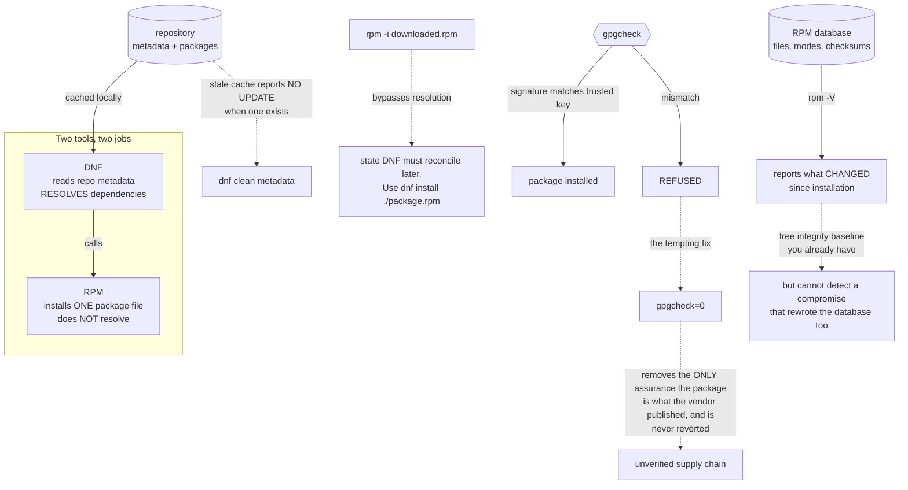

# RPM, DNF, Repositories and Package Verification

**Level:** Beginner
**Tree:** [Linux Foundations](../README.md)
**Branch:** [Software and Processes](README.md)
**Forest:** [Linux](../../../README.md)

## Explanation

A package is not an archive with a nicer name. It carries metadata the system depends on: what it provides, what it requires, which files belong to it and what their contents should be. That last property is the one people forget, and it turns the package database into an integrity baseline you already have and are probably not using.

**RPM and DNF do different jobs.** RPM is the low-level tool: it installs, removes and queries a single package file and it will not resolve dependencies for you — it refuses and tells you what is missing. DNF sits above it, reads repository metadata, resolves the dependency graph and calls RPM to do the work. The practical consequence is that **rpm -i is almost never the right command**. Installing a downloaded RPM directly bypasses dependency resolution and leaves the system in a state DNF must later reconcile; **dnf install ./package.rpm** resolves properly against enabled repositories.

**Repository metadata is a cache, and a stale cache produces confusing failures.** DNF will happily tell you no update is available because it is reading metadata from before the update was published. When behaviour makes no sense, refresh the cache before investigating anything else.

**GPG verification is the control that matters and the one most often disabled.** A repository definition carries gpgcheck and a key. With verification on, a package whose signature does not match the trusted key is refused. Setting gpgcheck=0 to make an installation work removes the only assurance that the package is what the vendor published — and it is usually done once, under time pressure, and never reverted. If a signature fails, the correct response is to find out why, not to switch off the check.

**rpm -V is underused.** It compares installed files against the package database and reports what changed: size, mode, checksum, ownership, timestamp. It will not detect a compromise that also rewrote the database, so it is not a substitute for a real integrity tool — but for answering "has anyone edited this binary or configuration file since installation" it is immediate, free and already installed.

**Version locking and module streams** exist because sometimes the newest package is the wrong one. Locking a version is legitimate; doing it without recording why creates a package that silently stops receiving security updates.

## Architecture and flow



## Commands

### Command 1

Install a downloaded RPM through DNF so dependencies resolve. Using rpm -i instead bypasses resolution and leaves state DNF must reconcile later.

```text
dnf install ./package.rpm
```

### Command 2

Refresh the repository cache. A stale cache is the usual reason DNF reports no update when one has been published.

```text
dnf clean metadata && dnf check-update
```

### Command 3

Verify installed files against the package database. Output flags what changed — S size, M mode, 5 checksum, U owner, T time.

```text
rpm -V httpd
```

### Command 4

Identify which package owns a file, then read its metadata including the signing key. The fastest way to answer where a mystery binary came from.

```text
rpm -qf /usr/sbin/sshd && rpm -qi openssh-server
```

### Command 5

List installed packages carrying no signature — each is something installed outside the verified path.

```text
rpm -qa --qf "%{NAME} %{SIGPGP:pgpsig}\n" | grep -i "none"
```

### Command 6

Show what a package actually pulls in before installing it, rather than discovering the dependency tree afterwards.

```text
dnf repoquery --requires --resolve httpd
```

## Automation scripts

### verify-packages.sh

```bash
#!/usr/bin/env bash
# Uses the package database as an integrity baseline - one you already have and probably are
# not using.
#
# Scope honestly: rpm -V compares files against the RPM database, so it cannot detect a
# compromise that also rewrote that database. It is not a substitute for AIDE or a real FIM.
# What it IS good for is answering, immediately and for free, "has anyone changed this binary
# or configuration file since it was installed".
set -uo pipefail

fail=0

# 1. Repositories with verification disabled. gpgcheck=0 is normally set once under time
#    pressure to make an install work, and then never reverted - so it is worth reporting
#    every time rather than assuming someone will remember.
echo "== repositories with GPG verification disabled =="
nogpg=$(grep -rlE '^\s*gpgcheck\s*=\s*0' /etc/yum.repos.d/ 2>/dev/null || true)
if [ -n "$nogpg" ]; then
  printf '%s\n' "$nogpg" | sed 's/^/   /'
  echo "   Packages from these repos are installed WITHOUT verifying they are what the"
  echo "   vendor published."
  fail=1
else
  echo "   none - all repositories verify signatures"
fi

# 2. Installed packages with no signature at all.
echo
echo "== installed packages carrying no signature =="
unsigned=$(rpm -qa --qf '%{NAME}|%{SIGPGP:pgpsig}\n' 2>/dev/null | awk -F\| '$2 == "(none)" {print "   " $1}')
if [ -n "$unsigned" ]; then
  printf '%s\n' "$unsigned" | head -20
  echo "   Each was installed outside the verified path - locally built, or gpgcheck bypassed."
  fail=1
else
  echo "   none"
fi

# 3. Modified files. Configuration drift is expected and marked (c); a changed BINARY is not.
echo
echo "== modified files, excluding configuration =="
modified=$(rpm -Va --nofiles --noscripts 2>/dev/null | grep -vE '^\.{8}\s+c ‌' | grep -E '^..5' || true)
if [ -n "$modified" ]; then
  printf '%s\n' "$modified" | head -25 | sed 's/^/   /'
  echo "   A 5 in column 3 means the CHECKSUM changed. On a binary that warrants explanation."
  fail=1
else
  echo "   no non-configuration files differ from their package"
fi

# 4. Version locks. Legitimate, but a lock with no recorded reason becomes a package that
#    silently stops receiving security updates.
echo
echo "== version locks =="
if [ -f /etc/dnf/plugins/versionlock.list ] && [ -s /etc/dnf/plugins/versionlock.list ]; then
  sed 's/^/   /' /etc/dnf/plugins/versionlock.list
  echo "   Each lock should have a recorded reason and a review date - otherwise it is a"
  echo "   package quietly excluded from patching."
else
  echo "   none"
fi

# 5. Is the metadata cache fresh enough to trust what dnf reports?
echo
echo "== metadata freshness =="
newest=$(find /var/cache/dnf -name '*.solv' -printf '%T@\n' 2>/dev/null | sort -rn | head -1)
if [ -n "${newest:-}" ]; then
  age=$(( ( $(date +%s) - ${newest%.*} ) / 86400 ))
  echo "   cache is ${age} day(s) old"
  [ "$age" -gt 7 ] && echo "   Older than a week: dnf may report no updates when some exist."
else
  echo "   no cache found - run dnf makecache"
fi

exit "$fail"
```

## Lab

**Objective:** Use the package system as both an installation mechanism and an integrity baseline, and observe what breaks when verification is bypassed.

### Steps

1. Install a package with dnf and confirm its signature was verified.
2. Download the same package and install it with rpm -i, observing the dependency behaviour differ.
3. Remove it and reinstall with dnf install ./package.rpm, confirming dependencies resolve.
4. Modify a binary belonging to an installed package, then find the change with rpm -V and read the flag columns.
5. Modify a configuration file belonging to the same package and note that it is flagged differently — configuration drift is expected and marked.
6. Set gpgcheck=0 on a test repository, install an unsigned package, then find it with the audit script.
7. Restore gpgcheck=1 and confirm the unsigned package is now refused.
8. Apply a version lock, then confirm the package is excluded from an update run.
9. Let the metadata cache go stale and observe DNF reporting no available update when one exists.

### Validation

A modified binary is detected by rpm -V and distinguished from expected configuration drift, an unsigned package is refused once verification is restored, and the version lock demonstrably excludes a package from patching.

## Operational automation

## Package hygiene worth automating

- Report repositories with gpgcheck=0 on a schedule. It is normally set once to make an installation work and then never reverted, so a point-in-time review will miss it.
- Run rpm -Va periodically and diff against the previous run. Changes to configuration files are expected; a changed binary checksum needs an explanation, and the diff is what separates the two.
- Treat version locks as expiring. Require a recorded reason and a review date — an unreviewed lock is a package silently excluded from security updates, which is the opposite of what the person applying it intended.
- Refresh metadata before any patch assessment. A stale cache produces a confident and wrong answer about what needs updating.
- Build local packages rather than copying binaries into place. A package brings dependency metadata, file ownership and a verification baseline; a copied binary brings none of those and is invisible to every check above.
- Understand rpm -V limits before relying on it: it cannot detect a compromise that also rewrote the RPM database. Use it as a fast first-pass, not as file integrity monitoring.

## Troubleshooting

### Scenario 1: DNF reports no updates available but an update was definitely published

**Likely cause:** The repository metadata cache is stale, so DNF is answering from old information.

**Resolution:** Run dnf clean metadata then dnf check-update. Refresh the cache before investigating anything else when DNF behaviour makes no sense.

### Scenario 2: A package fails to install with a GPG signature error

**Likely cause:** The signing key is not imported, or the package genuinely is not signed by the expected key.

**Resolution:** Import the correct key and retry. Do not set gpgcheck=0 — that removes the only assurance the package is what the vendor published, and it is almost never reverted afterwards.

### Scenario 3: rpm -i failed with unresolved dependencies

**Likely cause:** RPM does not resolve dependencies; it reports what is missing and stops. That is by design.

**Resolution:** Use dnf install ./package.rpm so the dependency graph is resolved against enabled repositories.

### Scenario 4: rpm -V reports many changed files after a legitimate configuration change

**Likely cause:** Configuration files are expected to differ and are flagged as such; the tool reports everything and leaves interpretation to you.

**Resolution:** Filter for checksum changes on non-configuration files. A changed binary is the finding; a changed config file usually is not.

### Scenario 5: A package will not update and no error is shown

**Likely cause:** A version lock is excluding it from the transaction.

**Resolution:** Check the versionlock list. Locks are legitimate but need a recorded reason — an unreviewed one silently removes a package from patching.

## Interview questions

### 1. What is the difference between RPM and DNF, and when does it matter?

RPM is the low-level tool that installs, removes and queries a single package. It does not resolve dependencies — it tells you what is missing and stops. DNF sits above it, reads repository metadata, resolves the dependency graph and calls RPM. It matters most when installing a downloaded package: rpm -i bypasses resolution and leaves the system in a state DNF has to reconcile later, whereas dnf install ./package.rpm resolves properly against enabled repositories. That is why rpm -i is almost never the right command even though it looks like the direct one.

### 2. Why is setting gpgcheck=0 a bad idea, given it makes the installation work?

Because it removes the only assurance that the package is what the vendor published. Signature verification is what stands between your estate and a substituted or tampered package, and disabling it converts a supply-chain control into nothing. The practical problem is that it is set once, under time pressure, to unblock an installation, and then never reverted — so a temporary bypass becomes the permanent posture. When a signature fails, the right response is to find out why: usually a missing key, occasionally a genuinely unsigned package that deserves scrutiny.

### 3. What can rpm -V tell you, and what can it not?

It compares installed files against the RPM database and reports what changed — size, mode, checksum, ownership, timestamp. That answers "has anyone edited this binary or config since installation" immediately, for free, using something already installed. What it cannot do is detect a compromise that also rewrote the RPM database, since the database is its reference. So it is an excellent fast first pass and not a substitute for real file integrity monitoring with an offline baseline, and treating it as the latter is the mistake worth avoiding.

### 4. When is a version lock appropriate, and what does it cost?

When a newer package is known to break something — a driver incompatibility, an application with a hard version dependency. The cost is that the locked package stops receiving updates, including security ones, and that consequence is invisible: dnf simply does not offer it. So a lock without a recorded reason and a review date is a package quietly excluded from patching, which is rarely what the person applying it intended. Lock deliberately, document it, and review on a cadence.

## Certification alignment

- RHCSA EX200 - install and update software packages from repositories and the filesystem
- LPIC-1 - RPM and package management, dependency resolution and verification
- CompTIA Linux+ - software management, repositories and package integrity

## References

- Red Hat: Managing software with the DNF tool
- rpm(8) and dnf(8) man pages - query formats, verification flags and repoquery
- Red Hat: package signing and GPG key management for repositories

## Suggested video search

RPM DNF package management repository metadata gpgcheck signature verification rpm -V version lock

---

> Validate commands, versions, permissions, licensing, and rollback procedures in an isolated lab before production use.
