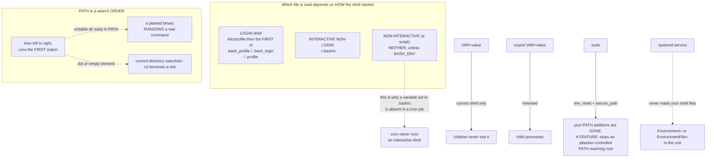

# Shell Environment, PATH and Environment Variables

**Level:** Beginner
**Tree:** [Linux Foundations](../README.md)
**Branch:** [Software and Processes](README.md)
**Forest:** [Linux](../../../README.md)

## Explanation

The shell environment explains a whole category of problems that otherwise look inexplicable: the command that works for you and not for a colleague, the script that behaves differently under sudo, the service that cannot find a binary that is plainly installed.

**PATH is a search order, and order is the security property.** The shell tries each directory left to right and runs the first match. A writable directory early in PATH means someone can place a binary that shadows a real command — and a dot or an empty element in PATH means the current directory is searched, which turns changing into a directory into a risk. Neither is hypothetical; both are standard findings.

**Which file is read depends on how the shell started, and this is where most confusion lives.** A LOGIN shell reads /etc/profile and then the first of ~/.bash_profile, ~/.bash_login or ~/.profile that exists — only the first. An INTERACTIVE NON-LOGIN shell reads ~/.bashrc. A NON-INTERACTIVE shell — which is what a script runs in — reads neither unless BASH_ENV is set. That is why exporting a variable in .bashrc and finding it absent in a cron job is not a mystery: cron never runs an interactive shell.

**Exported and non-exported are different things.** A variable set without export exists only in the current shell; child processes never see it. export puts it in the environment that children inherit. Most reports of a variable being set but not visible are this.

**sudo deliberately resets the environment.** env_reset is the default, and PATH is replaced with secure_path from sudoers. So a command that works for you can fail under sudo because your PATH additions are gone — and that is a security feature, not a bug: inheriting an attacker-controlled PATH into a root context is exactly what secure_path prevents. Use sudo -E only when you understand precisely what you are letting through.

**Services do not read your shell files at all.** A systemd unit gets the environment defined in the unit, plus a minimal default. Setting something in .bashrc and expecting a service to inherit it will never work; Environment= or EnvironmentFile= in the unit is the answer.

**Secrets do not belong in the environment.** They appear in the process environment, which other processes can often read, and in shell history when set interactively.

## Architecture and flow



## Commands

### Command 1

Read PATH as an ordered list. Order is what decides which binary runs, and a writable directory early in it is a shadowing risk.

```text
echo "$PATH" | tr : '\n' | nl
```

### Command 2

Show every match in PATH order, not just the first. This is how you find out you have been running a different binary than you assumed.

```text
type -a python3 && command -v python3
```

### Command 3

Compare PATH under sudo against your own. They differ because sudo applies secure_path — the usual reason a command works for you and fails under sudo.

```text
sudo printenv PATH && printenv PATH
```

### Command 4

See the environment a non-interactive context actually gets. This is what a script or cron job runs with.

```text
env -i /bin/bash --noprofile --norc -c 'echo "$PATH"'
```

### Command 5

Read the environment a service actually receives. It does not inherit your shell configuration, however it is set.

```text
systemctl show myservice -p Environment
```

### Command 6

Find writable PATH directories — each is a place someone could plant a binary that shadows a real command.

```text
tr ':' '\n' <<< "$PATH" | while read -r d; do [ -w "$d" ] && echo "WRITABLE: $d"; done
```

## Automation scripts

### audit-path-security.sh

```bash
#!/usr/bin/env bash
# Audits PATH and shell startup configuration for the conditions that let one binary be
# silently substituted for another.
#
# The premise: PATH is a SEARCH ORDER and the shell runs the first match. So the security
# question is not which directories are in PATH, it is which of them someone else can write
# to, and whether they come before the real ones.
set -uo pipefail

fail=0
TARGET_USER="${1:-$(whoami)}"

echo "== PATH, in search order =="
i=0
IFS=: read -ra dirs <<< "$PATH"
for d in "${dirs[@]}"; do
  i=$((i+1))
  note=""
  if [ -z "$d" ] || [ "$d" = "." ]; then
    note="  <-- CURRENT DIRECTORY IN PATH: cd into a directory and its binaries become runnable"
    fail=1
  elif [ -d "$d" ] && [ -w "$d" ] && [ "$(stat -c %U "$d")" != "$(whoami)" ]; then
    note="  <-- WRITABLE BY YOU BUT OWNED BY $(stat -c %U "$d")"
    fail=1
  elif [ -d "$d" ] && [ "$(stat -c %a "$d" | cut -c3)" -ge 2 ] 2>/dev/null; then
    note="  <-- WORLD-WRITABLE: anyone can plant a binary here"
    fail=1
  fi
  printf '   %2d  %-40s%s\n' "$i" "$d" "$note"
done

# Shadowing: the same command name resolvable in more than one PATH directory. Whichever is
# earlier wins, and nothing warns you.
echo
echo "== commands resolvable in more than one PATH directory =="
shadowed=0
for cmd in python python3 pip sudo ssh curl wget systemctl dnf; do
  hits=$(type -a "$cmd" 2>/dev/null | awk '/is \//{print $NF}' | sort -u)
  count=$(printf '%s\n' "$hits" | grep -c . || true)
  if [ "$count" -gt 1 ]; then
    echo "   $cmd:"
    printf '%s\n' "$hits" | sed 's/^/      /'
    echo "      the FIRST in PATH order wins"
    shadowed=1
  fi
done
[ "$shadowed" -eq 0 ] && echo "   none among common commands"

# sudo resets the environment on purpose. Reporting the difference prevents the recurring
# "works for me, fails under sudo" confusion.
echo
echo "== PATH under sudo versus your own =="
mine="$PATH"
theirs=$(sudo printenv PATH 2>/dev/null || echo "(cannot determine)")
if [ "$mine" != "$theirs" ]; then
  echo "   yours : $mine"
  echo "   sudo  : $theirs"
  echo "   They differ because of secure_path in sudoers. This is a FEATURE - it stops an"
  echo "   attacker-controlled PATH reaching a root context - and it is why a command that"
  echo "   works for you can fail under sudo."
fi

# Which startup files exist. Only the FIRST of the login-shell candidates is read, so having
# more than one is a reliable source of confusion.
echo
echo "== shell startup files for $TARGET_USER =="
home=$(getent passwd "$TARGET_USER" | cut -d: -f6)
found=0
for f in .bash_profile .bash_login .profile; do
  if [ -f "$home/$f" ]; then
    found=$((found+1))
    if [ "$found" -eq 1 ]; then echo "   $f  <-- READ (first match wins)"; else echo "   $f  <-- IGNORED for login shells"; fi
  fi
done
[ -f "$home/.bashrc" ] && echo "   .bashrc  <-- read by interactive NON-login shells only"
if [ "$found" -gt 1 ]; then
  echo "   More than one login-shell file exists. Only the first is read; edits to the others"
  echo "   appear to do nothing, which is a durable source of confusion."
  fail=1
fi

exit "$fail"
```

## Lab

**Objective:** Establish exactly which configuration file applies in each shell context, and demonstrate PATH shadowing as both a debugging story and a security one.

### Steps

1. Add a distinct marker to /etc/profile, ~/.bash_profile and ~/.bashrc, then open a login shell, a non-login interactive shell, and run a script — recording which markers appear in each.
2. Create both ~/.bash_profile and ~/.profile, put different markers in each, and confirm only the first is read.
3. Set a variable without export and confirm a child process cannot see it. Export it and confirm it can.
4. Place a directory you control early in PATH, put a script named ls in it, and observe it run instead of the real command.
5. Explain from the PATH order why that happened, then remove it.
6. Compare printenv PATH with sudo printenv PATH and locate secure_path in sudoers.
7. Set a variable in ~/.bashrc, then start a systemd service that echoes it, and confirm the service does not see it.
8. Set it correctly with Environment= in the unit and confirm the service now sees it.
9. Run audit-path-security.sh and confirm it reports the writable directory and the shadowed command.

### Validation

You can state which files are read in each of the three shell contexts, PATH shadowing has been demonstrated and explained from search order, and the service picks up its variable only from the unit rather than from any shell file.

## Operational automation

## Environment as a controlled property

- Audit PATH for writable and world-writable directories on a schedule. A writable directory ahead of /usr/bin is a supply-chain problem on the host itself, and it is invisible unless you look.
- Never rely on shell startup files for service configuration. Services get their environment from the unit; anything set in .bashrc is guaranteed not to reach them, and the failure looks like a missing package rather than a configuration error.
- Keep secure_path in sudoers and resist sudo -E as a habit. The environment reset is what prevents an attacker-controlled PATH being carried into a root context.
- Set variables explicitly in scripts rather than inheriting them. A script that depends on the caller environment works in testing and fails under cron, systemd and CI — three contexts that each provide something different.
- Keep secrets out of environment variables where you can. They are visible in the process environment, often readable by other processes, and they end up in shell history when set interactively.
- Standardise on one login-shell startup file per user. Only the first of .bash_profile, .bash_login and .profile is read, so having several produces edits that silently do nothing.

## Troubleshooting

### Scenario 1: A variable set in ~/.bashrc is not visible to a script or a cron job

**Likely cause:** .bashrc is read only by interactive non-login shells. Scripts and cron run non-interactive shells that read neither .bashrc nor the profile files.

**Resolution:** Set it explicitly in the script, or in the systemd unit for a service. Expecting a scheduled job to inherit interactive shell configuration will never work.

### Scenario 2: A command works normally and fails under sudo

**Likely cause:** sudo resets the environment and replaces PATH with secure_path from sudoers, so directories you added are gone.

**Resolution:** Use the absolute path to the command, or add the directory to secure_path if it is genuinely appropriate. Reaching for sudo -E should be deliberate — it carries your environment into a root context.

### Scenario 3: Editing ~/.profile appears to have no effect

**Likely cause:** A ~/.bash_profile also exists, and only the first matching login-shell file is read.

**Resolution:** Consolidate into one file. Having several is a durable source of confusion because the ignored file looks perfectly correct.

### Scenario 4: A systemd service cannot find a binary that is definitely installed

**Likely cause:** The service environment has a minimal PATH and does not include directories from the interactive shell configuration.

**Resolution:** Use an absolute path in ExecStart, or set PATH explicitly with Environment= in the unit.

### Scenario 5: A user ran a different binary than they intended

**Likely cause:** PATH shadowing — an earlier directory contains a binary with the same name, and the shell runs the first match.

**Resolution:** Use type -a to see every match in order. Audit PATH for writable directories, since this is also the mechanism behind a deliberate substitution.

## Interview questions

### 1. Which startup files does bash read, and when?

It depends on how the shell started. A login shell reads /etc/profile and then the FIRST of ~/.bash_profile, ~/.bash_login or ~/.profile that exists — only the first, which is why editing the wrong one appears to do nothing. An interactive non-login shell reads ~/.bashrc. A non-interactive shell, which is what a script runs in, reads none of them unless BASH_ENV is set. That last case explains a whole class of confusion: a variable exported in .bashrc is simply absent in a cron job, because cron never runs an interactive shell.

### 2. Why is a writable directory early in PATH a security problem?

Because PATH is a search order and the shell runs the first match. If someone can write to a directory that appears before /usr/bin, they can place a binary named ls or sudo there and it will run instead of the real one, with the privileges of whoever invoked it. A dot or an empty element in PATH is the same problem in a subtler form — it means the current directory is searched, so simply changing into a directory someone else controls becomes a risk. Both are standard audit findings rather than theoretical concerns.

### 3. Why does sudo change PATH, and when should you override it?

sudo applies env_reset and replaces PATH with secure_path from sudoers, so directories you added are not carried into the root context. That is deliberate: inheriting an attacker-controlled PATH into a root session is precisely the attack secure_path prevents. It is also the usual reason a command that works for you fails under sudo. Overriding it with sudo -E should be a considered decision about specific variables, not a reflex — the safer fix is an absolute path, or adding the directory to secure_path if it genuinely belongs there.

### 4. A service cannot find a binary that is installed. What is going on?

Almost always the service environment. A systemd unit does not read the user shell configuration at all — it gets a minimal default plus whatever the unit declares. So a PATH addition in .bashrc, which makes the command work perfectly in a terminal, has no effect on the service. The fix is an absolute path in ExecStart or an explicit Environment= in the unit. It presents as a missing package, which is why it wastes time.

## Certification alignment

- RHCSA EX200 - configure the shell environment and manage environment variables
- LPIC-1 - customise and use the shell environment, profile files and PATH
- CompTIA Linux+ - shell configuration, environment variables and user profiles

## References

- bash(1) - INVOCATION section, which defines exactly which startup files are read when
- Red Hat: Configuring the shell environment and using environment variables
- sudoers(5) - env_reset and secure_path

## Suggested video search

Linux shell environment PATH bashrc bash_profile login non-login export sudo secure_path systemd Environment

---

> Validate commands, versions, permissions, licensing, and rollback procedures in an isolated lab before production use.
