# Linux Processes Signals systemd Job Control and Process Troubleshooting

**Level:** Beginner
**Tree:** [Linux Foundations](../README.md)
**Branch:** [Software and Processes](README.md)
**Forest:** [Linux](../../../README.md)

## Explanation

# Processes, Signals and Job Control

Every running thing on a Linux system is a process with a parent, and understanding **why a process is in the state it is in** answers most day-to-day questions.

## Process state is the first thing to read

The state column in **ps** is more informative than people use it for:

- **R** running or runnable — competing for CPU.
- **S** interruptible sleep — waiting for something, and can be woken. The normal state for almost everything.
- **D** uninterruptible sleep — waiting on I/O and **cannot be killed**. A process stuck in D is a storage or filesystem problem, not a process problem.
- **Z** zombie — finished, but the parent has not reaped it. Zombies consume a process table entry and nothing else.
- **T** stopped, usually by a signal.

**The D state is the one that changes your diagnosis.** No signal will terminate it, including SIGKILL, so a hung process in D means looking at the storage path rather than trying harder to kill it.

## Signals, and why kill -9 is the wrong reflex

**SIGTERM (15)** asks a process to stop and can be handled, so the process closes files, flushes buffers and exits cleanly. **SIGKILL (9)** cannot be caught, blocked or ignored — the kernel destroys the process immediately.

That difference is the whole argument: **SIGKILL loses whatever the process had not yet written**. Reaching for it first turns a graceful shutdown into potential data loss, and it is a habit rather than a decision.

Other signals worth knowing: **SIGHUP (1)** conventionally means reload configuration, which is how many daemons re-read config without restarting. **SIGSTOP** and **SIGCONT** suspend and resume, which is how job control works.

## Zombies and orphans are different problems

A **zombie** has exited and its parent has not called wait to collect the exit status. You cannot kill a zombie — it is already dead. **The fix is the parent**, and if the parent is defective the zombie clears when the parent exits and init reaps it.

An **orphan** is a live process whose parent died; init adopts it. That is normal and harmless.

A large and growing zombie count is a defect in a specific parent process, and it matters because the process table is finite.

## systemd changed what a process belongs to

Under systemd every service runs in a **cgroup**, and that has practical consequences the classic model does not.

**systemctl status** shows the whole process tree for a unit, not just the main PID. **Killing the main process does not stop the service** — systemd restarts it according to the restart policy, which surprises people debugging. And a runaway child is contained by the unit resource limits rather than affecting the whole system.

So on a modern system the question is usually *what unit does this process belong to*, and **systemd-cgls** answers it directly.

## Job control is for interactive work and is misused for services

**Ctrl-Z** suspends, **bg** resumes in background, **fg** foreground, **jobs** lists. Backgrounding with **&** and detaching with **nohup** or **disown** keeps a process alive past logout.

That is fine for a long-running command and wrong for anything that should survive a reboot — which is what a systemd unit is for. A process started with nohup is invisible to the service manager and nothing restarts it.

## Architecture and flow

```mermaid
flowchart TD
    P["Every running thing is a process with a parent"] --> P1["Why it is in the state it is in answers most questions"]
    S["PROCESS STATE - read it first"] --> S1["R running or runnable - competing for CPU"]
    S --> S2["S interruptible sleep - waiting, wakeable. Normal."]
    S --> S3["D UNINTERRUPTIBLE sleep - waiting on I/O"]
    S3 --> S3a["CANNOT BE KILLED, not even by SIGKILL"]
    S3a --> S3b["A storage or filesystem problem, not a process problem"]
    S3b --> S3c["Changes your diagnosis - stop trying to kill it"]
    S --> S4["Z zombie - finished, parent has not reaped it"]
    S --> S5["T stopped, usually by a signal"]
    G{"Signals - why kill -9 is the wrong reflex"} --> G1["SIGTERM 15 - asks, and CAN BE HANDLED"]
    G1 --> G1a["Process closes files, flushes buffers, exits cleanly"]
    G --> G2["SIGKILL 9 - cannot be caught, blocked or ignored"]
    G2 --> G2a["Kernel destroys the process immediately"]
    G2a --> G2b["LOSES whatever had not been written"]
    G2b --> G2c["Reaching for it first is a habit, not a decision"]
    G --> G3["SIGHUP 1 - conventionally RELOAD CONFIG"]
    G --> G4["SIGSTOP and SIGCONT - how job control works"]
    Z["Zombies and orphans differ"] --> Z1["ZOMBIE - exited, parent never called wait"]
    Z1 --> Z2["You cannot kill it - it is already dead"]
    Z2 --> Z3["The fix is the PARENT"]
    Z3 --> Z4["Clears when the parent exits and init reaps it"]
    Z --> Z5["ORPHAN - live process whose parent died; init adopts it"]
    Z5 --> Z6["Normal and harmless"]
    Z --> Z7["Growing zombie count = a defect in one parent"]
    Z7 --> Z8["Matters because the process table is finite"]
    Y["systemd changed what a process BELONGS TO"] --> Y1["Every service runs in a CGROUP"]
    Y1 --> Y2["systemctl status shows the whole TREE, not just main PID"]
    Y1 --> Y3["Killing the main process does NOT stop the service"]
    Y3 --> Y4["systemd restarts it per the restart policy"]
    Y4 --> Y5["Which surprises people debugging"]
    Y1 --> Y6["A runaway child is contained by unit resource limits"]
    Y --> Y7["Modern question: what UNIT does this belong to?"]
    Y7 --> Y8["systemd-cgls answers it directly"]
    J["Job control is for INTERACTIVE work"] --> J1["Ctrl-Z suspend · bg · fg · jobs"]
    J --> J2["nohup and disown survive logout"]
    J2 --> J3["Fine for a long command"]
    J3 --> J4["WRONG for anything that should survive a reboot"]
    J4 --> J5["A nohup process is invisible to the service manager"]
    J5 --> J6["Nothing restarts it - that is what a unit is for"]
```



## Commands

### Command 1

Show process state and what each is waiting on, which is where diagnosis actually starts

```text
ps -eo pid,ppid,stat,wchan:20,comm --sort=-pcpu | head -20
```

### Command 2

Find processes in uninterruptible sleep, which cannot be killed and indicate a storage problem

```text
ps -eo pid,stat,comm | awk '$2 ~ /^D/ {print}'
```

### Command 3

List zombies and identify the parent responsible, since the parent is the thing to fix

```text
ps -eo pid,ppid,stat,comm | awk '$3 ~ /Z/ {print}'; ps -eo ppid --no-headers | sort | uniq -c | sort -rn | head -5
```

### Command 4

Read the whole process tree for a unit rather than a single PID, which is what the cgroup model gives you

```text
systemctl status nginx --no-pager | head -20
```

### Command 5

Show which unit each process belongs to, the question that matters on a modern system

```text
systemd-cgls --no-pager | head -30
```

### Command 6

Send SIGTERM and allow the process to exit cleanly before escalating, since SIGKILL loses unwritten data

```text
kill -TERM PID; sleep 5; ps -p PID >/dev/null && echo "still running, now consider SIGKILL"
```

### Command 7

Read the restart policy, which explains why killing the main process does not stop the service

```text
systemctl show nginx -p Restart,RestartSec,MainPID
```

## Automation scripts

### triage-process-states.sh

```bash
#!/usr/bin/env bash
# Triages process state and reports the three findings that change what you should do next,
# rather than listing the top CPU consumers.
#
#   1. D STATE (uninterruptible sleep). These processes are waiting on I/O and CANNOT be
#      killed - not by SIGTERM, not by SIGKILL. A hung process in D is a storage or
#      filesystem problem, so the answer is to look at the storage path rather than to try
#      harder to kill it. This is the single most useful state to recognise.
#   2. ZOMBIES. Already dead; you cannot kill them. The fix is the PARENT, which has not
#      called wait to collect the exit status. A growing count is a defect in one specific
#      parent, and it matters because the process table is finite.
#   3. PROCESSES OUTSIDE ANY SYSTEMD UNIT. Started with nohup or disown, these survive
#      logout and are invisible to the service manager - nothing restarts them and nothing
#      limits them. Fine for a long-running command, wrong for anything that should survive
#      a reboot.

set -o nounset
set -o pipefail

findings=0

printf 'PROCESS STATE TRIAGE\n\n'

# --- 1. uninterruptible sleep ----------------------------------------------------------
printf 'UNINTERRUPTIBLE SLEEP (D)\n'
d_procs=$(ps -eo pid,stat,wchan:24,comm --no-headers | awk '$2 ~ /^D/')
if [ -n "$d_procs" ]; then
    printf '%s\n' "$d_procs" | sed 's/^/  /'
    printf '  These cannot be killed by any signal. The wchan column shows what they are\n'
    printf '  waiting on - investigate the storage path, not the process.\n'
    for m in $(awk '$3 ~ /^(nfs|nfs4|cifs|fuse)/ {print $2}' /proc/mounts 2>/dev/null); do
        printf '  network filesystem mounted at %s - a common cause of D state\n' "$m"
    done
    findings=$((findings + 1))
else
    printf '  none\n'
fi

# --- 2. zombies --------------------------------------------------------------------------
printf '\nZOMBIES\n'
zombies=$(ps -eo pid,ppid,stat,comm --no-headers | awk '$3 ~ /Z/')
zcount=$(printf '%s' "$zombies" | grep -c . || true)
if [ "$zcount" -gt 0 ]; then
    printf '  %s zombie(s)\n' "$zcount"
    printf '%s\n' "$zombies" | head -10 | sed 's/^/    /'
    printf '  Parents responsible:\n'
    printf '%s\n' "$zombies" | awk '{print $2}' | sort | uniq -c | sort -rn | head -5 |
        while read -r n ppid; do
            pname=$(ps -p "$ppid" -o comm= 2>/dev/null || echo '(gone)')
            printf '    pid %-8s %-20s %s zombie(s)\n' "$ppid" "$pname" "$n"
        done
    printf '  You cannot kill a zombie - it is already dead. Fix or restart the PARENT.\n'
    if [ "$zcount" -gt 100 ]; then
        printf '  OVER 100 - the process table is finite and this will eventually exhaust it.\n'
    fi
    findings=$((findings + 1))
else
    printf '  none\n'
fi

# --- 3. processes outside a systemd unit --------------------------------------------------
printf '\nOUTSIDE ANY SYSTEMD UNIT\n'
if [ -d /sys/fs/cgroup ] && command -v systemctl >/dev/null 2>&1; then
    orphaned=0
    for pid in $(ps -eo pid --no-headers); do
        [ -r "/proc/$pid/cgroup" ] || continue
        cg=$(cat "/proc/$pid/cgroup" 2>/dev/null | head -1)
        case $cg in
            *".service"*|*".scope"*|*".slice"*) continue ;;
        esac
        ppid=$(awk '/^PPid:/ {print $2}' "/proc/$pid/status" 2>/dev/null)
        [ "${ppid:-1}" = '2' ] && continue   # kernel thread
        comm=$(tr -d '\0' < "/proc/$pid/comm" 2>/dev/null)
        printf '    pid %-8s %s\n' "$pid" "${comm:-?}"
        orphaned=$((orphaned + 1))
        [ "$orphaned" -ge 10 ] && break
    done
    if [ "$orphaned" -eq 0 ]; then
        printf '  none - every user process belongs to a unit\n'
    else
        printf '  These are invisible to the service manager. Nothing restarts them, nothing\n'
        printf '  applies resource limits to them, and they will not come back after a\n'
        printf '  reboot. If any of them matters, it should be a systemd unit.\n'
        findings=$((findings + 1))
    fi
else
    printf '  systemd not present - skipping\n'
fi

printf '\nWhen you do need to stop something, send SIGTERM first and give it time. SIGKILL\n'
printf 'cannot be caught, so the process loses whatever it had not yet written - and note\n'
printf 'that for a systemd service, killing the main process does not stop the service at\n'
printf 'all. systemd restarts it according to the restart policy. Use systemctl stop.\n'

[ "$findings" -gt 0 ] && exit 1
exit 0
```

## Lab

**Objective:** Observe each process state deliberately and demonstrate why the D state and the systemd restart policy change what an operator should do.

### Steps

1. Start a CPU-bound process and confirm its state is R.
2. Start a process waiting on input and confirm its state is S.
3. Create a process blocked on a stalled network filesystem and observe the D state.
4. Attempt to kill the D-state process with SIGTERM and then SIGKILL, and record the result.
5. Write a parent that forks a child and never calls wait, then confirm the zombie appears.
6. Attempt to kill the zombie and record what happens.
7. Kill the parent instead and confirm the zombie clears.
8. Start a systemd service, kill its main PID, and observe whether the service stops.
9. Read the restart policy and explain the behaviour.
10. Start a process with nohup and confirm it belongs to no systemd unit.

### Validation

The D-state process survives SIGKILL, demonstrating it cannot be signalled.,The zombie cannot be killed and clears only when the parent exits.,Killing the main PID of a service does not stop it, and the restart policy explains why.,The nohup process is shown to be outside any unit and therefore unmanaged.

## Operational automation

## Automating process hygiene

**Alert on D-state processes lasting more than a short interval.** They cannot be killed and they indicate a storage or filesystem problem, so treating them as a process alert sends people to the wrong place.

**Track zombie count as a trend per parent.** A few zombies are noise; a growing count from one parent is a specific defect, and the process table is finite so it eventually matters.

**Detect user processes outside any systemd unit.** Anything started with nohup is invisible to the service manager, unrestartable and unlimited — which is fine for a command and wrong for anything load-bearing.

**Never automate SIGKILL as a first action.** A watchdog that escalates straight to SIGKILL converts a slow shutdown into data loss, and the cost is invisible until it matters.

## Troubleshooting

### Scenario 1: A process cannot be killed even with SIGKILL

**Likely cause:** It is in uninterruptible sleep waiting on I/O, and no signal is delivered in that state

**Resolution:** Investigate the storage path — a stalled network filesystem is the usual cause; the process is a symptom rather than the problem

### Scenario 2: Zombie processes are accumulating

**Likely cause:** A parent process is not calling wait to collect exit statuses

**Resolution:** Identify the parent and fix or restart it; the zombies themselves cannot be killed because they are already dead

### Scenario 3: A service restarts immediately after being killed

**Likely cause:** systemd is applying its restart policy, and killing the main process is not stopping the service

**Resolution:** Use the service manager to stop it; on a modern system the unit rather than the PID is the thing being managed

### Scenario 4: Data was lost when a process was terminated

**Likely cause:** SIGKILL was used first, and it cannot be caught so buffers are never flushed

**Resolution:** Send SIGTERM and allow time to exit cleanly, escalating only if it does not respond

### Scenario 5: A background process disappeared after a reboot

**Likely cause:** It was started with nohup and belongs to no unit, so nothing restarts it

**Resolution:** Create a systemd unit for anything that must survive a reboot; job control is for interactive work

### Scenario 6: A daemon needed a configuration change without downtime

**Likely cause:** A restart was used where a reload would have been sufficient

**Resolution:** Send SIGHUP, which conventionally means re-read configuration, or use the service manager reload verb

## Interview questions

### 1. What does the D process state tell you?

That the process is in uninterruptible sleep waiting on I/O, and critically that it cannot be killed — no signal is delivered in that state, including SIGKILL. That single fact should change the diagnosis entirely: a process stuck in D is a storage or filesystem problem rather than a process problem, so the useful action is to investigate the storage path rather than to try harder to terminate it. In practice the most common cause is a stalled network filesystem — an NFS mount whose server has gone away will park every process touching it in D indefinitely. The wchan column in ps tells you what it is actually waiting on, which is usually enough to point at the right subsystem.

### 2. Why is kill -9 the wrong reflex?

Because SIGKILL cannot be caught, blocked or ignored — the kernel simply destroys the process. That means the process never closes its files, never flushes its buffers and never runs whatever cleanup it had. Anything it had not yet written is gone. SIGTERM asks the process to stop and can be handled, so a well-behaved process exits cleanly. The reason kill -9 is so common is that it is a habit rather than a decision: it always works, so people reach for it first. The correct sequence is SIGTERM, wait a reasonable interval, and escalate only if the process is genuinely unresponsive. And it is worth knowing it does not always work — a process in D state ignores SIGKILL too, so reaching for it there achieves nothing at all.

### 3. What changed about processes under systemd?

What a process belongs to. Every service runs in a cgroup, so the unit rather than the PID is the thing being managed, and that has three practical consequences. systemctl status shows the whole process tree for a unit rather than just the main PID, which is much more useful when a service forks. Killing the main process does not stop the service — systemd restarts it according to the restart policy, which reliably surprises people debugging and makes it look like the process is immortal. And a runaway child is contained by the unit resource limits rather than affecting the whole machine. So on a modern system the question I would ask first is which unit this process belongs to, and systemd-cgls answers that directly. It also means anything started with nohup is outside all of that: unmanaged, unrestartable and unlimited.

### 4. How do you deal with zombie processes?

By fixing the parent, because you cannot kill a zombie — it has already exited. A zombie is a process that finished and whose parent has not called wait to collect the exit status, so it holds a process table entry and nothing else. No signal will clear it. If the parent is defective, the practical fix is restarting the parent, at which point init adopts and reaps the children. A handful of zombies is noise and not worth chasing; what matters is a count that grows, because that is a specific defect in one parent and the process table is finite, so eventually nothing new can be forked. Worth distinguishing from an orphan, which is a live process whose parent died and which init adopts — that is entirely normal and needs no action.

## Certification alignment

- Red Hat RHCSA (EX200) — operate running systems and manage processes
- CompTIA Linux+ — process management and system troubleshooting
- LPIC-1 — 103.5 create, monitor and kill processes
- Linux Foundation LFCS — essential commands and operations

## References

- ps(1) and proc(5) manual pages
- signal(7): standard signals and their default actions
- systemd.resource-control(5) and systemd-cgls(1)
- Red Hat: troubleshooting uninterruptible processes

## Suggested video search

Linux process states uninterruptible sleep D state SIGTERM SIGKILL zombie reaping systemd cgroup systemctl status job control nohup

---

> Validate commands, versions, permissions, licensing, and rollback procedures in an isolated lab before production use.
