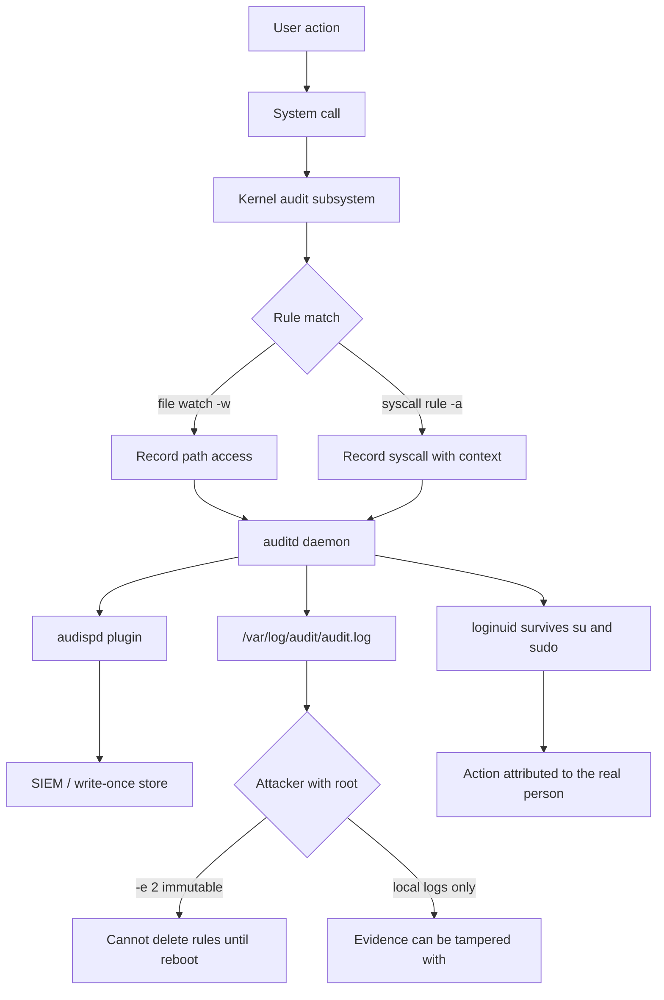

# auditd Rules and Forensic Trails

**Level:** Advanced
**Tree:** [Identity, Access & Compliance](../README.md)
**Branch:** [Compliance & Auditing](README.md)
**Forest:** [Linux](../../../README.md)

## Explanation

# auditd Rules and Forensic Trails

When an incident happens the question is always the same: who did what, when, and from where. The Linux audit subsystem is the only facility that can answer that authoritatively, because it records at the kernel syscall boundary and cannot be bypassed by a user-space program.

## Three kinds of rule

**Control rules** configure the subsystem itself: buffer size, failure mode, rate limits.

**File watches** (-w) record access to a path with a permission filter - write, attribute change, execute. Watching /etc/passwd, /etc/shadow, /etc/sudoers and the audit configuration itself is the baseline every benchmark expects.

**Syscall rules** (-a) are the powerful and dangerous ones. They can record any syscall filtered by architecture, user, exit status and more. They are also where performance goes to die: a rule matching a high-frequency syscall on a busy host can generate enormous volume and measurably slow the system.

## The immutable flag

Setting **-e 2** makes the rule set immutable until reboot. This is what stops an attacker who has obtained root from simply deleting the rules that would record their activity. It is required by most benchmarks, and it means rule changes require a reboot - which is the intended trade.

## Getting the trail off the box

Audit logs on a compromised host are evidence an attacker controls. **Ship them off the machine in near real time** to a SIEM or a write-once store. A local-only audit trail satisfies a checkbox and fails the actual purpose.

Remember also that **auditd records the loginuid**, which survives su and sudo. That is what lets you attribute an action to the original human rather than to root, and it is the reason auditd evidence stands up where shell history does not.

## Architecture and flow



## Commands

### Command 1

List the rules currently loaded in the kernel, which may differ from the files on disk

```text
auditctl -l
```

### Command 2

Watch a sensitive file for writes and attribute changes with a searchable key

```text
auditctl -w /etc/shadow -p wa -k identity
```

### Command 3

Record every command executed by real logged-in users

```text
auditctl -a always,exit -F arch=b64 -S execve -F auid>=1000 -F auid!=4294967295 -k exec
```

### Command 4

Search by key and interpret numeric IDs into names - the primary investigation command

```text
ausearch -k identity -i
```

### Command 5

Every action by a specific login user today, regardless of su or sudo

```text
ausearch -ua jdoe -ts today -i
```

### Command 6

Summary reporting and failed authentication attempts

```text
aureport --summary; aureport --auth --failed
```

### Command 7

Show subsystem status including lost events - lost events mean the buffer is too small

```text
auditctl -s
```

### Command 8

Compile /etc/audit/rules.d into the active rule set the supported way

```text
augenrules --load
```

## Automation scripts

### Audit subsystem posture and loss check

```bash
#!/usr/bin/env bash
# Confirms auditd is enforcing, immutable, not losing events, and shipping off-host.
set -uo pipefail
rc=0

echo "== status =="
status=$(auditctl -s 2>/dev/null) || { echo "cannot query audit subsystem"; exit 2; }
printf '%s\n' "$status" | tr ' ' '\n' | grep -E '^(enabled|lost|backlog|failure)' -A0 >/dev/null 2>&1 || true
echo "$status"

enabled=$(printf '%s\n' "$status" | awk '/enabled/{print $2; exit}')
lost=$(printf '%s\n' "$status" | awk '/^lost/{print $2; exit}')

case "${enabled:-0}" in
  2) echo "  OK: rules are immutable (-e 2)" ;;
  1) echo "  WARN: auditing enabled but rules are mutable - root can remove them"; rc=1 ;;
  *) echo "  ALERT: auditing is disabled"; rc=2 ;;
esac

if [ "${lost:-0}" -gt 0 ]; then
  echo "  ALERT: $lost audit events lost - increase buffer with -b in rules"
  rc=1
fi

echo "== baseline watches =="
for f in /etc/passwd /etc/shadow /etc/sudoers /etc/audit/auditd.conf; do
  if auditctl -l 2>/dev/null | grep -q -- "$f"; then
    echo "  OK   watching $f"
  else
    echo "  MISS not watching $f"
    rc=1
  fi
done

echo "== off-host shipping =="
if grep -qs "^active = yes" /etc/audit/plugins.d/*.conf 2>/dev/null || grep -qs "^active = yes" /etc/audisp/plugins.d/*.conf 2>/dev/null; then
  echo "  OK: an audispd plugin is active"
else
  echo "  WARN: audit logs appear to be local only - evidence is attacker-controllable"
  rc=1
fi
exit $rc
```

## Lab

**Objective:** Build an audit trail that attributes actions to a real person through sudo, and prove the rules cannot be removed by root.

### Steps

1. Add watches on /etc/passwd, /etc/shadow and /etc/sudoers with distinct keys, loading them via augenrules.
2. Add a syscall rule recording execve for real users, then run commands as a normal user.
3. Use sudo to edit a watched file, then find the event with ausearch and confirm the original login user is recorded.
4. Attempt to modify the watched file as root directly and confirm that is recorded too.
5. Set the immutable flag with -e 2, then attempt to delete a rule and observe the refusal.
6. Check auditctl -s for lost events under load and increase the buffer if any are lost.

### Validation

A change made through sudo is traced by ausearch back to the original human through loginuid, not to root - which is the attribution the audit trail exists to provide,The rule set is immutable: an attempt to modify rules as root is refused, and the refusal is observed rather than inferred from the configuration flag,A reboot is confirmed as the only way to change the rules, which is the operational cost of immutability and the reason it must be a deliberate choice,Audit log volume under normal load was measured, since a rule set that fills the disk causes the failure mode it was meant to prevent evidence of

## Operational automation

## Automating audit

**Manage rules as files in /etc/audit/rules.d and load with augenrules.** Rules added interactively with auditctl vanish on reboot, which produces the worst outcome: an audit trail that appears configured and is not.

**Ship events off-host in near real time.** Local logs on a compromised machine are under the attacker control. An audispd plugin forwarding to a SIEM or write-once store is what makes the trail evidential.

**Alert on lost events.** A non-zero lost counter means the kernel discarded audit records, so the trail has holes exactly when volume was highest, which is often during an incident.

**Test rule performance before fleet rollout.** A syscall rule on a high-frequency call can generate enormous volume and slow the system measurably. Measure on a representative host under load first.

## Troubleshooting

### Scenario 1: Audit rules disappear after a reboot

**Likely cause:** They were added interactively with auditctl rather than written to /etc/audit/rules.d

**Resolution:** Move them into a numbered file in rules.d and load with augenrules --load so they persist

### Scenario 2: auditctl -s shows a large and growing lost count

**Likely cause:** The audit backlog buffer is too small for the event volume being generated

**Resolution:** Increase the buffer with -b in the rules and reduce over-broad syscall rules that generate high-frequency noise

### Scenario 3: The system becomes noticeably slower after adding audit rules

**Likely cause:** A syscall rule matches a very high-frequency call such as open or read across all users

**Resolution:** Narrow the rule with filters on architecture, auid and exit status, or watch specific paths instead of broad syscalls

### Scenario 4: Events show root rather than the person who made the change

**Likely cause:** The search is reading uid rather than auid, or the session did not set a loginuid

**Resolution:** Search by auid with ausearch -ua, which follows the original login identity through su and sudo

## Interview questions

### 1. Why is auditd evidence more trustworthy than shell history?

Shell history is written by the shell into a file the user owns, so it can be edited, disabled or simply not written at all - it was designed for convenience, not accountability. auditd records at the kernel syscall boundary, so it captures the action regardless of which program performed it, including actions by processes that have no shell. Crucially it records loginuid, which persists through su and sudo, so an action performed as root is still attributable to the person who logged in. With the immutable flag set, even root cannot remove the rules that are recording them.

### 2. What does setting -e 2 achieve and what does it cost?

It makes the audit rule set immutable until the next reboot, so an attacker who gains root cannot delete the rules recording their activity - which is otherwise the first thing a competent intruder does. The cost is that any legitimate rule change also requires a reboot, so rule sets must be considered carefully and deployed through change control rather than tweaked ad hoc. Most security benchmarks require it, and the trade is generally correct on servers.

### 3. Audit logging is enabled but you are told the trail is not trustworthy. Why might that be?

Most likely the logs never leave the host. If audit records only exist in /var/log/audit on a machine an attacker has rooted, they can be altered or deleted, so they prove nothing about an incident on that machine. The second likely reason is lost events - if the backlog buffer is undersized the kernel discards records under load, so the trail has gaps precisely when activity spiked. Trustworthy auditing needs immutable rules, adequate buffers, and near-real-time forwarding to a store the host cannot rewrite.

## Certification alignment

- RHCSA EX200 - manage security and system logging
- Red Hat EX415 - Security: Linux hardening and auditing
- CompTIA Security+ - logging, monitoring and forensics
- CIS Benchmark for RHEL - audit configuration controls

## References

- Red Hat documentation - Auditing the system (Security hardening guide)
- man 8 auditctl, man 8 ausearch, man 5 audit.rules
- Linux Audit project documentation on rule syntax and performance
- CIS Benchmark audit rule requirements for RHEL

## Suggested video search

Linux auditd audit rules ausearch aureport forensic investigation tutorial

---

> Validate commands, versions, permissions, licensing, and rollback procedures in an isolated lab before production use.
