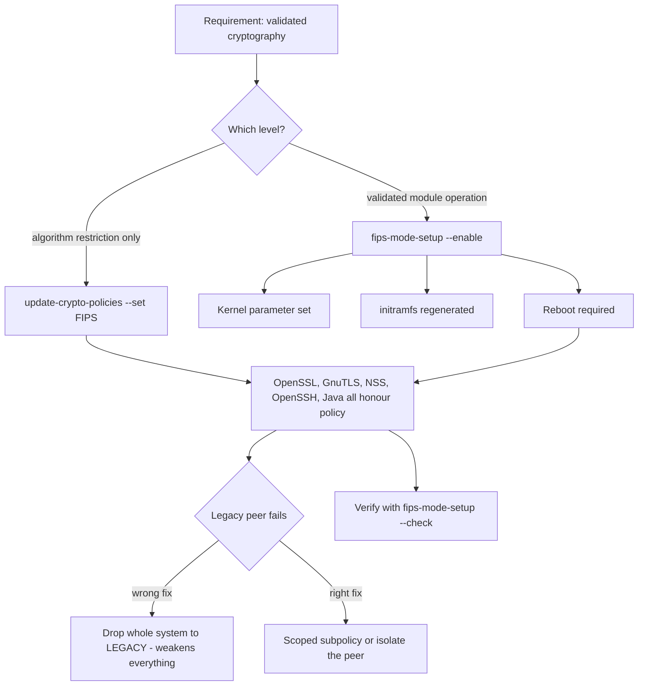

# FIPS Mode and System-Wide Crypto Policies

**Level:** Advanced
**Tree:** [Identity, Access & Compliance](../README.md)
**Branch:** [Compliance & Auditing](README.md)
**Forest:** [Linux](../../../README.md)

## Explanation

# FIPS Mode and System-Wide Crypto Policies

Regulated environments frequently require that cryptography uses validated algorithms and implementations. On RHEL this is handled at two levels that are often confused.

## Crypto policies

**update-crypto-policies** sets a system-wide policy that every consuming component honours - OpenSSL, GnuTLS, NSS, OpenSSH, Java. Instead of configuring cipher suites separately in each application and inevitably missing one, you set the policy once.

The stock policies are **LEGACY** (maximum compatibility, weak algorithms permitted), **DEFAULT** (reasonable modern baseline), **FUTURE** (forward-looking, stricter, will break older peers) and **FIPS** (only FIPS-approved algorithms).

Policies can be adjusted with **subpolicies** rather than dropping the whole system to LEGACY for one stubborn peer - an important distinction, because lowering the global policy to accommodate one device weakens every service on the host.

## FIPS mode is more than a policy

Setting the crypto policy to FIPS restricts algorithms. **Enabling FIPS mode** with fips-mode-setup goes further: it switches the cryptographic modules into their validated mode of operation, sets a kernel parameter, regenerates the initramfs, and requires a reboot. Only then is the system running validated cryptography in the sense a regulator means.

## What breaks

FIPS mode disallows algorithms that are extremely common: MD5, SHA-1 signatures, older TLS versions, some SSH key types, and some hardcoded application crypto. Expect breakage in old applications, legacy integrations and anything shipping its own crypto library that has not been validated. The correct approach is to test in a representative environment, inventory what fails, and remediate or isolate - not to enable it in production and discover the failures live.

Also note FIPS mode must be enabled from installation for the strongest assurance; retrofitting is supported but has caveats about keys generated before the switch.

## Architecture and flow



## Commands

### Command 1

Show the active system-wide cryptographic policy

```text
update-crypto-policies --show
```

### Command 2

Raise the policy to a stricter forward-looking baseline

```text
update-crypto-policies --set FUTURE
```

### Command 3

Report whether FIPS mode is actually enabled, not merely whether the policy is set

```text
fips-mode-setup --check
```

### Command 4

Enable FIPS mode - sets the kernel parameter and regenerates initramfs; requires reboot

```text
fips-mode-setup --enable
```

### Command 5

Authoritative kernel-level confirmation that FIPS mode is active

```text
cat /proc/sys/crypto/fips_enabled
```

### Command 6

Apply a scoped subpolicy instead of dropping the whole system to LEGACY

```text
update-crypto-policies --set DEFAULT:SHA1
```

### Command 7

Confirm what a TLS peer actually negotiates under the current policy

```text
openssl s_client -connect host:443 -brief </dev/null
```

### Command 8

List key types and ciphers the local SSH build will accept under policy

```text
ssh -Q key; ssh -Q cipher
```

## Automation scripts

### Crypto posture reporter

```bash
#!/usr/bin/env bash
# Reports crypto policy, real FIPS state, and flags the dangerous LEGACY setting.
set -uo pipefail
rc=0

echo "== system-wide crypto policy =="
pol=$(update-crypto-policies --show 2>/dev/null || echo unknown)
echo "  policy: $pol"
case "$pol" in
  LEGACY*) echo "  ALERT: LEGACY permits known-weak algorithms across every service"; rc=1 ;;
  DEFAULT*) echo "  OK: modern baseline" ;;
  FUTURE*|FIPS*) echo "  OK: strict policy" ;;
esac

echo "== FIPS mode =="
if [ -r /proc/sys/crypto/fips_enabled ]; then
  k=$(cat /proc/sys/crypto/fips_enabled)
  echo "  kernel fips_enabled: $k"
else
  k=0
  echo "  kernel fips_enabled: unavailable"
fi
if command -v fips-mode-setup >/dev/null 2>&1; then
  fips-mode-setup --check 2>&1 | sed 's/^/  /'
fi
# A FIPS policy without FIPS mode is a common and misleading half-measure
if [ "$pol" = "FIPS" ] && [ "${k:-0}" != "1" ]; then
  echo "  WARN: policy is FIPS but FIPS mode is NOT enabled - algorithms restricted, modules not validated"
  rc=1
fi

echo "== SSH key types accepted =="
ssh -Q key 2>/dev/null | sed 's/^/  /' | head -12
exit $rc
```

## Lab

**Objective:** Change the system crypto policy, observe what it breaks, and distinguish a FIPS policy from genuine FIPS mode.

### Steps

1. Record the current policy and capture which TLS versions and ciphers a test service negotiates.
2. Raise the policy to FUTURE and retest, noting which peers or clients now fail.
3. Identify one legacy peer that fails and apply a scoped subpolicy rather than dropping to LEGACY.
4. Set the policy to FIPS and confirm with update-crypto-policies --show.
5. Check /proc/sys/crypto/fips_enabled and observe it is still 0 - the policy alone did not enable FIPS mode.
6. Enable FIPS mode properly with fips-mode-setup --enable, reboot, and verify the kernel flag is now 1.

### Validation

fips-mode-setup --check and update-crypto-policies --show are compared on the same host, showing that a FIPS crypto policy and enabled FIPS mode are independent states,A legacy peer that failed to connect under the strict policy connects after a scoped subpolicy is applied, and the subpolicy names the specific algorithm rather than lowering the base policy,The base policy is confirmed unchanged after the subpolicy is applied, proving the exception was scoped rather than global,The compatibility exception is recorded with the peer it exists for, so it can be removed when that peer is retired instead of persisting indefinitely

## Operational automation

## Automating crypto posture

**Set the policy through configuration management and audit it continuously.** Crypto policy is a single high-leverage setting, and a host that has quietly drifted to LEGACY is weakened across every service at once.

**Never drop the global policy to satisfy one peer.** Use a scoped subpolicy, or place the legacy device behind a gateway. Lowering the global policy is the security equivalent of disabling the firewall to fix one connection.

**Enable FIPS at build time when it is required.** Retrofitting is supported but has caveats about material generated before the switch; building FIPS-enabled from installation avoids that ambiguity entirely.

**Report the kernel flag, not the policy name, as evidence.** /proc/sys/crypto/fips_enabled is the value that stands up in an audit; a policy set to FIPS without FIPS mode enabled is a common and misleading half-measure.

## Troubleshooting

### Scenario 1: Applications fail to connect after raising the crypto policy

**Likely cause:** The peer only supports algorithms the stricter policy no longer permits

**Resolution:** Identify the required algorithm from the TLS or SSH handshake error, then apply a narrowly scoped subpolicy rather than reverting the whole system

### Scenario 2: An audit finds the system is not FIPS compliant although the policy is set to FIPS

**Likely cause:** The crypto policy restricts algorithms but FIPS mode was never enabled, so modules are not running in validated mode

**Resolution:** Run fips-mode-setup --enable and reboot, then evidence compliance with /proc/sys/crypto/fips_enabled

### Scenario 3: System fails to boot after enabling FIPS mode

**Likely cause:** The initramfs was not regenerated, or the boot device uses an algorithm not permitted in FIPS mode

**Resolution:** Boot the previous kernel entry, rebuild the initramfs with dracut -f, and confirm disk encryption settings are FIPS-compatible

### Scenario 4: SSH keys stop working after enabling FIPS mode

**Likely cause:** The key type or signature algorithm is not FIPS-approved, for example older DSA keys or ssh-rsa with SHA-1

**Resolution:** Reissue keys using approved types and ensure the signature algorithm is rsa-sha2-256 or better, or use ECDSA

## Interview questions

### 1. What is the difference between setting the crypto policy to FIPS and enabling FIPS mode?

The crypto policy restricts which algorithms applications may negotiate - it is a configuration layer honoured by OpenSSL, GnuTLS, NSS, OpenSSH and Java. Enabling FIPS mode goes further: it sets a kernel parameter, switches the cryptographic modules into their validated mode of operation, regenerates the initramfs and requires a reboot. A regulator asking for FIPS means the second. A system with the policy set to FIPS but the kernel flag at zero has restricted algorithms while running non-validated module operation, which is a common and misleading half-measure.

### 2. A legacy appliance cannot connect after you raise the crypto policy. What do you do?

I would not drop the global policy, because that weakens every service on the host to accommodate one device. The right options are a narrowly scoped subpolicy that re-enables only the specific algorithm required, or better, isolating the appliance behind a gateway or proxy that terminates modern crypto on one side and speaks legacy on the other. Either way the exception should be documented with an owner and a decommissioning date, because the underlying problem is an unsupportable device rather than a policy that is too strict.

### 3. Why are system-wide crypto policies better than configuring each application?

Because per-application configuration is where gaps hide. In a large estate you would need to configure cipher suites separately in the web server, the database, the SSH daemon, the Java runtime and every other consumer, and any one that is missed silently accepts weak algorithms. A single policy that all those components honour means one place to set, one place to audit, and one place that cannot be partially applied. It also makes drift detection trivial, since you compare one value rather than auditing dozens of configuration files.

## Certification alignment

- RHCSA EX200 - manage system security settings
- Red Hat EX415 - Security: Linux hardening specialist
- CompTIA Security+ - cryptography and compliance frameworks
- FIPS 140-2 / 140-3 validation requirements for regulated environments

## References

- Red Hat documentation - Using system-wide cryptographic policies (Security hardening)
- Red Hat documentation - Switching the system to FIPS mode
- man 8 update-crypto-policies and man 8 fips-mode-setup
- NIST FIPS 140-3 and the Cryptographic Module Validation Program

## Suggested video search

RHEL FIPS mode crypto policies update-crypto-policies compliance configuration

---

> Validate commands, versions, permissions, licensing, and rollback procedures in an isolated lab before production use.
