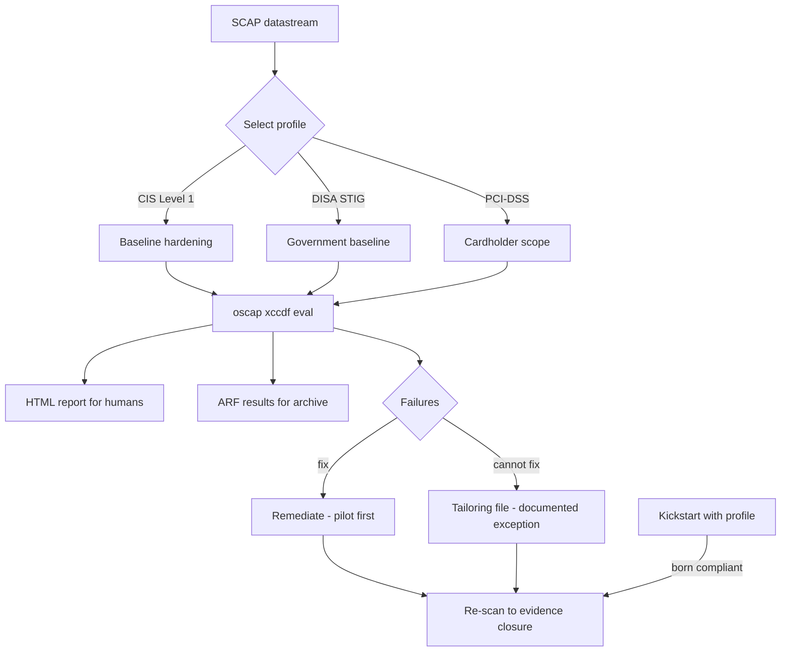

# OpenSCAP, CIS Benchmarks and STIG Remediation

**Level:** Intermediate
**Tree:** [Identity, Access & Compliance](../README.md)
**Branch:** [Compliance & Auditing](README.md)
**Forest:** [Linux](../../../README.md)

## Explanation

# OpenSCAP, CIS Benchmarks and STIG Remediation

Auditors do not accept "we hardened it". They ask for evidence, produced repeatably, showing which controls pass and which are accepted exceptions. OpenSCAP is how Linux produces that evidence.

## What SCAP actually is

SCAP is a set of standards for expressing security policy in machine-readable form. In practice you work with a **datastream** file containing multiple **profiles** - CIS Level 1, CIS Level 2, DISA STIG, PCI-DSS, ANSSI and others. Each profile is a set of rules, each rule has a check (OVAL) and often a fix.

The important property is that the **same content is used to scan and to remediate**, so the evidence and the fix cannot drift apart.

## Scan, then remediate carefully

Running **oscap xccdf eval** produces a report showing pass, fail and notapplicable per rule, with a machine-readable ARF result for archiving and an HTML report for humans.

Automatic remediation is available but should be treated with real caution: **--remediate applies every fix in the profile**, and profiles like STIG will happily disable services, tighten permissions and change authentication in ways that break the application the server exists to run. The correct sequence is scan, review, pilot the remediation on a non-production host, then apply.

A better pattern for new builds is to apply the profile **at install time via Kickstart**, so the host is born compliant rather than being retrofitted.

## Exceptions are part of compliance

No real system passes every rule. What matters is that each failure is either fixed or is a **documented, approved exception with an owner and a review date**. A tailoring file lets you express that formally so the scan itself reflects agreed policy rather than producing noise everyone learns to ignore.

## Architecture and flow



## Commands

### Command 1

List every profile available in the datastream with its identifier

```text
oscap info /usr/share/xml/scap/ssg/content/ssg-rhel9-ds.xml
```

### Command 2

Scan against CIS Level 1 and produce both archival and human-readable output

```text
oscap xccdf eval --profile cis_server_l1 --results-arf arf.xml --report report.html /usr/share/xml/scap/ssg/content/ssg-rhel9-ds.xml
```

### Command 3

Scan and automatically apply fixes - pilot this on non-production first

```text
oscap xccdf eval --profile stig --remediate <datastream>
```

### Command 4

Generate a remediation script to review before running anything

```text
oscap xccdf generate fix --profile cis_server_l1 --fix-type bash <datastream> > fix.sh
```

### Command 5

Generate an Ansible playbook so remediation goes through normal change control

```text
oscap xccdf generate fix --profile cis_server_l1 --fix-type ansible <datastream> > fix.yml
```

### Command 6

GUI to build a tailoring file that records agreed exceptions formally

```text
scap-workbench
```

### Command 7

Scan against your tailored policy rather than the stock profile

```text
oscap xccdf eval --profile cis_server_l1 --tailoring-file tailoring.xml <datastream>
```

### Command 8

Regenerate a readable report from archived results for an auditor

```text
oscap xccdf generate report arf.xml > report.html
```

## Automation scripts

### Compliance scan with trend recording

```bash
#!/usr/bin/env bash
# Scans, archives results with a datestamp and records the pass rate for trending.
set -euo pipefail
PROFILE="${1:-cis_server_l1}"
DS="${2:-/usr/share/xml/scap/ssg/content/ssg-rhel9-ds.xml}"
OUT="/var/log/compliance"
STAMP=$(date +%Y%m%d-%H%M)

[ -f "$DS" ] || { echo "datastream not found: $DS (install scap-security-guide)"; exit 2; }
mkdir -p "$OUT"

# oscap exits 2 when rules fail, which is normal - do not let set -e abort on it
set +e
oscap xccdf eval --profile "$PROFILE" \
  --results-arf "$OUT/arf-$STAMP.xml" \
  --report "$OUT/report-$STAMP.html" "$DS" >"$OUT/scan-$STAMP.txt" 2>&1
rc=$?
set -e

pass=$(grep -c "^Result.*pass$" "$OUT/scan-$STAMP.txt" 2>/dev/null || true)
fail=$(grep -c "^Result.*fail$" "$OUT/scan-$STAMP.txt" 2>/dev/null || true)
total=$((pass + fail))
pct=0
[ "$total" -gt 0 ] && pct=$(( pass * 100 / total ))

printf '%s profile=%s pass=%s fail=%s rate=%s%%\n' "$STAMP" "$PROFILE" "$pass" "$fail" "$pct" >> "$OUT/trend.log"
echo "scan complete: $pass passed, $fail failed (${pct}%)"
echo "report: $OUT/report-$STAMP.html"
# exit 0 so a scheduled run is not treated as a job failure just because rules failed
exit 0
```

## Lab

**Objective:** Produce real compliance evidence, remediate safely, and record an exception the way an auditor expects.

### Steps

1. Install scap-security-guide and list the available profiles for the platform.
2. Scan against CIS Level 1 and record the initial pass rate from the HTML report.
3. Generate the remediation as a script and as an Ansible playbook, and read what it would actually change.
4. Apply remediation on a test host, then re-scan and record the improved pass rate.
5. Identify one rule that cannot be fixed because it breaks a required application.
6. Build a tailoring file that documents that exception, and scan against the tailored policy.

### Validation

Two archived scan reports exist from before and after remediation, and the pass rate difference is attributable to specific rules rather than to a changed profile or scope,At least one remediation was applied and then verified by re-scanning, rather than assumed effective because the remediation script exited zero,Every remaining failure has a recorded exception naming the rule, the business reason and an owner - so the gap is a decision rather than an oversight,The operational impact of at least one applied control was checked, because a hardening rule that breaks an application is discovered by the application team otherwise

## Operational automation

## Automating compliance

**Scan on a schedule and record the trend, not just the current state.** A single pass rate says little; a falling trend shows drift and is what actually prompts action.

**Never run --remediate unattended against production without piloting.** STIG remediation in particular disables services and tightens authentication, and it will happily break the application the server exists to run. Generate the Ansible output and put it through normal change control instead.

**Build compliance in at provisioning time.** Kickstart supports applying a SCAP profile during installation, so hosts are born compliant and never exist in an unhardened state on the network.

**Archive the ARF results, not only the HTML.** The machine-readable results are what let you prove the state of a host on a specific date months later, which is exactly what an audit asks for.

## Troubleshooting

### Scenario 1: An application breaks immediately after automatic remediation

**Likely cause:** The profile disabled a service, changed permissions or tightened authentication the application depended on

**Resolution:** Identify the rule from the report, restore the specific setting, and record a documented exception in a tailoring file rather than abandoning the whole profile

### Scenario 2: oscap exits with status 2 and the scheduled job is reported as failed

**Likely cause:** Exit code 2 means rules failed, which is a normal scan outcome, not a tool error

**Resolution:** Handle the exit code explicitly in the wrapper script and report the pass rate instead of the raw exit status

### Scenario 3: Many rules report notapplicable and the pass rate looks artificially high

**Likely cause:** The profile targets a different platform version, or the rules genuinely do not apply to this role

**Resolution:** Confirm the datastream matches the OS major version, and report pass rate against applicable rules only

### Scenario 4: Scan results differ between two supposedly identical hosts

**Likely cause:** Configuration drift - a manual change on one host that never went through automation

**Resolution:** Diff the two reports rule by rule; the differing rules identify exactly what drifted and should be brought back under configuration management

## Interview questions

### 1. What is the risk of running oscap with --remediate on production?

It applies every fix in the profile without regard for what the server does. Profiles such as STIG disable services, enforce mount options, tighten file permissions and change authentication settings, any of which can break the application the host exists to run. The safe sequence is to scan first, review the findings, generate the remediation as a script or Ansible playbook so it can be read and reviewed, pilot it on a non-production host that matches the role, and only then apply through normal change control.

### 2. How do you handle a control you genuinely cannot implement?

You document it as a formal exception rather than ignoring it. Technically that means a tailoring file so the scan reflects agreed policy and the report is clean of known-accepted items. Procedurally it means a recorded risk with a named business owner, a justification, any compensating control, and a review date. An auditor is generally comfortable with a documented, owned, time-bound exception; what fails an audit is an unexplained failure or a report full of noise that everyone has learned to ignore.

### 3. Why is scanning at build time better than remediating later?

Because a host that is hardened at installation never exists in an unhardened state on the network, so there is no window between provisioning and hardening for it to be compromised. It also avoids the situation where remediation breaks a running application, since nothing has been deployed yet. Kickstart can apply a SCAP profile during installation, which means compliance is a property of the build rather than a project someone has to run afterwards.

## Certification alignment

- RHCSA EX200 - manage security including SELinux and system hardening
- Red Hat EX415 - Security: Linux hardening specialist
- CompTIA Linux+ XK0-005 and Security+ - compliance and hardening
- CIS Benchmark and DISA STIG implementation for RHEL

## References

- Red Hat documentation - Security hardening and Scanning the system for configuration compliance
- ComplianceAsCode / SCAP Security Guide project content
- CIS Benchmarks for Red Hat Enterprise Linux
- NIST SCAP specification and DISA STIG library

## Suggested video search

OpenSCAP oscap CIS benchmark STIG scan remediate tailoring RHEL tutorial

---

> Validate commands, versions, permissions, licensing, and rollback procedures in an isolated lab before production use.
