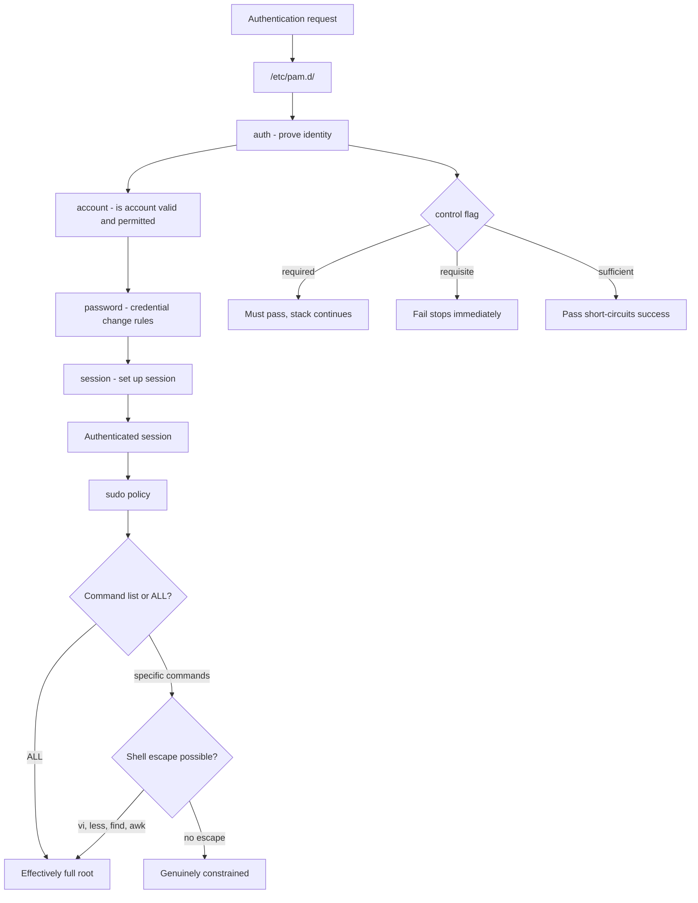

# PAM Stack Design and sudo Policy

**Level:** Advanced
**Tree:** [Identity, Access & Compliance](../README.md)
**Branch:** [Identity & Authentication](README.md)
**Forest:** [Linux](../../../README.md)

## Explanation

# PAM Stack Design and sudo Policy

PAM decides what happens when anything on the system tries to authenticate a user, and sudo decides what a user may do once authenticated. Both are edited casually and both can lock everyone out of a machine.

## Reading a PAM stack

Each service file in /etc/pam.d contains rules in four groups: **auth** (prove identity), **account** (is the account permitted and valid), **password** (change credentials) and **session** (set up and tear down the session).

The control field is what people misread. **required** must succeed but the stack continues so failures do not reveal which module failed. **requisite** fails immediately. **sufficient** short-circuits with success if it passes and no earlier required module failed. **optional** rarely affects the outcome. And the bracketed form gives fine-grained control per return value.

Order is semantically significant: moving a sufficient line above a required one can bypass the check entirely.

## Do not hand-edit on modern RHEL

RHEL 8 and later manage the stack through **authselect** profiles. Editing /etc/pam.d directly means the next authselect apply silently reverts your change - or worse, your edit blocks authselect from working at all. Create a custom profile instead.

## sudo policy that survives an audit

The rule that matters: **never grant ALL when a command list will do**, and understand that many innocuous-looking commands are a shell escape. Granting sudo to vi, less, find, awk, or anything with a shell escape is equivalent to granting full root, because the user can spawn a root shell from inside them.

Use **/etc/sudoers.d/ drop-in files** rather than editing the main file, always validate with **visudo -c** before deploying, and prefer **central sudo rules in the directory** so the policy is auditable in one place rather than on 500 hosts.

## Architecture and flow



## Commands

### Command 1

Show the active profile and what profiles are available - do this before any PAM change

```text
authselect current; authselect list
```

### Command 2

Create a customisable profile based on a stock one instead of editing /etc/pam.d

```text
authselect create-profile custom-sssd -b sssd
```

### Command 3

Apply a custom profile with an additional feature enabled

```text
authselect select custom/custom-sssd with-mkhomedir --force
```

### Command 4

Validate sudoers syntax - always run before deploying, a broken sudoers locks out privilege escalation

```text
visudo -c
```

### Command 5

Edit a drop-in file safely with syntax checking on save

```text
visudo -f /etc/sudoers.d/ops-team
```

### Command 6

Show exactly what a specific user is permitted to run - the audit question

```text
sudo -l -U jdoe
```

### Command 7

Clear a lockout after failed attempts without disabling the lockout policy

```text
faillock --user jdoe --reset
```

### Command 8

Confirm lockout and password quality modules are actually in the stack

```text
grep -E "pam_faillock|pam_pwquality" /etc/pam.d/system-auth
```

## Automation scripts

### sudo policy risk auditor

```bash
#!/usr/bin/env bash
# Flags sudo grants that are effectively full root: ALL, NOPASSWD, and shell-escape binaries.
set -uo pipefail
rc=0

# Commands that permit a shell escape - granting these is equivalent to granting root
ESCAPES="vi vim nano less more find awk sed perl python python3 ruby tar zip man ftp gdb nmap"

scan() {
  local f="$1"
  [ -r "$f" ] || return 0
  while IFS= read -r line; do
    case "$line" in \#*|"") continue ;; esac
    case "$line" in
      *ALL=\(ALL\)*ALL*|*ALL=\(ALL:ALL\)*ALL*)
        echo "  FULL ROOT: $f: $line"; rc=1 ;;
    esac
    case "$line" in
      *NOPASSWD*) echo "  NOPASSWD:  $f: $line" ;;
    esac
    for e in $ESCAPES; do
      case "$line" in
        *"/$e"*) echo "  SHELL ESCAPE via $e: $f: $line"; rc=1 ;;
      esac
    done
  done < "$f"
}

echo "== /etc/sudoers =="
scan /etc/sudoers
if [ -d /etc/sudoers.d ]; then
  for f in /etc/sudoers.d/*; do
    [ -f "$f" ] || continue
    echo "== $f =="
    scan "$f"
  done
fi

echo "== syntax =="
visudo -c >/dev/null 2>&1 && echo "  OK: sudoers syntax valid" || { echo "  ALERT: sudoers syntax INVALID"; rc=2; }
exit $rc
```

## Lab

**Objective:** Modify the PAM stack the supported way, and prove that a narrowly scoped sudo grant can still be full root.

### Steps

1. Record the current authselect profile, then create a custom profile based on it.
2. Enable account lockout with pam_faillock through the custom profile and confirm repeated bad passwords lock the account.
3. Reset the lockout with faillock and confirm login works again.
4. Grant a test user sudo access to only /usr/bin/find via a drop-in file, validated with visudo -c.
5. As that user, use find to spawn a root shell, demonstrating the escape.
6. Replace the grant with a genuinely constrained command and confirm the escape no longer works.

### Validation

The PAM change was made with authselect and survives an authselect apply-changes, proving it is a supported customisation rather than an edit that the next update will overwrite,A root shell was obtained from a sudo rule granting a single seemingly harmless command - most commonly through an editor, a pager or a shell escape - and the escape route is understood, not merely observed,The same rule, rewritten with NOEXEC or a restricted command set, no longer permits the escape, and the difference is demonstrated rather than reasoned about,sudo logging shows the attempted escape, so the control failing would be detectable afterwards rather than silent

## Operational automation

## Automating PAM and sudo safely

**Always keep a second root session open when changing PAM.** A broken stack locks out every login including root, and recovery then means single-user mode or rescue media. Test in one session, verify in another.

**Validate sudoers in CI with visudo -c before it ever reaches a host.** A syntax error in sudoers means nobody can escalate privilege on that machine.

**Deploy sudo policy centrally through the directory where possible.** Files distributed to 500 hosts cannot answer the auditor question "who can run what, right now" - a central rule set can.

**Audit continuously for ALL, NOPASSWD and shell-escape grants.** These accumulate quietly as people solve immediate problems, and each one silently converts a limited grant into full root.

## Troubleshooting

### Scenario 1: Nobody can log in after a PAM change, including root over SSH

**Likely cause:** A required module was reordered or removed, or a syntax error broke the stack

**Resolution:** Boot to single-user or use an existing open session; restore with authselect select <profile> --force, which rewrites the stack from the profile

### Scenario 2: authselect apply reverts a change made in /etc/pam.d

**Likely cause:** The stock profile is authoritative and regenerates those files - direct edits are not preserved

**Resolution:** Create a custom profile with authselect create-profile and make the change there

### Scenario 3: A user reports being locked out repeatedly for no reason

**Likely cause:** pam_faillock is counting failures from a stale cached credential, often a scheduled job or a mounted share with an old password

**Resolution:** Identify the source in the auth logs, fix the stored credential, then reset with faillock --user <name> --reset

### Scenario 4: Central sudo rules from the directory are ignored on one host

**Likely cause:** sudo is not configured to consult SSSD, so it only reads local files

**Resolution:** Confirm sudoers: files sss appears in /etc/nsswitch.conf and that the sudo responder is enabled in sssd.conf

## Interview questions

### 1. Why is granting sudo access to vi or find effectively granting root?

Because both allow a shell escape. From vi a user can run :!/bin/bash and get a shell owned by the effective user, which under sudo is root. find has -exec which runs arbitrary commands. The same applies to less, awk, perl, python, tar and many others. The lesson is that the security of a sudo rule depends on what the permitted binary can be made to do, not on how narrow the rule looks. If a command can execute other commands, granting it is granting root.

### 2. What is the difference between required and requisite in a PAM stack?

Both must succeed for the stack to succeed. The difference is what happens on failure: requisite fails immediately and returns control, while required records the failure but continues evaluating the rest of the stack before returning. required is generally preferred for authentication because continuing means the failure response takes the same time and reveals the same information regardless of which module failed, which avoids leaking whether an account exists.

### 3. Why should you not edit files in /etc/pam.d directly on modern RHEL?

Because authselect owns those files and regenerates them from a profile. A direct edit is silently lost the next time a profile is applied, and it can also put authselect into a state where it refuses to apply changes because the files no longer match what it expects. The supported approach is to create a custom profile from a stock one and modify that, which keeps changes durable and reviewable.

## Certification alignment

- RHCSA EX200 - configure sudo and manage user access
- RHCE EX294 - automate access control with Ansible
- CompTIA Linux+ XK0-005 - authentication, authorisation and PAM
- CIS Benchmark controls for access control and privilege escalation

## References

- Red Hat documentation - Configuring authentication and authorization using authselect
- man 5 pam.conf, man 8 pam_faillock, man 5 sudoers
- GTFOBins - catalogue of binaries usable for shell escapes and privilege escalation
- CIS Benchmark for RHEL - sudo and PAM hardening controls

## Suggested video search

Linux PAM stack authselect sudoers policy shell escape security tutorial

---

> Validate commands, versions, permissions, licensing, and rollback procedures in an isolated lab before production use.
