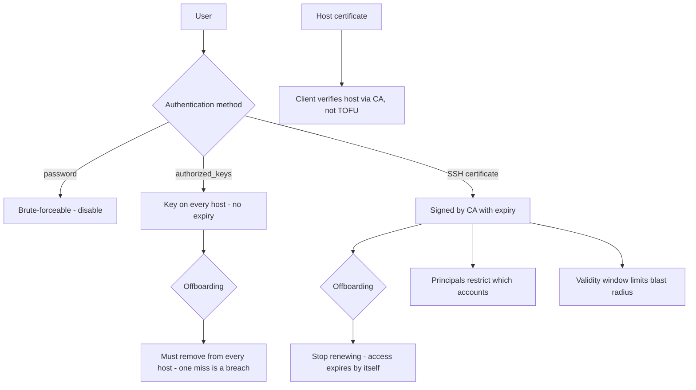

# SSH Hardening and Certificate Authentication

**Level:** Intermediate
**Tree:** [Identity, Access & Compliance](../README.md)
**Branch:** [Identity & Authentication](README.md)
**Forest:** [Linux](../../../README.md)

## Explanation

# SSH Hardening and Certificate Authentication

SSH is the front door to every Linux host in the estate, and the default configuration is designed for compatibility rather than for a hostile internet.

## The baseline

**Disable password authentication entirely** where possible. Passwords are guessable and brute-forced constantly; keys are not. **Disable direct root login** so administrative actions are attributable to a person before they escalate. Restrict access with **AllowGroups** rather than relying on every account being well managed.

Set modern **KexAlgorithms, Ciphers and MACs** rather than accepting defaults that retain legacy algorithms for old clients. On RHEL the cleanest way is to let the **system-wide crypto policy** govern this, so one setting controls SSH, TLS and everything else consistently.

## Why authorized_keys does not scale

Key distribution is the real problem. With authorized_keys files, onboarding means pushing a key to every host and offboarding means removing it from every host - and the one host that was missed is the one that matters. There is no expiry, and no way to answer "which keys can access production" without scanning every machine.

## Certificates solve it

**SSH certificates** replace key distribution with signing. A trusted CA signs a user key, producing a certificate with an **embedded expiry**, a list of valid **principals** and optional **restrictions**. Hosts trust the CA public key, not individual user keys, so onboarding is issuing a certificate and offboarding is simply not renewing it. A 12-hour certificate means a stolen key is worthless by tomorrow.

Host certificates solve the reciprocal problem: clients verify the host against the CA instead of blindly accepting a fingerprint on first connection, which removes the trust-on-first-use weakness that makes host-key warnings meaningless in practice.

## Architecture and flow



## Commands

### Command 1

Show the effective running configuration including defaults, not just the file

```text
sshd -T | grep -Ei "permitrootlogin|passwordauth|pubkeyauth|allowgroups"
```

### Command 2

Validate configuration syntax before restarting - a broken config can lock you out

```text
sshd -t
```

### Command 3

Generate a modern key; ed25519 is preferred over RSA for new keys

```text
ssh-keygen -t ed25519 -C "jdoe@example.com"
```

### Command 4

Sign a user key into a certificate valid 12 hours for two principals

```text
ssh-keygen -s ca_key -I jdoe -n jdoe,deploy -V +12h user_key.pub
```

### Command 5

Inspect a certificate: principals, validity window and any restrictions

```text
ssh-keygen -L -f user_key-cert.pub
```

### Command 6

Sign a host certificate so clients verify hosts through the CA

```text
ssh-keygen -s ca_key -I host.example.com -h -n host.example.com -V +52w host_key.pub
```

### Command 7

Read and raise the system-wide cryptographic policy that governs SSH and TLS together

```text
update-crypto-policies --show; update-crypto-policies --set FUTURE
```

### Command 8

Review recent authentication failures and probing attempts

```text
journalctl -u sshd -S -1h | grep -Ei "failed|invalid"
```

## Automation scripts

### SSH hardening posture check

```bash
#!/usr/bin/env bash
# Audits effective sshd settings rather than the file, since defaults matter.
set -uo pipefail
rc=0

declare -A WANT=(
  [permitrootlogin]="no"
  [passwordauthentication]="no"
  [pubkeyauthentication]="yes"
  [permitemptypasswords]="no"
  [x11forwarding]="no"
)

eff=$(sshd -T 2>/dev/null) || { echo "cannot read effective sshd config"; exit 2; }

for k in "${!WANT[@]}"; do
  have=$(printf '%s\n' "$eff" | awk -v k="$k" '$1==k{print $2; exit}')
  want="${WANT[$k]}"
  if [ "${have:-unset}" = "$want" ]; then
    printf '  OK   %-26s = %s\n' "$k" "$have"
  else
    printf '  FAIL %-26s = %-6s (want %s)\n' "$k" "${have:-unset}" "$want"
    rc=1
  fi
done

echo "== crypto policy =="
command -v update-crypto-policies >/dev/null 2>&1 && update-crypto-policies --show || echo "  n/a"

echo "== CA trust configured? =="
if printf '%s\n' "$eff" | grep -qi "trustedusercakeys"; then
  echo "  OK: certificate authentication configured"
else
  echo "  INFO: no TrustedUserCAKeys - relying on authorized_keys distribution"
fi
exit $rc
```

## Lab

**Objective:** Harden sshd, then replace key distribution with a certificate authority and prove that access expires by itself.

### Steps

1. Audit the effective configuration with sshd -T and disable password authentication and root login.
2. Confirm with sshd -t and restart, keeping a second session open in case of error.
3. Create an SSH CA keypair and configure TrustedUserCAKeys on the server.
4. Sign a user key with a five-minute validity and two principals, then log in using the certificate.
5. Wait for the certificate to expire and confirm access is refused with no server-side change.
6. Sign a host certificate and configure the client to verify hosts via the CA rather than trust-on-first-use.

### Validation

Password authentication is refused by the server, verified from a client that has no key, so the refusal is server policy rather than client configuration,Certificate authentication succeeds with no entry in authorized_keys on the target host, which is the property that removes per-host key distribution,Access ends by itself when the certificate reaches its validity end, with no action taken on the server - the expiry observed, not simulated,An equivalent authorized_keys entry is shown still granting access after the person has notionally left, making the offboarding difference concrete rather than asserted

## Operational automation

## Automating SSH access

**Move to certificates and automate signing.** The whole point is that hosts trust one CA rather than thousands of individual keys. Short validity windows (hours, not months) make revocation largely unnecessary because access expires naturally.

**Protect the CA key like a root credential**, because it is one. It belongs in an HSM or a vault with signing performed by a service, not on an engineer laptop.

**Never restart sshd from a single session without a verified config.** Run sshd -t first and keep a second connection open; automation that restarts sshd on a bad config locks out an entire fleet at once.

**Audit effective configuration, not files.** sshd -T shows defaults that a file review misses entirely, which is where most hardening gaps hide.

## Troubleshooting

### Scenario 1: Locked out of a host after an SSH configuration change

**Likely cause:** A directive with a typo or an over-restrictive AllowGroups was applied and sshd restarted

**Resolution:** Use console or out-of-band access to correct it; prevent recurrence by running sshd -t before restart and keeping a second session open during changes

### Scenario 2: Certificate login is refused although the certificate is valid

**Likely cause:** The principal in the certificate does not match the Linux account being logged into, or TrustedUserCAKeys is not configured

**Resolution:** Inspect with ssh-keygen -L to confirm principals and validity, and confirm the server trusts the CA public key

### Scenario 3: Key authentication fails silently and falls back to password

**Likely cause:** Permissions on the home directory, .ssh directory or authorized_keys are too open, so sshd refuses to use them

**Resolution:** Set home to 755 or tighter, .ssh to 700 and authorized_keys to 600; check SELinux context with restorecon

### Scenario 4: Legacy device cannot connect after crypto hardening

**Likely cause:** The system-wide crypto policy removed the algorithms that device supports

**Resolution:** Rather than weakening the global policy, place the device behind a jump host, or apply a scoped policy exception with a documented expiry

## Interview questions

### 1. Why do SSH certificates scale better than authorized_keys?

Because they replace distribution with signing. With authorized_keys, granting access means pushing a key to every relevant host and revoking means removing it from every host - and you can never be certain you got them all, nor answer who currently has access without scanning everything. With certificates, hosts trust a CA. Access is granted by signing a certificate with an embedded expiry and principal list, and revoked simply by not renewing it. A twelve-hour certificate makes a stolen key worthless within a day, and offboarding becomes automatic.

### 2. What does sshd -T tell you that reading sshd_config does not?

The effective configuration including every default that is not written in the file. Most hardening gaps are settings nobody configured, so they silently take a permissive default. Reviewing the file shows what someone chose to write; sshd -T shows what the daemon will actually do. It is the only reliable basis for an audit, and it should be what compliance checks read.

### 3. How do host certificates improve on the standard host key model?

The standard model is trust-on-first-use: the client shows a fingerprint the user has no way to verify, and in practice everyone accepts it. That makes a man-in-the-middle on first connection viable. With host certificates the host key is signed by a CA the client already trusts, so the client can verify the host cryptographically on the very first connection with no fingerprint prompt, and rebuilt hosts do not produce the changed-host-key warnings that train users to ignore them.

## Certification alignment

- RHCSA EX200 - configure SSH key-based authentication and secure access
- RHCE EX294 - automate SSH configuration and key management
- CompTIA Linux+ XK0-005 - secure remote access
- CIS Benchmark for RHEL - SSH server configuration controls

## References

- OpenSSH manual pages - man 5 sshd_config and man 1 ssh-keygen (CERTIFICATES section)
- Red Hat documentation - Using secure communications between two systems with OpenSSH
- Red Hat documentation - System-wide cryptographic policies
- NIST SP 800-52 and vendor guidance on approved algorithms

## Suggested video search

OpenSSH hardening certificate authority principals bastion configuration tutorial

---

> Validate commands, versions, permissions, licensing, and rollback procedures in an isolated lab before production use.
