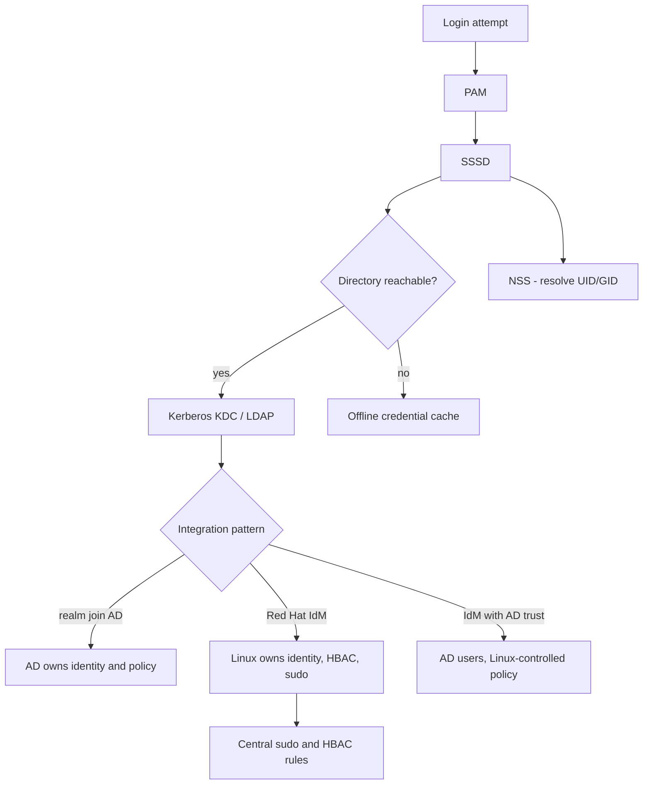

# SSSD, Red Hat IdM and Active Directory Enrolment

**Level:** Advanced
**Tree:** [Identity, Access & Compliance](../README.md)
**Branch:** [Identity & Authentication](README.md)
**Forest:** [Linux](../../../README.md)

## Explanation

# SSSD, Red Hat IdM and Active Directory Enrolment

Local accounts do not scale. On any estate above a handful of hosts, identity must come from a directory, and on Linux the client that talks to that directory is **SSSD**.

## What SSSD actually does

SSSD is not just an LDAP client. It provides **NSS** (name resolution - who is user 1234), **PAM** (authentication - is this password correct), and critically an **offline cache**. That cache is why a laptop or a host that loses the network keeps working: credentials that succeeded recently are cached and can satisfy a login while the directory is unreachable. Without SSSD, a directory outage is a total login outage across the estate.

## Three integration patterns

**Direct AD integration** via realm join is the simplest: Linux hosts become AD domain members, users authenticate with AD credentials, and POSIX attributes come either from AD itself or are computed. Fewest moving parts, but AD administrators end up owning Linux identity policy.

**Red Hat IdM (FreeIPA)** gives Linux its own identity domain with Kerberos, integrated DNS, a CA, host-based access control and sudo rules held centrally. This is the right answer when Linux policy needs to be owned by the Linux team.

**IdM with an AD trust** is the enterprise pattern: users live in AD, Linux-specific policy lives in IdM, and a cross-realm Kerberos trust joins them. Users log in with AD credentials while HBAC and sudo rules stay under Linux control.

## The parts that go wrong

Kerberos is unforgiving about **time** (skew beyond five minutes breaks authentication outright), **DNS** (SRV records locate the KDC; broken reverse DNS breaks service principals) and **clock-synchronised secrets** (the host keytab). Nearly every "SSSD is broken" incident is one of those three.

## Architecture and flow



## Commands

### Command 1

Show what the host can see about a domain before attempting to join

```text
realm discover ad.example.com
```

### Command 2

Join AD and have realmd configure SSSD, Kerberos and PAM

```text
realm join --user=Administrator ad.example.com
```

### Command 3

Enrol the host into Red Hat IdM and create home directories on first login

```text
ipa-client-install --mkhomedir --enable-dns-updates
```

### Command 4

Prove NSS resolves a directory user to a POSIX identity

```text
id user@example.com; getent passwd user@example.com
```

### Command 5

Show whether SSSD considers the domain online and which server it is using

```text
sssctl domain-status example.com
```

### Command 6

Obtain and inspect a Kerberos ticket - the fastest way to isolate auth from directory issues

```text
kinit user@EXAMPLE.COM; klist
```

### Command 7

Invalidate the entire SSSD cache when stale entries are suspected

```text
sss_cache -E
```

### Command 8

Define central host-based access and sudo rules in IdM

```text
ipa hbacrule-add --hostcat=all engineers-ssh; ipa sudorule-add ops-restart
```

## Automation scripts

### Identity integration health check

```bash
#!/usr/bin/env bash
# Verifies the three things that break Kerberos-based identity: time, DNS and the keytab.
set -uo pipefail
rc=0

echo "== time synchronisation =="
if command -v chronyc >/dev/null 2>&1; then
  offset=$(chronyc tracking 2>/dev/null | awk -F: '/System time/{print $2}' | awk '{print $1}')
  echo "system time offset: ${offset:-unknown} s"
  # Kerberos rejects skew beyond 300s by default
  awk -v o="${offset:-0}" 'BEGIN{ if (o<0) o=-o; if (o>120) { print "  ALERT: clock skew is high - Kerberos will fail"; exit 1 } }' || rc=1
else
  echo "  WARN: chrony not present - cannot verify time"
fi

echo "== SSSD domain status =="
if command -v sssctl >/dev/null 2>&1; then
  for d in $(sssctl domain-list 2>/dev/null); do
    st=$(sssctl domain-status "$d" 2>/dev/null | grep -i "online status" || true)
    echo "  $d: ${st:-unknown}"
    case "$st" in *Offline*) echo "  ALERT: $d is offline"; rc=1 ;; esac
  done
fi

echo "== host keytab =="
if [ -f /etc/krb5.keytab ]; then
  klist -k /etc/krb5.keytab >/dev/null 2>&1 && echo "  OK: keytab readable" || { echo "  ALERT: keytab unreadable"; rc=1; }
else
  echo "  WARN: no /etc/krb5.keytab - host is not Kerberos-enrolled"
fi

exit $rc
```

## Lab

**Objective:** Enrol a host into a directory, prove offline authentication works, and enforce access with central rules rather than local files.

### Steps

1. Enrol the host into Red Hat IdM (or join AD with realm join) and confirm the join succeeded.
2. Resolve a directory user with id and getent, and log in as that user over SSH.
3. Create an HBAC rule allowing only one group SSH access, and confirm a user outside it is denied.
4. Define a central sudo rule in the directory and confirm it applies without editing /etc/sudoers locally.
5. Disconnect the host from the network and confirm a recently authenticated user can still log in from the SSSD cache.
6. Deliberately skew the clock by ten minutes and observe Kerberos authentication fail, then correct it.

### Validation

A directory user logs in and id shows the central groups, not local ones - proving the identity resolved through SSSD rather than a local account of the same name,The same user logs in with the identity provider unreachable, served from the SSSD cache, and the cache expiry behaviour is known rather than assumed,Kerberos authentication fails when the clock is skewed past the permitted window and succeeds once time is corrected, with no other change - isolating time as the sole cause,sssd_nss and sssd_pam logs show which provider answered, so a future failure can be attributed to lookup or to authentication rather than guessed at

## Operational automation

## Automating identity enrolment

**Enrol during provisioning, never manually.** Kickstart or cloud-init should perform the join so no host ever exists in an unenrolled state with local accounts that then become permanent.

**Treat the join credential as a short-lived secret.** Use a dedicated enrolment account with only the right to join hosts, pulled from a vault at build time, not a domain administrator credential baked into an image.

**Monitor domain status, not just enrolment.** A host that joined successfully six months ago can be offline against the directory today; sssctl domain-status is the check that matters.

**Put HBAC and sudo rules in version control and apply them through the IdM API.** Rules edited by hand in a web UI drift and nobody can answer who granted what, which is exactly the question an auditor asks.

## Troubleshooting

### Scenario 1: Directory users cannot log in, and logs show clock skew too great

**Likely cause:** Kerberos rejects tickets when host and KDC clocks differ by more than the allowed skew, five minutes by default

**Resolution:** Fix time synchronisation with chrony against the same source as the KDC, then retry; do not raise the skew tolerance as a workaround

### Scenario 2: id returns nothing for a directory user although the join succeeded

**Likely cause:** SSSD is running but the domain is offline, or the user has no POSIX attributes and no idmap range applies

**Resolution:** Check sssctl domain-status; if online, confirm the ID mapping configuration and whether POSIX attributes are expected from the directory

### Scenario 3: Login works but the home directory does not exist

**Likely cause:** oddjob-mkhomedir or the pam_mkhomedir module was not enabled at enrolment

**Resolution:** Enable it with authselect and restart oddjobd, or re-enrol with --mkhomedir

### Scenario 4: Authentication succeeds against one server but fails intermittently

**Likely cause:** DNS SRV records point at a KDC that is unreachable or decommissioned, so some lookups pick a dead server

**Resolution:** Verify SRV records resolve to live KDCs; use sssctl to confirm which server SSSD selected during a failure

## Interview questions

### 1. Why is SSSD preferable to configuring PAM and LDAP directly?

Because SSSD adds caching, connection management and failover that raw pam_ldap never had. The offline cache means a directory outage does not become an estate-wide login outage, which is the single biggest operational difference. It also multiplexes lookups so hundreds of processes do not each open directory connections, and it handles Kerberos ticket management, multiple domains and ID mapping coherently.

### 2. When would you choose IdM with an AD trust over joining AD directly?

When the Linux team needs to own Linux-specific policy while the organisation keeps AD as the single source of user identity. With a trust, users authenticate with their existing AD credentials, but HBAC rules, sudo policy, host groups and Linux service principals live in IdM under Linux administration. Joining AD directly is simpler, but it puts Linux access policy in the hands of AD administrators and generally means sudo policy falls back to local files, which does not scale or audit well.

### 3. Kerberos authentication suddenly fails across many hosts. What do you check first?

Time, DNS and the keytab, in that order. Clock skew beyond the tolerance breaks tickets outright and is the most common cause. Then DNS, because SRV records locate the KDC and both forward and reverse resolution matter for service principals. Then the host keytab, which can be invalidated if the machine account password was reset or the host was rebuilt without re-enrolment. Those three account for the overwhelming majority of sudden, widespread Kerberos failures.

## Certification alignment

- RHCSA EX200 - configure a system to use an existing authentication service
- RHCE EX294 - automate identity configuration with Ansible
- Red Hat EX362 - Identity Management specialist
- CompTIA Linux+ XK0-005 - authentication and directory services

## References

- Red Hat documentation - Planning Identity Management and Integrating with Active Directory
- SSSD project documentation - man 5 sssd.conf
- MIT Kerberos administrator guide - clock skew and principal naming
- FreeIPA documentation on HBAC and central sudo rules

## Suggested video search

SSSD Red Hat IdM FreeIPA Active Directory trust realm join configuration

---

> Validate commands, versions, permissions, licensing, and rollback procedures in an isolated lab before production use.
