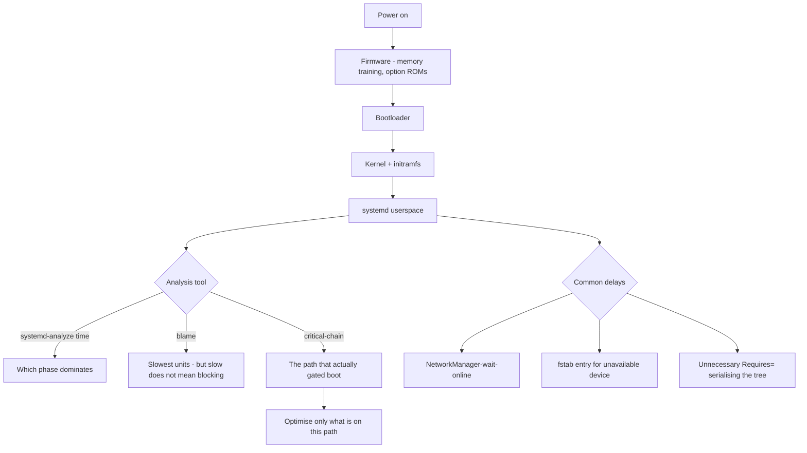

# Boot Performance Analysis with systemd-analyze

**Level:** Intermediate
**Tree:** [Kernel, Performance & Observability](../README.md)
**Branch:** [Tracing & Boot Analysis](README.md)
**Forest:** [Linux](../../../README.md)

## Explanation

# Boot Performance Analysis with systemd-analyze

Boot time matters more than it used to. Autoscaling groups, VM fleets that patch and reboot on a schedule, and disaster recovery all care how long a host takes to become useful.

## Where the time actually goes

**systemd-analyze** splits boot into firmware, loader, kernel and userspace. Firmware time on physical servers is often dominated by memory training and option ROM initialisation and is not something Linux can influence - recognising that early avoids optimising the wrong layer entirely.

**systemd-analyze blame** lists units by how long they took, but that list is routinely misread: a slow unit that nothing waits on does not delay boot at all.

**systemd-analyze critical-chain** is the tool that matters. It shows the dependency path that actually determined when the boot completed. Optimising anything off that chain achieves nothing.

## The usual culprits

Network waits dominate. **NetworkManager-wait-online** blocks until an interface is up, which is correct when a service genuinely needs the network and a pure waste when nothing does. A DHCP timeout on an unplugged interface can add 30 seconds or more.

Storage is second: an fstab entry for an unavailable device blocks boot until it times out, which is why network storage needs **_netdev** and **nofail** where appropriate.

## Ordering versus requirement

The most common self-inflicted delay comes from confusing **After=** (ordering) with **Requires=** (dependency). After= only says "if both are starting, start this one second"; it does not pull the other unit in. Adding unnecessary Requires= creates dependency chains that serialise a boot which could otherwise have parallelised.

## Architecture and flow



## Commands

### Command 1

Total boot time split into firmware, loader, kernel and userspace

```text
systemd-analyze time
```

### Command 2

Slowest units - useful context, but not proof anything was blocking

```text
systemd-analyze blame | head -20
```

### Command 3

The dependency path that actually determined boot completion - the one that matters

```text
systemd-analyze critical-chain
```

### Command 4

Critical path to a specific target rather than the default

```text
systemd-analyze critical-chain multi-user.target
```

### Command 5

Full timeline as an SVG showing parallelism and where serialisation occurred

```text
systemd-analyze plot > boot.svg
```

### Command 6

Validate a unit file for ordering and dependency errors before deploying it

```text
systemd-analyze verify /etc/systemd/system/myapp.service
```

### Command 7

Jobs still running during a slow boot, and units that failed

```text
systemctl list-jobs; systemctl list-units --state=failed
```

### Command 8

Remove the network wait where no boot-time service actually requires it

```text
systemctl disable NetworkManager-wait-online.service
```

## Automation scripts

### Boot critical path analyser

```bash
#!/usr/bin/env bash
# Reports where boot time went and, importantly, distinguishes units that were
# merely slow from units that actually gated the boot.
set -uo pipefail
THRESH="${1:-60}"
rc=0

echo "== boot time =="
systemd-analyze time 2>/dev/null | sed 's/^/  /'

total=$(systemd-analyze time 2>/dev/null | grep -oE "= ?[0-9.]+s" | tail -1 | tr -d "= s")
if [ -n "${total:-}" ]; then
  over=$(awk -v t="$total" -v x="$THRESH" 'BEGIN{print (t+0 > x) ? 1 : 0}')
  [ "$over" -eq 1 ] && { echo "  WARNING: boot exceeded ${THRESH}s"; rc=1; }
fi

echo "== critical chain (what actually gated boot) =="
systemd-analyze critical-chain 2>/dev/null | head -15 | sed 's/^/  /'

echo "== slowest units (context only - slow != blocking) =="
systemd-analyze blame 2>/dev/null | head -8 | sed 's/^/  /'

echo "== known delay sources =="
if systemctl is-enabled NetworkManager-wait-online.service >/dev/null 2>&1; then
  t=$(systemd-analyze blame 2>/dev/null | grep "NetworkManager-wait-online" | awk '{print $1}')
  echo "  NetworkManager-wait-online is ENABLED (${t:-unknown})"
  echo "    disable it unless a boot-time service genuinely needs the network"
fi

failed=$(systemctl list-units --state=failed --no-legend 2>/dev/null | wc -l)
echo "  failed units: $failed"
[ "${failed:-0}" -gt 0 ] && { systemctl list-units --state=failed --no-legend | sed 's/^/    /'; rc=1; }
exit $rc
```

## Lab

**Objective:** Reduce boot time by optimising the critical chain, and prove that optimising off it changes nothing.

### Steps

1. Record baseline boot time and capture the critical chain and blame output.
2. Identify the slowest unit in blame that is NOT on the critical chain.
3. Disable or speed up that unit, reboot, and confirm total boot time is unchanged.
4. Identify the top unit on the critical chain and address that instead.
5. Disable NetworkManager-wait-online if no boot service requires the network, and measure the saving.
6. Add an fstab entry for a non-existent network device without _netdev and observe boot hang until timeout.

### Validation

A unit reported as slow by systemd-analyze blame is optimised and total boot time is shown NOT to improve, demonstrating that blame ranks duration rather than impact,A unit on the critical-chain is addressed and total boot time falls measurably, with both timings taken across several boots rather than one,systemd-analyze critical-chain is used to distinguish the two cases before any change, so the target is chosen from evidence rather than from the largest number,Any unit removed or disabled to gain time is recorded with what it did, because boot time reclaimed by dropping a needed service is a fault deferred to first use

## Operational automation

## Automating boot optimisation

**Track boot time as a fleet metric.** A host whose boot time has crept from 20 seconds to two minutes is telling you something changed - usually a timeout being hit that nobody noticed.

**Validate unit files with systemd-analyze verify in CI.** It catches ordering and dependency mistakes before they reach a host and serialise its boot.

**Use nofail and _netdev deliberately in fstab.** A single entry for an unavailable device blocks boot until timeout and can drop a host into emergency mode; these two options are the difference between a degraded boot and no boot.

**Prefer socket activation and After= over Requires= chains.** Every unnecessary hard dependency removes an opportunity for systemd to parallelise, and boot serialisation is almost always self-inflicted.

## Troubleshooting

### Scenario 1: Boot takes 90 seconds longer than expected with no obvious error

**Likely cause:** A unit is hitting its default 90-second timeout - typically a network wait or a mount for an unavailable device

**Resolution:** Look for the ~90s entry in systemd-analyze blame; add nofail or _netdev to the fstab entry or disable the unnecessary network wait

### Scenario 2: Disabling the slowest unit in blame made no difference to boot time

**Likely cause:** That unit was not on the critical chain - it ran in parallel and nothing was waiting for it

**Resolution:** Use systemd-analyze critical-chain to find the units that actually gated completion, and optimise those

### Scenario 3: System drops to emergency mode after adding storage

**Likely cause:** An fstab entry references a device that is not available at boot, and the mount is treated as required

**Resolution:** Add nofail so boot continues, and _netdev for network-backed storage so it is ordered after networking

### Scenario 4: Boot is slow only on physical servers, not on VMs

**Likely cause:** Firmware time - memory training and option ROM initialisation - which Linux cannot influence

**Resolution:** Confirm with systemd-analyze time that firmware dominates; address it through BIOS settings such as fast boot and disabling unused controllers

## Interview questions

### 1. Why is systemd-analyze blame misleading on its own?

Because it ranks units by how long they took, not by whether anything was waiting for them. systemd starts units in parallel wherever dependencies allow, so a unit that takes 40 seconds while nothing depends on it delays the boot by exactly zero. Optimising it feels productive and achieves nothing. critical-chain is the tool that matters because it shows the actual dependency path that determined when boot completed. The correct method is to use blame for context and critical-chain to decide where to spend effort.

### 2. What is the difference between After= and Requires=, and why does it matter for boot time?

After= expresses ordering only: if both units happen to be starting, this one starts second. It does not cause the other unit to be started at all. Requires= expresses a hard dependency: the other unit is pulled in, and if it fails this unit fails too. People frequently add Requires= when they only meant ordering, and every unnecessary hard dependency creates a chain that systemd must serialise rather than parallelise. That is one of the most common self-inflicted causes of slow boot, and it also makes failures cascade further than intended.

### 3. A fleet of VMs suddenly boots 90 seconds slower after a network change. What is your first hypothesis?

Something is hitting the default systemd timeout, and 90 seconds is exactly that default, so the number itself is the clue. The most likely candidate is NetworkManager-wait-online blocking because an interface now fails to come up - perhaps DHCP no longer responds on a VLAN, or an interface was renamed. The second candidate is an fstab entry for network-backed storage that is no longer reachable. I would check systemd-analyze blame for an entry close to 90 seconds, confirm against critical-chain that it is actually gating boot, and then either fix the underlying network problem or remove the dependency if nothing at boot genuinely needs it.

## Certification alignment

- RHCSA EX200 - manage systemd services, targets and boot process
- RHCE EX294 - automate service and boot configuration
- CompTIA Linux+ XK0-005 - boot process and systemd troubleshooting
- LFCS - system startup and service management

## References

- man 1 systemd-analyze, man 5 systemd.unit, man 5 systemd.mount
- Red Hat documentation - Managing systemd and optimising boot
- systemd documentation - unit ordering, dependencies and socket activation
- freedesktop systemd wiki - boot performance optimisation notes

## Suggested video search

systemd-analyze boot performance critical-chain blame plot optimization tutorial

---

> Validate commands, versions, permissions, licensing, and rollback procedures in an isolated lab before production use.
