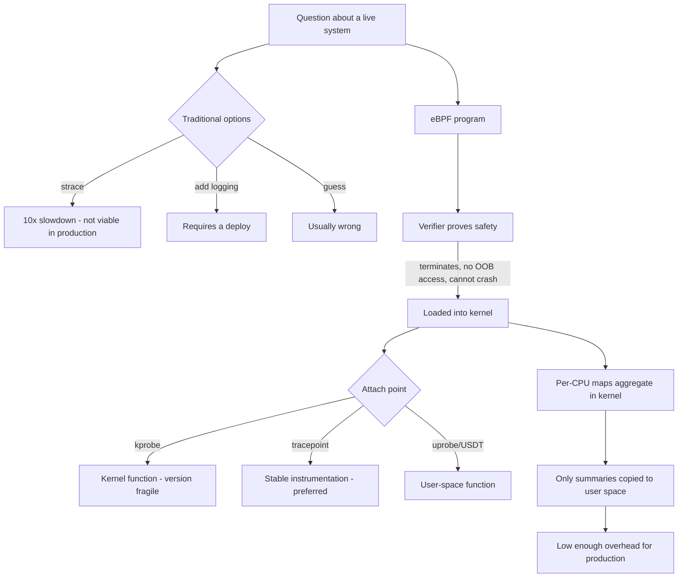

# eBPF and bpftrace Production Tracing

**Level:** Advanced
**Tree:** [Kernel, Performance & Observability](../README.md)
**Branch:** [Tracing & Boot Analysis](README.md)
**Forest:** [Linux](../../../README.md)

## Explanation

# eBPF and bpftrace Production Tracing

Traditional debugging on a production system means strace (which can slow a process by an order of magnitude), adding logging (which needs a deploy), or guessing. eBPF changed that: it runs verified, sandboxed programs in the kernel with overhead low enough to use on live production.

## Why it is safe

An eBPF program is checked by the **verifier** before it loads. The verifier proves the program terminates, does not access memory out of bounds and cannot crash the kernel. That guarantee is what makes it acceptable to attach probes to a running production system - something no previous kernel tracing mechanism could claim.

## Where you can attach

**kprobes** attach to kernel functions, **uprobes** to user-space functions, **tracepoints** to stable kernel instrumentation points, and **USDT** probes to statically defined probes in applications. Tracepoints are preferred where they exist because kprobe targets are internal function names that change between kernel versions.

## bpftrace

Writing raw eBPF is painful. **bpftrace** provides an awk-like language: a probe specification, an optional filter, and an action. A one-liner can answer questions that would otherwise take a debug build - which files a process is opening, the latency distribution of a syscall, which process is generating disk IO.

The **bcc tools** collection provides ready-made scripts (execsnoop, opensnoop, biolatency, tcplife) that cover most of what you need day to day.

## The honest limitations

eBPF is not free - high-frequency probes on a busy system do cost measurable CPU. It requires a reasonably modern kernel and matching headers, and probe availability varies. And attaching probes to arbitrary kernel functions creates a dependency on kernel internals that can break on upgrade.

## Architecture and flow



## Commands

### Command 1

List available tracepoints - the stable attach points worth preferring

```text
bpftrace -l "tracepoint:syscalls:*"
```

### Command 2

Show every file being opened system-wide, live

```text
bpftrace -e 'tracepoint:syscalls:sys_enter_openat { printf("%s %s\n", comm, str(args->filename)); }'
```

### Command 3

Histogram of read sizes - distribution rather than an average

```text
bpftrace -e 'kprobe:vfs_read { @bytes = hist(arg2); }'
```

### Command 4

Every process execution as it happens - catches short-lived processes top never sees

```text
execsnoop-bpfcc
```

### Command 5

Block IO latency as a histogram, which exposes tail latency an average hides

```text
biolatency-bpfcc 10 1
```

### Command 6

Every TCP connection with duration and bytes - who is actually talking to whom

```text
tcplife-bpfcc
```

### Command 7

Files a specific process opens, including the ones that fail

```text
opensnoop-bpfcc -p <pid>
```

### Command 8

Sample stacks at 99 Hz for 30 seconds to build a CPU flame graph

```text
profile-bpfcc -F 99 30
```

## Automation scripts

### eBPF readiness and quick-trace helper

```bash
#!/usr/bin/env bash
# Confirms the host can actually run eBPF tooling before an incident, not during one.
set -uo pipefail
rc=0

echo "== kernel =="
uname -r | sed 's/^/  /'
kv=$(uname -r | awk -F. '{printf "%d%03d", $1, $2}')
[ "${kv:-0}" -lt 4012 ] && { echo "  WARN: kernel may be too old for modern eBPF features"; rc=1; }

echo "== BPF config =="
for opt in CONFIG_BPF CONFIG_BPF_SYSCALL CONFIG_BPF_JIT; do
  v=$(grep -h "^$opt=" /boot/config-$(uname -r) 2>/dev/null || zgrep -h "^$opt=" /proc/config.gz 2>/dev/null)
  echo "  ${v:-$opt not found}"
done

echo "== tooling =="
for t in bpftrace bpftool; do
  if command -v "$t" >/dev/null 2>&1; then echo "  OK   $t present"
  else echo "  MISS $t - install bpftrace / bcc-tools"; rc=1; fi
done

echo "== probe availability =="
if command -v bpftrace >/dev/null 2>&1; then
  n=$(bpftrace -l 2>/dev/null | wc -l)
  echo "  $n probes visible"
  [ "${n:-0}" -eq 0 ] && { echo "  ALERT: no probes listed - missing kernel headers or insufficient privilege"; rc=1; }
fi

echo "== loaded BPF programs =="
command -v bpftool >/dev/null 2>&1 && bpftool prog show 2>/dev/null | head -5 | sed 's/^/  /' || echo "  n/a"
exit $rc
```

## Lab

**Objective:** Answer questions about a live system with eBPF that no log or metric would have told you.

### Steps

1. Verify eBPF readiness: kernel version, BPF config options and bpftrace probe listing.
2. Use execsnoop to catch short-lived processes that never appear in top or ps.
3. Write a bpftrace one-liner producing a histogram of read sizes and interpret the distribution.
4. Run biolatency during a disk-heavy workload and identify the tail latency an average would hide.
5. Use opensnoop against a specific process to find a file it is failing to open.
6. Measure the overhead by running a high-frequency probe and comparing throughput with and without it.

### Validation

A real question is answered on a running system with no restart, no added logging and no strace, so the diagnosis did not disturb the state being investigated,The probe overhead is measured by comparing throughput or latency with the probe attached and detached, rather than assumed negligible,The same investigation is contrasted with strace on a busy process, where the slowdown is severe enough to change the behaviour being observed,The kernel and tooling version dependency is noted, since a bpftrace script that works on one kernel can silently attach to nothing on another

## Operational automation

## Using eBPF responsibly

**Prefer tracepoints over kprobes in anything durable.** Tracepoints are a stable interface; kprobes attach to internal kernel function names that change between versions, so a kprobe-based tool can silently stop working after a kernel update.

**Aggregate in the kernel, not in user space.** The reason eBPF is cheap is that maps summarise data in-kernel and only the summary crosses to user space. A probe that prints every event defeats that and can flood a busy system.

**Measure probe overhead before leaving anything attached.** High-frequency probes on a busy host do cost real CPU, and a permanently attached tracer is now part of your production workload.

**Install and validate the tooling before you need it.** Discovering that bpftrace is missing or headers do not match during an incident is the worst possible time; readiness should be part of the build.

## Troubleshooting

### Scenario 1: bpftrace reports no probes or fails to attach

**Likely cause:** Missing kernel headers or debug symbols, or the command is not running with sufficient privilege

**Resolution:** Install kernel-devel matching the running kernel and BTF/debuginfo where required, and run as root or with CAP_BPF

### Scenario 2: A bpftrace script that worked previously fails after a kernel upgrade

**Likely cause:** It attaches to a kprobe on an internal function whose name or signature changed

**Resolution:** Rewrite against a tracepoint where one exists, since tracepoints are a stable interface

### Scenario 3: System slows noticeably while tracing

**Likely cause:** The probe fires at very high frequency or prints per-event output rather than aggregating

**Resolution:** Filter more tightly, aggregate into a map or histogram instead of printing, and sample rather than tracing every event

### Scenario 4: Events are missing from the trace output

**Likely cause:** The perf ring buffer overflowed because events were produced faster than user space consumed them

**Resolution:** Increase buffer size, reduce event volume with tighter filters, or aggregate in-kernel so far fewer events cross the boundary

## Interview questions

### 1. Why is eBPF safe to run on a production system when previous kernel tracing was not?

Because of the verifier. Before an eBPF program is loaded, the kernel statically analyses it and proves that it terminates, does not access memory out of bounds and cannot crash or hang the kernel. Programs that cannot be proven safe are simply rejected. That guarantee is what makes attaching probes to a live production system acceptable - a kernel module doing the same job could panic the machine. Combined with in-kernel aggregation, which keeps overhead low by summarising data before it crosses to user space, it makes production tracing genuinely practical rather than a last resort.

### 2. Why prefer tracepoints to kprobes?

Tracepoints are a stable, deliberately exposed interface with a defined argument structure, so a tool written against one keeps working across kernel versions. A kprobe attaches to an arbitrary internal kernel function by name, and those names, signatures and even existence change freely between releases because they are not a public interface. A kprobe-based script can therefore break silently on a kernel upgrade - and the failure mode is often that it attaches successfully but reports nothing, which is worse than an obvious error. Use kprobes for ad-hoc investigation, tracepoints for anything you intend to keep.

### 3. What would you use eBPF for that metrics and logs cannot tell you?

Anything requiring visibility between the instrumented points. Metrics tell you a service is slow; eBPF tells you the block IO latency distribution has a long tail on one device. Logs show requests but not that a process is opening a file that does not exist thousands of times a second. execsnoop catches short-lived processes that ps and top will never sample. It also answers questions retrospectively without a deploy - you can attach a probe to a running production process and get an answer in seconds, where adding a log line means a code change, a build and a release.

## Certification alignment

- Red Hat performance and observability curriculum
- CompTIA Linux+ XK0-005 - system monitoring and troubleshooting
- SRE and observability engineering practices
- Linux Foundation performance tuning tracks

## References

- Brendan Gregg - BPF Performance Tools (definitive reference)
- bpftrace reference guide and one-liner collection
- Kernel documentation - BPF and tracepoint interfaces
- iovisor/bcc project tools documentation

## Suggested video search

eBPF bpftrace bcc tools production tracing Linux observability tutorial

---

> Validate commands, versions, permissions, licensing, and rollback procedures in an isolated lab before production use.
