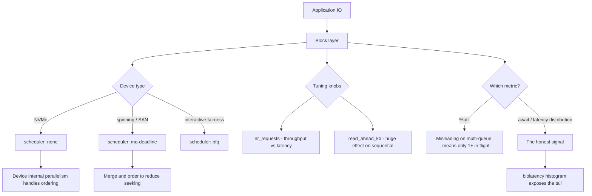

# Block IO Schedulers, Queue Depth and Storage Latency

**Level:** Advanced
**Tree:** [Kernel, Performance & Observability](../README.md)
**Branch:** [Tracing & Boot Analysis](README.md)
**Forest:** [Linux](../../../README.md)

## Explanation

# Block IO Schedulers, Queue Depth and Storage Latency

Storage is where most performance problems actually live, and the defaults are tuned for a general case that may be nothing like your workload.

## Schedulers by device type

The modern multi-queue schedulers are **none**, **mq-deadline**, **bfq** and **kyber**.

For NVMe, **none** is almost always correct. The device has enormous internal parallelism and its own reordering; adding a software scheduler just costs CPU and adds latency.

For spinning disks and many SAN LUNs, **mq-deadline** helps by merging and ordering requests to reduce seeking and by bounding worst-case latency.

**bfq** provides fairness between processes and suits interactive or desktop-like workloads. **kyber** targets low latency on fast devices with an explicit target.

Applying an aggressive scheduler to NVMe is a very common mistake that measurably reduces throughput.

## Latency, not utilisation

The most misread metric in Linux storage is **%util in iostat**. On a multi-queue device it indicates only that at least one request was in flight, so a device that can service dozens of concurrent requests shows 100% while barely working. **Await and the latency distribution are the honest signals**, and biolatency gives the distribution rather than an average that hides the tail.

## Queue depth and readahead

**nr_requests** controls how much can be queued. Deeper queues raise throughput and raise latency, which is the correct trade for batch and the wrong one for interactive.

**Readahead** is often left at a default that is far too small for large sequential reads and wastefully large for random access. It is one of the highest-return single settings on database and analytics workloads.

## Architecture and flow



## Commands

### Command 1

Show available schedulers with the active one in brackets

```text
cat /sys/block/nvme0n1/queue/scheduler
```

### Command 2

Set the scheduler - none is normally correct for NVMe

```text
echo none > /sys/block/nvme0n1/queue/scheduler
```

### Command 3

Extended per-device statistics; read await and aqu-sz, treat %util with suspicion

```text
iostat -xz 1
```

### Command 4

Block IO latency as a histogram - shows the tail an average conceals

```text
biolatency-bpfcc 10 1
```

### Command 5

Read and set queue depth - deeper means more throughput and more latency

```text
cat /sys/block/sda/queue/nr_requests; echo 256 > /sys/block/sda/queue/nr_requests
```

### Command 6

Tune readahead, which dominates large sequential read performance

```text
cat /sys/block/sda/queue/read_ahead_kb; echo 4096 > /sys/block/sda/queue/read_ahead_kb
```

### Command 7

Benchmark with a realistic queue depth rather than guessing

```text
fio --name=test --rw=randread --bs=4k --iodepth=32 --numjobs=4 --runtime=60 --group_reporting
```

### Command 8

Show queue topology: scheduler, queue depth, rotational flag and alignment

```text
lsblk -t
```

## Automation scripts

### Block device tuning auditor

```bash
#!/usr/bin/env bash
# Flags the classic misconfiguration: a heavyweight scheduler on NVMe, and
# readahead left at a default unsuited to the workload.
set -uo pipefail
rc=0

printf '%-14s %-10s %-12s %-10s %-10s\n' DEVICE ROTATIONAL SCHEDULER NR_REQ READAHEAD
for d in /sys/block/*; do
  dev=$(basename "$d")
  case "$dev" in loop*|ram*|dm-*|sr*) continue ;; esac
  [ -r "$d/queue/scheduler" ] || continue

  rot=$(cat "$d/queue/rotational" 2>/dev/null)
  sched=$(sed -n 's/.*\[\(.*\)\].*/\1/p' "$d/queue/scheduler" 2>/dev/null)
  nrq=$(cat "$d/queue/nr_requests" 2>/dev/null)
  ra=$(cat "$d/queue/read_ahead_kb" 2>/dev/null)

  printf '%-14s %-10s %-12s %-10s %-10s\n' "$dev" "${rot:-?}" "${sched:-?}" "${nrq:-?}" "${ra:-?}"

  case "$dev" in
    nvme*)
      if [ "$sched" != "none" ]; then
        echo "    ALERT: NVMe with scheduler=$sched - none is normally correct, this costs throughput"
        rc=1
      fi
      ;;
  esac
  if [ "${rot:-0}" = "1" ] && [ "$sched" = "none" ]; then
    echo "    WARN: spinning disk with no scheduler - mq-deadline usually helps by merging and ordering"
    rc=1
  fi
done

echo
echo "note: %util in iostat is unreliable on multi-queue devices."
echo "      it only means at least one request was in flight - use await and biolatency."
exit $rc
```

## Lab

**Objective:** Measure the real effect of scheduler and readahead choices, and prove that %util is not a saturation signal.

### Steps

1. Record the current scheduler, nr_requests and read_ahead_kb for each block device.
2. Benchmark random read IOPS on an NVMe device with fio using scheduler none.
3. Switch to bfq or mq-deadline, repeat the identical benchmark and record the difference.
4. Run a large sequential read at the default readahead, then raise read_ahead_kb and measure again.
5. While a moderate workload runs, observe iostat showing high %util and confirm with fio that far more throughput is still available.
6. Use biolatency to capture the latency distribution and identify the tail an average would hide.

### Validation

The same benchmark is run under at least two schedulers on the actual hardware, and the difference is recorded as numbers rather than a recommendation,Readahead is varied and the effect measured on a sequential and a random workload separately, since the two respond in opposite directions,A device showing 100% util is shown still accepting more throughput, proving util measures time with at least one request outstanding rather than saturation,Queue depth and await are used together to identify the actual saturation point, so the limit is located rather than assumed from the util figure

## Operational automation

## Automating storage tuning

**Set the scheduler by device type with a udev rule, not by hand.** Sysfs writes are lost at reboot, and a rule keyed on rotational and device type applies the correct choice automatically as hardware changes.

**Benchmark before and after, on the real hardware.** Storage tuning advice does not transfer between device classes; a setting that helps a SAN LUN can hurt local NVMe. Without a measurement you are guessing.

**Alert on latency, not utilisation.** %util is meaningless as a saturation signal on multi-queue devices and generates alerts that teams learn to ignore. Await and latency percentiles reflect what applications actually experience.

**Tune readahead per workload.** It is one of the highest-return single settings for sequential-heavy work such as analytics and backups, and one of the most wasteful when left large for random-access databases.

## Troubleshooting

### Scenario 1: NVMe throughput is well below the device specification

**Likely cause:** A software IO scheduler is active, adding ordering work the device already does internally

**Resolution:** Set the scheduler to none via a udev rule and re-benchmark; also confirm the device is not thermally throttling

### Scenario 2: Monitoring shows disks at 100% utilisation but applications are not complaining

**Likely cause:** %util on multi-queue devices only indicates at least one request in flight, not saturation

**Resolution:** Alert on await and latency percentiles instead; confirm real headroom by benchmarking with increasing queue depth

### Scenario 3: Sequential read performance is far below what the storage can deliver

**Likely cause:** Readahead is at a default far too small for large sequential access

**Resolution:** Increase read_ahead_kb and measure; values in the megabytes are appropriate for analytics and backup workloads

### Scenario 4: Average IO latency looks acceptable but users report intermittent stalls

**Likely cause:** A long tail is hidden by the average - most requests are fast while a small fraction are very slow

**Resolution:** Use biolatency to see the distribution and target the tail; investigate queue depth, device saturation or a failing device

## Interview questions

### 1. Why is none usually the right IO scheduler for NVMe?

Because the device already does the work a scheduler exists to do. NVMe has deep internal parallelism, multiple hardware queues and its own reordering and merging logic, so a software scheduler adds CPU work and latency in exchange for ordering the device would have handled better itself. Schedulers earn their cost on spinning media, where reordering requests to reduce head seeks is a genuine and large win, or where you need fairness between processes. Applying bfq or a deadline scheduler to fast NVMe is a common and measurable performance mistake.

### 2. Why should you not trust %util from iostat?

Because it was designed for single-queue devices where one request in flight genuinely meant the device was busy. On a multi-queue NVMe or a SAN LUN that can service dozens of concurrent requests, %util reports 100% as soon as a single request is outstanding, so a device operating at a small fraction of its capability appears fully saturated. Teams alert on it, get constant false positives and eventually ignore the metric. The honest signals are await and the latency distribution, because those reflect what the application actually waits for.

### 3. How does queue depth trade off throughput against latency?

A deeper queue lets more requests be outstanding simultaneously, which keeps the device busy and raises aggregate throughput because there is always work available. But each individual request may now wait behind more others, so per-request latency rises. For batch workloads such as backups or analytics that is the right trade - you care about total work completed. For interactive or transactional workloads it is the wrong one, because a user or a transaction is waiting on each individual request. The correct depth therefore depends on what you are optimising for, which is why it should be measured against the real workload rather than copied from a guide.

## Certification alignment

- RHCSA EX200 - manage storage and analyse system performance
- RHCE EX294 - automate storage and performance configuration
- CompTIA Linux+ XK0-005 - storage performance and troubleshooting
- Performance engineering - storage latency methodology

## References

- Kernel documentation - block layer, multi-queue and IO schedulers
- Red Hat documentation - Monitoring and managing system status and performance
- Brendan Gregg - Systems Performance (disk IO chapters)
- fio documentation and man 1 iostat

## Suggested video search

Linux block IO scheduler mq-deadline none NVMe queue depth iostat latency tuning

---

> Validate commands, versions, permissions, licensing, and rollback procedures in an isolated lab before production use.
