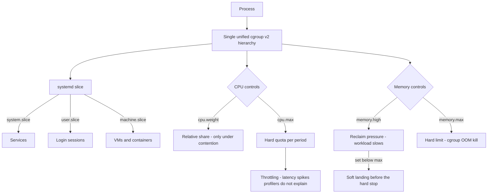

# cgroups v2 Resource Control and systemd Slices

**Level:** Advanced
**Tree:** [Kernel, Performance & Observability](../README.md)
**Branch:** [Resource Control & Memory](README.md)
**Forest:** [Linux](../../../README.md)

## Explanation

# cgroups v2 Resource Control and systemd Slices

cgroups are how Linux stops one workload starving everything else. Containers, systemd services and virtual machines all sit on the same mechanism, so understanding it once explains resource behaviour everywhere.

## v2 changed the model

cgroups v1 had a separate hierarchy per controller, so a process could be in one cgroup for CPU and a different one for memory - which made coherent policy nearly impossible. **v2 uses a single unified hierarchy**: one tree, all controllers, one place a process belongs. RHEL 9 and modern distributions default to v2, and it is what container runtimes now target.

## The four numbers that matter

**cpu.max** is a hard ceiling expressed as quota per period. **cpu.weight** is a relative share applied only under contention - a workload with a low weight still gets the whole machine when nothing else wants it.

**memory.max** is a hard limit, and exceeding it triggers the OOM killer inside that cgroup. **memory.high** is the more useful control: exceeding it applies increasing reclaim pressure and throttling rather than killing, so the workload slows down instead of dying. Setting memory.high below memory.max gives you a soft landing before the hard limit.

## systemd slices

systemd expresses all of this through **slices**, and every unit lands in one. The stock layout is system.slice for services, user.slice for logins and machine.slice for VMs and containers. Setting **MemoryMax** or **CPUQuota** on a unit writes the corresponding cgroup value, which is far more maintainable than manipulating the filesystem directly.

## The trap

The most common production surprise is **CPU throttling that looks like slow code**. A container with cpu.max set will be stopped dead at the end of each period once quota is used, producing latency spikes that profilers do not explain. Always check nr_throttled before optimising anything.

## Architecture and flow



## Commands

### Command 1

Show the whole cgroup tree as systemd sees it - which processes are in which slice

```text
systemd-cgls
```

### Command 2

Live resource consumption per cgroup - the fastest way to find what is consuming a host

```text
systemd-cgtop
```

### Command 3

Apply memory limits with a soft threshold below the hard one

```text
systemctl set-property nginx.service MemoryMax=2G MemoryHigh=1500M
```

### Command 4

Cap a service at one and a half cores

```text
systemctl set-property myapp.service CPUQuota=150%
```

### Command 5

Read nr_throttled and throttled_usec - proof of whether throttling is causing latency

```text
cat /sys/fs/cgroup/system.slice/myapp.service/cpu.stat
```

### Command 6

PSI memory pressure for the cgroup - stall time is a better signal than usage

```text
cat /sys/fs/cgroup/system.slice/myapp.service/memory.pressure
```

### Command 7

Run a command in an ad-hoc constrained scope for testing limits

```text
systemd-run --scope -p MemoryMax=512M -p CPUQuota=50% ./stress-test
```

### Command 8

Read the effective limits and current usage for a unit

```text
systemctl show nginx.service -p MemoryMax -p CPUQuota -p MemoryCurrent
```

## Automation scripts

### CPU throttling and memory pressure detector

```bash
#!/usr/bin/env bash
# Finds cgroups being throttled or under memory pressure - the two causes of
# "slow application" that never show up in application profiling.
set -uo pipefail
CG=/sys/fs/cgroup
rc=0

[ -d "$CG" ] || { echo "cgroup filesystem not found"; exit 2; }
[ -f "$CG/cgroup.controllers" ] || { echo "not running cgroups v2"; exit 2; }

echo "== CPU throttling =="
found=0
while IFS= read -r stat; do
  d=$(dirname "$stat")
  nr=$(awk '/^nr_throttled/{print $2}' "$stat" 2>/dev/null || echo 0)
  [ "${nr:-0}" -gt 0 ] || continue
  us=$(awk '/^throttled_usec/{print $2}' "$stat" 2>/dev/null || echo 0)
  printf '  THROTTLED %-58s periods=%s time=%ss\n' "${d#$CG/}" "$nr" "$((us/1000000))"
  found=1; rc=1
done < <(find "$CG" -name cpu.stat 2>/dev/null)
[ "$found" -eq 0 ] && echo "  none"

echo "== memory pressure (PSI) =="
found=0
while IFS= read -r psi; do
  d=$(dirname "$psi")
  avg=$(awk -F'avg10=' '/^some/{split($2,a," "); print a[1]}' "$psi" 2>/dev/null || echo 0)
  [ -n "${avg:-}" ] || continue
  over=$(awk -v a="$avg" 'BEGIN{print (a+0 > 5.0) ? 1 : 0}')
  [ "$over" -eq 1 ] || continue
  printf '  PRESSURE  %-58s some_avg10=%s%%\n' "${d#$CG/}" "$avg"
  found=1; rc=1
done < <(find "$CG" -name memory.pressure 2>/dev/null)
[ "$found" -eq 0 ] && echo "  none"
exit $rc
```

## Lab

**Objective:** Constrain a workload with cgroups v2 and prove that CPU throttling produces latency the application itself cannot explain.

### Steps

1. Confirm the host is running cgroups v2 by checking for /sys/fs/cgroup/cgroup.controllers.
2. Run a CPU-bound workload in a systemd scope with CPUQuota=50% and measure its completion time.
3. Read cpu.stat and record nr_throttled and throttled_usec climbing.
4. Raise the quota to 200% and confirm both the time and the throttle counters change.
5. Run a memory-hungry workload with MemoryHigh set below MemoryMax and observe it slow rather than die.
6. Lower MemoryMax below the workload requirement and observe the cgroup OOM kill instead.

### Validation

A workload held at memory.high is observed being throttled and staying alive, and the same workload at memory.max is killed - the two outcomes produced deliberately rather than described,Latency under throttling is measured and correlated with memory.pressure, showing the stall the application itself cannot see,An application profiler is run during the throttling and shown to attribute the time elsewhere, which is why the cgroup metric is the one that answers the question,The chosen limits are recorded with the workload they were measured against, since a limit copied from another service is a guess wearing a number

## Operational automation

## Automating resource control

**Set limits through systemd unit properties, not by writing to the cgroup filesystem.** Direct writes are lost on restart and invisible to anyone reading the unit; drop-in files are declarative and reviewable.

**Always set MemoryHigh below MemoryMax.** high throttles and reclaims, max kills. Configuring only max means the first sign of trouble is a dead process rather than a slow one.

**Monitor nr_throttled as a first-class metric.** It is the single most misdiagnosed performance signal in containerised environments - engineers optimise code for weeks when the answer is that the quota is too low.

**Prefer PSI pressure metrics to raw utilisation.** Pressure measures time actually lost to waiting for a resource, which correlates with user-visible latency far better than a utilisation percentage.

## Troubleshooting

### Scenario 1: An application has latency spikes that profiling cannot explain

**Likely cause:** The cgroup CPU quota is being exhausted and the workload is stopped until the next period

**Resolution:** Check nr_throttled in cpu.stat; raise cpu.max or reduce concurrency so the work fits within the period

### Scenario 2: A process is killed with no OOM message in the system log

**Likely cause:** It hit the cgroup memory limit, so the kill was cgroup-scoped rather than a system-wide OOM event

**Resolution:** Check memory.events for oom_kill counts in the unit cgroup; raise MemoryMax or add MemoryHigh to throttle before the hard limit

### Scenario 3: Limits set by writing to /sys/fs/cgroup disappear after a restart

**Likely cause:** Direct filesystem writes are runtime-only; systemd recreates the cgroup on unit start

**Resolution:** Use systemctl set-property or a drop-in file so the limit is part of the unit definition

### Scenario 4: A container runtime reports cgroup errors on a modern host

**Likely cause:** The runtime expects cgroups v1 while the host is running the unified v2 hierarchy

**Resolution:** Update the runtime to a version supporting v2, or boot with systemd.unified_cgroup_hierarchy=0 as a temporary measure

## Interview questions

### 1. What is the difference between memory.high and memory.max?

memory.max is a hard limit - crossing it invokes the OOM killer within that cgroup and the process dies. memory.high is a throttling threshold: when usage exceeds it the kernel applies aggressive reclaim and slows the workload down, but does not kill it. In practice you want both, with high set some way below max, so a workload that starts consuming too much degrades gracefully and gives you a chance to observe and react before anything is killed. Configuring only max means your first signal is a dead process.

### 2. An application in a container has unexplained latency spikes. Where do you look?

cpu.stat, specifically nr_throttled and throttled_usec. If a CPU quota is set, the workload is hard-stopped when it exhausts its quota within a period and resumes at the start of the next one. That produces latency spikes with a very characteristic period-length shape, and no application profiler will explain it because the process is not running at all during the stall. It is probably the most commonly misdiagnosed performance problem in containerised environments - teams optimise code for weeks when the real fix is raising the quota or reducing per-request concurrency.

### 3. Why did cgroups v2 move to a unified hierarchy?

Because v1 had a separate hierarchy per controller, so a process could belong to one cgroup for CPU and a completely different one for memory. That made coherent resource policy extremely hard to express and reason about, and it created situations where controllers made contradictory decisions about the same workload. v2 has a single tree in which a process belongs to exactly one cgroup, with controllers enabled per subtree. That is simpler to reason about, allows controllers to cooperate, and is what enabled features like PSI pressure accounting per cgroup.

## Certification alignment

- RHCSA EX200 - manage system resources and systemd units
- RHCE EX294 - automate service resource configuration
- CompTIA Linux+ XK0-005 - process and resource management
- Kubernetes CKA - resource requests, limits and QoS classes

## References

- Kernel documentation - Control Group v2 (cgroup-v2.rst)
- Red Hat documentation - Managing system resources with control groups
- man 5 systemd.resource-control
- PSI (Pressure Stall Information) kernel documentation

## Suggested video search

Linux cgroups v2 systemd slices CPU quota memory limits throttling tutorial

---

> Validate commands, versions, permissions, licensing, and rollback procedures in an isolated lab before production use.
