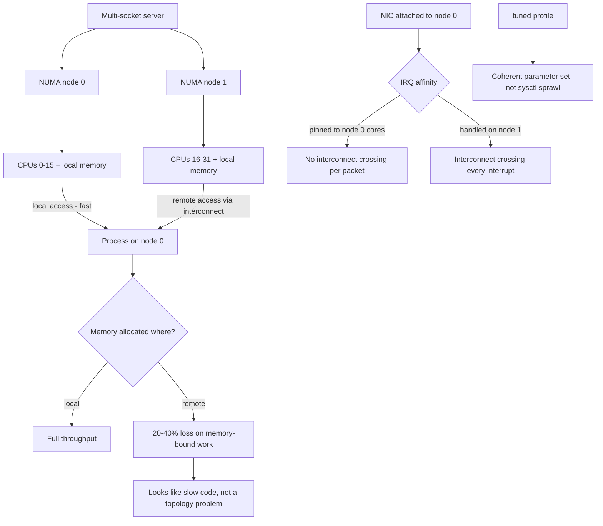

# NUMA Topology, IRQ Affinity and Kernel Tuning

**Level:** Advanced
**Tree:** [Kernel, Performance & Observability](../README.md)
**Branch:** [Resource Control & Memory](README.md)
**Forest:** [Linux](../../../README.md)

## Explanation

# NUMA Topology, IRQ Affinity and Kernel Tuning

On any modern multi-socket server, memory is not uniformly fast. Each CPU socket has memory attached directly to it, and reaching another socket memory crosses an interconnect that costs meaningful latency and bandwidth.

## Why NUMA matters

A process running on socket 0 but allocated memory on socket 1 pays a **remote access penalty on every single memory reference**. On memory-bound workloads - databases, in-memory caches, virtual machines - this routinely costs 20 to 40 percent throughput, and it never shows up as CPU saturation. It looks like the application is simply slow.

The kernel tries to allocate locally, but a process that starts on one node and later migrates, or a VM whose vCPUs span nodes, ends up with memory scattered. **numastat** shows numa_miss and numa_foreign counters climbing when this is happening.

The fix is to pin: **numactl** for processes, and for virtual machines pin vCPUs and memory to a single node where the VM fits within it.

## IRQ affinity

High-throughput NICs and NVMe devices generate enormous interrupt loads. By default irqbalance spreads them, but on latency-sensitive workloads you often want interrupts pinned to specific cores **on the same NUMA node as the device**, with application threads kept off those cores. An interrupt handled on the wrong node crosses the interconnect for every packet.

## tuned rather than sysctl sprawl

RHEL ships **tuned** with profiles that set coherent groups of kernel parameters for a workload type - throughput-performance, latency-performance, virtual-host and so on. Applying a profile is far more maintainable than accumulating dozens of individually reasoned sysctl values that nobody can later justify. Start from the closest profile and record any deviation as a documented override.

## Architecture and flow



## Commands

### Command 1

Show NUMA nodes, their CPUs, memory sizes and inter-node distances

```text
numactl --hardware
```

### Command 2

Per-node memory statistics; watch numa_miss and numa_foreign for locality failures

```text
numastat -m
```

### Command 3

Show exactly which nodes a specific process has its memory on

```text
numastat -p <pid>
```

### Command 4

Pin a process to one node for both CPU and memory

```text
numactl --cpunodebind=0 --membind=0 ./workload
```

### Command 5

Topology overview including cache and device locality

```text
lscpu | grep -i numa; lstopo-no-graphics --of console
```

### Command 6

Interrupt distribution across cores and the affinity of a specific IRQ

```text
cat /proc/interrupts | head -20; cat /proc/irq/<n>/smp_affinity_list
```

### Command 7

List, check and apply a coherent tuning profile

```text
tuned-adm list; tuned-adm active; tuned-adm profile throughput-performance
```

### Command 8

Confirm the running system still matches the active profile - detects manual drift

```text
tuned-adm verify
```

## Automation scripts

### NUMA locality and IRQ placement auditor

```bash
#!/usr/bin/env bash
# Reports cross-node memory access and whether device interrupts sit on the
# same NUMA node as the device - both silent throughput killers.
set -uo pipefail
rc=0

command -v numactl >/dev/null 2>&1 || { echo "numactl not installed"; exit 2; }

nodes=$(numactl --hardware | awk '/^available:/{print $2}')
echo "NUMA nodes: $nodes"
if [ "${nodes:-1}" -le 1 ]; then echo "single node - NUMA locality not a concern"; exit 0; fi

echo "== cross-node access =="
if command -v numastat >/dev/null 2>&1; then
  miss=$(numastat 2>/dev/null | awk '/numa_miss/{s=0; for(i=2;i<=NF;i++) s+=$i; print s}')
  hit=$(numastat 2>/dev/null | awk '/numa_hit/{s=0; for(i=2;i<=NF;i++) s+=$i; print s}')
  echo "  numa_hit=$hit numa_miss=$miss"
  if [ -n "${miss:-}" ] && [ -n "${hit:-}" ] && [ "${hit:-0}" -gt 0 ]; then
    pct=$(awk -v m="$miss" -v h="$hit" 'BEGIN{printf "%.1f", (m*100)/(m+h)}')
    echo "  remote ratio: ${pct}%"
    over=$(awk -v p="$pct" 'BEGIN{print (p+0 > 10) ? 1 : 0}')
    [ "$over" -eq 1 ] && { echo "  ALERT: high remote memory ratio - pin workloads with numactl"; rc=1; }
  fi
fi

echo "== device IRQ locality =="
for dev in /sys/class/net/*/device; do
  [ -e "$dev/numa_node" ] || continue
  nic=$(basename "$(dirname "$dev")")
  dn=$(cat "$dev/numa_node" 2>/dev/null)
  [ "${dn:--1}" -ge 0 ] || continue
  echo "  $nic is attached to NUMA node $dn"
done

echo "== tuned =="
if command -v tuned-adm >/dev/null 2>&1; then
  tuned-adm active 2>/dev/null | sed 's/^/  /'
  tuned-adm verify >/dev/null 2>&1 && echo "  OK: running config matches profile" \
    || { echo "  WARN: system has drifted from the active tuned profile"; rc=1; }
fi
exit $rc
```

## Lab

**Objective:** Measure the real cost of NUMA remote memory access and correct it by pinning.

### Steps

1. Map the topology with numactl --hardware and record node count, CPUs per node and inter-node distance.
2. Run a memory-bound benchmark with no pinning and record throughput plus numastat miss counters.
3. Deliberately pin CPU to node 0 and memory to node 1 and measure the throughput penalty.
4. Pin both CPU and memory to node 0 and measure again, quantifying the improvement.
5. Identify which NUMA node the primary NIC is attached to and inspect its IRQ affinity.
6. Apply a tuned profile appropriate to the workload and run tuned-adm verify to confirm no drift.

### Validation

Local versus remote memory access is measured on the actual hardware and expressed as a percentage difference, not taken from a vendor figure,The NUMA node of the network device is read from sysfs, and the interrupt affinity is checked against it - a device served by a remote node is the common misconfiguration,A workload pinned with numactl to the local node is compared against the same workload unpinned, and the difference is measured under identical load,numastat is used to show remote allocations occurring, so the fault is evidenced rather than inferred from topology alone

## Operational automation

## Automating performance tuning

**Use tuned profiles rather than accumulating sysctl settings.** A profile expresses a coherent intent for a workload type; a pile of individual sysctl values collected over years is unauditable and nobody can explain why any given one is there.

**Run tuned-adm verify in monitoring.** It detects manual changes that drifted the host away from its intended profile - a common source of one server behaving differently from its supposedly identical peers.

**Pin latency-sensitive workloads explicitly.** Relying on kernel heuristics is fine for general-purpose hosts, but databases and packet-processing workloads should have their NUMA placement stated rather than inferred.

**Record the measurement, not just the setting.** Any tuning change should be accompanied by a before and after number. Tuning applied without measurement is superstition, and it accumulates into configurations nobody dares change.

## Troubleshooting

### Scenario 1: A database performs 30 percent worse on a larger multi-socket server than on a smaller single-socket one

**Likely cause:** Memory is being allocated across NUMA nodes, so a large share of accesses cross the interconnect

**Resolution:** Confirm with numastat -p on the database process; pin it with numactl or configure the database NUMA awareness, sizing the instance to fit within one node where possible

### Scenario 2: Network throughput plateaus well below line rate with one CPU core saturated

**Likely cause:** All interrupts for the NIC are landing on a single core, often on a different NUMA node from the device

**Resolution:** Enable multiple receive queues, spread IRQ affinity across cores on the device local node, and keep application threads off those cores

### Scenario 3: Two supposedly identical servers perform differently

**Likely cause:** One has drifted from its tuned profile through manual sysctl changes

**Resolution:** Run tuned-adm verify on both and diff the effective sysctl values to find the deviation

### Scenario 4: A virtual machine has inconsistent performance on a NUMA host

**Likely cause:** Its vCPUs and memory span multiple nodes so guest scheduling decisions cause remote access unpredictably

**Resolution:** Size the VM to fit within a single node and pin it there, or expose virtual NUMA topology so the guest scheduler can make locality-aware decisions

## Interview questions

### 1. Why can a workload be slower on a bigger multi-socket server?

Because memory access is no longer uniform. Each socket has memory attached directly to it, and reaching memory on another socket crosses an interconnect with meaningfully higher latency and lower bandwidth. A memory-bound workload whose threads run on one socket while its memory sits on another pays that penalty on every reference, which typically costs twenty to forty percent throughput. On a single-socket machine that penalty simply does not exist. The insidious part is that it never appears as CPU saturation - the CPUs look busy but underutilised, and it presents as the application being inexplicably slow.

### 2. How do you know whether NUMA locality is actually hurting you?

numastat gives the system-wide counters - numa_hit for local allocations and numa_miss and numa_foreign for allocations that had to go elsewhere. A significant miss ratio indicates the kernel could not satisfy allocations locally. For a specific process, numastat -p shows exactly which nodes its memory is distributed across, which is the direct evidence. The practical test is to run the workload pinned with numactl to a single node and compare throughput - if pinning produces a large improvement, locality was the constraint.

### 3. Why prefer tuned profiles to setting sysctl values individually?

Because a profile is a coherent, named intent that someone can read and reason about, whereas a collection of individual sysctl settings accumulated over years becomes unauditable - nobody knows which values still serve a purpose, which were copied from a blog post, or which now conflict. tuned also lets you verify that a running system still matches its profile, which catches manual drift between hosts that are supposed to be identical. The right pattern is to start from the closest stock profile and record any deviation explicitly as a documented override, so every non-default value has a stated reason.

## Certification alignment

- RHCSA EX200 - analyse and tune system performance
- Red Hat RHCE EX294 - automate performance profile management
- CompTIA Linux+ XK0-005 - performance monitoring and tuning
- Performance engineering - NUMA and hardware locality

## References

- Red Hat documentation - Monitoring and managing system status and performance
- man 8 numactl, man 8 numastat, man 8 tuned-adm
- Brendan Gregg - Systems Performance (CPU and memory chapters)
- Kernel documentation - NUMA memory policy

## Suggested video search

Linux NUMA numactl IRQ affinity tuned profiles performance tuning tutorial

---

> Validate commands, versions, permissions, licensing, and rollback procedures in an isolated lab before production use.
