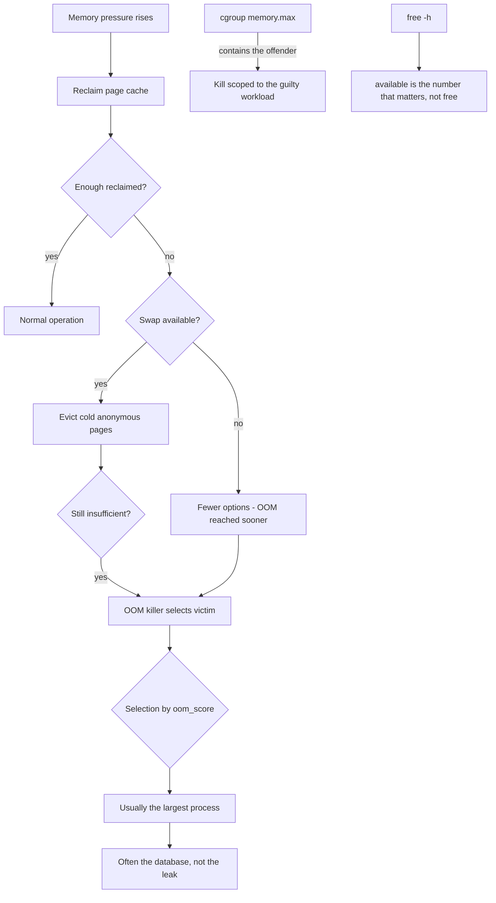

# Linux Memory Analysis: Swap, Page Cache and the OOM Killer

**Level:** Advanced
**Tree:** [Kernel, Performance & Observability](../README.md)
**Branch:** [Resource Control & Memory](README.md)
**Forest:** [Linux](../../../README.md)

## Explanation

# Memory Analysis, Swap and the OOM Killer

Linux memory accounting confuses almost everyone, and the confusion leads to bad decisions - most commonly, adding RAM to a machine that did not need it or disabling swap on one that did.

## free output is not what it looks like

The number people panic about is **used**, but Linux deliberately uses all spare memory for page cache because unused RAM is wasted RAM. Cache is reclaimable on demand. The column that actually matters is **available**, which estimates how much can be allocated without swapping. A host showing 2 GB free and 40 GB available is completely healthy.

## Swap is not a performance tier

A persistent myth is that swap makes a system slow and should be disabled. In reality swap lets the kernel evict genuinely cold anonymous pages so that hot pages and cache get RAM. **A system with no swap has fewer options under pressure, so it reaches the OOM killer sooner.**

What is true is that *swap thrashing* is catastrophic. The distinction is measured by **PSI pressure and swap-in rate**, not by swap usage. Pages sitting in swap untouched cost nothing.

## The OOM killer

When the kernel cannot reclaim enough, it selects a victim by **oom_score**, which is roughly proportional to memory footprint and adjustable via **oom_score_adj**. It usually kills the largest consumer - which is frequently the important database rather than the leaking process that caused it.

Protect critical services by lowering their oom_score_adj, and make leaky processes preferred victims by raising theirs. Better still, set **cgroup memory limits** so the offending workload is contained and killed within its own cgroup rather than triggering a system-wide OOM that takes the wrong process with it.

## Architecture and flow



## Commands

### Command 1

Memory overview - read the available column, not free

```text
free -h
```

### Command 2

PSI stall time for memory - the honest signal of whether pressure is hurting you

```text
cat /proc/pressure/memory
```

### Command 3

Watch si/so columns; sustained swap-in is thrashing, resident swap is harmless

```text
vmstat 1 10
```

### Command 4

Per-process memory by PSS, which apportions shared pages fairly unlike RSS

```text
smem -tk -s pss
```

### Command 5

Find previous OOM kills and which process was chosen

```text
grep -E "oom_kill|oom-kill" /var/log/messages; journalctl -k | grep -i "killed process"
```

### Command 6

Read a process OOM score and protect it from selection

```text
cat /proc/<pid>/oom_score; echo -500 > /proc/<pid>/oom_score_adj
```

### Command 7

Commit accounting and kernel slab usage - where memory hides outside processes

```text
cat /proc/meminfo | grep -E "Committed_AS|CommitLimit|Slab|SReclaimable"
```

### Command 8

Drop caches to prove cache is reclaimable - diagnostic only, never a fix

```text
echo 3 > /proc/sys/vm/drop_caches
```

## Automation scripts

### Memory pressure and OOM risk reporter

```bash
#!/usr/bin/env bash
# Distinguishes healthy cache usage from genuine pressure, and lists OOM-vulnerable processes.
set -uo pipefail
rc=0

echo "== memory =="
read -r _ total used free shared cache avail < <(free -b | awk '/^Mem:/{print}')
pct_avail=$(( avail * 100 / total ))
printf '  total=%sG available=%sG (%s%%) cache=%sG\n' \
  $((total/1073741824)) $((avail/1073741824)) "$pct_avail" $((cache/1073741824))
if   [ "$pct_avail" -lt 5 ];  then echo "  CRITICAL: under 5% available"; rc=2
elif [ "$pct_avail" -lt 15 ]; then echo "  WARNING: under 15% available"; rc=1
else echo "  OK: sufficient available memory (cache is reclaimable, ignore it)"; fi

echo "== PSI pressure =="
if [ -r /proc/pressure/memory ]; then
  some=$(awk -F'avg60=' '/^some/{split($2,a," "); print a[1]}' /proc/pressure/memory)
  full=$(awk -F'avg60=' '/^full/{split($2,a," "); print a[1]}' /proc/pressure/memory)
  echo "  some_avg60=${some}%  full_avg60=${full}%"
  over=$(awk -v f="${full:-0}" 'BEGIN{print (f+0 > 1.0) ? 1 : 0}')
  [ "$over" -eq 1 ] && { echo "  ALERT: real stalls occurring - this is genuine pressure"; rc=1; }
fi

echo "== swap activity =="
vmstat 1 3 | tail -1 | awk '{print "  si=" $7 " so=" $8 " (sustained non-zero = thrashing)"}'

echo "== top OOM candidates =="
for p in /proc/[0-9]*; do
  [ -r "$p/oom_score" ] || continue
  s=$(cat "$p/oom_score" 2>/dev/null) || continue
  [ "${s:-0}" -gt 0 ] || continue
  n=$(tr -d "\0" < "$p/comm" 2>/dev/null)
  a=$(cat "$p/oom_score_adj" 2>/dev/null)
  echo "$s ${p#/proc/} $n adj=$a"
done | sort -rn | head -5 | awk '{printf "  score=%-6s pid=%-8s %s %s\n", $1,$2,$3,$4}'
exit $rc
```

## Lab

**Objective:** Prove that cache is not a leak, that swap delays rather than causes OOM, and that oom_score_adj changes who dies.

### Steps

1. Record free -h output, then read a large file to fill page cache and observe free drop while available stays high.
2. Drop caches and confirm the memory returns instantly, proving cache was never consumed.
3. With swap enabled, run a workload exceeding RAM and observe cold pages move to swap while the system stays responsive.
4. Disable swap, repeat the workload, and observe the OOM killer trigger sooner.
5. Start a large process and a small critical process; exhaust memory and record which one the OOM killer chose.
6. Set oom_score_adj to -900 on the critical process, repeat, and confirm a different victim is selected.

### Validation

free output is reconciled against available rather than free, and the page cache is shown being reclaimed under pressure - demonstrating why the free column understates usable memory,The same workload is run with swap enabled and disabled, and OOM arrives SOONER without swap - the counter-intuitive result observed rather than asserted,oom_score_adj is used to change which process the kernel selects, and the selection is confirmed from the kernel log rather than predicted,The OOM event is located in the journal with the process, its score and the memory state at the time, so a future incident can be diagnosed after the fact

## Operational automation

## Automating memory management

**Alert on PSI pressure and available memory, never on used.** Alerting on used produces constant false positives because Linux correctly uses spare RAM for cache, and teams quickly learn to ignore the alert entirely.

**Protect critical services with oom_score_adj in the unit file.** systemd exposes OOMScoreAdjust, so protection is declarative and survives restarts rather than being applied by hand after an incident.

**Prefer cgroup limits to system-wide OOM.** A memory limit on the workload that misbehaves contains the damage to that workload; a system-wide OOM event picks by size and frequently kills something else entirely.

**Do not disable swap by reflex.** Size it deliberately and monitor swap-in rate. A small amount of swap gives the kernel room to evict genuinely cold pages, which usually improves behaviour under pressure rather than degrading it.

## Troubleshooting

### Scenario 1: Monitoring reports memory almost fully used but the system performs normally

**Likely cause:** Page cache is counted as used; Linux uses free memory for cache by design and reclaims it on demand

**Resolution:** Alert on the available field and on PSI pressure instead of used; confirm reclaimability with a one-off drop_caches in a test window

### Scenario 2: The OOM killer terminated the database rather than the leaking application

**Likely cause:** Selection is driven by oom_score, which is dominated by memory footprint, and the database was simply the largest

**Resolution:** Set OOMScoreAdjust negative on critical units and positive on known-leaky ones; better, cap the leaky workload with a cgroup memory limit

### Scenario 3: System becomes completely unresponsive under memory pressure

**Likely cause:** Swap thrashing - pages are being read back in as fast as they are written out

**Resolution:** Confirm with sustained si/so in vmstat and high PSI full pressure; reduce workload memory, add RAM, or apply cgroup limits so one workload cannot do this

### Scenario 4: Memory usage cannot be accounted for by any process

**Likely cause:** Kernel slab allocations or hugepages, which do not appear in process RSS totals

**Resolution:** Check Slab and SReclaimable in /proc/meminfo and use slabtop; investigate hugepage reservations that are allocated but unused

## Interview questions

### 1. Should you disable swap on a production Linux server?

Generally no, and the instinct to do so comes from confusing swap usage with swap thrashing. Swap gives the kernel somewhere to put genuinely cold anonymous pages so that hot pages and page cache can stay in RAM. Removing it does not remove memory pressure - it just removes an option, so the OOM killer arrives sooner and more abruptly. What is genuinely bad is thrashing, where pages are being swapped in as fast as they are swapped out, and you measure that with sustained si/so in vmstat and PSI full pressure, not with the amount of swap in use. Pages sitting in swap untouched cost nothing at all.

### 2. Why is the used column in free misleading?

Because Linux deliberately fills otherwise-idle memory with page cache, on the correct principle that unused RAM is wasted RAM. That cache is immediately reclaimable when something needs the memory, so counting it as used overstates consumption dramatically. The available column is the meaningful figure - it estimates how much can be allocated without swapping, accounting for reclaimable cache and slab. A server showing very little free but plenty available is behaving exactly as designed, and alerting on used is why so many memory alerts get ignored.

### 3. How do you stop the OOM killer choosing the wrong process?

Two approaches, and the second is better. First, adjust oom_score_adj so critical services are less attractive victims and known-risky ones are more attractive; systemd exposes this as OOMScoreAdjust so it can live in the unit file rather than being applied manually after an incident. Second and preferably, apply cgroup memory limits to the workload that misbehaves, so when it exceeds its allocation the kill is scoped to that cgroup and never becomes a system-wide OOM event at all. That way the process that caused the problem is the one that dies, which is not what global OOM selection guarantees.

## Certification alignment

- RHCSA EX200 - manage system resources and analyse performance
- RHCE EX294 - automate resource and performance configuration
- CompTIA Linux+ XK0-005 - memory management and troubleshooting
- Performance engineering fundamentals (USE method)

## References

- Kernel documentation - Memory management and OOM killer heuristics
- Red Hat documentation - Monitoring and managing system status and performance
- Brendan Gregg - Systems Performance, memory methodology chapters
- man 5 proc (oom_score, oom_score_adj, meminfo)

## Suggested video search

Linux memory management swap OOM killer page cache PSI analysis tutorial

---

> Validate commands, versions, permissions, licensing, and rollback procedures in an isolated lab before production use.
