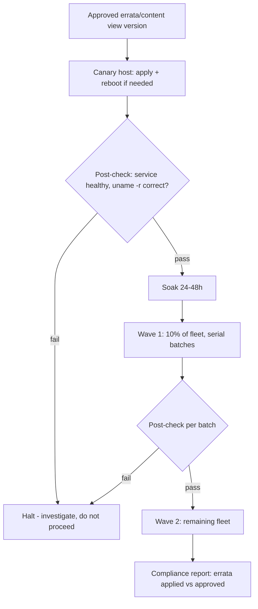

# Fleet Patch Automation with dnf and Ansible

**Level:** Expert
**Tree:** [Performance, Networking & Automation at Scale](../README.md)
**Branch:** [Fleet Automation & Provisioning](README.md)
**Forest:** [Linux](../../../README.md)

## Explanation

## Patching a thousand hosts without a thousand tickets

At small scale, dnf update on each host is fine. At fleet scale, patching needs three things layered on top: **scheduling** so patches land in controlled waves rather than everywhere at once, **idempotent orchestration** so the same playbook run is safe to repeat, and **verifiable state** so a change board can see exactly what changed on which hosts and roll back if needed.

dnf itself supports this partially: dnf-automatic applies updates on a timer with configurable behavior (notify-only, download-only, or apply), useful for low-risk dev tiers. dnf history is the built-in rollback primitive - dnf history undo <id> reverses a specific transaction cleanly because dnf records exactly what a transaction changed, unlike a bare rpm-level approach.

Fleet-scale enterprise patching layers Ansible (via ansible.builtin.dnf with state: latest scoped by package name/glob, never a blind whole-system update in one uncontrolled blast) organized into serial batches (serial: '10%' in a playbook) so a bad patch only affects a small wave before the play fails and halts. Pre-flight and post-flight checks matter more than the patch command itself: a pre-check confirms disk space and no pending reboot conflicts; a post-check confirms the target service/port responds and, for kernel updates, that the expected new kernel actually booted (uname -r comparison). Red Hat Satellite or AAP survey forms typically drive the actual errata selection so what gets installed traces to an approved content view version, not an arbitrary 'whatever is newest today'.

The discipline that prevents 3am pages: canary first (one host, soak 24-48h), then a small wave, then the fleet - each wave gated by the post-check passing, never advancing blindly by clock alone.

## Rollback

On RHEL the honest position is that **dnf history undo is real but limited**: it reverses a transaction where the previous packages are still available and nothing has since changed state that depends on them. It is not a snapshot, and it does not undo a schema migration, a config file rewritten by an RPM, or a service that has already run with new data.

The dependable rollback is at the **infrastructure layer** - a VM snapshot before the wave, or rebuilding from an image. Deciding which layer owns rollback before the patch window, rather than during it, is the difference between a controlled reversion and an outage spent discovering that dnf cannot help.

## Security implications

Patching is a security control whose **measure is time-to-patch for the exploited subset**, not percentage compliance. A fleet at 98% with the unpatched 2% being internet-facing is in a worse position than one at 80% where the exposed tier is current.

The tension worth stating: **the safest patch cadence for availability is the least safe for exposure**. Slower waves reduce the blast radius of a bad patch and lengthen the window an attacker has. That is a business decision, and it belongs with whoever owns the risk rather than being settled implicitly by a schedule.

## Monitoring

The signal that a wave succeeded is the **post-check passing on real service behaviour**, not that dnf exited zero. A host that patched cleanly and no longer serves is a successful transaction and a failed change.

Track **time from advisory to fleet-complete** as the programme metric. Percentage patched is a snapshot that says nothing about velocity, and velocity is what determines exposure between one advisory and the next.

## High availability and disaster recovery

In a clustered estate, patch order is a **quorum question**. Patching enough nodes at once to lose quorum takes the service down as effectively as the fault the cluster was built to survive, so the wave must respect the cluster, not the inventory alphabet.

Standby and DR hosts are the ones most often left behind, and they are the ones that must work when everything else has failed. **Patch DR on the same cadence as production**, or accept that failover lands on a stale, differently-configured estate at the worst moment.

## Anti-patterns

**Advancing waves by clock rather than by post-check.** It converts a staged rollout into a slower simultaneous one, and the pilot wave stops being a gate.

**Excluding a package to make an update succeed.** The exclusion outlives the reason and quietly pins a component nobody remembers, usually discovered when a security advisory cannot be applied.

**Patching with no soak on the pilot.** Many regressions surface only under a full daily cycle - a nightly batch, a backup, a month-end job - so a pilot promoted after an hour has tested almost nothing.

## Change control

Patching is the routine change most likely to be granted a **standing approval**, and standing approval is what turns a controlled process into an unexamined one. The approval should cover the *process* - waves, gates, rollback - rather than pre-approving any content.

The item genuinely needing per-instance review is an **out-of-band emergency patch**, because it skips the soak that normally catches regressions. Record what was skipped and why, so the risk accepted is visible rather than implied.

## Architecture and flow



## Commands

### Command 1

Show recent transactions as rollback candidates

```text
dnf history list | head -20
```

### Command 2

Reverse a specific past transaction cleanly, restoring prior package versions

```text
dnf history undo 42
```

### Command 3

Show whether the scheduled automatic-update timer is active and its next run

```text
dnf-automatic --timer status
```

### Command 4

Report whether a reboot is required after applied updates (kernel/glibc/systemd changes)

```text
needs-restarting -r
```

### Command 5

Dry-run the patch playbook against only the canary host group first

```text
ansible-playbook patch-fleet.yml --limit canary --check
```

### Command 6

Preview only security-relevant updates without applying them

```text
dnf update --security --assumeno
```

## Automation scripts

### patch-fleet.yml

```yaml
- name: Wave-based fleet patching with canary and post-check
  hosts: patch_targets
  serial: ["1", "10%", "100%"]
  max_fail_percentage: 0
  vars:
    target_kernel: "{{ expected_kernel_version }}"
  tasks:
    - name: Pre-check free disk space on /boot and /
      ansible.builtin.command: df -Ph /boot /
      register: disk_check
      changed_when: false

    - name: Apply approved security errata only
      ansible.builtin.dnf:
        name: "*"
        state: latest
        security: true
      register: patch_result

    - name: Reboot if needed_restarting flags it
      ansible.builtin.command: needs-restarting -r
      register: reboot_check
      failed_when: false
      changed_when: false

    - name: Reboot the host
      ansible.builtin.reboot:
        reboot_timeout: 600
      when: reboot_check.rc == 1

    - name: Post-check - confirm booted kernel matches expectation
      ansible.builtin.command: uname -r
      register: kernel_now
      changed_when: false
      failed_when: target_kernel is defined and target_kernel not in kernel_now.stdout

    - name: Post-check - confirm key service healthy
      ansible.builtin.uri:
        url: "http://localhost:8080/health"
        status_code: 200
      register: health
      retries: 5
      delay: 10
      until: health.status == 200
```

## Lab

**Objective:** Build a wave-based Ansible patching playbook with canary, pre/post checks, and a controlled rollback path, and prove a failed wave halts before touching the remaining fleet.

### Steps

1. Build 4-5 VMs in an inventory group patch_targets with a canary host tagged separately.
2. Write patch-fleet.yml with serial waves (1, then 10%, then 100%) and pre/post health checks as shown.
3. Run it in --check mode against canary only, then for real against canary and confirm the post-check passes.
4. Deliberately break the post-check for the next wave (point the health URL at a wrong port) and rerun against the next batch.
5. Confirm max_fail_percentage: 0 halts the play before it reaches the final 100% wave.
6. Fix the health check, rerun, and confirm the fleet completes; then demonstrate dnf history undo on one host to show rollback.

### Validation

Canary wave applies and passes its post-check before any other host is touched.,The deliberately broken post-check causes ansible-playbook to stop with a non-zero exit and an untouched remaining fleet.,After fixing the check, the full fleet completes and uname -r matches the expected kernel everywhere.,dnf history undo on a test host reverts to the prior package set and the service still starts.

## Operational automation

### Automating patch governance

- **AAP survey + workflow**: expose errata/content-view-version as a survey field so operators trigger only approved patch sets, with a workflow template chaining canary -> wave1 -> wave2 job templates, each gated by success.
- **Compliance reporting**: after each wave, run a fact-gathering play (ansible.builtin.package_facts) and diff against the approved errata list, feeding a dashboard that proves patch compliance per environment for audits.
- **Reboot orchestration**: use ansible.builtin.reboot with serial batching so reboots also roll in waves, never fleet-wide simultaneously, keeping capacity available throughout the window.

## Troubleshooting

### Scenario 1: Playbook reports changed on every run even with nothing new to patch

**Likely cause:** Using state: latest against a rolling repo mirror that updates metadata timestamps without new packages, or a package that reports spurious changes

**Resolution:** Pin to a specific content view version/snapshot repository and verify with dnf check-update whether packages are genuinely available

### Scenario 2: Post-reboot health check fails though the service process is running

**Likely cause:** Service takes longer to warm up than the check's retry window, or is listening but not yet passing internal readiness checks

**Resolution:** Increase retries/delay in the uri task and check the service's own readiness endpoint rather than a bare port check

### Scenario 3: dnf history undo fails with a dependency conflict

**Likely cause:** A later transaction already updated a dependency that the undone transaction's packages need at an older version

**Resolution:** Undo the more recent transactions first in reverse order, or use dnf history rollback <id> to revert to a point-in-time state instead of a single transaction

### Scenario 4: Canary wave passes but a later wave fails on a subset of hosts

**Likely cause:** Hardware or configuration drift (different kernel modules, third-party drivers) not present on the canary host

**Resolution:** Ensure the canary is genuinely representative of the fleet's hardware/config diversity, or run one canary per distinct hardware/config profile

## Interview questions

### 1. Why does dnf history undo work reliably where a manual rpm -e/-i sequence would not?

dnf history records the complete transaction - every package added, removed, or upgraded together with dependency resolution - so undo replays the exact inverse transaction as a unit. Manual rpm commands lack that transactional record and easily miss a dependency that also needs reverting.

### 2. What is the purpose of max_fail_percentage combined with serial batching?

Serial batching limits blast radius by only touching a percentage of hosts per wave; max_fail_percentage: 0 (or a low threshold) tells Ansible to abort the entire play the moment any host in a batch fails, rather than continuing to the next batch with a known-bad change. Together they turn a fleet-wide update into a series of gated, reversible steps.

### 3. How do you decide what counts as an acceptable post-patch health check?

It must exercise the actual failure mode patches can cause - not just 'process is running' but a real readiness signal (HTTP 200 from a health endpoint, a successful synthetic transaction, or for kernel patches, the exact booted uname -r). A shallow check (ps aux | grep) passes even when the application is broken.

### 4. Why separate security-only updates from a full dnf update in enterprise patching?

Security-only patching (--security) minimizes the change surface per cycle, making failures easier to attribute and approve through change control; a full update pulls in feature and dependency changes unrelated to the CVE being remediated, increasing regression risk without a matching compliance justification.

## Certification alignment

- RHCE EX294 - Manage software packages and updates with Ansible
- RHCE EX294 - Schedule tasks and control task execution (serial, max_fail_percentage)
- Red Hat Certified Specialist in Ansible Automation - patch/errata management objectives

## References

- Red Hat Documentation: Automating system administration with Ansible - package management
- man dnf, man dnf.conf, man dnf-automatic
- Ansible Documentation: ansible.builtin.dnf, ansible.builtin.reboot modules

## Suggested video search

Ansible dnf patch management fleet automation canary rollout tutorial

---

> Validate commands, versions, permissions, licensing, and rollback procedures in an isolated lab before production use.
