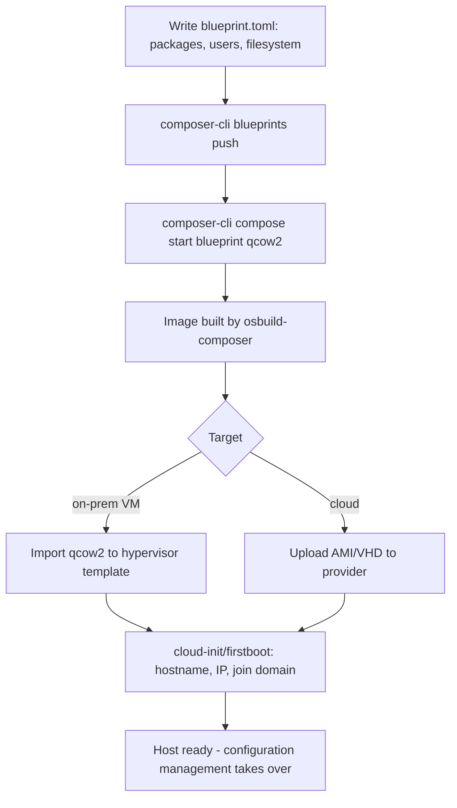

# Kickstart Automation and Image Builds

**Level:** Advanced
**Tree:** [Performance, Networking & Automation at Scale](../README.md)
**Branch:** [Fleet Automation & Provisioning](README.md)
**Forest:** [Linux](../../../README.md)

## Explanation

## Building servers that are born correct

Kickstart is RHEL's declarative installation language: a single text file (%packages, partitioning, network, %post scripts) drives Anaconda through an entirely unattended install, turning 'follow these 40 wizard screens' into a versioned artifact reviewed like code. A kickstart file is served over HTTP/PXE/vmedia or embedded in an ISO, and referenced at boot with inst.ks=. The critical design habit is idempotent %post scripts logged to a fixed path (exec > /root/ks-post.log 2>&1) so a failed post-install step is diagnosable instead of silently leaving a half-configured host.

For virtual and cloud estates, kickstart increasingly hands off to **cloud-init** or is replaced entirely by pre-built golden images: RHEL Image Builder (osbuild-composer, exposed via the composer-cli or the Cockpit UI) composes a custom image - packages, users, firstboot scripts, filesystem layout - as a single declarative blueprint (TOML/JSON) and outputs it in the target format (qcow2, AMI, Azure VHD, ISO with embedded kickstart, raw). This shifts configuration left: instead of a 20-minute kickstart run per VM, a golden image boots in seconds and firstboot only handles instance-specific identity (hostname, IP, join-domain) via cloud-init.

The enterprise pattern combines both: Image Builder produces a hardened, patched base blueprint rebuilt weekly in CI against the latest content view, and Kickstart (or cloud-init) handles only the per-instance customization, which keeps golden images small, auditable, and reproducible while the fleet stays current without a rebuild-every-server cadence.

## Rollback

A build artefact rolls back by **rebuilding from the previous blueprint or kickstart**, which is the argument for keeping both in version control rather than on a build host. The image itself is disposable; the definition is the asset.

What does not roll back is **a host already provisioned from a bad image**. Rebuilding it is usually faster and more certain than repairing it, and designing for that - treating provisioned hosts as replaceable rather than repairable - is what makes image-based operations worth the effort.

## Security implications

A kickstart file frequently contains a **root password hash or a bootstrap credential**, and it is served over the network at provision time - often unauthenticated, sometimes over HTTP. Anyone who can reach the provisioning path can read it.

Use a hash rather than plaintext, prefer injecting a key over setting a password at all, and treat the kickstart as a **secret-bearing artefact**: restricted, served over TLS where possible, and rotated. The golden image inherits everything in it, so a credential baked in once is present on every host built from it thereafter.

## Monitoring

The signal is **build reproducibility**, not build success. A blueprint that produced a working image last month and a different one today has drifted - usually because it pins nothing and the upstream repository moved - and the divergence is invisible unless the artefacts are compared.

Record the **package manifest of every build** and diff consecutive ones. An unexplained package appearing or a version moving between builds is the earliest evidence that the definition is under-specified.

## High availability and disaster recovery

Image-based provisioning is a **recovery capability**, and it is only real if it has been exercised. The measure is time from bare metal to serving, and it is worth timing once rather than estimating - the estimate is always shorter.

The dependency chain matters: provisioning needs DHCP, TFTP or HTTP, DNS and a repository. **In a DR scenario those may be the very services that are down**, so a provisioning path that depends on production infrastructure cannot rebuild production. Confirm the chain is independent, or accept that the capability does not apply to a full-site failure.

## Anti-patterns

**Baking everything into the image.** A golden image containing application config becomes a release artefact and needs rebuilding for every change. Keep the image minimal and configure afterwards.

**No version pinning in the blueprint.** The build is then reproducible only until upstream changes, which is not reproducible.

**A golden image nobody rebuilds.** It ages into an unpatched baseline that every new host inherits, so the oldest thing in the estate is the newest server.

## Change control

Changing a blueprint is low risk **until something is built from it**, at which point every subsequent host carries the change. That inversion - safe to edit, consequential to use - is why blueprint changes belong in review even though editing one breaks nothing.

Gate on a **test build and a boot test**, not on the file diff. A kickstart that parses and produces a host that will not boot has passed every check except the one that mattered.

## Architecture and flow



## Commands

### Command 1

Register a new image blueprint with osbuild-composer

```text
composer-cli blueprints push webapp-blueprint.toml
```

### Command 2

Start building a qcow2 image from the pushed blueprint

```text
composer-cli compose start webapp-blueprint qcow2
```

### Command 3

Show the state (WAITING/RUNNING/FINISHED) of all image builds

```text
composer-cli compose status
```

### Command 4

Download the finished image artifact once the build completes

```text
composer-cli compose image <uuid>
```

### Command 5

Validate a kickstart file's syntax before serving it to installers

```text
ksvalidator /var/www/html/ks/webapp.ks
```

### Command 6

Kick off a kickstart-driven install pointing at a served file

```text
curl -O http://sat.acme.com/pub/ks/webapp.ks && virt-install --initrd-inject=webapp.ks --extra-args='inst.ks=file:/webapp.ks'
```

## Automation scripts

### webapp-blueprint.toml

```yaml
name = "webapp-golden"
description = "Hardened RHEL 9 base image for web tier"
version = "1.2.0"
distro = "rhel-9"

[[packages]]
name = "nginx"
version = "*"

[[packages]]
name = "aide"
version = "*"

[[customizations.user]]
name = "opsadmin"
groups = ["wheel"]
key = "ssh-ed25519 AAAA...opsadmin-key"

[customizations.services]
enabled = ["nginx", "firewalld"]

[customizations.firewall]
ports = ["443/tcp"]

[[customizations.filesystem]]
mountpoint = "/var/log"
minsize = "4 GiB"
```

## Lab

**Objective:** Compose a custom golden image blueprint with Image Builder, produce a qcow2 artifact, and prove firstboot customization applies cleanly on first launch.

### Steps

1. Install osbuild-composer and composer-cli; enable the service.
2. Write webapp-blueprint.toml with a package set, a wheel-group user with an SSH key, and firewall port 443 open.
3. Push the blueprint and start a qcow2 compose; poll compose status until FINISHED.
4. Download the image and boot it in a hypervisor with a cloud-init NoCloud datasource providing hostname and network config.
5. Confirm nginx is enabled, port 443 is open in firewalld, and the opsadmin user can SSH in with the embedded key with no manual steps.

### Validation

composer-cli compose status shows FINISHED for the build.,First boot completes without a console login prompt requiring manual input.,firewall-cmd --list-ports on the booted instance shows 443/tcp already open.,SSH as opsadmin succeeds immediately using only the embedded key, no password set.

## Operational automation

### Automating image builds

- **CI pipeline**: rebuild blueprints weekly against the latest content view/repo snapshot in a pipeline, running composer-cli compose start and a boot-test stage before promoting the artifact to the template library.
- **Ansible**: the community general osbuild/composer CLI wraps cleanly in ansible.builtin.command tasks with idempotent checks against compose status; some environments call the composer HTTP API directly instead.
- **Kickstart-as-code**: keep .ks files in git, validate every commit with ksvalidator in CI, and serve them from an internal HTTP endpoint version-tagged so a specific install always maps to a specific reviewed file.

## Troubleshooting

### Scenario 1: Kickstart install hangs at the %post stage with no error

**Likely cause:** A %post script is waiting on network access before networking is fully up, or a command is prompting for input

**Resolution:** Add %post --log=/root/ks-post.log, avoid interactive commands, and use %post --nochroot with explicit network waits (nm-online) if network access is required

### Scenario 2: Image Builder compose fails validating the blueprint

**Likely cause:** A package name is misspelled or unavailable in the configured repository set for that distro version

**Resolution:** Run composer-cli blueprints depsolve <name> to see the exact resolution error and correct the package/version constraint

### Scenario 3: Golden image boots but firstboot customization never applies

**Likely cause:** No cloud-init datasource is present/configured, or the hypervisor did not attach the NoCloud seed ISO/metadata

**Resolution:** Confirm cloud-init is installed in the blueprint and the hypervisor provides a datasource (ISO, config-drive, or provider metadata service)

### Scenario 4: Same blueprint version produces images with different package versions over time

**Likely cause:** The compose pulled from a rolling repository (e.g. baseos latest) rather than a pinned content view/snapshot

**Resolution:** Point Image Builder's source repositories at a versioned, promoted content view snapshot instead of a rolling mirror

## Interview questions

### 1. What problem does RHEL Image Builder solve that Kickstart alone does not?

Kickstart automates a per-machine install that still takes minutes and reruns package installation every time. Image Builder produces a pre-baked, tested artifact once; provisioning becomes booting a golden image in seconds, with only instance-specific identity handled at firstboot via cloud-init - shifting cost from every deployment to one build.

### 2. How do you keep golden images from drifting from the latest security content?

Rebuild the blueprint on a schedule (weekly/monthly) against a promoted, versioned content view snapshot in CI, boot-test the artifact, then replace the template in the library - never patch a running golden image in place, since that reintroduces the drift the pattern exists to avoid.

### 3. Why must %post script output be logged explicitly in Kickstart?

Anaconda's own log capture does not reliably surface every %post failure to the installer console, so a failed post-install customization can leave a host that looks 'installed' but is misconfigured. Redirecting exec > /root/ks-post.log 2>&1 at the top of %post guarantees a durable, reviewable record.

### 4. When would you still choose Kickstart over Image Builder for a given fleet?

When hardware-specific installs are needed (bare metal with varying disk/NIC layouts that a single image cannot anticipate), or when the org has no image pipeline yet and needs a fast, auditable win; Kickstart's per-install flexibility (partitioning logic, %pre hardware detection) still beats a fixed image in heterogeneous bare-metal fleets.

## Certification alignment

- RHCSA EX200 - Kickstart automated installation fundamentals
- RHCE EX294 - Provisioning fundamentals feeding into Ansible-managed fleets
- Red Hat Certified Specialist in Image Builder objectives

## References

- Red Hat Documentation: Composing a customized RHEL system image (Image Builder)
- man kickstart, pykickstart syntax reference
- Red Hat Documentation: Performing an automated installation using Kickstart

## Suggested video search

RHEL Image Builder composer-cli blueprint kickstart automation tutorial

---

> Validate commands, versions, permissions, licensing, and rollback procedures in an isolated lab before production use.
