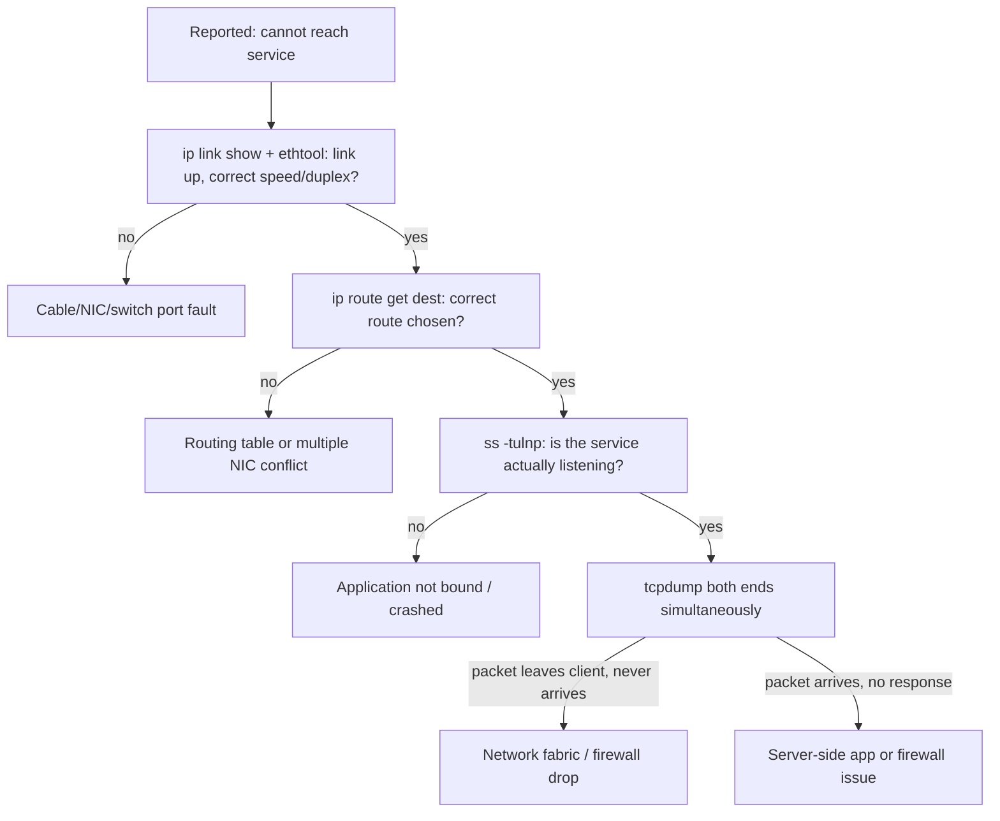

# Linux Network Troubleshooting: tcpdump Packet Capture and Diagnostic Bundles

**Level:** Advanced
**Tree:** [Performance, Networking & Automation at Scale](../README.md)
**Branch:** [Advanced Linux Networking](README.md)
**Forest:** [Linux](../../../README.md)

## Explanation

## A layered approach to network problems

Network troubleshooting on Linux is fastest when it follows the OSI layers upward instead of guessing. Layer 1/2: ip link show confirms carrier state and speed/duplex (ethtool ens192); a link that is up but negotiated at the wrong speed or duplex silently causes retransmits and latency that look like an application bug. Layer 3: ip route get <dest> shows exactly which route and source address the kernel will use, resolving the common confusion of multiple NICs on overlapping subnets. Layer 4 and above: ss (the modern replacement for netstat) shows socket state - ss -tulnp for listeners, ss -tn state established for active connections, and critically the Recv-Q/Send-Q columns which reveal a stalled consumer versus a genuinely full network path.

For active reachability testing, ping proves layer 3 but not much else; traceroute (or better, mtr for a continuously updating per-hop loss/latency view) localizes where in a multi-hop path loss or latency is introduced. tcpdump remains the ground truth: capturing on both ends of a suspected problem (client and server, or a switch SPAN port) and comparing whether a packet left one host and never arrived proves whether the fault is host-local (firewall, routing) or in the network fabric.

DNS deserves its own step, because it silently multiplies connection time or causes intermittent failures: resolvectl status and resolvectl query show which resolver actually answers and how long it took; dig +trace walks the delegation chain when a specific record is wrong upstream. The discipline that saves the most time: capture with tcpdump -w before any 'fix', because a service restart destroys the exact evidence needed to prove root cause.

## Rollback

Diagnosis should be **read-only by default**, and most of this leaf is. Where a diagnostic step does change state - dropping a connection, flushing a cache, toggling an interface - note the original value first, because the pressure of an incident is exactly when an undocumented change becomes permanent.

The one action with no rollback is **the evidence you did not capture**. A restart clears the state that would have explained the fault, so the capture is not merely first in the sequence, it is the only step that cannot be repeated later.

## Security implications

A packet capture is a **data disclosure**. Unencrypted traffic in a pcap includes credentials, tokens, personal data and session cookies, and the file usually leaves the host to be analysed - which turns a diagnostic artefact into a data transfer that may cross a boundary the data is not permitted to cross.

Capture the minimum: a **BPF filter narrowed to the affected host and port**, a snaplen that captures headers rather than payload where the question is connectivity, and a defined retention. Treat a pcap as classified at the level of the traffic it contains, because it is.

## Monitoring

The useful precursor is **connection-state counters, not throughput**. Rising retransmissions, listen-queue overflows and SYN backlog drops appear in ss -s and nstat well before users report anything, and they distinguish a network fault from an application one.

The second is that **an interface can be up and dropping**. ip -s link reports per-interface errors and drops; a clean ping alongside a rising drop counter is the signature of an MTU or a duplex problem rather than an outage.

## High availability and disaster recovery

In a failover pair, **asymmetric routing** is the fault this leaf must catch: traffic leaving by one path and returning by another is dropped by reverse-path filtering, and it presents as intermittent connectivity that correlates with nothing obvious. Confirm rp_filter behaviour and the actual return path before blaming the application.

During a DR test the network is the part most likely to differ from production - different subnets, different MTU, different firewalling. **Capture on both sides** rather than one, because a one-sided capture cannot distinguish a packet never sent from one sent and dropped in transit, and that distinction is the whole answer.

## Anti-patterns

**Restarting the service first.** It is the fastest way to clear the symptom and destroy the evidence, and it guarantees the fault returns with nothing learned.

**tcpdump with no filter on a busy interface.** It fills the disk, drops packets under its own load, and produces a capture too large to analyse. Filter at capture time.

**Concluding from ping alone.** ICMP can be permitted where the application port is not, and can be deprioritised or dropped independently. A successful ping proves ICMP works.

## Change control

Diagnosis usually needs no approval, with two exceptions worth naming in advance: **capturing traffic** raises a data-handling question, and **any change made mid-incident** bypasses normal review by definition.

The discipline that survives the incident is recording what was changed while changing it. An emergency change nobody wrote down is indistinguishable from configuration drift a week later, and it will be found by someone with no context.

## Architecture and flow



## Commands

### Command 1

Show interface stats including errors and drops, a first clue for layer 1/2 issues

```text
ip -s link show ens192
```

### Command 2

Confirm negotiated speed/duplex matches the switch port configuration

```text
ethtool ens192 | grep -E 'Speed|Duplex|Link detected'
```

### Command 3

List all listening TCP/UDP sockets with the owning process

```text
ss -tulnp
```

### Command 4

Show exactly which route, source IP and interface the kernel selects for a destination

```text
ip route get 10.20.0.5
```

### Command 5

Capture traffic to/from a specific host and port for offline analysis

```text
tcpdump -i ens192 -w /var/tmp/cap.pcap host 10.20.0.5 and port 443
```

### Command 6

Report-mode traceroute with loss and latency per hop over 20 probes

```text
mtr -rw -c 20 10.20.0.5
```

## Automation scripts

### netdiag.sh

```bash
#!/usr/bin/env bash
# Layered network diagnostic capture, evidence-first before any fix.
set -euo pipefail
TARGET="${1:?usage: netdiag.sh <target-ip>}"
OUT="/var/tmp/netdiag-$(date +%F-%H%M%S)"
mkdir -p "$OUT"
echo "== Layer 1/2 =="
ip -s link show > "$OUT/link.txt"
for i in $(ls /sys/class/net | grep -v lo); do ethtool "$i" 2>/dev/null | grep -E 'Speed|Duplex|Link detected'; done > "$OUT/ethtool.txt"
echo "== Layer 3 =="
ip route get "$TARGET" > "$OUT/route.txt" 2>&1
echo "== Layer 4 sockets =="
ss -tulnp > "$OUT/sockets.txt"
echo "== Reachability =="
mtr -rw -c 10 "$TARGET" > "$OUT/mtr.txt" 2>&1 || true
echo "== DNS =="
resolvectl status > "$OUT/dns.txt" 2>&1 || true
echo "Evidence captured in $OUT"
```

## Lab

**Objective:** Diagnose three injected network faults (bad duplex, wrong route, blocked port) using only layered diagnostic commands, without restarting any service before capturing evidence.

### Steps

1. Force a duplex mismatch with ethtool -s ens192 speed 100 duplex half autoneg off and observe retransmits with ip -s link show under load.
2. Add a bogus higher-priority route with ip route add and observe ip route get choosing the wrong path.
3. Block a service port with a temporary iptables/nft rule and observe ss -tulnp still shows it listening while tcpdump shows no inbound SYN reaching the process.
4. For each fault, capture evidence with netdiag.sh before removing the fault.
5. Remove each fault (revert ethtool, delete the bogus route, remove the block rule) and confirm normal operation returns.

### Validation

ip -s link show shows rising RX/TX errors during the duplex mismatch.,ip route get shows the incorrect next-hop while the bogus route exists.,tcpdump during the port-block test shows no SYN arriving at the service, distinguishing it from an application-level failure.,All three faults are correctly diagnosed from captured evidence alone, before any remediation.

## Operational automation

### Automating network diagnostics

- **Monitoring**: export node_exporter's interface error/drop counters and ss-derived socket metrics to Prometheus; alert on rising RX/TX errors as an early duplex/cabling signal before users notice.
- **Runbook automation**: wire netdiag.sh into the incident runbook via AAP so on-call always captures the same evidence set automatically before touching anything.
- **Synthetic checks**: schedule mtr/dig-based synthetic probes from multiple hosts to catch asymmetric routing or DNS regressions before they page anyone.

## Troubleshooting

### Scenario 1: Intermittent slowness only under heavy load, ping looks fine

**Likely cause:** Duplex mismatch or a marginal cable causing retransmits that only appear under throughput, not idle ping

**Resolution:** Check ip -s link show for rising error/drop counters and ethtool for negotiated duplex; replace cable/reseat or fix autoneg settings

### Scenario 2: Service reachable from some hosts but not others on the same subnet

**Likely cause:** Asymmetric routing or a stale ARP/route entry on one host

**Resolution:** Compare ip route get output between working and failing hosts, clear stale entries with ip neigh flush, and confirm consistent routing tables

### Scenario 3: ss shows the port listening but tcpdump shows no SYN arriving

**Likely cause:** A firewall (local nft/iptables or upstream) is dropping the connection before it reaches the socket

**Resolution:** Check local firewall rules and any network ACL/security group between client and server; a listening socket does not guarantee reachability

### Scenario 4: DNS resolution is slow only for certain domains

**Likely cause:** A specific upstream resolver in the chain is slow or unreachable, and resolvectl falls through after a timeout

**Resolution:** Use resolvectl query with verbose output and dig +trace to find which resolver in the chain is responsible, then fix or remove it

## Interview questions

### 1. Why check duplex/speed before assuming a network problem is 'the switch'?

A duplex mismatch is a self-inflicted host or cable configuration problem that produces symptoms (slowness under load, CRC errors) that look identical to congestion or switch misbehavior. ethtool and ip -s link show settle it in seconds and rule out blaming the wrong team.

### 2. What is the practical difference between ss and netstat?

ss reads directly from kernel netlink sockets instead of parsing /proc, making it far faster on hosts with large numbers of connections, and it exposes richer TCP state detail (like Recv-Q backlog vs actual queued bytes). netstat is deprecated in RHEL 8/9's default toolset in favor of ss and ip.

### 3. How do you prove a network problem is server-side versus network-fabric?

Capture tcpdump simultaneously at the client and the server. If the SYN leaves the client but never arrives at the server capture, the fault is in the network path (firewall, routing, switch). If it arrives at the server but gets no response, the fault is server-side (app not listening, local firewall, or overloaded accept queue).

### 4. Why capture evidence before restarting a hung service?

A restart clears the exact socket states, queues, and packet captures that would prove root cause, often 'fixing' the symptom while leaving the underlying issue to recur. Evidence-first (ss, tcpdump -w, ip -s link) preserves the state for analysis and postmortem.

## Certification alignment

- RHCSA EX200 - Analyze and diagnose network problems
- RHCE EX294 - Verify network connectivity with Ansible facts and modules
- Red Hat RH342 Network troubleshooting objectives

## References

- man ss, man tcpdump, man ip-route, man ethtool, man mtr
- Red Hat Documentation: Monitoring and managing system status and performance (RHEL 9) - networking chapter
- Wireshark/tcpdump filter reference documentation

## Suggested video search

Linux network troubleshooting ss tcpdump mtr dig deep dive RHEL

---

> Validate commands, versions, permissions, licensing, and rollback procedures in an isolated lab before production use.
