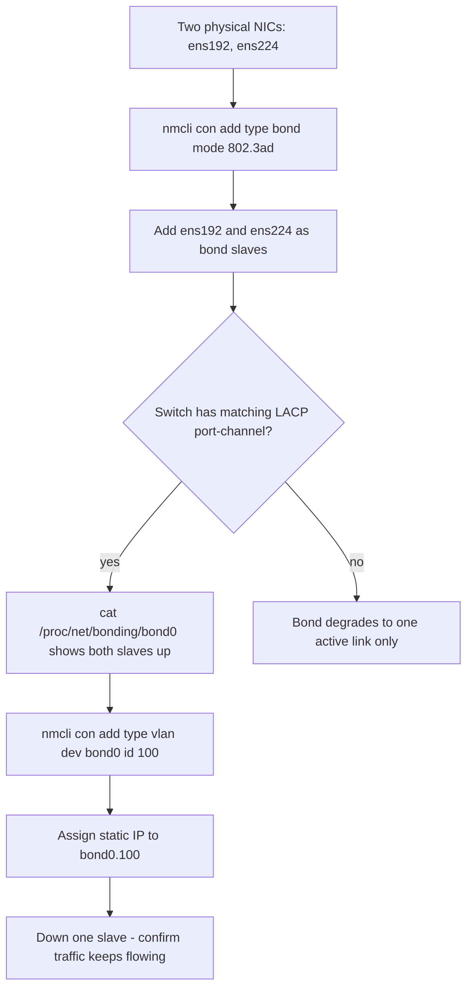

# NetworkManager: nmcli, Bonding, Teaming and VLANs

**Level:** Advanced
**Tree:** [Performance, Networking & Automation at Scale](../README.md)
**Branch:** [Advanced Linux Networking](README.md)
**Forest:** [Linux](../../../README.md)

## Explanation

## NetworkManager as the single source of network truth

RHEL 8/9 manage all networking through **NetworkManager**, whether configured via nmcli, nmtui, the Cockpit UI, or Ansible - all three write the same connection-profile keyfiles under /etc/NetworkManager/system-connections. A connection profile binds settings (IP, VLAN tag, bond membership) to a device or MAC, and is activated independently of the kernel interface existing yet, which is what makes declarative network configuration in Kickstart and cloud-init work reliably.

**Bonding** aggregates multiple NICs into one logical interface for throughput and failover. Mode matters: active-backup (mode=1) needs no switch support and simply fails over; 802.3ad (mode=4, LACP) needs switch-side LACP configured and gives real aggregate throughput plus faster failover via negotiation; balance-rr stripes packets but can reorder traffic and is rarely appropriate for production. Enterprise standard is LACP to a pair of stacked/VPC switches for both bandwidth and resilience, verified with cat /proc/net/bonding/bond0 to confirm both slaves are up and the correct mode is active.

**VLANs** are modeled as a nmcli connection type stacked on a parent device (nmcli connection add type vlan), so a single bonded interface can carry management, storage and application traffic as separate tagged sub-interfaces - avoiding a bond per VLAN and simplifying switch-side trunk configuration to one port-channel.

The professional workflow is: build the bond first and confirm both members are link-up, then stack VLANs on the bond, then assign IPs per VLAN sub-interface. Always test failover by physically or administratively downing one slave NIC and confirming the bond and its dependent VLANs stay reachable before calling the build complete.

## Rollback

NetworkManager keeps the previous connection profile, so rollback is **nmcli connection down** on the new profile and **up** on the old one - no reboot, no file editing. Deleting a profile with nmcli connection delete removes the keyfile under /etc/NetworkManager/system-connections/, and a copy of that directory before the change is the cheapest insurance available.

What has no rollback from the running system is a change that removes your own path to the host. **nmcli connection up applied over SSH can drop the session before you can undo it**, which is why the safe pattern is to schedule a reversion first - an at job that restores the previous profile in five minutes - and cancel it once connectivity is confirmed.

## Security implications

A bond or VLAN is a **segmentation boundary**, and a misconfigured trunk quietly dissolves it. A VLAN interface created on the wrong parent, or a switchport left as a trunk when it should be an access port, places a host on networks its firewall rules were never written for.

Verify the segmentation actually holds rather than assuming the configuration implies it: from the host, confirm you can reach what you should and **cannot reach what you should not**. A VLAN that carries traffic it should not is invisible in nmcli output and obvious in a connectivity test.

## Monitoring

The signal is **bond slave state, not bond state**. A bond with one dead slave is still up and still carrying traffic - it has simply lost its redundancy, which is the entire reason it exists. /proc/net/bonding/bond0 reports each slave, and a degraded bond that nobody notices is a single failure away from an outage.

For 802.3ad, also watch that the **partner MAC and aggregator ID are what you expect**. A bond that negotiated with a different switch than intended, or fell back to a single-port aggregator, reports up while delivering none of the bandwidth or resilience it was built for.

## High availability and disaster recovery

Bonding protects against a NIC, cable or switchport failure and **not against a switch failure** unless the slaves land on different switches. That requires MLAG or equivalent on the switch side, so the resilience claim depends on a configuration you do not own - worth confirming with the network team rather than inferring from the host.

For recovery, the profiles are the artefact: **keyfiles under /etc/NetworkManager/system-connections/ are the network build**, and backing them up makes a rebuild a copy rather than a reconstruction. A restored host with no profiles comes up on DHCP or not at all.

## Anti-patterns

**Editing ifcfg files.** They are gone in RHEL 9 - NetworkManager uses keyfiles. Guidance that still says ifcfg is pre-RHEL 9 and will silently do nothing.

**Testing a bond by unplugging a cable and looking at ping.** Ping survives a slave loss by design; that is the point. Read /proc/net/bonding to see which slave actually failed, or the test proves nothing.

**Building the bond and never failing it.** An untested bond is an assumption. The failover path is the feature, and it is the part that is misconfigured most often.

## Change control

Network changes on a remote host are the highest-blast-radius routine change in this forest, because **a mistake removes the means of fixing it**. Console or out-of-band access must be confirmed available before the change, not sought after it fails.

The pattern that makes this safe is a **timed automatic reversion**: apply, verify, then cancel the pending rollback. It converts a potential outage into a five-minute degradation, and it costs one at job.

## Architecture and flow



## Commands

### Command 1

Create an LACP bond interface with 100ms link monitoring

```text
nmcli connection add type bond con-name bond0 ifname bond0 bond.options "mode=802.3ad,miimon=100"
```

### Command 2

Enslave a physical NIC to the bond (repeat for the second NIC)

```text
nmcli connection add type ethernet ifname ens192 master bond0
```

### Command 3

Show bond mode, MII status, and which slaves are currently up

```text
cat /proc/net/bonding/bond0
```

### Command 4

Stack a tagged VLAN sub-interface on the bond with a static IP

```text
nmcli connection add type vlan con-name bond0.100 dev bond0 id 100 ip4 10.10.100.5/24
```

### Command 5

Prefer a specific slave as primary for active-backup mode

```text
nmcli connection modify bond0 +bond.options "primary=ens192"
```

### Command 6

Simulate a link failure to test bond failover without pulling a cable

```text
nmcli device disconnect ens192
```

## Automation scripts

### build-bond-vlan.sh

```bash
#!/usr/bin/env bash
# Idempotently build an LACP bond with a tagged VLAN and verify failover.
set -euo pipefail
BOND="bond0"; SLAVES=(ens192 ens224); VLANID="100"; VLANIP="10.10.100.5/24"
nmcli connection show "$BOND" >/dev/null 2>&1 || \
  nmcli connection add type bond con-name "$BOND" ifname "$BOND" bond.options "mode=802.3ad,miimon=100"
for s in "${SLAVES[@]}"; do
  nmcli connection show "$s-slave" >/dev/null 2>&1 || \
    nmcli connection add type ethernet con-name "$s-slave" ifname "$s" master "$BOND"
  nmcli connection up "$s-slave"
done
nmcli connection up "$BOND"
VCON="$BOND.$VLANID"
nmcli connection show "$VCON" >/dev/null 2>&1 || \
  nmcli connection add type vlan con-name "$VCON" dev "$BOND" id "$VLANID" ip4 "$VLANIP"
nmcli connection up "$VCON"
echo "== Bond status =="; cat /proc/net/bonding/"$BOND" | grep -E "Bonding Mode|Slave Interface|MII Status"
echo "Build complete."
```

## Lab

**Objective:** Build an LACP bond from two NICs, stack a tagged VLAN on it, and prove traffic survives the loss of either physical slave.

### Steps

1. Attach two additional virtual NICs to the VM and confirm both appear with ip link.
2. Create bond0 in 802.3ad mode and enslave both NICs, matching an LACP port-channel on the virtual switch if the hypervisor supports it (or use active-backup if not).
3. Confirm cat /proc/net/bonding/bond0 shows both slaves in the 'up' MII status.
4. Stack a VLAN 100 sub-interface on bond0 with a static IP and confirm it pings a gateway on that VLAN.
5. Run a continuous ping to the bond's VLAN IP from another host, then nmcli device disconnect one slave.
6. Confirm the ping continues uninterrupted, then reconnect the slave and confirm it rejoins the bond.

### Validation

cat /proc/net/bonding/bond0 shows Bonding Mode: IEEE 802.3ad and two slave interfaces.,ip -d link show bond0.100 shows the correct VLAN id 100.,Continuous ping shows zero or at most one dropped packet during slave disconnect.,After reconnect, the bond log (journalctl -u NetworkManager) shows the slave rejoining.

## Operational automation

### Automating network configuration

- **Ansible**: the community.general.nmcli module manages bonds, VLANs, teams and bridges declaratively with a single task per connection profile - idempotent by connection name.
- **RHEL system role**: redhat.rhel_system_roles.network expresses the entire host network topology (bonds, VLANs, routes) as a YAML variable structure, the standard for fleet-wide rollout via AAP.
- **Kickstart**: the network --bondslaves= directive builds the bond at install time so servers arrive pre-teamed, removing a manual post-install step entirely.

## Troubleshooting

### Scenario 1: Bond shows only one slave as 'up' though both cables are connected

**Likely cause:** Switch side is not configured for LACP (802.3ad) on that port-channel, or miimon carrier detection is misreading a media type

**Resolution:** Confirm switch port-channel/LACP config matches, or fall back to active-backup mode if switch support cannot be added

### Scenario 2: VLAN sub-interface has no connectivity though the bond itself pings the gateway

**Likely cause:** Switch trunk port does not tag/allow that VLAN ID, or the VLAN ID in nmcli does not match the switch configuration

**Resolution:** Verify switch trunk allowed-VLAN list and the id= value in the vlan connection profile match exactly

### Scenario 3: nmcli connection up succeeds but the profile does not survive reboot

**Likely cause:** Profile was created without autoconnect, or a conflicting profile with higher priority exists for the same device

**Resolution:** Set nmcli connection modify <name> connection.autoconnect yes and check nmcli connection show for duplicate profiles on the same interface

### Scenario 4: Failover takes several seconds and drops packets

**Likely cause:** miimon interval too high, or LACP timeout is set to slow (30s) instead of fast (1s) on the switch

**Resolution:** Lower miimon to 100ms in bond.options and request fast LACP timers from the network team

## Interview questions

### 1. Why prefer 802.3ad (LACP) bonding over active-backup in a data center?

LACP gives real aggregate throughput across all active slaves plus fast, protocol-negotiated failover, but requires switch-side port-channel configuration. Active-backup needs zero switch cooperation and is the right choice when the two NICs land on independent, non-stacked switches for true redundancy rather than throughput.

### 2. What does miimon actually monitor and what does it miss?

miimon polls the NIC driver's link-carrier state at the configured interval (in ms), detecting cable pulls and link-down events. It does not detect a switch silently dropping traffic while keeping the physical link up (a misconfigured VLAN, for instance) - arp_interval with arp_ip_target is used for that deeper reachability check.

### 3. How does NetworkManager keep VLAN configuration model consistent across reboots and tooling?

Every device, bond, and VLAN is a persisted connection profile keyfile; nmcli, nmtui, Cockpit, and Ansible's nmcli module all read and write the same files, so configuration applied by any tool is visible and consistent to every other tool and survives reboot without a separate ifcfg-style script.

### 4. A bond shows both slaves up but only one carries traffic. What do you check?

Confirm the bonding mode - active-backup by design only sends/receives on the active slave, which is expected. If 802.3ad was intended, check the switch's LACP port-channel actually formed (both ports in the same aggregate, not each independently) via the switch CLI, since a misconfigured switch can silently leave LACP negotiation incomplete.

## Certification alignment

- RHCSA EX200 - Configure network settings and hostname resolution
- RHCE EX294 - Manage bonded and team interfaces with network system role
- RHCE EX294 - Configure VLAN-tagged interfaces

## References

- Red Hat Documentation: Configuring and managing networking (RHEL 9)
- man nmcli, man nm-settings, man bonding (kernel-doc)
- Red Hat KB: Configuring bonding and VLANs with NetworkManager

## Suggested video search

RHEL 9 NetworkManager nmcli bonding LACP VLAN configuration tutorial

---

> Validate commands, versions, permissions, licensing, and rollback procedures in an isolated lab before production use.
